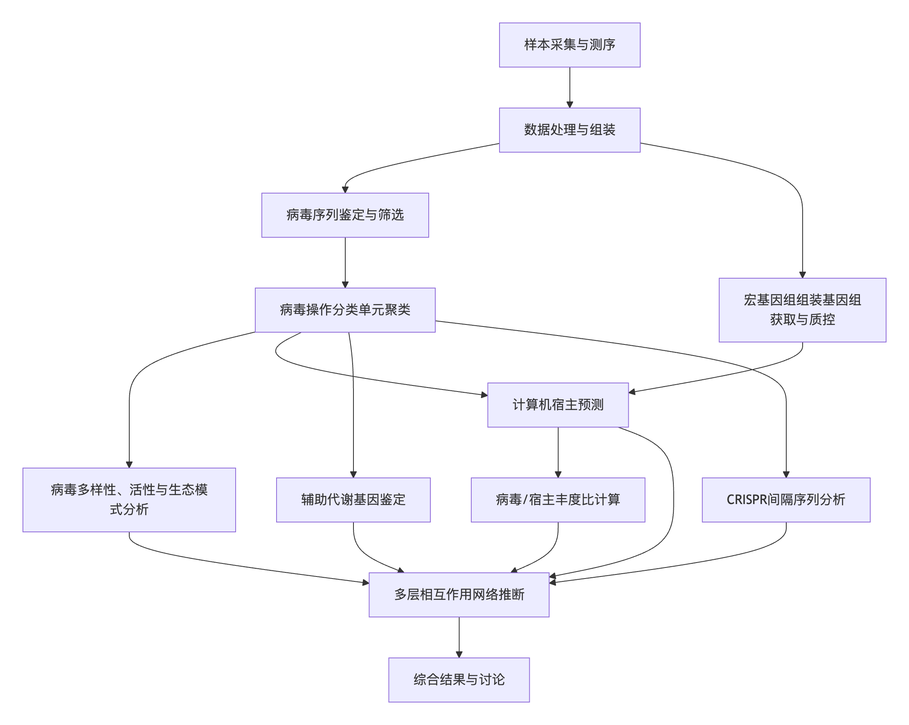
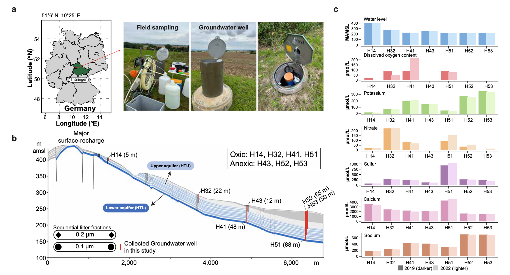
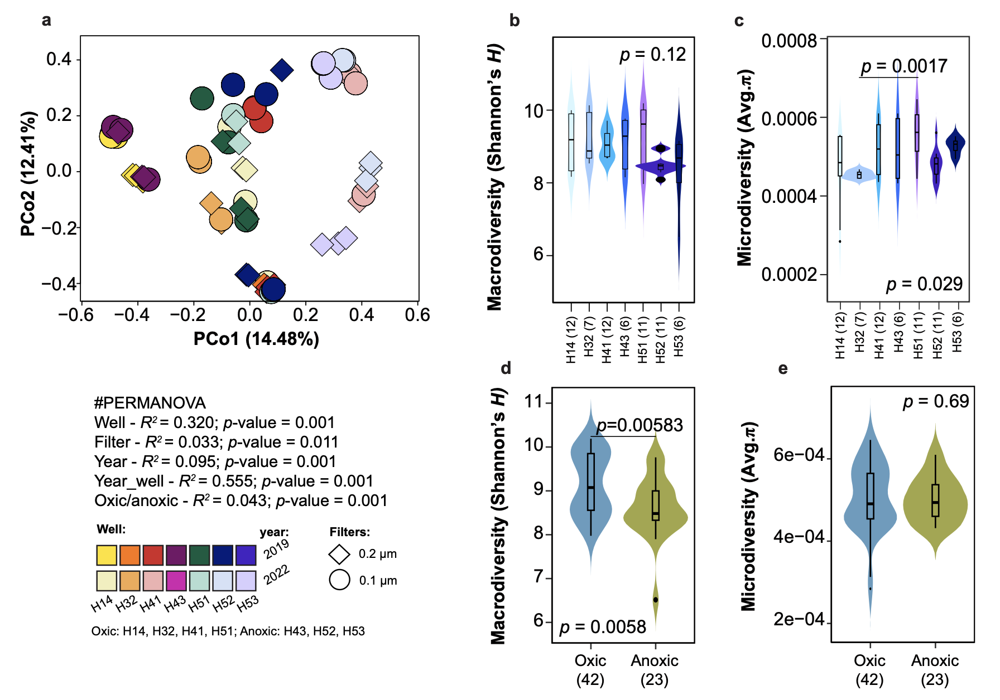
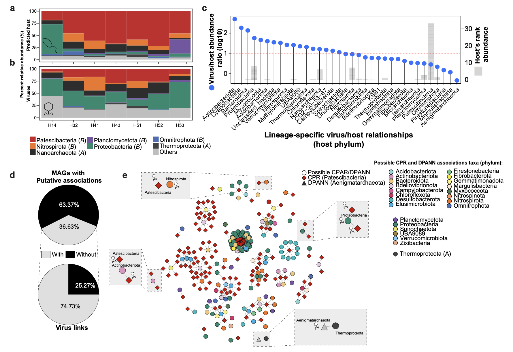
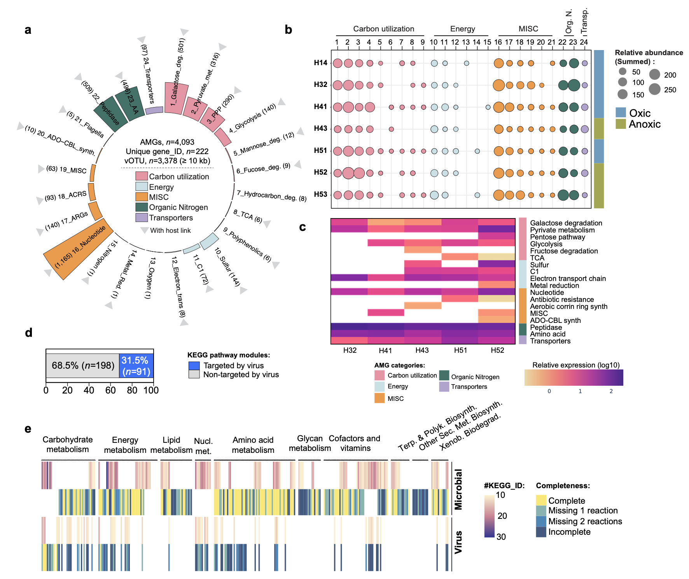

## 背景
病毒是地球上最丰富的生物实体，估计数量级为10^31，大约是微生物细胞数量的一个数量级。在海洋等生态系统中，病毒通过裂解细胞、基因水平转移和代谢重编程感染细胞（形成“病毒细胞”）等方式，在微生物演化、生物地球化学循环（如“病毒分流”和“病毒穿梭”）中扮演着至关重要的角色。海洋病毒的研究已鉴定出数以万计的病毒编码辅助代谢基因，凸显了病毒在调控全球海洋碳、氮、硫循环中的功能作用。在部分地表淡水环境中，也观察到了类似的现象。

尽管如此，病毒在许多其他环境中的多样性、功能和生态影响在很大程度上仍是未知的。地下水作为一个关键但研究不足的环境，是维持陆地地表生态系统和全球生物地球化学循环（包括碳、氮、硫、磷和各种金属循环）的最大非冰冻淡水储库。地下水是一个以微生物为主的生境，具有营养稀缺、有机碳可用性低和无光等特点，这些共同对土著微生物群落施加了强大的选择压力。在这些环境中，化能无机自养作为一种主要的碳固定模式，其速率与阳光照射的贫营养海水中光合自养碳固定的速率相当。地下水富含超小型的原核生物，包括候选门辐射细菌和DPANN超门古菌的成员。这些微生物具有高度精简的基因组，被认为依赖外共生或互养相互作用生存，在有些地下水群落中可占50%以上，可能在地下生物地球化学循环中发挥基础性作用。然而，人们对感染它们的病毒，尤其是感染古菌的病毒知之甚少。由于CPR细菌、DPANN古菌及其病毒的培养代表稀少，不依赖培养的基因组学方法是揭示其生物学特性（包括感染病毒、病毒编码的AMGs和病毒-宿主相互作用）的重要途径。在气候变化的背景下，理解这些系统中的病毒活动对于预测微生物相互作用和养分循环如何应对环境变化至关重要。

- Pratama, A.A., Pérez-Carrascal, O., Sullivan, M.B. et al. Diversity and ecological roles of hidden viral players in groundwater microbiomes. Nat Commun 17, 2179 (2026). https://doi.org/10.1038/s41467-026-68914-2
- 期刊：Nature Communications （IF 15.7）
- 发表时间：2026年1月30日

本研究对来自德国海尼希关键带观测场七个井的65个地下水样本进行了大规模的病毒生态基因组学分析，获得了总计1.24万亿碱基对的宏基因组和宏转录组数据。研究人员从中鉴定出257,252个病毒操作分类单元，其中99%在目、科、属水平上是全新的。通过计算机宿主预测发现，这些病毒主要感染变形菌门、候选门辐射细菌和DPANN古菌。通过病毒/宿主丰度比、CRISPR间隔序列和原噬菌体筛查，研究揭示了在CPR/DPANN谱系、其宿主和病毒之间可能存在多层相互作用的潜力。此外，研究在3,378个病毒基因组中鉴定出4,093个辅助代谢基因，涉及289个KEGG代谢模块，广泛参与碳、氮、硫循环。这些发现为探索病毒如何影响地下水中微生物群落动态、代谢重编程和养分循环建立了基准。

## 方法
本研究整合了生态学和基因组学数据，对德国海尼希关键带观测场内七个地下水井的病毒群落结构和功能进行了病毒生态基因组学分析。这个特征明确的系统涵盖了一系列物理化学梯度，从有氧到缺氧条件，并拥有多样化的微生物种群。

**数据获取与处理**：研究分析了来自先前对海尼希CZE研究的数据集，包括2019年从六个井采集的31个地下水样本的0.515万亿碱基对的短读长宏基因组数据。此外，增加了从相同的六个井（共七个井，增加了一个位于山坡末端的H53井）时隔三年采集的34个样本的0.725万亿碱基对宏基因组数据，合计65个样本总计1.24万亿碱基对。为提高物种水平病毒操作分类单元的回收率，还加入了六个长读长宏基因组样本。此外，利用了2015年从五个井采集的17个地下水样本的约22千兆碱基对的宏转录组数据用于评估病毒活性。

**病毒鉴定与vOTU聚类**：使用VirSorter2、DeepVirFinder、VIBRANT和geNomad等多种工具从组装的contig中鉴定病毒序列。为提高置信度，应用了基于CheckV的额外过滤步骤，以去除可能的非病毒序列（如细胞基因组岛）。最终获得4,708,626个病毒contig。使用MMseq2在95%平均核苷酸一致性和80%覆盖度的阈值下，将这些contig聚类为病毒操作分类单元，最终得到257,252个≥5 kb的vOTUs，其中82,245个≥10 kb。

**宿主预测**：使用iPHoP工具，结合默认数据库和从同一地点获得的1,275个宏基因组组装基因组，对≥10 kb的vOTUs进行计算机宿主预测。整合两种方法的结果，仅考虑置信度分数≥90%的顶级匹配用于后续分析。

**辅助代谢基因鉴定**：使用DRAM-v工具对≥10 kb的vOTUs进行注释，以鉴定病毒编码的假定辅助代谢基因。应用了推荐的过滤标准以增加置信度，并排除了常见被误分类为代谢基因的病毒基因。

**生态与统计学分析**：使用CoverM计算病毒和MAGs的标准化丰度。通过非度量多维尺度和主坐标分析评估病毒群落结构。使用香农指数评估宏观多样性，计算平均核苷酸多样性以评估微观多样性。通过曼特尔检验分析环境驱动因素。通过共现网络分析推断CPR/DPANN与潜在宿主微生物之间的关联。通过原噬菌体检测和CRISPR间隔序列筛选进一步探究病毒-宿主相互作用。

## 结果与讨论

### 地下水病毒群落高度多样且独特

通过对1.24万亿碱基对数据的分析，本研究鉴定出257,252个≥5 kb的vOTUs。积累曲线表明采样已接近但尚未饱和，揭示了极高且采样不足的病毒丰富度。聚焦于≥10 kb的较大vOTUs，本研究的数量远超其他已报道的地下水病毒组研究，甚至达到全球海洋病毒数据库vOTU数量的42%。分类学分析表明，尽管约80%的vOTUs在门/纲水平可被归类于已建立的类群，但在更精细的分类等级上表现出极高的新颖性：仅0.3%的vOTUs在目水平有分类，≥99.8%在科水平和100%在属水平代表新的谱系。与公共病毒组数据库的比较发现，在应用的阈值下，没有来自其他数据库的序列与本研究的地下水病毒聚类，暗示了地下水病毒的地方性。与其他生物群落vOTUs的比较也显示出极低的共享水平，这反映了病毒生物地理结构的普遍模式，即生物群落特异的地方性很常见。

### 病毒群落的生态模式具有井特异性

海尼希CZE地下水系统的水文地球化学梯度导致了微生物群落结构的空间分区。本研究发现病毒群落同样表现出显著的井特异性结构。排序分析显示，病毒群落结构主要受井和年份的交互作用驱动。58.2%的vOTUs为单一井独有，6.10%为核心vOTUs（存在于>50%的井中）。宏观多样性在含氧井中显著更高，而微观多样性则在各井间差异显著，表明局部环境或生物条件可能微妙地塑造病毒的遗传结构。

### 地下水病毒的生态驱动因素
环境驱动因素分析表明，温度与病毒丰富度显著相关，而铵和钾浓度与病毒宏观多样性显著相关。氧化还原条件是已知的微生物群落驱动因素，也影响了病毒群落。病毒群落在含氧和缺氧井间呈现弱但显著的分组，且香农指数在含氧井中显著更高。然而，病毒多样性与溶解氧浓度无直接相关性，暗示病毒多样性的变化可能由氧化还原阈值触发，而非氧气浓度的渐变。

### 地下水病毒预测感染多种原核生物门类

通过计算机宿主预测，研究人员为11.6%的vOTUs（9,615个）建立了病毒-宿主关联，涉及52个门、339个目和650个科。其中，变形菌门占据了病毒-宿主关联的最高比例（21%），其次是Patescibacteria（18%），尽管变形菌门仅占所有MAGs累计相对丰度的约7.0%。这与海洋生态系统不同，表明病毒靶向性可能不仅受宿主丰度驱动，还反映了宿主活性或生理状态。宏转录组分析支持这一观点，显示一些转录活性最高的MAGs属于硝化螺旋菌门、Patescibacteria和变形菌门。谱系特异性病毒/宿主丰度比分析显示，在分析的35个谱系中，48.6%的VHRs大于1，表明病毒数量超过了其各自宿主。VHRs在井间也存在变异，反映了环境的异质性。

### 地下水生态系统中的潜在多层相互作用
地下水生态系统中的超小型CPR细菌和DPANN古菌通常与其他微生物形成密切关联，并且已被证明易受病毒感染。本研究结合多种分析，探讨了是否存在涉及这些谱系、其宿主和病毒的多层“嵌套相互作用”。首先，计算机宿主预测分析将vOTUs与CPR和DPANN谱系联系起来。其次，基于MAGs的共现网络分析表明，36.6%的MAGs与其他MAGs共关联，研究人员将其解释为暗示了CPR/DPANN与其潜在微生物宿主之间可能存在外共生关系。在这些有关联的MAGs中，74.7%也与vOTUs相关联，支持了宿主-共生体-病毒并发相互作用的可能性。此外，在原噬菌体检测中，20.4%的Patescibacteria MAGs和29%的Nanoarchaeota MAGs中检测到原噬菌体。最后，CRISPR间隔序列筛选揭示了两条vOTUs的间隔序列同时与脱硫杆菌门和Patescibacteria关联，表明同一vOTU可能存在罕见的跨宿主感染现象。综合来看，这些分析表明病毒可以与CPR/DPANN及其假定的微生物宿主相互作用，提示地下水生态系统中存在多层次病毒-共生体-宿主关系网络。

### 病毒对地下水生物地球化学过程的影响

病毒可通过携带宿主来源的辅助代谢基因来影响生态系统功能。在寡营养的地下水中，研究人员测试了AMGs是否普遍存在并在原位表达。从≥10 kb的vOTUs中鉴定出4,093个假定AMGs，归属于3,378个vOTUs（占4.1%），功能涵盖转运、中心碳代谢、氨基酸代谢、氮和硫代谢等。大量AMGs与全球海洋和淡水湖泊病毒组中报道的AMGs重叠，强调了水生系统间的功能趋同。宏转录组数据显示，在所有表达的病毒基因中，8.0%对应于假定AMGs。转录的AMGs与TCA循环、糖酵解、氮和硫代谢等途径相关。下游井（H51和H52）中AMGs转录水平升高，表明随着微生物群落稳定和核心类群占主导，病毒对宿主代谢的调节作用增强。研究还特别鉴定了与硫、氮、碳和甲烷代谢相关的AMGs。这些基因与已知在该地下水中起关键作用的微生物类群相关联，表明病毒可能影响这些资源有限生态系统中广泛的微生物碳和养分循环。

### 感染CPR细菌和DPANN古菌的病毒编码的AMGs
CPR细菌和DPANN古菌是海尼希地下水中最丰富的类群，但其精简的基因组限制了代谢能力。为评估病毒是否可能补充这些谱系的功能，研究人员检查了其预测病毒编码的AMGs。在CPR相关病毒中，7.1%携带与碳代谢、氨基酸合成和营养转运相关的AMGs。在DPANN相关病毒中，5.8%编码参与碳利用、硫还原和有机氮加工的AMGs。在群落水平，编码AMGs的病毒靶向了宿主31.5%的KEGG代谢模块。与全球海洋病毒组的估计相比，尽管流行率存在差异，但靶向途径的广度相似，表明通过AMGs进行代谢重编程是寡营养环境中一种趋同的病毒策略。

## 结论
本研究揭示了地下水中存在一个庞大且大部分未被描述的病毒多样性世界，其中绝大多数代表新的属，包括大量与CPR和DPANN相关的病毒。这些病毒编码多种多样的辅助代谢基因，并将这些宿主的病毒基因组代表至少扩展了一个数量级。研究发现表明，地下水微生物组内的病毒相互作用比以前认为的更为丰富和广泛，可能对微生物适应和生态系统功能产生影响。

研究人员重点关注了CPR/DPANN谱系、其宿主和病毒之间潜在的多层相互作用，突出了病毒作为地下水微生物组宿主-共生体网络参与者的角色。病毒编码的AMGs将其与碳、氮、硫循环联系起来，病毒感染可能靶向并调控在这些能量有限环境中支撑养分循环的关键宿主代谢。

本研究为探索病毒如何影响地下水微生物群落动态、代谢重编程和养分循环建立了重要的基线。未来的研究需要借助实验手段验证预测的病毒-宿主相互作用，并努力更全面、同步地评估所有生物实体（包括RNA病毒、质粒和移动遗传元件）的生态多样性及生态系统作用，以便将其整合到能够提供和检验关于病毒或其他实体在决定生态系统功能和稳定的群落代谢中作用的机制建模框架中。当前工作为研究地下水特异的病毒-宿主相互作用奠定了基础，最终将有助于完善我们测量和理解病毒对地下水微生物组中微生物演化、适应和生物地球化学循环贡献的能力。
