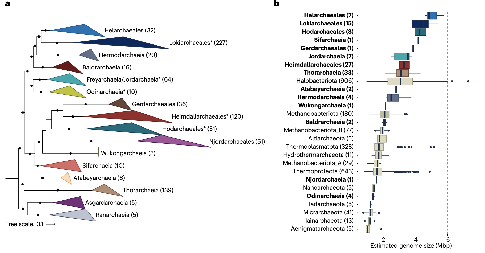
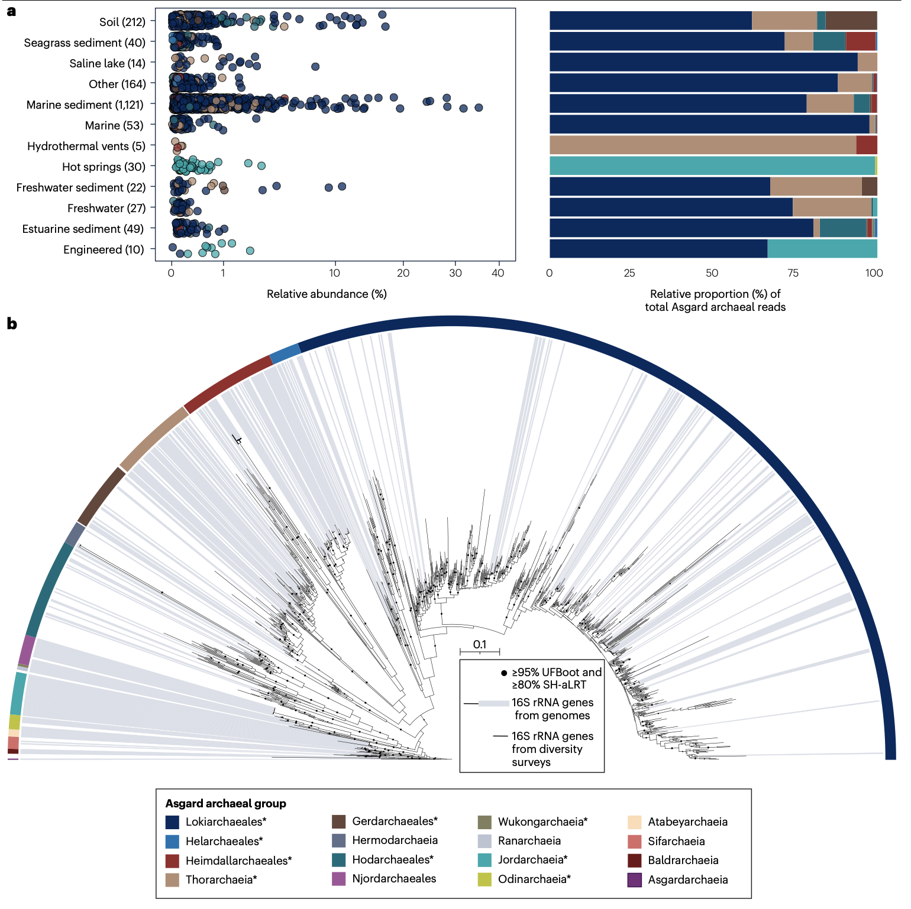
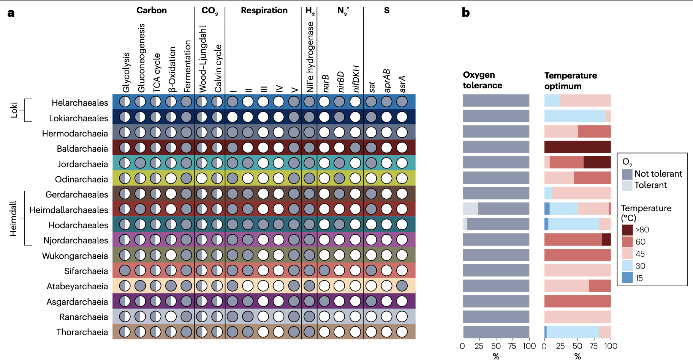
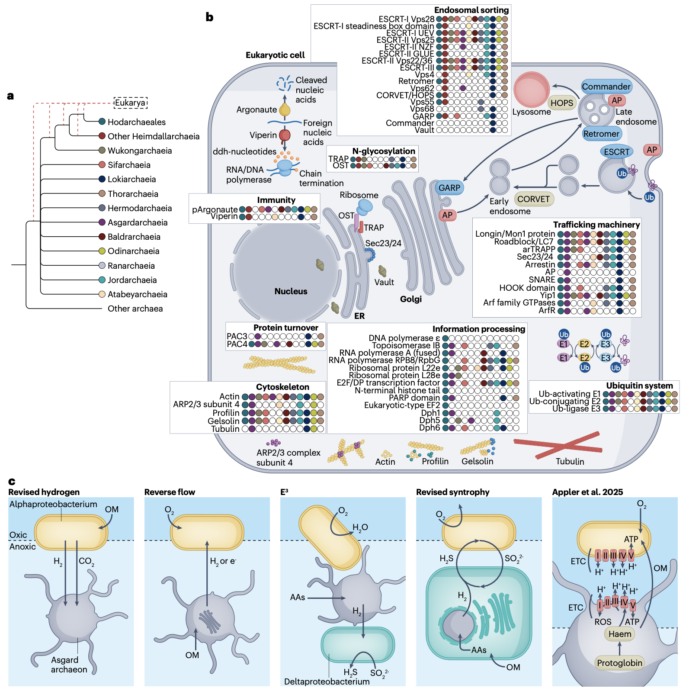
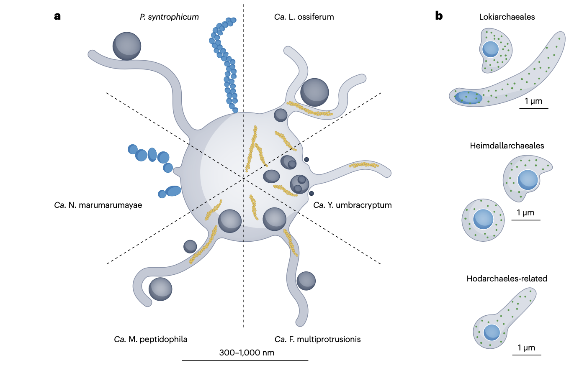

## 背景
生命的演化树长期被划分为细菌、古菌和真核生物三域。然而，真核细胞——拥有细胞核、线粒体、复杂内膜系统等特征的复杂生命形式——究竟如何从简单的原核祖先演化而来，是生物学领域最根本的谜题之一。经典的“内共生学说”（Endosymbiotic Theory）指出，真核细胞起源于一种古菌宿主与一种α-变形菌内共生体（即未来线粒体的祖先）的融合。但数十年来，这个神秘的古菌宿主的身份一直悬而未决。

20世纪70年代，卡尔·沃斯（Carl Woese）等人通过核糖体RNA（rRNA）序列分析，确立了古菌（Archaea）作为区别于细菌和真核生物的独立生命域。此后，基于16S rRNA基因的环境调查逐步揭示出古菌惊人的多样性，但获取其基因组信息的速度远落后于细菌。2011年，研究人员提出TACK超门（包括泉古菌门 Thaumarchaeota、奇古菌门 Aigarchaeota、初古菌门 Crenarchaeota 和科古菌门 Korarchaeota）可能与真核生物起源相关，暗示真核生物可能起源于古菌内部，而非与之并行的独立分支。这一“古菌宿主”假说（Archaea-host hypothesis）或称“两域树”（Two-domain tree of life）观点，挑战了传统的三域体系。

真正的突破发生在2015年。一个研究团队对取自北极洋中脊“洛基城堡”（Loki’s Castle）热液喷口系统的深海沉积物进行了宏基因组测序。通过序列组装与分箱（Binning），他们重建了一个来自名为“海洋底栖群B”（Marine Benthic Group B, MBG-B）的神秘古菌的草图基因组。分析结果震惊学界：这个被命名为“洛基古菌门”（Lokiarchaeota）的基因组，不仅编码了多种此前仅见于真核生物的蛋白质，系统发育分析更将其置于真核生物的“姊妹”位置。这强烈暗示，真核生物可能直接起源于洛基古菌门或其近亲。随后，更多具有类似特征的谱系在宏基因组数据中被发现，它们被以北欧神话中的诸神（如Thor, Odin, Heimdall）命名，并统称为“阿斯加德古菌”（Asgard archaea）。从此，寻找真核细胞起源之谜答案的焦点，被牢牢锁定在这群神秘的古菌身上。

- Panagiotou, K., Geesink, P., Köstlbacher, S. et al. Diversity, ecology, cell biology and evolution of the Asgard archaea. Nat Rev Microbiol (2026). https://doi.org/10.1038/s41579-026-01288-w
- 期刊：Nature Reviews Microbiology （IF=103.3）
- 发表时间：2026年3月5日

## 系统发育与基因组多样性

在阿斯加德古菌被基因组学正式“发现”之前，基于16S rRNA基因的调查早已在环境中检测到多个深分支且未培养的古菌类群，如海洋底栖群B、深海古菌群（Deep-Sea Archaeal Group, DSAG）以及多个热液喷口古菌群。这些类群后来被证实是阿斯加德古菌的成员。随着高通量测序与宏基因组组装分箱技术的成熟，大量阿斯加德古菌的宏基因组组装基因组（Metagenome-Assembled Genomes, MAGs）得以重建，其系统发育多样性被迅速揭示。

根据最新的古菌分类系统（如基因组分类数据库 GTDB），阿斯加德古菌被确立为一个独立的门，目前包含至少12个已描述的纲（Class）。主要的纲包括：洛基古菌纲（Lokiarchaeia）、索尔古菌纲（Thorarchaeia）、奥丁古菌纲（Odinarchaeia）、亥姆达尔古菌纲（Heimdallarchaeia），以及近年来新发现的约德古菌纲（Jordarchaeia）、西芙古菌纲（Sifarchaeia）、赫尔莫达古菌纲（Hermodarchaeia）、尼约德古菌纲（Njordarchaeia）等。

阿斯加德古菌在基因组上表现出一个显著特征：普遍较大的基因组尺寸。统计显示，其平均基因组大小约为3.4兆碱基对（Mbp），显著大于其他古菌门。基因组扩张的机制可能涉及多方面因素。水平基因转移（Horizontal Gene Transfer, HGT），特别是从细菌获取与代谢相关的基因，起到了一定作用。基因家族的扩张，尤其是通过基因重复（Gene Duplication），也被认为是重要驱动力，这在细胞骨架、膜运输相关的ESPs基因家族中尤为明显。此外，较低的基因丢失率也可能贡献了其较大的基因组容量。尽管MAGs数量众多，但高质量（完整度>90%，污染度<5%）或完整的基因组仍占少数。最新的系统发育基因组学（Phylogenomics）研究，通过使用更合理的进化模型和更全面的标记基因集，强有力地支持真核生物是嵌套于阿斯加德古菌内部的一个分支。当前多数分析表明，亥姆达尔古菌纲，特别是其下的霍达古菌目（Hodarchaeales），是真核生物最接近的现存“姊妹群”。

## 环境分布与丰度

阿斯加德古菌具有全球性的广泛分布，但其栖息地主要为厌氧或微氧环境。它们常见于海洋和淡水沉积物、热液喷口、湖泊、河口、陆地温泉以及某些土壤中。然而，不同类群在环境中的分布和相对丰度存在显著差异。洛基古菌纲是分布最广的谱系，在多种沉积物中常可检测到，且相对丰度较高。其他谱系如索尔古菌纲、奥丁古菌纲等虽然也广泛存在，但在大多数环境中的相对丰度通常较低（常低于总微生物群落的1%）。

需要指出的是，基于通用引物对的16S rRNA基因扩增子测序（Amplicon sequencing）存在固有的引物偏好性（Primer bias），可能导致某些阿斯加德古菌谱系（如引物结合位点不匹配的尼约德古菌纲）被低估或完全漏检。因此，其真实的环境多样性可能比现有调查显示的更为丰富。对公共数据库中环境来源的16S rRNA基因序列与已获得基因组中相应基因的对比分析表明，目前仍有大量阿斯加德古菌的遗传多样性尚未获得基因组层面的解析，预示着未来可能还有新的高阶分类群有待发现。

## 代谢特性与生态相互作用

宏基因组分析揭示了阿斯加德古菌多样化的代谢潜能。它们主要是一类异养微生物，能够利用蛋白质、碳水化合物、脂肪酸、氨基酸，乃至更复杂的碳氢化合物和芳香族化合物。不同谱系展现出特化的代谢倾向，反映了对特定生态位的适应。例如，某些洛基古菌纲和索尔古菌纲成员可能具有降解碳氢化合物的潜力；西芙古菌纲编码丰富的碳水化合物活性酶（CAZymes），可能擅长降解复杂多糖；而赫尔莫达古菌纲则拥有降解烷烃和芳香化合物的完整基因通路。大多数阿斯加德古菌进行发酵代谢（Fermentation），奥丁古菌纲和尼约德古菌纲似乎完全依赖这种代谢方式，这与它们在电子受体有限的温泉等环境中的分布相符。值得注意的是，尽管总体上被认为是厌氧微生物，但在亥姆达尔古菌纲等谱系中发现了编码完整有氧呼吸链复合体、原球蛋白（Protoglobin）和血红素合成途径的基因，暗示部分成员可能具备一定的氧耐受甚至利用氧气进行呼吸的能力。

生态互作方面，多项证据表明阿斯加德古菌与环境中其他微生物，特别是细菌，存在密切的互养关系（Syntrophy）。对已成功培养的菌株的研究提供了最直接的证据：首个被富集培养的阿斯加德古菌“互养普罗米修斯古菌”（Prometheoarchaeum syntrophicum），以及后续获得的洛基古菌纲、霍达古菌纲代表株，均在实验室中被证明必须与特定的硫酸盐还原细菌或产甲烷古菌建立严格的互养共培养才能生长。它们通过交换氢、甲酸和有机代谢中间产物（如氨基酸）相互依赖，这是一种典型的种间氢转移（Interspecies Hydrogen Transfer）和种间甲酸转移（Interspecies Formate Transfer）互养模式。环境微生物群落的共现网络（Co-occurrence network）分析也发现，阿斯加德古菌与多种细菌类群（如三角洲变形菌纲、厌氧绳菌纲、深古菌纲等）存在统计学上显著的正相关性。这些关联为潜在的代谢互养伙伴关系提供了生态学线索，但其具体的生化机制和因果关系的确认仍需进一步的实验验证。

## 真核生物样特征

阿斯加德古菌最令人瞩目的发现，是其基因组编码了大量“真核生物特征蛋白”。这些蛋白质是真核细胞复杂结构与功能的核心组成部分，它们的出现表明，许多构建真核细胞的“分子工具”在真核生物起源之前，就已在其古菌祖先中开始演化了。

**细胞骨架相关蛋白**：阿斯加德古菌编码多种肌动蛋白（Actin）及肌动蛋白相关蛋白（Arp）同源物。除了一个高度保守的“洛基肌动蛋白”（Lokiactin）核心拷贝外，还存在多个旁系同源物。此外，还发现了肌动蛋白结合蛋白如同型丝切蛋白（Cofilin）/抑制蛋白（Profilin）和凝溶胶蛋白（Gelsolin），体外实验证实它们能够调节真核生物肌动蛋白的聚合动态。在奥丁古菌纲和某些亥姆达尔古菌中甚至发现了微管蛋白（Tubulin）同源物，其中一些能在体外组装成类似于真核微管的管状结构，这强烈暗示了微管细胞骨架具有深远的古菌起源。

**ESCRT系统与膜运输机制**：负责膜重塑、囊泡出芽和多囊体形成的“内吞体分选转运复合体”（Endosomal Sorting Complexes Required for Transport, ESCRT）系统，在阿斯加德古菌中已初具规模。研究表明，其祖先已具备ESCRT-I, II, III, IV的核心组分，并通过基因复制变得更为复杂。与真核生物相似，阿斯加德古菌的ESCRT系统功能也与泛素化（Ubiquitination）修饰相关联。此外，其基因组富含多种小GTP酶（如Rab, Arf, Rag家族），这些是调控膜泡出芽、拴系与融合的关键分子开关。异源表达实验表明，阿斯加德古菌的ADP-核糖基化因子（Arf）同源物能在酵母或人类细胞中定位至膜上，并诱导致密内膜网络的形成。

**免疫系统组件**：研究还发现阿斯加德古菌拥有复杂的免疫系统，除了典型的CRISPR-Cas和限制修饰系统，还编码病毒抑制蛋白（Viperin）和 Argonaute 蛋白的同源物。系统发育分析表明，真核生物的Viperin和Argonaute可能垂直遗传自阿斯加德古菌祖先。功能实验证实，阿斯加德古菌的Argonaute蛋白在人类细胞中能进行RNA指导的RNA切割，显示了其在RNA干扰通路中功能的古老保守性。

**代谢途径的贡献**：新近研究表明，真核细胞的核心碳代谢是“嵌合起源”的。除了来自线粒体细菌祖先的贡献，糖酵解（Glycolysis）和磷酸戊糖途径（Pentose Phosphate Pathway）中的多个关键酶也显示出阿斯加德古菌的起源。这意味着真核生物的中央代谢是古菌与细菌组分在细胞合并后深度融合的产物。

## 细胞生物学特性

对少数成功富集或共培养的阿斯加德古菌代表株的显微观察，为了解其细胞结构提供了直接证据。这些细胞通常呈球状或卵圆形，直径在300纳米至1.8微米之间。一个普遍观察到的特征是细胞表面具有膜衍生出的细长“突起”（Protrusions）或“触手”，这些结构内部常有肌动蛋白丝分布，并可形成复杂的分支网络。在某些共培养体系中，观察到这些突起似乎伸向互养伙伴细胞，暗示其可能在种间物质交换或相互作用中起作用。

另一个常见特征是产生细胞外膜泡（Extracellular Vesicles）以及偶尔观察到的细胞内膜泡（Intracellular Vesicles）。后者在某些菌株（如“阴影约德古菌” Candidatus Yibarchaeum umbracryptum）中可形成复杂的内部膜结构，类似于一个简化的内膜系统（Endomembrane system）雏形。然而，目前获得培养的菌株可能远未代表整个阿斯加德古菌门的形态多样性。基于荧光原位杂交（Fluorescence In Situ Hybridization, FISH）的环境样品显微观察揭示了更大的形态差异，包括丝状体，以及一个引人遐想的特征：用不同荧光标记的DNA和核糖体RNA探针，其信号在细胞内显示出明显的空间分离。这引发了关于阿斯加德古菌是否具有某种原始的、非膜结合的遗传物质区室化（Compartmentalization）形式的猜想，尽管在培养细胞中尚未观察到膜包被的细胞核。

## 真核生物起源的模型与意义
阿斯加德古菌的发现，使得为真核生物起源构建基于具体古菌宿主的、更精细的演化模型成为可能。研究人员结合其代谢特征和互养习性，提出了多种修正的起源模型。例如，“逆流模型”（Reverse Flow Model）认为，古菌宿主通过发酵产生氢气和有机酸，而被其吞噬的α-变形菌内共生体（原线粒体）则消耗这些产物，从而建立起互养关系。而更复杂的“纠缠-吞噬-内生化模型”（Entangle-Engulf-Endogenize, E3 Model）则引入了第三个伙伴——一种硫酸盐还原细菌，它在初始的互养三角关系中消耗氢气，随后在吞噬和基因转移事件中逐渐被“边缘化”。尽管细节各异，这些模型都强调“代谢互养”带来的选择优势是驱动这一重大共生合并事件的核心动力。

系统发育学将真核生物牢固地置于阿斯加德古菌内部，这意味着真核细胞并非凭空出现，而是从一个已具备相当分子复杂性的古菌祖先谱系中逐渐演化出来的。阿斯加德古菌中丰富的ESPs表明，许多真核细胞的核心机制（如动态细胞骨架、膜运输、囊泡形成）在共生事件发生前就已在其古菌祖先中开始预适应（Pre-adaptation）或初具雏形。这为内共生发生后，宿主细胞能够“管理”和整合内共生体，并最终演化出更复杂的细胞区室化，奠定了关键的分子基础。因此，阿斯加德古菌被认为是连接原核与真核世界的、至关重要的“缺失环节”。

## 挑战与未来展望
尽管取得了突破性进展，对阿斯加德古菌的研究仍面临重大挑战。**培养难题**首当其冲：它们生长极其缓慢（倍增时间可达7至25天），通常依赖于严格的互养伙伴，且对环境扰动敏感，这使得获得纯培养或化学成分确定的培养基培养异常困难。其次，目前**基因组覆盖的多样性仍有局限**，许多通过环境调查检测到的谱系缺乏高质量的基因组信息，限制了对整个类群功能潜力的全面评估。第三，对已发现的**ESPs的功能认知大多基于生物信息学预测或异源表达实验**，需要在原生宿主中进行功能验证，这有待于针对阿斯加德古菌的遗传操作系统的建立。

未来的研究应致力于以下几个方向：1）**扩展培养多样性**：开发创新的培养策略（如基于扩散室的共培养、模拟自然条件的恒化器），并利用基因组尺度代谢模型指导培养基设计，以分离更多不同谱系的代表菌株。2）**深化原位研究**：利用宏转录组学（Metatranscriptomics）、代谢组学（Metabolomics）及高分辨率原位成像技术，揭示阿斯加德古菌在自然环境中的代谢活性、与伙伴相互作用的具体分子对话及其生态角色。3）**功能机制解析**：在细胞和分子水平上，深入研究其独特结构（如突起、膜泡）的生物发生与功能，以及多种ESPs如何协同工作以支撑基本的细胞过程。通过这些跨学科的努力，阿斯加德古菌将继续作为一把关键的“演化钥匙”，帮助我们最终解锁从简单原核细胞到复杂真核细胞这一生命史上最伟大的飞跃之谜。
