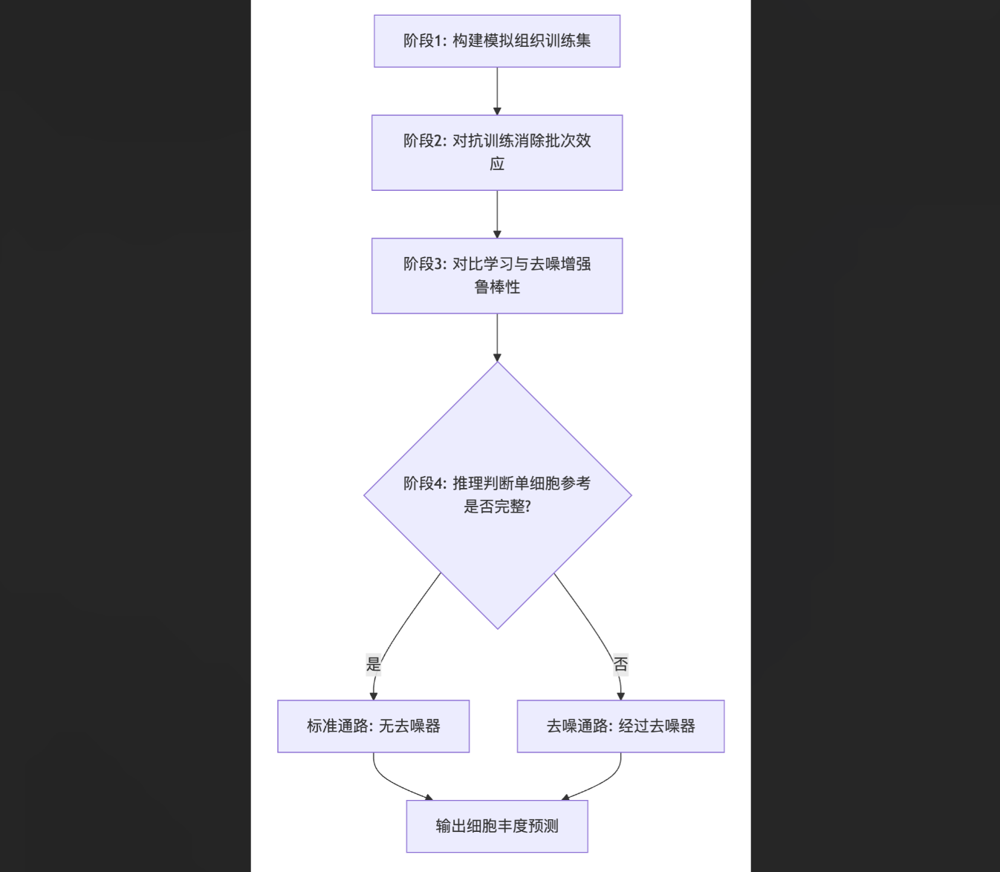
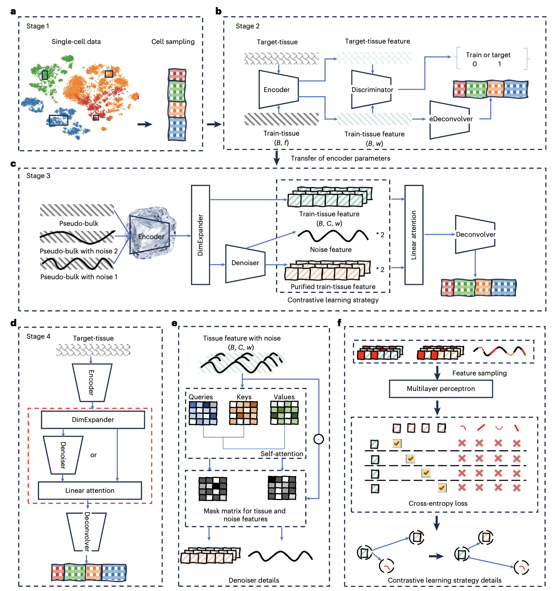
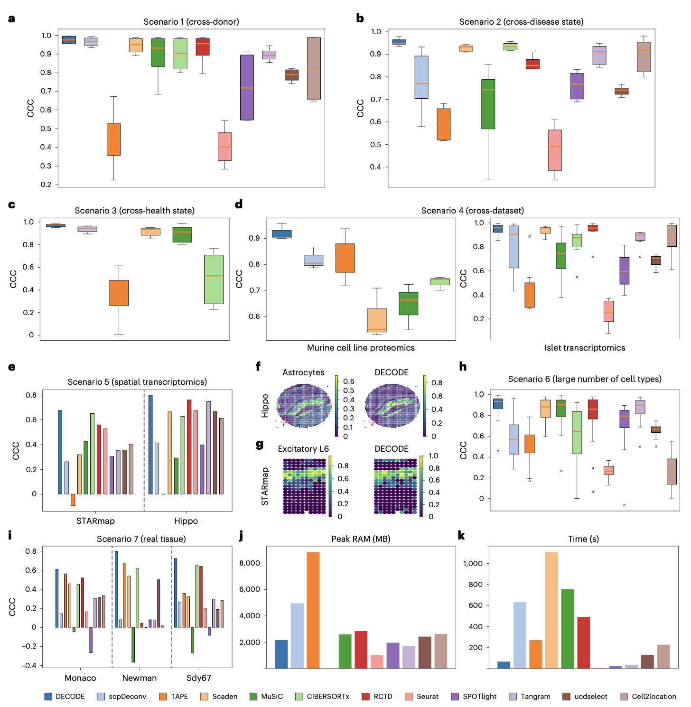
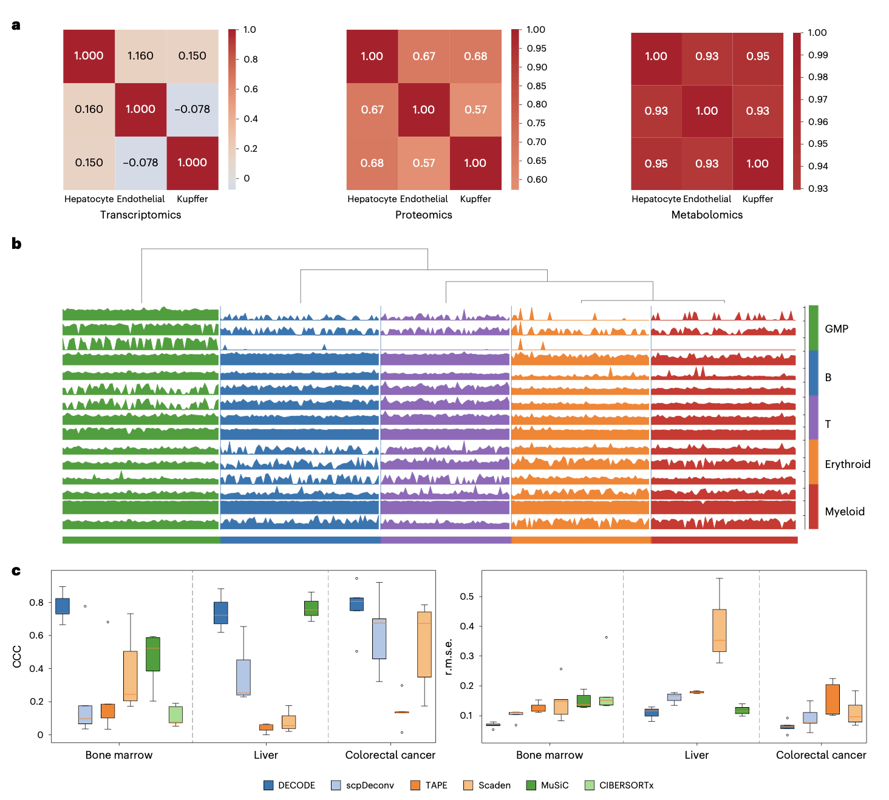
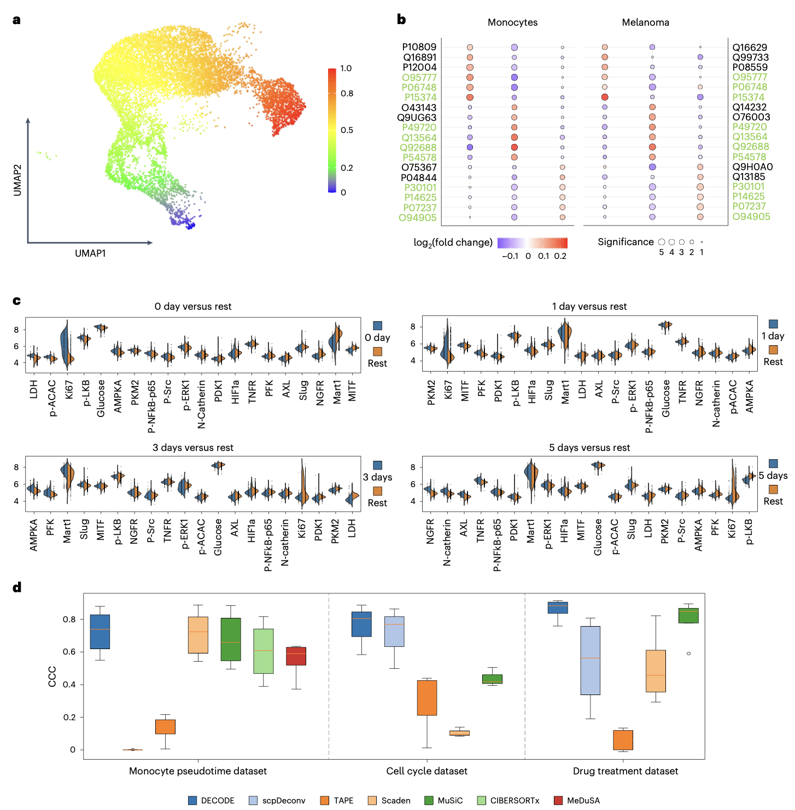
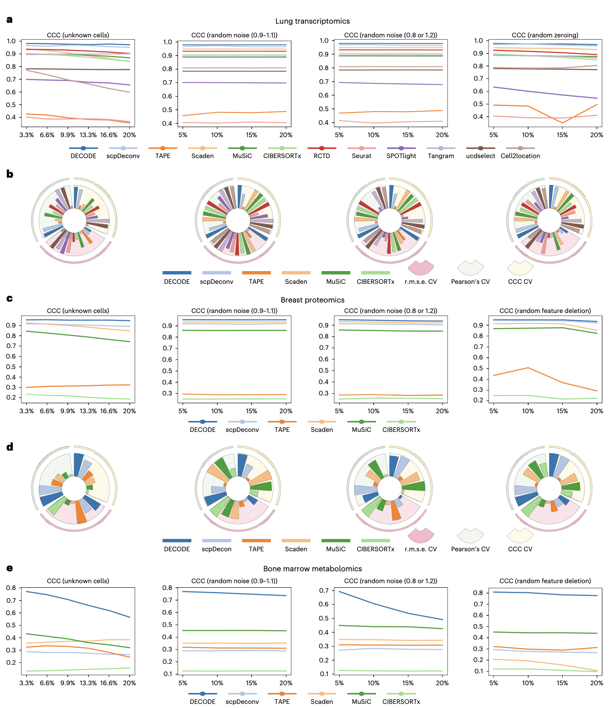
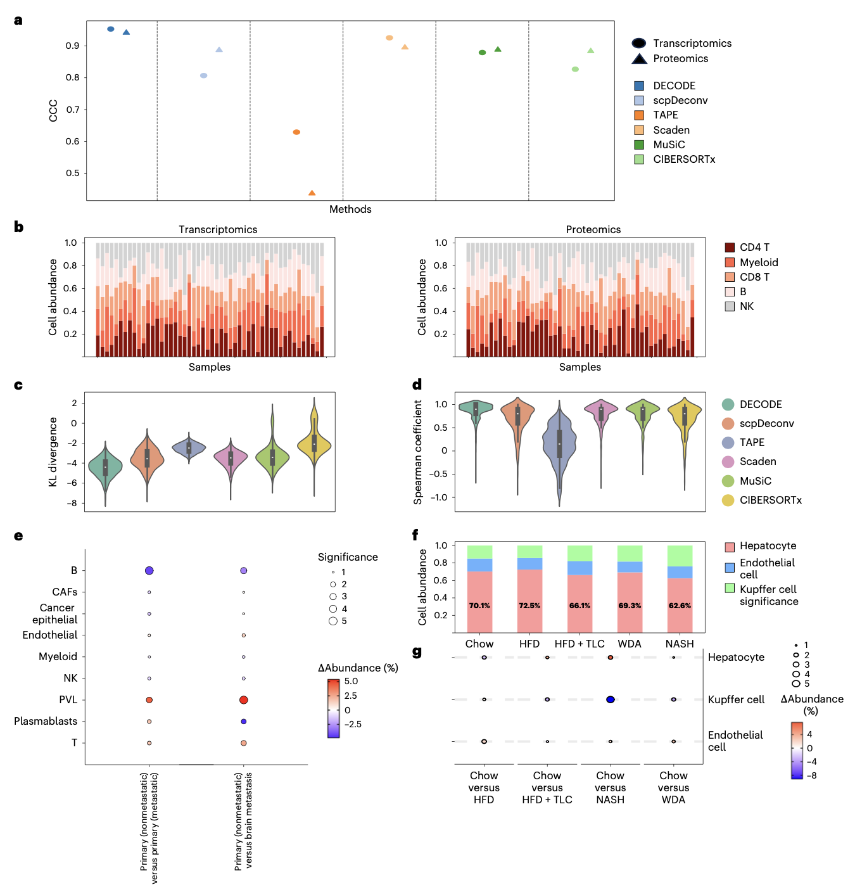

## 背景

细胞丰度及其动态变化是理解器官发育、基因调控和疾病进程的基础。单细胞多组学技术是研究细胞异质性的金标准，但其广泛应用受到成本和技术可行性的制约。反卷积方法为此提供了折中方案。目前，反卷积算法的发展呈现高度专业化的态势。在转录组层面，MuSiC、CIBERSORTx等工具已被广泛应用，而RCTD、SPOTlight等则专门针对空间转录组数据设计。在蛋白质组层面，也出现了如scpDeconv等专用方法。然而，这些针对特定组学设计的方法通常基于对该组学数据分布的特定假设（如泊松或负二项分布），其普适性存疑。更重要的是，代谢组学至今仍缺乏有效的反卷积工具，构成了多组学研究的关键缺口。

构建通用反卷积框架面临三大技术挑战：1）不同组学模态在数据规模、分布、稀疏性和特征维度上差异巨大，要求模型具有极高的灵活性；2）单细胞参考数据与组织样本数据间的“细胞类型不匹配”问题，即单细胞数据可能未包含组织中存在的所有细胞类型；3）由不同供体、技术平台和生理状态引入的强烈批次效应，会掩盖真实的生物学信号。尽管现有方法在特定场景下有效，但仍缺乏一个能同时应对组学异质性、不完整单细胞参考和严重批次效应的统一框架，这限制了反卷积技术在海量多组学组织数据中的广泛应用。

- Zhao, T., Liu, R., Sun, Y. et al. DECODE: deep learning-based common deconvolution framework for various omics data. Nat Methods (2026). https://doi.org/10.1038/s41592-026-03007-y
- 期刊：Nature Methods (IF=32.1)
- 发表时间：2026年3月2日

为了突破这些局限，研究人员开发了DECODE，一个基于对抗训练和对比学习的通用框架。实验表明，DECODE在跨供体、跨疾病、跨健康状态、跨数据集、空间转录组及代谢组反卷积任务中，均显著优于现有先进方法。更重要的是，DECODE能够处理单细胞参考不完整（即组织样本包含未知细胞类型）的实际情况，并在多组学乳腺癌和肝病队列分析中，揭示了与生物学认知一致的细胞比例变化，证明了其在整合大规模多组学队列数据方面的强大潜力。

## 方法

DECODE框架由四个核心阶段构成，其核心流程如下图所示：

### 模拟组织样本生成
基于参考单细胞数据，通过从均匀分布中随机抽取细胞类型比例向量，并按比例随机采样、聚合单细胞特征，生成大量“模拟组织”样本及其对应的已知细胞比例标签，用于模型训练。

### 对抗训练消除批次效应
该阶段整合了编码器、判别器和浅层反卷积模块。编码器将模拟组织数据与待反卷积的目标组织数据映射到潜在空间。判别器被训练以区分两类数据的来源。通过联合优化判别损失和反卷积损失，模型迫使判别器失败，从而在潜在空间中消除两类数据间的批次效应，同时保留用于反卷积的关键生物学信号。训练结束后，编码器参数被固定并传递至下一阶段。

### 对比学习与去噪增强鲁棒性
为提升模型对噪声和不完整参考的鲁棒性，本阶段引入人工噪声细胞，将其与模拟组织样本混合，构成训练样本对。固定编码器将样本对映射至高维空间后，一个基于自注意力机制的去噪器模块负责分离出“净化”的组织特征和噪声特征。通过对比学习损失函数，模型学习最大化净化特征与原始模拟组织特征（正样本对）的相似性，同时最小化其与噪声特征（负样本对）的相似性。该过程使DECODE能够从包含未知细胞类型（视为噪声）的组织数据中，准确地反卷积出已知细胞类型的比例。

### 推理与路径选择
在前向推理时，模型根据单细胞参考数据是否完全覆盖目标组织中所有细胞类型，自动选择计算路径。若完全覆盖，则数据不经过去噪器模块；否则，数据需经过去噪器处理以排除未知细胞类型的干扰，最终通过反卷积模块输出预测的细胞丰度向量。

## 结果

### 在转录组和蛋白质组反卷积中优于现有方法

研究者在涵盖跨供体、跨疾病、跨健康状态、跨数据集、空间转录组、多细胞类型以及真实组织数据在内的7个场景、15个数据集上，将DECODE与12种先进反卷积方法（如TAPE、CIBERSORTx、MuSiC、scpDeconv、Scaden、RCTD、Seurat、SPOTlight等）进行了全面比较。评估指标包括Lin‘s一致性相关系数、均方根误差和皮尔逊相关系数。结果显示，DECODE在绝大多数场景和指标上表现最优或名列前茅，尤其在最具挑战性的跨数据集泛化和空间转录组反卷积任务中，其预测的细胞类型分布与真实情况高度吻合，展现了卓越的准确性和稳定性。在计算效率方面，DECODE的峰值内存占用和运行时间处于合理水平，具备实际应用的可行性。

### 实现准确稳定的代谢组反卷积

代谢组反卷积因可检测代谢物数量少（仅数百个）、且不同细胞类型的代谢谱高度相似而极具挑战。研究使用小鼠肝脏、骨髓和人结直肠癌三个单细胞代谢组数据集对DECODE进行评估。在所有比较方法中，DECODE展现出显著优势，其预测的细胞比例与真实值最为接近。而其他多数方法，由于难以捕捉细胞间微弱的代谢差异信号，对某些细胞类型的预测出现严重偏差甚至失效。这标志着DECODE填补了代谢组学反卷积领域的工具空白。

### 精准反卷积细胞状态

除了细胞类型，细胞状态（如分化伪时间、细胞周期、药物处理时间点）的丰度也对理解细胞功能至关重要。研究人员在三个分别涉及单核细胞伪时间轨迹、黑色素瘤/单核细胞细胞周期、以及黑色素瘤细胞药物响应时间点的数据集上评估了DECODE。结果表明，DECODE能够准确恢复与这些连续或离散细胞状态相关的丰度信息，其性能优于其他对比方法，证明了其在细胞状态反卷积方面的通用能力。

### 在不完整单细胞参考下的精确反卷积

在实际应用中，单细胞参考数据常无法涵盖组织中所有细胞类型。为测试DECODE对此的鲁棒性，研究者在测试数据中逐步引入未知细胞类型，并施加了随机噪声、系统偏差和特征缺失等多种扰动。结果显示，在转录组和蛋白质组数据中，DECODE在大多数扰动场景下表现最佳，稳定性突出。在代谢组数据中，DECODE是唯一能产生可用结果的方法，进一步凸显了其在处理这类高难度数据时的独特有效性。

### 在不同组学数据间具有高度一致性

在队列研究中，对同一组织进行多组学分析时，使用不同的反卷积工具会因方法特异性误差导致结果不一致。研究者利用一个同时包含转录组和表面蛋白质组的CITE-seq数据集构建模拟队列，评估DECODE的跨组学一致性。结果显示，DECODE在两个组学上的反卷积结果高度一致，其样本间的一致性显著优于其他方法。KL散度和斯皮尔曼相关性分析进一步证实，DECODE能为跨组学队列整合提供一致且可靠的细胞丰度估计。

### 在多组学队列分析中揭示生物学见解

最后，研究人员将DECODE应用于真实世界的多组学队列，以验证其生物学发现能力。在整合了238个乳腺癌多组学样本的分析中，DECODE揭示了非转移性原位癌、转移性原位癌和脑转移灶之间显著的细胞组成差异，例如T细胞和血管周样细胞在非转移肿瘤中富集，而初始B细胞在转移病变中增加，这些发现与已知的免疫生物学知识相符。在整合了285个小鼠肝脏多组学样本的分析中，DECODE成功量化了不同饮食模型（正常饮食、高脂饮食、非酒精性脂肪性肝炎NASH、西方饮食加酒精）下肝细胞和库弗细胞的比例变化，观测到的趋势（如NASH和WDA模型中库弗细胞增加）得到了文献支持。这些分析证明了DECODE能够有效整合跨组学、跨研究的数据，挖掘出可靠的生物学模式。

## 讨论

DECODE的出现标志着多组学数据分析的一个重要里程碑。它首次提供了一个能够统一处理转录组、蛋白质组和代谢组数据的反卷积框架，特别是填补了代谢组反卷积的空白。其核心优势在于通过阶段二的对抗训练有效对齐多平台、多状态数据，消除批次效应；并通过阶段三的对比学习和自注意力机制，从含噪输入中重建纯净特征，从而在单细胞参考不完整的情况下仍能实现鲁棒反卷积。

在应用层面，DECODE在乳腺癌和肝脏疾病多组学队列中的成功分析，展示了其将海量组织水平队列数据延伸至细胞水平的强大潜力，为发现疾病特异性细胞组成变化、理解微环境动态提供了新工具。例如，其在乳腺癌中揭示的浆母细胞、T细胞、B细胞和PVL细胞的丰度变化模式，为理解肿瘤免疫编辑和转移机制提供了新的计算证据。

当然，DECODE也存在局限性。其训练过程需要生成人工噪声细胞，增加了与单细胞特征维度相关的计算成本。此外，当前可用的单细胞代谢组数据集仍然有限，制约了对DECODE在该领域鲁棒性的更全面评估。未来的工作可以考虑为DECODE增加专用空间模块以更好地利用空间信息，并将其扩展至更多组学层面（如DNA甲基化），以进一步增强其在整合多组学分析中的适应能力。

## 结论

综上所述，DECODE是一个高效、通用且鲁棒的反卷积框架，能够在转录组、蛋白质组和代谢组数据上准确估算细胞类型和状态的丰度。它提供了一个广泛适用的解决方案，能够充分挖掘现有海量多组学组织水平数据的潜力，为在细胞层面深入理解复杂生物系统、推动生物医学研究提供了新的见解和方法。
