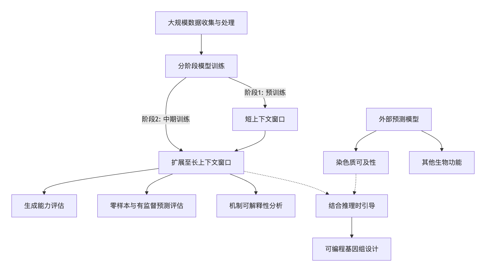
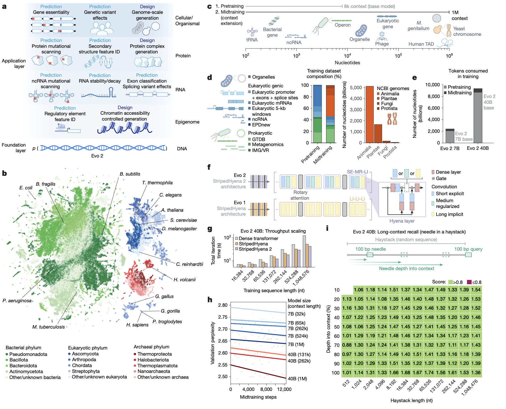
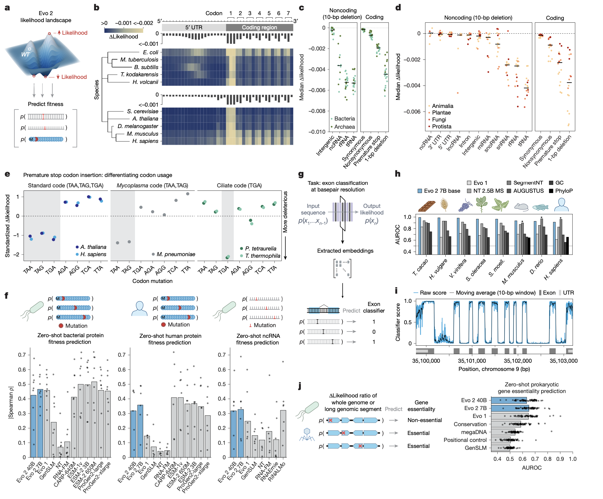
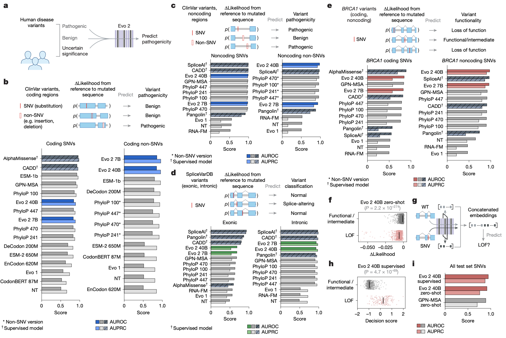
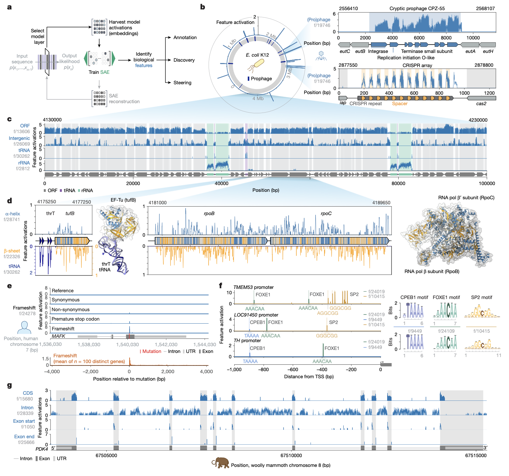
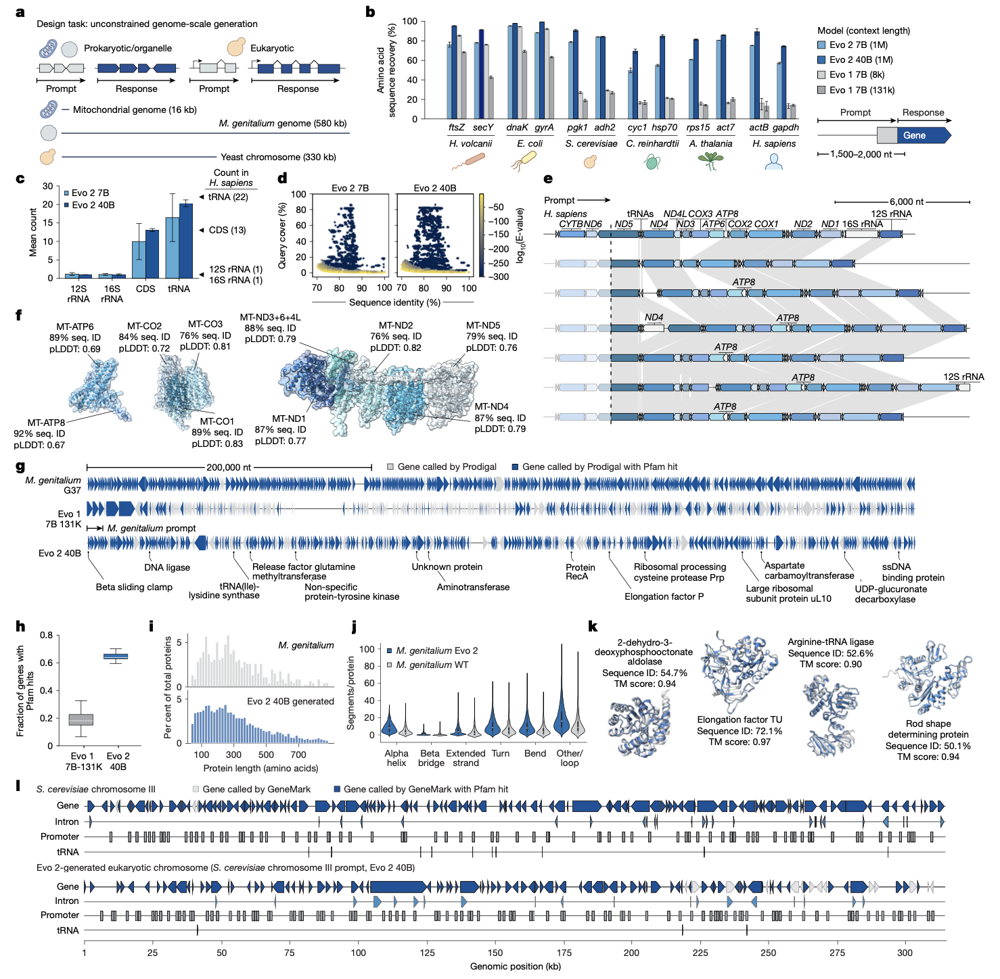
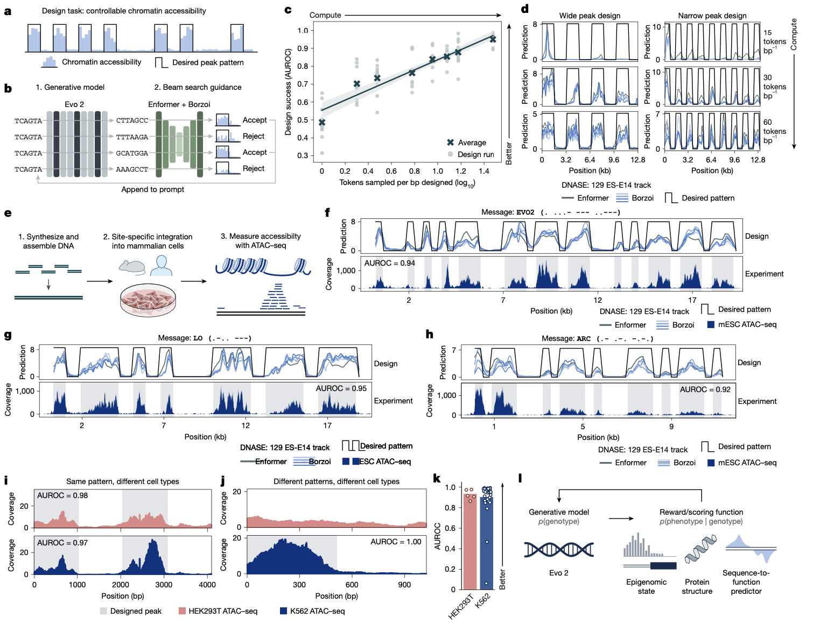

## 背景

生物学研究的尺度横跨分子、系统到有机体，其核心目标是理解和设计跨越所有生命领域的功能组件。创造一个能够跨越生命多样性来设计功能的机器，需要其学习一种深度、通用的生物复杂性表征。虽然这种复杂性超越了人类的直接直觉，但人工智能的进步提供了一个通用框架，可以利用大规模的计算和数据来揭示高阶模式。研究人员推断，要训练出具备这种能力的模型，需要覆盖整个生物多样性谱系的数据，以便发现类似于在其他领域中出现的新兴特性。

此前的研究已证明，在原核基因组序列上训练的机器学习模型能够模拟DNA、RNA、蛋白质的功能，以及它们相互作用形成的复杂分子机器。本研究中，作者团队提出了Evo 2，这是一个在跨越所有生命领域的代表性基因组快照上训练得到的生物学基础模型。通过数据筛选、模型架构、大规模预训练、先进的解释性方法以及推理时预测和生成策略等多方面的创新，研究人员将序列建模范式扩展到了真核基因组的尺度和复杂性之中。Evo 2强调通用能力，而非针对特定任务的优化，它在生物序列建模领域树立了一个重要里程碑，为与中心法则所有“模态”（DNA、RNA、蛋白）相关、从分子到基因组尺度、并可跨越所有生命领域泛化的预测与设计任务，奠定了广泛的基础。

- Brixi, G., Durrant, M.G., Ku, J. et al. Genome modelling and design across all domains of life with Evo 2. Nature (2026). https://doi.org/10.1038/s41586-026-10176-5
- 期刊：Nature (IF 48.5)
- 发表时间：2026年3月4日（在线发表）

研究人员开发了Evo 2，这是一个生物学基础模型。它基于一个高度精选、涵盖所有生命领域的基因组图谱进行训练，其数据量达9万亿DNA碱基对，拥有单核苷酸分辨率的100万个令牌上下文窗口。Evo 2能够在无需针对特定任务进行微调的情况下，精确预测从非编码致病突变到临床上重要的BRCA1变异等多种遗传变异的功能影响。机制可解释性分析揭示，Evo 2学习到的表征与诸多生物学特征相关联，包括外显子-内含子边界、转录因子结合位点、蛋白质结构元件和前噬菌体基因组区域。在生成能力方面，Evo 2能够以前所未有的自然度和连贯性，在基因组尺度上产生线粒体、原核和真核生物序列。当结合预测模型和推理时搜索进行引导时，Evo 2还能生成经过实验验证的染色质可及性模式。研究人员已完全开源Evo 2，包括模型参数、训练与推理代码以及OpenGenome2数据集，旨在加速对生物复杂性的探索与设计。

## 方法

Evo 2的开发与评估涉及一系列复杂且协同的步骤，其核心流程可概括为以下阶段：

**大规模数据收集与处理**：研究团队从已分类的高质量公共数据库中收集、筛选并处理了超过8.8万亿个核苷酸的序列，构建了非冗余的OpenGenome2数据集。该数据集涵盖了细菌、古菌、真核生物和噬菌体。为了生物安全考虑，研究人员刻意排除了感染真核宿主的病毒基因组序列。

**模型架构与训练**：Evo 2采用了名为StripedHyena 2的新型卷积混合架构，该架构结合了多种变体的输入依赖性卷积算子和注意力机制，旨在提高不同长度序列的训练效率。研究人员训练了两种规模模型：一个是70亿参数模型，在2.4万亿个令牌上训练；另一个是400亿参数模型。模型训练分为两个阶段。**第一阶段（预训练）** 专注于短上下文窗口（8,192个令牌），并通过数据加权强调基因区域，以学习功能性遗传元件。**第二阶段（中期训练）** 将模型的上下文长度逐步扩展到100万个令牌，使模型能够学习长距离基因组元素之间的关系。这种分阶段策略在损失缩放和长上下文信息召回方面都取得了良好效果。

**评估框架**：Evo 2的性能在多个维度上进行评估。在预测方面，研究人员测试了其零样本预测能力，包括基因变异对模型似然性的影响、基因必要性、蛋白质/RNA功能适应性等，并与现有最佳方法进行比较。在生成方面，评估了模型在基因补全、完整细胞器基因组生成、原核/真核基因组尺度生成等方面的能力。在可解释性方面，研究人员在Evo 2的隐表征上训练稀疏自编码器，以识别与已知生物学概念（如启动子、外显子、蛋白质二级结构、前噬菌体等）对应的特征维度。最后，在应用层面，研究展示了如何将Evo 2与外部染色质可及性预测模型结合，通过推理时引导来设计具有特定染色质开放模式的DNA序列，并进行了实验验证。

## 结果

### 学习生物演化约束

Evo 2通过在大规模演化数据集上学习序列的似然性，捕捉了通常反映功能重要性的保守序列模式。研究人员评估了单核苷酸变异对Evo 2模型似然性的影响，观察到模型准确捕捉了多种已知的生物学约束。例如，在蛋白编码基因起始密码子周围的突变，模型能显示出起始密码子内部、反映三联密码子结构的周期性模式，以及原核生物Shine-Dalgarno序列和真核生物Kozak序列位置上的强烈变化。在变异类型上，非同义突变、提前终止密码子和移码突变对模型似然性的影响远大于同义突变。在非编码区，tRNA和rRNA序列内的缺失对模型似然性的影响也远大于基因间区。模型还成功学习了不同物种间终止密码子使用的差异。在多个蛋白质和RNA的深度突变扫描数据集上，Evo 2的零样本似然性与功能适应性测量值显著相关，与当前最先进的蛋白质语言模型和RNA语言模型具有可比性。

### 实现准确的人类变异效应预测

变异效应预测是基因组学的一项核心挑战。研究人员在ClinVar、SpliceVarDB等包含临床和实验确定的人类变异数据库上评估了Evo 2。结果表明，对于编码区的单核苷酸变异，Evo 2与领先的零样本方法表现相当。对于编码区的非SNV变异（如插入、缺失），两种规模的Evo 2模型均超越了所有其他被比较的方法。对于非编码区变异，Evo 2 400亿模型在所有无监督模型中排名第一，仅落后于有监督的专用模型。在BRCA1和BRCA2基因的功能性变异数据集上，Evo 2的零样本预测同样表现出色。此外，研究人员展示了如何利用Evo 2的序列嵌入训练一个轻量级有监督分类器，该分类器在区分BRCA1基因功能丧失性变异上表现优异，超越了零样本预测，突显了Evo 2嵌入在下游任务中的应用潜力。

### 模型内部特征与生物学概念对齐

通过稀疏自编码器对Evo 2内部表征进行分析，研究人员在不依赖任何先验生物标签的情况下，识别出大量与已知生物学概念对齐的特征。例如，模型学习到了与原核生物前噬菌体区域、CRISPR阵列间隔序列相关的特征，以及与开放阅读框、蛋白质二级结构（α螺旋、β折叠）相关的特征。在人类基因组中，研究人员发现了对移码和提前终止突变敏感的特征，激活在人类启动子区域并与已知转录因子结合基序相似的特征，以及专门与外显子、内含子及其边界结构相关的特征。值得注意的是，这些在模式生物中识别出的特征，能够迁移并应用于猛犸象基因组的基因区域，显示出模型的跨物种泛化能力。

### 在基因组尺度上生成接近自然的序列

作为一个生成模型，Evo 2被用于从多种生物中生成DNA序列。在基因补全任务中，Evo 2在古菌、原核和四类真核生物中均能以高氨基酸序列恢复率完成基因。更重要的是，Evo 2能够生成整个细胞器（如人类线粒体）的完整序列，生成的序列包含了正确数量的编码序列、tRNA和rRNA基因，并保持了正确的基因排列顺序和密码子使用偏好。在小型原核基因组尺度上，研究人员以生殖支原体为模板，提示Evo 2生成了约580kb的序列。生成的序列中包含大量具有显著蛋白结构域匹配的基因，其蛋白质长度和二级结构分布与天然基因组相似。在真核尺度上，Evo 2成功生成了包含tRNA、启动子和内含子结构的酵母染色体片段。这些评估表明，Evo 2能够生成在多个计算指标上接近自然的细胞器、原核和真核基因组序列。

### 通过推理时引导设计哺乳动物染色质模式

研究人员展示了一种无需重新训练模型即可实现条件生成的方法：将Evo 2与现有的染色质可及性预测模型（如Enformer、Borzoi）相结合，通过推理时的束搜索进行引导。通过定义一个期望的染色质开放模式作为评分函数，研究人员引导Evo 2生成了能够在小鼠胚胎干细胞中实现特定可及性模式的DNA序列。实验验证成功实现了写入“EVO2”、“LO”、“ARC”等摩斯电码信息的染色质模式，且预测与实验结果高度一致。该方法同样适用于设计在人类HEK293T和K562细胞系中具有相同或细胞类型特异性染色质模式的序列，验证了设计的通用性和可编程性。分析表明，Evo 2生成的设计序列在开放区域富含转录因子基序，其序列属性与天然调控序列相似，显示出优于简单随机序列的调控潜力。

## 讨论

Evo 2的发布标志着基因组规模AI建模的一个关键进展。它首次提供了一个在涵盖所有生命领域的数据上训练的统一基础模型，在零样本预测、可解释特征发现和长序列生成方面均展现了强大的通用能力。其在人类临床变异预测、特别是非SNV变异方面的卓越表现，以及生成接近自然的长基因组序列的能力，为计算生物学和合成生物学开辟了新的可能性。

然而，Evo 2也存在局限性。其生成序列的计算评估并不能保证细胞内的功能活性，大规模功能性基因组的实验验证仍是一项艰巨的任务。尽管通过排除真核感染病毒数据进行了安全缓解，但针对特定任务的后续训练仍可能规避此措施。此外，当前的推理时引导设计方法计算成本较高。

展望未来，将Evo 2与群体基因组变异数据、序列到功能的实验数据，或其他生物模态（如三维结构、表观基因组）相结合，有望进一步扩展其下游任务的范围。利用可解释性方法进行基因组挖掘以发现新的生物元件，以及通过有监督微调和来自生物实验的强化学习反馈来提升生成序列的质量和效率，是极具前景的研究方向。

## 结论

总而言之，Evo 2是一个强大的生物学基础模型，它在跨越所有生命领域的基因组数据上训练，实现了对生物复杂性的通用预测和生成。通过开源模型、数据和代码，Evo 2为科学界提供了一个统一的平台，有望加速从理解基因功能到编程化设计复杂生物系统的研究进程。
