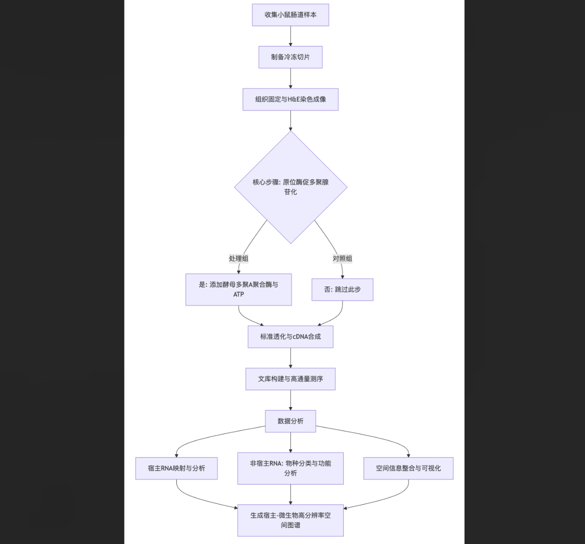
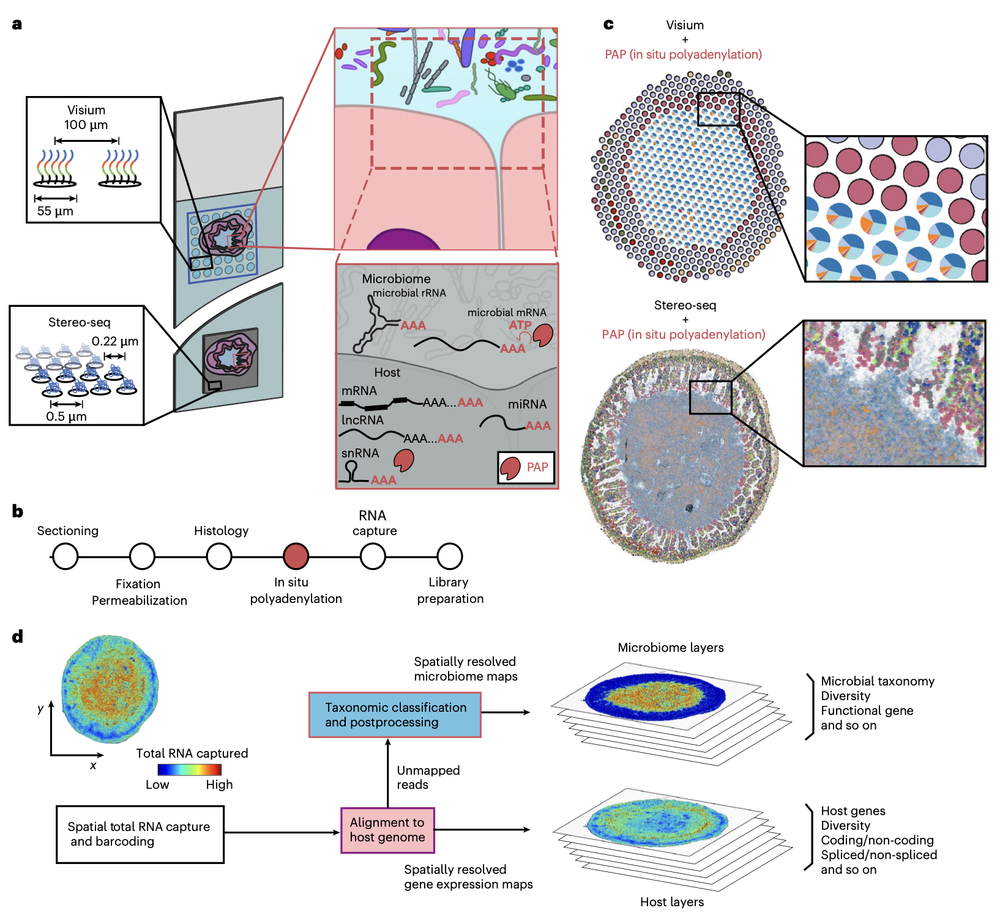
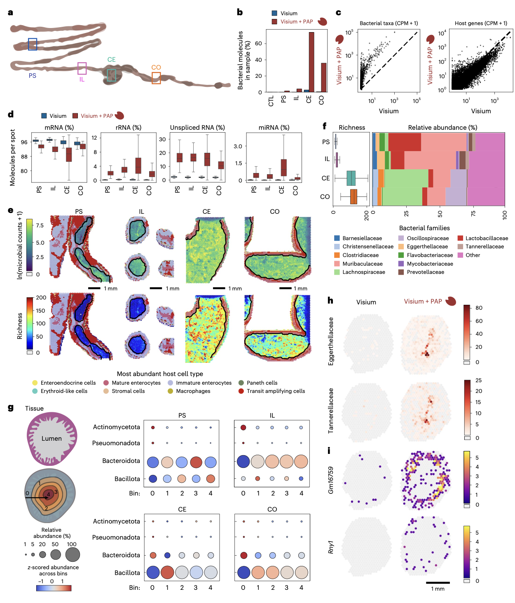
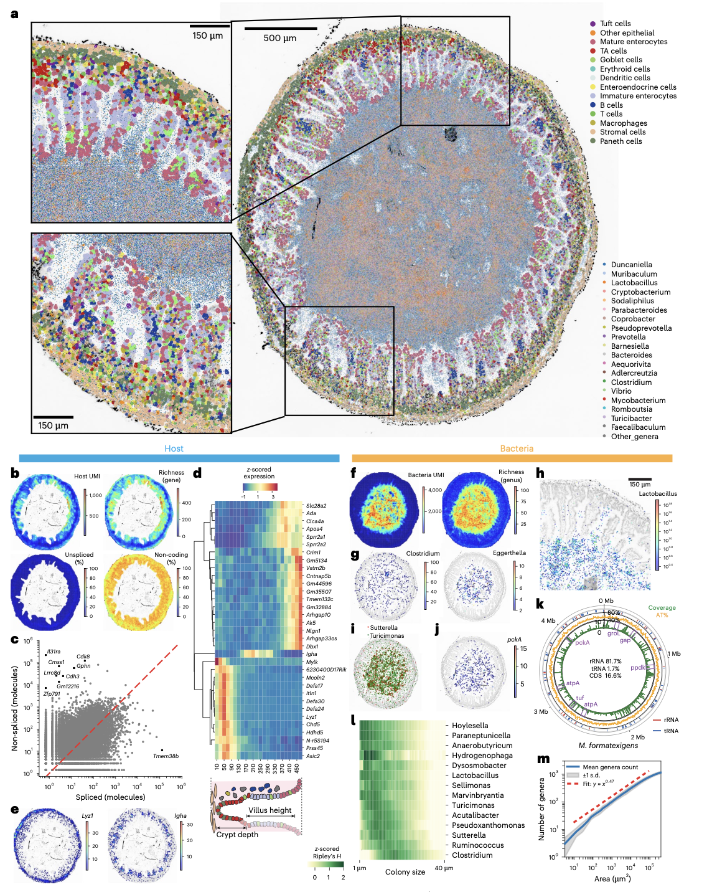
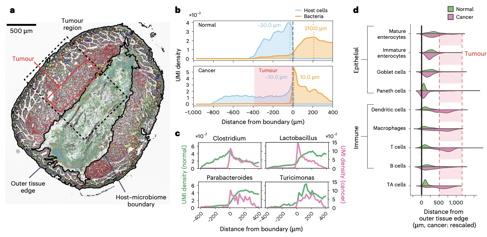

## 背景
长期以来，肠道微生物组被认为是一个具有类组织特性的器官系统，其功能由微生物与宿主细胞间的相互作用所定义。然而，由于缺乏合适的测量工具，研究这些相互作用一直存在挑战。尽管成像技术可以研究微生物在特定位置（如肠道、口腔）的定位，但这类方法通常存在多重性受限或无法提供宿主转录响应等详细信息。**空间分辨RNA测序**技术的兴起，使得在完整组织中保留空间信息的同时分析基因表达成为可能，但目前商业平台主要针对宿主多聚腺苷酸化转录本进行优化，在捕获微生物RNA方面存在灵敏度与分辨率不足等问题。

- Ntekas, I., Takayasu, L., McKellar, D.W. et al. Spatial transcriptomics maps host–gut microbiome biogeography at high resolution. Nat Microbiol (2026). https://doi.org/10.1038/s41564-026-02286-7
- 期刊：Nature Microbiology (IF 19.4)
- 发表时间：2026年3月6日

这篇研究报道了一种高通量、高分辨率的空间转录组学方法，该方法通过对细菌和宿主RNA进行**原位酶促多聚腺苷酸化处理**，显著提升了细菌RNA的捕获效率，并能够同时分析宿主编码与非编码转录本。研究人员在商业平台上验证了该方法，证明其相较于标准流程，细菌RNA的捕获效率可提升高达100倍。将该方法应用于小鼠肠道肿瘤模型，揭示了肠道微生物组沿肠道纵轴的生物地理学特征、微米尺度上的微生物间强相互作用，以及肿瘤相关区域宿主-微生物界面结构的显著变化。该方法为在健康与疾病状态下深入研究宿主-微生物间的短程、双向相互作用提供了一个易于推广的技术框架。

## 方法
本研究核心方法“原位多聚腺苷酸化空间总RNA测序”，旨在通过一个简单的酶学步骤，增强现有商业空间转录组平台对非多聚腺苷酸化RNA的捕获能力，特别是微生物RNA。

### 工作流程
以下是该研究核心方法的工作流程示意图，其核心步骤是“原位酶促多聚腺苷酸化”：

具体而言，该方法的优化与实施要点包括：
1.  **酶学优化**：在体外表征了酵母多聚A聚合酶的最佳反应时间，确定在37°C下孵育25分钟足以在组织切片中实现充分的RNA多聚腺苷酸化。
2.  **平台兼容性**：研究人员分别在**低分辨率平台**和**高分辨率平台**上实施了该方法。低分辨率实验使用了Visium平台，对小鼠肠道（近端小肠、回肠、盲肠、结肠）多个位点进行采样。高分辨率实验则采用了Stereo-seq平台，实现了约0.5微米像素级的空间分辨率，能够对宿主-微生物界面进行更精细的描绘。
3.  **样本处理**：将新鲜冷冻组织切片固定于甲醇-醋酸-氯仿混合液中。成像后，在空间芯片上直接进行原位多聚腺苷酸化反应。之后，进行标准的透化、cDNA合成与文库构建步骤。对照样本则跳过多聚腺苷酸化步骤，直接进行透化。
4.  **数据分析**：测序数据通过定制化流程进行处理。首先，将读数比对到宿主基因组，剩余的未比对读数通过Kraken2软件进行物种分类。宿主和微生物读数被分别构建为具有空间坐标的数据对象，用于后续的生物地理、空间自相关、共定位及与宿主转录组整合的分析。

## 结果
该方法有效增强了微生物和宿主非编码RNA的捕获，并揭示了肠道生态系统的复杂空间组织。

### 原位多聚腺苷酸化显著提升捕获效率

在低分辨率Visium平台上的配对实验表明，原位多聚腺苷酸化处理使细菌RNA的捕获量**最高提升了99倍**。病毒和古菌RNA的捕获也得到增强。该处理不仅提升了低丰度类群（如Tannerellaceae、Eggerthellaceae）的检测，对高丰度类群（如乳杆菌科、毛螺菌科）同样有效。捕获到的微生物组成与邻近切片的**宏转录组测序**结果在微生物生物量高的区域（盲肠、结肠）高度一致。除了微生物RNA，该处理还显著富集了多种宿主来源的非编码RNA分子，包括未剪接mRNA、核糖体RNA、微小RNA、长链非编码RNA等，其中未剪接mRNA的比例从2.1%提升至15.6%，为研究宿主细胞的动态响应提供了新视角。

### 肠道微生物组的宏观生物地理学

沿胃肠道（从近端小肠、回肠到盲肠、结肠）移动，研究人员观察到每个空间点上的**分类单元丰富度**显著增加。不同微生物科的相对丰度呈现明显的区位特异性：乳杆菌科和Muribaculaceae在近端小肠和回肠丰富，但在盲肠和结肠中不占优势；毛螺菌科和梭菌科在盲肠中丰度最高；而黄杆菌科、Eggerthellaceae等在小肠中相对丰度更高。在横轴方向上（从组织到肠腔），不同区域的微生物组成变化模式不同，例如，在小肠中，肠腔的微生物多样性最高，而在盲肠和结肠中，靠近黏膜的区域多样性更高。

### 高分辨率下的微生物-宿主界面结构

在高分辨率Stereo-seq数据中，研究人员在回肠组织切片中恢复了超过600万个宿主RNA和超过1000万个微生物RNA分子。将宿主细胞图谱与0.5微米分辨率的微生物信号整合，生成了宿主-微生物界面的精细视图。宿主基因表达在空间上并不均匀，小肠绒毛顶端的成熟肠上皮细胞表现出更高的基因表达水平和多样性。多种与微生物响应相关的宿主基因（如溶菌酶基因Lyz1、IgA重链编码基因Igha等）呈现出特异性的空间表达模式。

对微生物的局部密度和多样性分析揭示了**微生物空间组织的微观特征**。在回肠中，靠近宿主边界区域的细菌负荷和多样性较低。多个属（如乳杆菌、梭菌等）显示出显著的**空间自相关**，表明存在菌落形成现象。计算Ripley's H函数推断出不同菌落的大小各异，例如乳杆菌形成小菌落（半径<10 μm），而梭菌可形成较大菌落（半径>30 μm）。空间相关性分析揭示了某些属之间存在强共定位模式。此外，观测到的属级分类单元数量与取样面积之间的关系遵循幂律，幂指数为0.47，表明小鼠回肠微生物组相对于其他生态系统具有较高的空间分散性。

### 肿瘤-微生物界面的结构重塑

在分析带有显著肿瘤的回肠组织时，研究人员比较了肿瘤边缘与正常组织边缘微生物组的空间组织。在正常组织中，微生物在距宿主绒毛100-200 μm处最为密集。而在**肿瘤组织中**，微生物密度最高的区域直接位于**肿瘤与管腔的边界**。优势菌属如梭菌、乳杆菌和副拟杆菌与肿瘤边缘密切关联，而在正常组织中，这些类群通常远离组织边界。在肿瘤组织中，宿主细胞的分布结构也发生改变：肿瘤相关的快速增殖细胞以及免疫细胞（如树突状细胞、巨噬细胞、CD8+ T细胞）在肿瘤区域富集，而正常情况下靠近边界的杯状细胞则因肿瘤团块的存在而远离宿主-微生物界面。

## 讨论
本研究证明，将原位多聚腺苷化与空间RNA测序相结合，能够同时实现肠道微生物组以及宿主多聚腺苷酸化和非多聚腺苷酸化转录组的空间图谱绘制。通过在商业平台的流程中添加一个简单的酶学步骤，该方法为跨空间尺度测量宿主-微生物相互作用组提供了一个可及且可扩展的途径。

高分辨率分析揭示了微生物类群内部和之间存在相互作用，包括某些类群存在菌落形成的证据。菌落形成可能指示活跃生长，其大小或可作为生长速率的替代指标。在肿瘤组织与微生物组的边界，研究人员观察到关键微生物类群向宿主边界移动，以及宿主组织结构的改变，这提示该区域发生相互作用的可能性增加。

尽管本研究为在微生物组研究中引入空间维度奠定了基础，但仍存在一些局限性。**商业空间转录组平台的高成本**是广泛应用的主要障碍。此外，多聚腺苷酸化导致测序读数在编码RNA、非编码RNA和微生物RNA之间重新分配，可能降低特定宿主mRNA的检测深度。与靶向特定转录本的成像方法相比，测序方法的灵敏度较低，这可能限制对稀有细胞状态或低丰度微生物的识别。同时，当前数据库和分类方法可能存在的序列错误分类，也要求严格的阴性对照和正交验证来避免假阳性结果。

未来，通过改进文库制备化学、优化固定方案、整合长读长测序、提高rRNA去除效率，以及开发能够兼容福尔马林固定石蜡包埋组织的方法，有望进一步提升该技术的性能。此外，亟需开发能够整合宿主编码、非编码和微生物信号的新型计算工具。

## 结论
本研究建立并验证了一种增强型空间总RNA测序方法，成功绘制了小鼠肠道宿主与微生物组在健康和疾病状态下的高分辨率空间互作图谱。该方法不仅揭示了肠道微生物组精细的生物地理结构、微米尺度的菌落形成现象，还发现了肿瘤微环境中宿主-微生物界面的显著重构。该工作为在空间背景下系统研究微生物组生态学、宿主-微生物互作，及其在炎症性肠病、癌症等疾病中的作用提供了强大的工具和新的见解。
