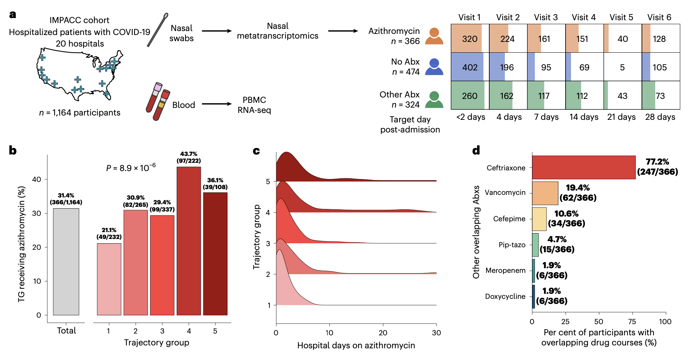
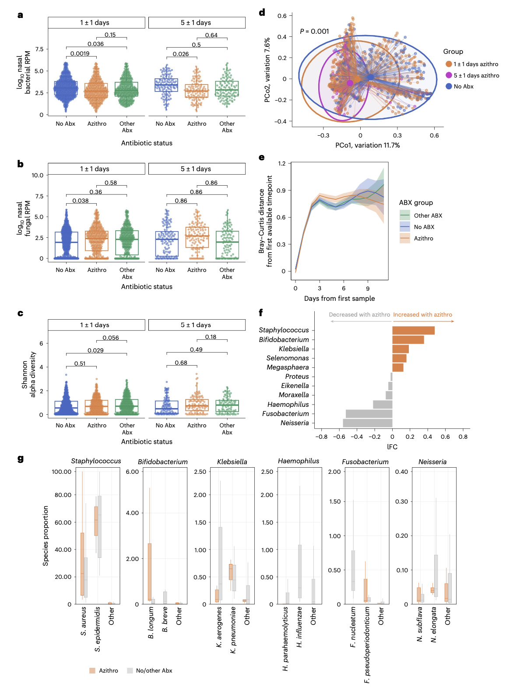
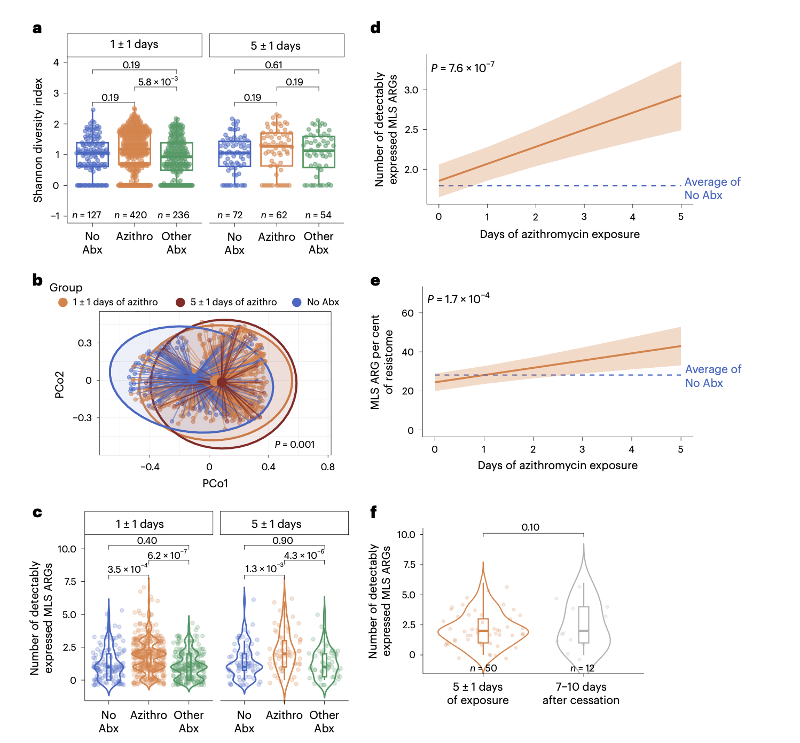
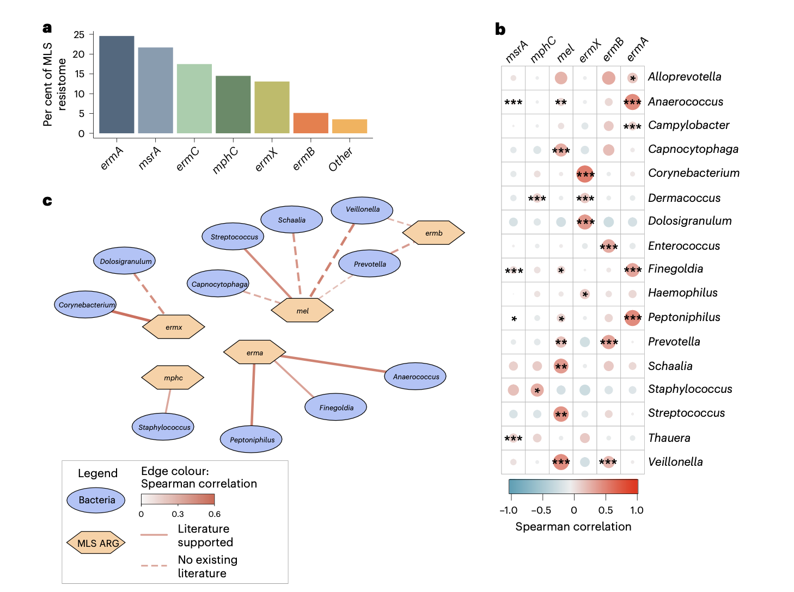

## 背景

阿奇霉素是世界卫生组织的基本药物之一，也是人类医疗中使用最广泛的抗生素之一。在COVID-19大流行初期，部分早期研究曾暗示其可能具有抗病毒活性，且既往研究显示大环内酯类抗生素具有抗炎特性，这促使阿奇霉素一度成为住院患者的常用药物。然而，随后的随机对照试验证实，阿奇霉素在治疗COVID-19方面并未带来临床获益。尽管如此，在临床实践中，该药物仍被大量处方。

已有研究发现，阿奇霉素暴露可改变人类微生物组及其携带的抗菌药物耐药基因库（即抗性基因谱）。然而，尚无研究评估在急性呼吸道感染背景下经验性使用阿奇霉素对呼吸道微生物组的影响。此外，既往关于阿奇霉素暴露的研究均未纳入宏转录组学分析，该方法能够同时评估细菌16S rRNA丰度和耐药基因表达，从而对抗性基因谱进行功能性分析。

**源文件信息**:
- Glascock, A., Maguire, C., Phan, H. V., Lydon, E. C., Schaenman, J., Calfee, C. S., ... & Langelier, C. R. (2026). Empiric azithromycin alters the upper respiratory microbiome and resistome without anti-inflammatory benefit in COVID-19. *Nature Microbiology*. https://doi.org/10.1038/s41564-026-02285-8
- 期刊：Nature Microbiology (IF 19.4)
- 发表时间：2026年3月16日

这篇研究在一项前瞻性、多中心队列研究中，对1164名因COVID-19住院的患者进行纵向宏转录组学（Longitudinal Metatranscriptomics）分析，通过采集鼻拭子样本，比较了接受阿奇霉素治疗、未使用任何抗生素或使用其他抗生素的患者其上呼吸道微生物组、抗性基因谱及系统性免疫反应的差异。研究发现，阿奇霉素显著改变了上呼吸道微生物组的组成，并增加了大环内酯类/林可酰胺类/链阳菌素B（MLS）类抗生素耐药基因的表达及其在抗性基因谱中的相对比例。这些变化在用药1天内即可出现，并持续一周以上。MLS耐药基因的表达与多种共生菌和潜在致病菌相关，而在宿主气道和血液的炎症基因表达方面未发现差异。此项研究结果表明，经验性使用阿奇霉素会显著影响上呼吸道的微生物组和抗性基因谱，但并未显示出明显的抗炎益处。

## 方法

### 研究设计、临床队列与伦理

本研究为前瞻性纵向研究，于2020年5月至2021年3月期间，从美国15个生物医学中心的20家医院入组了1164名因COVID-19住院的患者。研究遵循了观察性流行病学研究报告规范。研究方案经各中心机构审查委员会审批。入组时及住院期间，所有参与者均未接种SARS-CoV-2疫苗。

### 样本采集与宏转录组测序

在入院后72小时内及后续目标时间点（第4、7、14、21、28天）采集患者的中鼻甲鼻拭子样本。提取RNA后，使用Illumina Total Stranded RNA Prep with Ribo-Zero Plus试剂盒进行rRNA去除、cDNA合成和文库构建。文库在Illumina NovaSeq 6000平台上进行双端100bp测序，目标深度为每样本5000万条读长。

### 微生物组与抗性基因谱分析

使用CZID开源生物信息学流程处理宏转录组数据。首先比对并去除宿主读长，随后进行质量控制。过滤后的微生物读长被二次抽样至200万条，并使用Minimap2比对至NCBI核苷酸数据库进行物种分类。同时，使用SPAdes对短读长进行组装，以提高比对特异性。抗性基因谱分析则通过CZID抗菌药物耐药流程完成，该流程利用耐药基因鉴定工具和综合抗生素耐药数据库。

### 背景与批次校正

使用26个双蒸水阴性对照样本对环境和批次效应进行统计建模和校正，仅在患者样本中显著富集的微生物分类单元和耐药基因被保留用于下游分析。

### 统计分析

患者被分为三组：阿奇霉素组（接受阿奇霉素±其他抗生素）、其他抗生素组（仅接受非阿奇霉素抗生素）和无抗生素组。主要分析聚焦于两个时间点：暴露后1±1天和5±1天。使用线性混合效应模型比较组间差异，并校正年龄、性别、疾病严重程度、住院天数、糖皮质激素使用等协变量。使用广义可加混合模型分析纵向趋势。微生物组多样性和差异丰度分析分别使用vegan、phyloseq和NCOMBC等R包完成。相关性分析采用Spearman相关。宿主转录组差异表达分析使用limma包完成。所有P值均使用Benjamini-Hochberg方法进行错误发现率校正。

## 结果

### 队列特征

在1164名COVID-19患者中，366人接受了阿奇霉素治疗，474人未使用任何抗生素，324人使用了其他抗生素。阿奇霉素治疗在疾病最严重的患者中最为常见。中位治疗天数为2天。绝大多数患者在入院一周内开始使用阿奇霉素，最常与其联用的抗生素是头孢曲松。

### 阿奇霉素暴露改变呼吸道微生物组

分析显示，暴露于阿奇霉素约5天后，与对照组相比，患者上呼吸道细菌相对丰度显著降低。用药1天后即可观察到类似趋势。同时，阿奇霉素暴露与上呼吸道真菌相对丰度的增加相关。尽管微生物组的α多样性未受影响，但其群落组成在阿奇霉素暴露后发生了显著改变。

差异丰度分析表明，阿奇霉素暴露与上呼吸道潜在致病菌（如葡萄球菌属、克雷伯菌属）的富集，以及几种典型共生菌（如奈瑟菌属、梭杆菌属）的耗竭相关。在物种水平，金黄色葡萄球菌和表皮葡萄球菌构成了差异富集葡萄球菌属的主体。研究人员未发现阿奇霉素治疗与上呼吸道SARS-CoV-2病毒载量或微生物代谢通路表达的差异存在关联。

### 阿奇霉素暴露改变呼吸道抗菌抗性基因谱

阿奇霉素暴露在治疗早期（1±1天）即导致抗性基因谱的α多样性增加。同时，抗性基因谱的组成在阿奇霉素暴露后也发生了显著变化。

研究重点聚焦于介导MLS类耐药的基因。研究发现，在治疗早期和晚期，阿奇霉素暴露组中可检测到的MLS基因数量均显著多于无抗生素组或其他抗生素组。纵向模型分析证实，阿奇霉素暴露天数与上呼吸道微生物组中可检测到的MLS耐药基因数量的增加显著相关。

进一步分析各耐药基因类别在抗性基因谱中所占比例的变化发现，阿奇霉素暴露5天后，MLS类耐药基因的比例从24.5%显著增加至42.9%。值得注意的是，MLS耐药基因的富集（无论是基因数量还是比例）在阿奇霉素停药后7-10天仍然持续存在。

### 气道抗性基因谱与微生物组的相关性将耐药基因与分类单元相关联

研究人员鉴定了气道微生物组中的多种MLS耐药基因，其中以 *ermA* 和 *msrA* 最为普遍。多维相关性分析显示，多个MLS基因与潜在致病菌和常见共生菌的丰度呈显著正相关。物种水平的分析进一步强化了这些关联。利用CARD数据库的病原体来源预测工具进行的补充分析，也强调了MLS耐药基因与特定物种（如化脓性链球菌与 *ermA*，金黄色葡萄球菌/表皮葡萄球菌与 *ermC*）之间的关联。

### 阿奇霉素未改变宿主炎症反应

为探究阿奇霉素在急性COVID-19背景下是否具有免疫调节作用，研究人员进行了宿主差异基因表达分析。结果显示，在治疗5天后，无论是气道还是血液中，均未发现与阿奇霉素暴露相关的差异表达基因。这表明，阿奇霉素并未显著减弱COVID-19住院患者的宿主炎症反应。

## 讨论

在这项针对COVID-19住院患者的大型多中心队列研究中，经验性阿奇霉素治疗与上呼吸道微生物组、真菌组和抗菌抗性基因谱的改变相关。研究发现，阿奇霉素治疗约5天后，可检测到的大环内酯类耐药基因显著扩增，某些效应在用药数天内即可出现。此外，阿奇霉素治疗还与上呼吸道菌群组成的改变有关，包括克雷伯菌和葡萄球菌等潜在致病菌的富集。这些发现共同表明，在病毒性呼吸道感染患者中不当使用阿奇霉素，可驱动大环内酯类耐药决定因子的扩增并破坏气道微生物组的组成。

本研究结果与先前在非洲儿童中开展的大规模阿奇霉素治疗研究结论一致，并进一步将效应扩展至呼吸道，并在转录水平证实了耐药基因的功能性表达。大环内酯类耐药的肺炎链球菌和化脓性链球菌已被美国疾病控制与预防中心列为紧迫威胁。考虑到门诊处方中约有30%的抗生素被认定为不适当或不必要，且阿奇霉素处方中有很大一部分是开给儿童的，这一发现尤为令人担忧。

本研究的优势包括大型多中心队列、详细的临床表型分析、呼吸道宏转录组学技术的应用以及对临床和生物学数据的严格质量控制。局限性则包括观察性研究设计、短读长测序技术限制了对耐药基因与特定分类单元进行精确定位的能力，以及鼻拭子样本仅代表上呼吸道，可能无法反映下呼吸道的微生物变化。

## 结论

总而言之，本研究发现，在COVID-19住院患者中，阿奇霉素暴露与气道微生物组组成的改变以及大环内酯类耐药基因的扩增相关。综合来看，这些发现表明，在病毒性呼吸道感染患者中经验性使用大环内酯类药物，可能会促进抗菌药物耐药性并带来公共卫生风险，从而强调了抗生素管理（Antibiotic Stewardship）工作的重要性。
