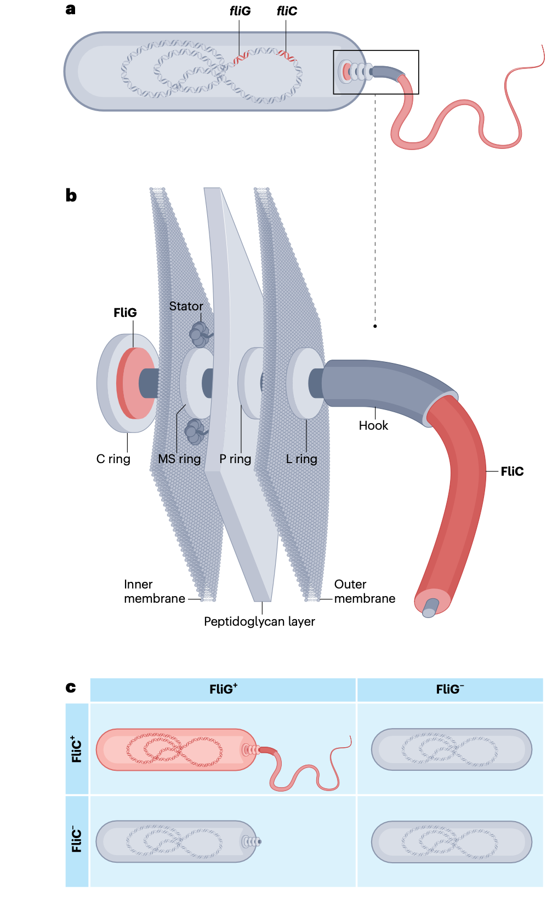
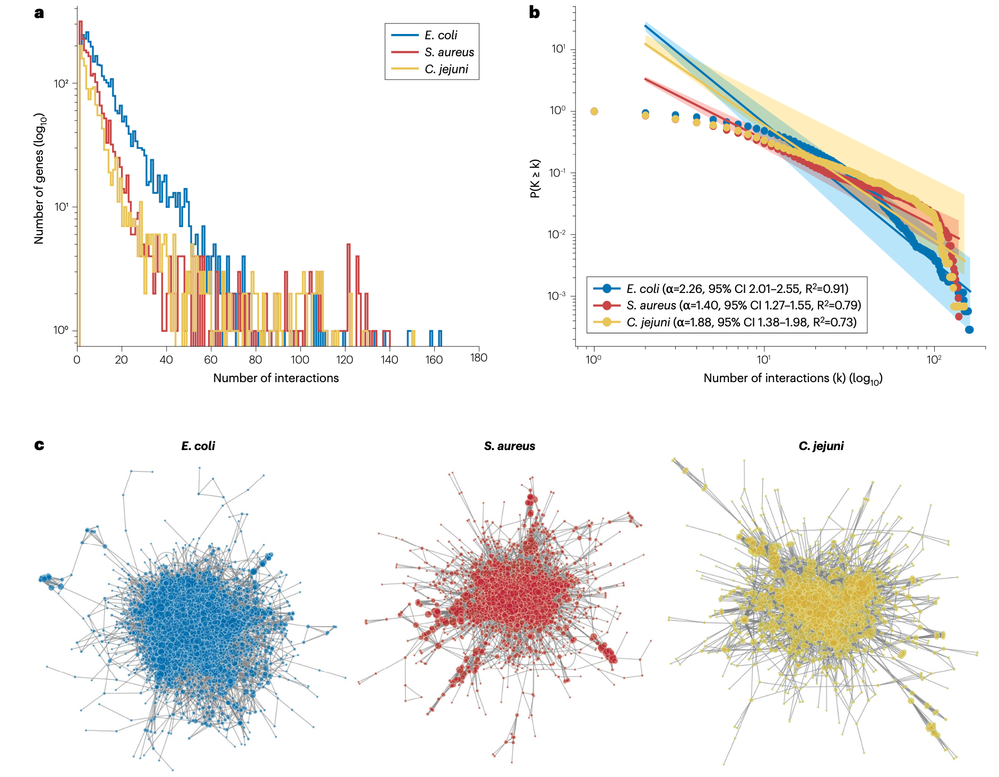
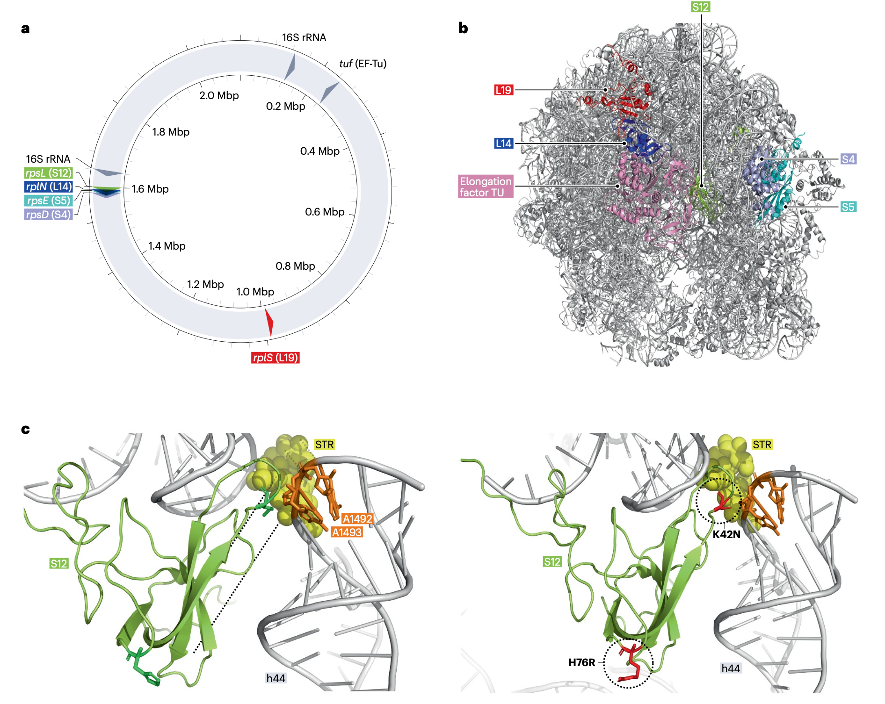
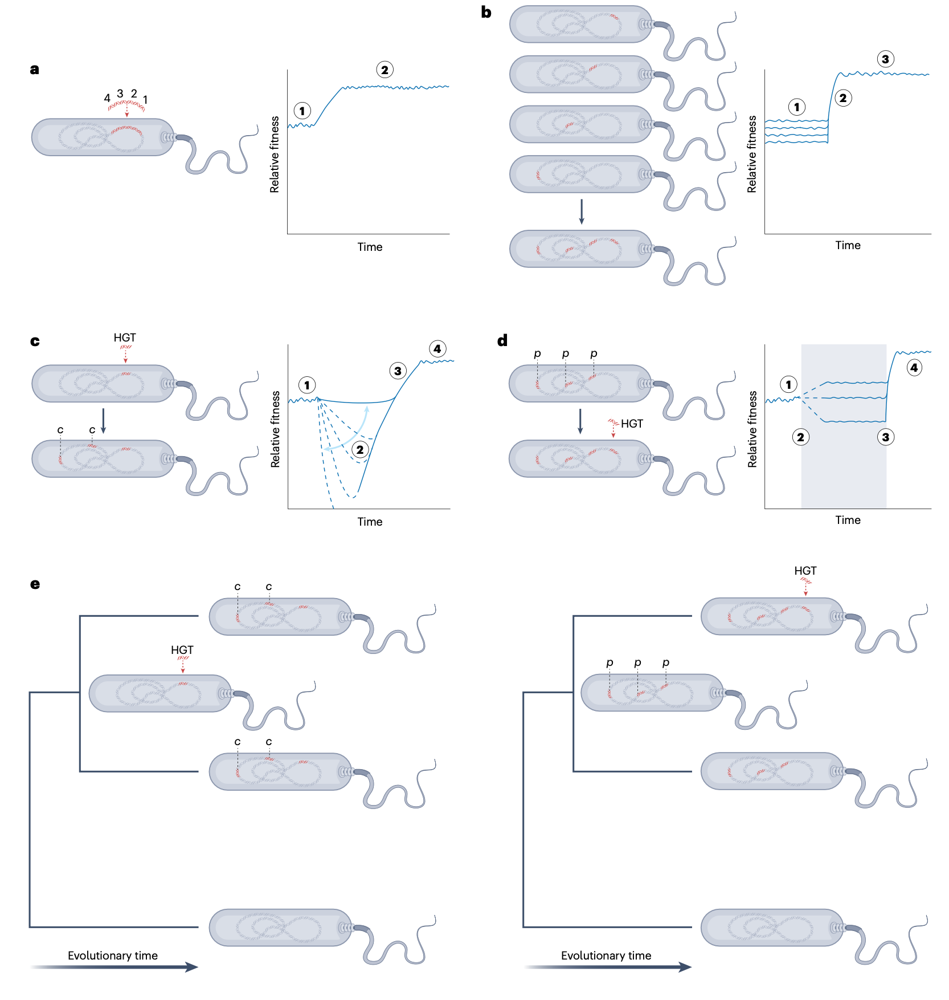
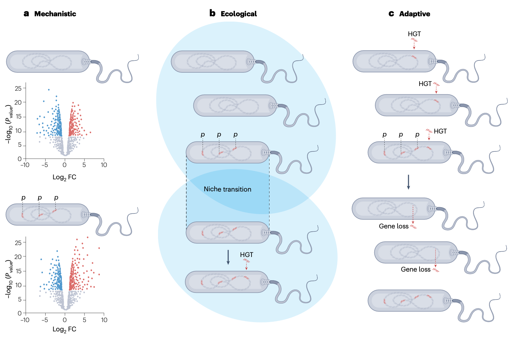

## 背景

在早期的进化理论发展中，达尔文就认识到性状共适应的重要性，他指出动物要获得发达的结构，“几乎必然需要其他多个部分被修饰并共适应”。随着现代综合进化论的发展，支持共变异的遗传学基础的重要性变得清晰。Wright曾指出，基因的效应依赖于其遗传背景，这与现在被称为“上位性”的现象一致，即一个基因的效应依赖于另一个基因。与等位基因独立贡献性状的加性效应不同，上位性对表型多样性的影响取决于上位性效应大小，并且至关重要的是，取决于遗传传递机制。

在具有有性生殖的种群中，交配导致等位基因组合在每一代中被重新分配，趋于随机化。在这种规律的基因组“洗牌”下，等位基因通常只有在其赋予适应度优势时才会固定下来，而上位性等位基因组合的遗传力通常较低。相比之下，在细菌等无性繁殖种群中，连锁在代际间得以维持。与真核生物相比，细菌的遗传传递方式非常不同，其繁殖通常涉及快速的克隆繁殖，核心基因组重组水平相对较低。因此，即使在不存在重组障碍的情况下，新的有益等位基因组合也能在单一群体中达到高频率。这种在遗传和连锁上的根本差异，对于我们如何研究和解释不同生物体间的上位性具有重要意义。

关于上位性在适应性进化中作用的大部分研究涉及真核生物的定量遗传学，由于传递遗传学的差异，这通常不直接适用于细菌。目前，细菌中的上位性分析通常涉及从实验室表型测定中进行推断，或对基因组共变进行进化建模，而整合的基因型-表型关联研究方法相对较少。随着高通量全基因组测序技术的出现以及日益庞大的基因组数据集的可用性，我们现在得以探究基因相互作用如何影响复杂性状。将实验室功能基因组学的可控性与群体基因组学的相关性相结合，可以更深入地剖析基因网络与性状的关联。

- Cummins, E.A., Raikwar, P.S., Hallett, E. et al. Epistasis and co-adaptation in bacterial genome evolution. Nat Rev Genet (2026). https://doi.org/10.1038/s41576-026-00941-7
- 期刊：Nature Reviews Genetics （IF=52）
- 发表时间：2026年3月2日

本文综述了微生物基因组学如何超越基因中心模型，迈向对促进性、补偿性和背景依赖性变异的综合分析。及时将基于相互作用的视角纳入种群规模的分析，将改善基因型-表型关联图谱，并深化我们对塑造微生物世界的复杂性状的理解。

## 词汇表

- **Accessory genes (附属基因)**：特定细菌物种菌株中存在的、取决于菌株的（非共享的）基因集合。
- **Antagonistic epistasis (拮抗性上位性)**：当两个突变共同产生的效应比预期更弱时的情况，即一个突变部分抵消或干扰了另一个突变的效果。
- **Clonal frame (克隆骨架)**：细菌基因组中未经重组、垂直遗传（从亲代到子代）的部分。
- **Clonal interference (克隆干扰)**：无性繁殖种群中不同谱系之间的竞争，每个谱系携带不同的有益突变，这会减缓或改变有益等位基因的固定。
- **Co-adaptation (共适应)**：两个或多个基因通过自然选择进行的相互适应，导致相互依赖性增加。
- **Codon usage bias (密码子使用偏好)**：对某些同义密码子而非其他密码子的非随机偏好。
- **Comparative genomics (比较基因组学)**：通过识别物种间的基因组相似性和差异性来揭示进化模式的基因组学方法。
- **Core genes (核心基因)**：特定细菌物种菌株间共享的基因集合。
- **Ecotype model (生态型模型)**：该模型提出微生物种群形成独特的、生态特化的群体，它们通过突变而多样化，但通过周期性选择保持一致性。
- **Epistasis (上位性)**：一种表型现象，其中一个基因（“上位基因”）掩盖或改变了另一个基因（“下位基因”）的表达。它区别于加性效应，在加性效应中多个基因独立贡献于一个性状。
- **Epistatic effect size (上位性效应大小)**：基因在影响性状方面的相互作用强度，超出其各自的加性效应——它显示了一个基因如何修饰另一个基因的影响。
- **Functional genomics (功能基因组学)**：在单个生物体背景下研究基因功能及其与其他基因相互作用的学科，通常通过实验方法将基因型与表型联系起来。
- **Horizontal gene transfer (HGT，水平基因转移)**：从一个生物体到另一个生物体的非有性遗传物质转移，区别于亲代-子代遗传。
- **Linkage disequilibrium (连锁不平衡)**：种群中不同遗传位点上等位基因的非随机关联。
- **Modern Synthesis (现代综合进化论)**：进化生物学中将自然选择理论与孟德尔遗传定律统一起来的框架。
- **Natural competence (自然感受态)**：在自然和实验室环境中摄取胞外环境DNA的遗传编程能力。
- **Negative selection (负选择)**：一种自然选择形式，降低种群内不利等位基因的频率。
- **Neutral diversification (中性多样化)**：种群内遗传变异的增加，并非由自然选择驱动。
- **Non-synonymous mutation (非同义突变)**：编码序列中改变所编码氨基酸的核苷酸变化，可能影响所得蛋白质的结构和功能。
- **Pangenome (泛基因组)**：给定细菌物种内存在的全部基因集合。
- **Pleiotropy (多效性)**：当单个基因影响多个不相关的表型性状时。
- **Positive selection (正选择)**：一种自然选择形式，增加种群内有益等位基因的频率。
- **Purifying selection (纯化选择)**：清除有害突变、从而保护现有生物学功能的自然选择。
- **Sign epistasis (符号上位性)**：当突变的适应度效应（“符号”——有益、中性或有害）取决于另一位点存在的其他等位基因时发生的现象。在一个遗传背景中有利的突变，在另一个背景中可能有害（或中性），因此其效应的“符号”根据基因型背景而翻转。
- **Sympatric (同域分布)**：在同一地理区域出现的种群或物种，因此有相互接触的潜力（即它们的分布范围重叠且没有物理障碍）。
- **Synonymous mutation (同义突变)**：DNA序列中改变密码子但不改变其编码氨基酸的变化。
- **Synteny (同线性)**：不同物种或菌株间染色体上相同遗传位点区块的保守性。
- **Synthetically lethal (合成致死)**：描述一种遗传相互作用，其中同时突变或删除两个基因导致细胞死亡，而单独突变其中任何一个基因不影响存活性。
- **Transmission genetics (传递遗传学)**：也称为孟德尔遗传学。研究基因如何从一代传递到下一代的学科。
- **Transposon (转座子)**：可以在基因组内改变位置的移动DNA序列，通常自我复制，有时会改变或破坏附近的基因。

## 基因中心“即插即用”基因组学

理解表型的遗传基础通常涉及检查同基因型菌株间微小基因组差异的功能性后果。传统方法是研究基因失活或缺失的效应。这种敲除与回补策略在生物学中具有巨大影响力，并且仍然是验证基因型-表型关联的既定标准。

然而，自然界中细菌基因组的遗传复杂性远非实验室参考菌株所能完全代表。当代分析通常在种群尺度上考虑遗传变异，包含所有个体共享的核心基因和仅在部分分离株中存在的附属基因。受其源于实验室微生物学和传统诱变方法的影响，泛基因组概念通常遵循基因中心范式。在这种“即插即用”的细菌适应模型中，附属基因，特别是可移动遗传元件，被视为中心。然而，将基因及其相关效应视为构建模块是一种过度简化，因为基因的功能只能在其基因组背景，即共适应的基因组背景中被理解。

## 共适应的细菌基因组

没有基因能够完全孤立地发挥作用。从蛋白质-蛋白质相互作用和功能基因关联可以推断出基因网络。即使是那些被认为由单个基因赋予功能的表型，相互作用的伙伴也能极大地调节表型结果。虽然基因仍然是最明显的遗传单位，但基因相互作用引发了对生物组织边界的质疑：我们应如何定义组成元件与完整功能单元？什么应该是基因和等位基因进行比较的参考标准？

要解决这些整合问题，考虑基因的生物学作用以及自然选择如何作用于它们所决定的表型是有益的。在群体遗传学中，自然选择的作用通常通过比较序列和识别具有非随机变异模式的区域来推断。在自然细菌种群中，这种推断因多种原因变得复杂。首先，通过突变和/或重组产生序列变异的速度在细菌物种间不同。其次，自然种群中观察到的序列变异受到自然选择的影响。最后，整体适应度是个体基因效应的总和。因此，单个基因组可以同时携带有益、中性和有害的等位基因。

显然，细菌基因组是反映复杂生物学的整合系统，包括调控网络、功能通路和蛋白质间的物理相互作用。为了更深入的功能理解，从基因中心方法转向定量遗传学中使用的方法至关重要。这些方法明确考虑等位基因系列和跨位点的等位基因组合，表型变异源于多个位点变异的联合效应，而非个体变异孤立作用的结果，这与上位性一致。

### 量化上位性

在分子微生物学实验室中，通过追踪突变在受控环境中如何相互作用和积累，可以常规地从表型上测量上位性。在著名的大肠杆菌长期进化实验中，Lenski等人表明，连续有益突变的适应度益处随时间递减，这被称为“收益递减”上位性。在抗生素压力下的实验进化进一步揭示了耐药机制组合中的拮抗性上位性如何限制进化路径。此类实验室研究揭示了上位性如何影响适应性，提供了仅靠基因组调查无法获得的数据，但仍局限于少数菌株和基因。

近年来，高通量实验技术使得能够对细菌中的上位性进行系统筛选。例如，利用大肠杆菌和枯草芽孢杆菌中的组合基因敲除进行高通量遗传相互作用图谱绘制，揭示了影响细胞包膜生物合成和代谢等关键细胞过程的合成致死或合成缓解相互作用网络。扩展全基因组基因失活的原则，高通量转座子插入测序和转座子定向插入位点测序已被用于研究细菌中的遗传相互作用。这些方法使得能够在全基因组范围内推断补偿性相互作用和上位性。

### 上位性的分子机制

在分子水平上，上位性源于分子依赖性，包括直接的蛋白质-蛋白质相互作用、代谢或信号通路内的功能依赖性、反馈调节以及遗传冗余。例如，同一生物合成途径中酶的突变可以相互掩盖或增强彼此的效果。同样，蛋白质复合物中的突变可能破坏功能的稳定性，除非得到其他相互作用亚基的补偿。调控基因可以改变下游靶标的表达，代谢通量、结构补偿和对细胞资源的竞争也促成了基因相互作用效应。

以上位性为基础的遗传学在模型生物嗜热栖热菌中得到了很好的阐释。这里，对抗生素链霉素的耐药性源于编码核糖体蛋白S12的rpsL基因突变，该突变改变了抗生素的结合位点。这些核糖体在无抗生素环境中表现出较低的翻译效率和适应度，但编码其他核糖体蛋白基因中的次级突变可以恢复携带rpsL突变菌株的生长速率和翻译。因为抑制因子是作为独立的第二位点突变出现在不同的翻译基因中，并且通过选择信号或实验进化被识别，它们很可能与起始的rpsL耐药等位基因不处于连锁不平衡状态。高分辨率晶体结构表明，这些补偿性突变通过稳定关键界面、促进结构域闭合和加强整合核糖体复合物内部的亚基相互作用来恢复核糖体功能。

### 从上位性到野生环境中的基因组共变

基因组测序技术的进步揭示了自然细菌种群中巨大的遗传多样性。为了解决这个问题，研究人员利用了多基因组比较所提供的统计能力，并开发了微生物全基因组关联研究，其中微生物基因组内的遗传变异与微生物表型相关联。基于克隆骨架无法解释的、与表型分离的微生物遗传变异可能具有适应性的假设，这种方法在微生物学中具有很大影响力。微生物GWAS为许多生物现象的因果变异提供了见解，包括致病性、宿主适应和抗生素耐药性。虽然与表型相关的基因经常被一起发现，但早期的细菌GWAS通常将基因或蛋白质编码区视为独立的实体，可能低估了上位性和共适应。

基于GWAS的原则，全基因组共变分析比较基因组以识别那些经常共同出现的等位基因，即当等位基因A存在时，等位基因B也经常存在。检测上位性的统计检验通常包括统计模型中的交互项。在细菌中，繁殖的克隆性质导致基因座间存在强烈的连锁不平衡。因此，等位基因共同出现常常是共遗传的结果，而非功能相互作用和上位性的结果。从基因组数据推断上位性最直观的方法之一是识别与已知功能重要基因相关的共变。除了表征抗生素耐药性共适应的基因组图谱，GWAS关联的共变分析还在几种病原体中揭示了多基因相互作用。这些发现凸显了基因-基因相互作用对细菌表型的重要性。

## 基因组和谐与不和谐

细菌适应建立在一个悖论之上。一方面，突变和HGT促进适应，可能赋予新的功能。另一方面，它们有可能创造不和谐的等位基因组合，从而很可能被选择所淘汰。遗传创新的益处经常被强调；然而，随机的基因组变化更可能是中性或适应不良的，会降低整体适应度。细菌基因组是高度相互作用的，基因存在于功能网络中。在这种遗传背景下，上位性是获得新多基因性状的障碍，特别是在发生HGT的物种中，因为HGT预期会破坏大量的相互作用。经典的进化理论预测，“无望的怪物”杂交体会完全失衡，从而通过选择被淘汰。然而，种间重组在细菌中有充分的记录。

最简单的解释是，基因的获得所带来的益处超过了其对受体基因组的适应度成本。新颖或极端的环境创造了条件，使得混合谱系（有望的怪物）能够增殖。在大多数物种中，重组发生在核心基因组中，其中的基因被认为受到稳定化选择，并被必需的细胞功能所约束。对细菌核心基因组中种间同源重组的研究发现，相互作用的等位基因可以被分离、移动，并在新的基因组背景中功能性地重建。

### 解决霍尔丹困境

基因组显著的适应能力困扰了进化生物学家数十年，并催生了有影响力的进化理论，包括“霍尔丹困境”。简而言之，霍尔丹观察到，考虑到遗传变化的适应度成本，适应性进化的速度比预期的要快。然而，在上位性背景下解释细菌进化的速度仍然具有挑战性，因为遗传变化可能会破坏已建立的基因网络，因此更有可能给细胞带来高的适应度成本，并导致选择性死亡，特别是对于多性状适应。

考虑到一个突变的效果如何依赖于其他突变，有助于解决霍尔丹困境，具体表现为表明适应性进化通常通过非加性的、相互作用的途径进行，而不是独立的、逐个进行的连续突变。在共适应的基因组中，现实世界的进化比霍尔丹最初假设预测的更有效、成本更低，主要有四个原因。第一，模块化适应，即细菌基因组获得多个基因或操纵子，促进协调变化，绕过了霍尔丹假设的加性模型。第二，共变降低了有益突变的每次替换成本，这些突变可以在单个基因组中一起固定，而不是在不同的菌株中竞争。第三，补偿性变化允许细菌进化创新，而不会产生致命的适应度代价。第四，促进性变化为新的进化途径创造了遗传背景。

### 恢复基因组和谐的补偿性遗传变化

补偿性遗传变化可以恢复因其他突变或遗传事件而“受损”的细菌的适应度。补偿性突变经常因质粒获取带来的适应度成本而出现。这些突变可以发生在质粒本身、细菌染色体上，或两者兼有，其中染色体突变通常在恢复适应度方面更有效。例如，在大肠杆菌中，获得的黏菌素耐药性通过质粒编码的mcr-1调控区的多态性而得以稳定，这些多态性降低了转录水平。当获得多种多重耐药性质粒时，基因组反应具有高度特异性，受受体菌株和质粒复制子类型的影响。这些反应通常涉及影响调控和代谢途径的插入序列元件和染色体突变，反映了基因组进化的复杂性和背景依赖性。在某些情况下，上位性相互作用甚至可以促进多种耐药性状的积累，而无需额外的适应度成本。

不携带耐药决定簇的质粒也可能由于质粒与宿主基因之间的有害相互作用而引发补偿性变化。荧光假单胞菌的实验进化表明，摄取一个大质粒会导致平行补偿性突变。值得注意的是，在麦苗根际的微生物中也发现了gacAS系统中的突变，表明此类补偿机制在受控实验室条件之外也在运作。这些突变不仅恢复了适应度，还可以增加质粒的一般容许性，表明补偿性与进化促进之间存在联系。这一过程使细菌能够更好地耐受未来的质粒获取，与基因组共适应缓冲遗传干扰并促进适应性的概念一致。

除了质粒相关的变化，补偿性突变还纠正了有害染色体突变的影响。在金黄色葡萄球菌中，增加生物膜形成的icaA上游的基因间突变，会被ica操纵子内的突变所补偿，以抵消该表型带来的适应度成本。在铜绿假单胞菌中，rpoA和rpoC中的补偿性突变恢复了因rpoB的利福平耐药突变而丧失的适应度。类似地，含有异烟肼耐药性补偿性突变的结核分枝杆菌菌株，通常携带oxyR'-ahpC区域的额外突变以补偿异烟肼耐药性。这一原则延伸至种间基因渗入事件，例如在弯曲杆菌中观察到的现象。在空肠弯曲杆菌和结肠弯曲杆菌中，与甲酸脱氢酶相关的基因对，均具有空肠弯曲杆菌的祖先，但只有当它们同时存在时才具有功能，这表明单一的渗入等位基因可能是有害的，除非伴随着一个补偿性伙伴。改变表型的突变的补偿性配对也在鼠伤寒沙门菌中观察到。最初一个同时赋予抗生素耐药性和毒力丧失的突变，被随后一个补偿性突变所补偿，该突变恢复了毒力同时保持了耐药性。这些例子强调了基因组通过共进化调整来解决冲突的能力。

### 促进基因组创新

促进性遗传变化是一个过程，其中先前的变化改变了遗传或生理背景，使得新性状的出现更有可能。这种为未来适应所做的“铺垫”并不直接赋予新的性状或选择优势，这与辅助性变化形成对比，后者是立即支持机制功能所必需的。例如，在金黄色葡萄球菌的β-内酰胺耐药性中，辅助因子确保mecA能够有效运作，而促进性突变则通过重塑细胞生理来增强耐药性，实现更高的耐药性上限。

促进的概念与历史偶然性相关，即特定突变成功与否取决于由先前变化塑造的遗传背景。一旦促进性突变被固定，它可能导致“固化”，即移除它变得越来越有害。促进性突变已在多种系统中观察到。这些例子表明，促进性如何通过扩大或限制可及突变图谱，来定义未来进化的轨迹。

促进性和历史偶然性对于理解通向抗生素耐药性的进化“垫脚石”至关重要。现有的遗传变异影响耐药性的进化，从相同起始遗传背景独立进化出耐药性的克隆，比从不同起始背景进化出对相同抗生素耐药性的克隆，拥有更多共同的突变。染色质多态性促进了大肠杆菌中黏菌素耐药性的进化，并且与多种细胞功能相关的基因已被证明会影响大肠杆菌对四环素的耐药性进化，既有正面也有负面影响。此外，肺炎链球菌在pde1功能丧失突变后更可能进化出高水平青霉素耐药性。在假单胞菌属中，拥有ampR基因促进了体外对β-内酰胺的耐药性进化；鉴定出该促进基因有助于设计一种简单的两药联合治疗，以防止体外耐药性进化。除了抗生素，促进性还影响噬菌体抗性。在丁香假单胞菌中，噬菌体抗性是否可逆或固化，不取决于抗性基因本身，而取决于导致其出现的特定促进途径。识别此类“进化门户”可能有助于预测耐药性的出现，并设计预防性疗法，以引导细菌种群走向更不易进化或对药物更敏感的状态。实现这一潜力将取决于对上位性相互作用的精确检测，以及对促进性突变长期后果的理解。

## 结论与未来展望

细菌基因组的进化超越了简单的基因中心模型，是一个由复杂的上位性相互作用网络和共适应驱动的动态、整合过程。基因间的非加性相互作用塑造了表型，调节了适应轨迹，并在面对新挑战时保持了基因组的稳定性。理解这些相互作用对于精确的基因型-表型关联图谱至关重要，这在从基因工程到抗菌治疗的应用微生物学中具有重要意义。

当代基因组学方法，包括高通量功能基因组筛选、实验进化、自然种群共变分析和系统发育重建，为解决上位性的复杂性提供了强大的框架。然而，详细的表型数据仍然是理解自然种群中细菌的主要限制因素。克服这一障碍需要将传统实验室微生物学与群体基因组学统一起来。通过鼓励分子微生物学家在群体背景下定位功能基因组学，并鼓励群体基因组学家从机制上解释进化和生态变异，关于上位性的观点可以融合，从而可能极大地提高对共适应基因组的理解。

未来的研究将需要结合种群尺度预测与敲除和功能获得研究的假设生成性研究。这种跨学科方法在从系统和进化角度理解基因-基因相互作用，以及解释上位性如何塑造个体间的表型差异和种群水平变异方面具有巨大潜力。细菌基因组的可塑性表明，上位性并不构成基因组重排的绝对障碍。然而，一个核心问题是上位性系统是否显示出有助于解释整体功能但无法通过观察个体相互作用来预测的涌现特性。解决这个问题将需要考虑关联基因系统的时间顺序、模块化和可进化性，以及基因组破坏的适应度收益和成本。

超越传统的基因中心方法，现在很清楚，准确的功能基因组学需要理解基因的上下文背景，并且HGT可以解耦已建立的上位性网络并在新的遗传背景中重建它们。发展对共适应基因网络和细菌基因组显著可塑性的认识，将对未来微生物学产生深远的影响，因为它必然成为精确基因型-表型关联图谱的基础。精确的关联图谱反过来将在应用微生物学中变得越来越重要，从设计基因工程菌株到制定定制化的抗菌化疗策略。在后基因组时代，解释上位性无疑将在塑造我们对微生物世界的理解中发挥重要作用。
