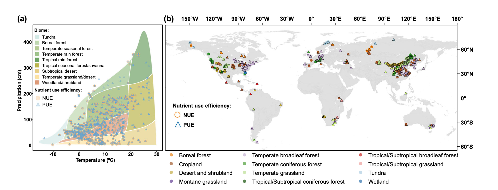
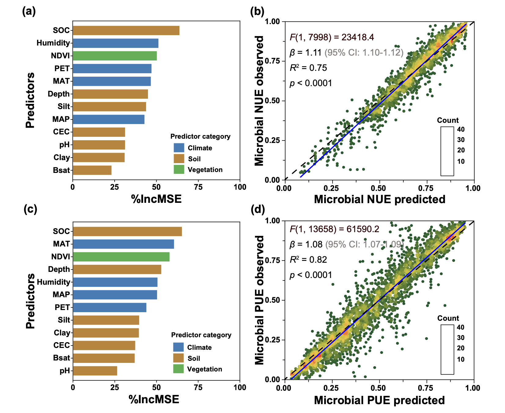
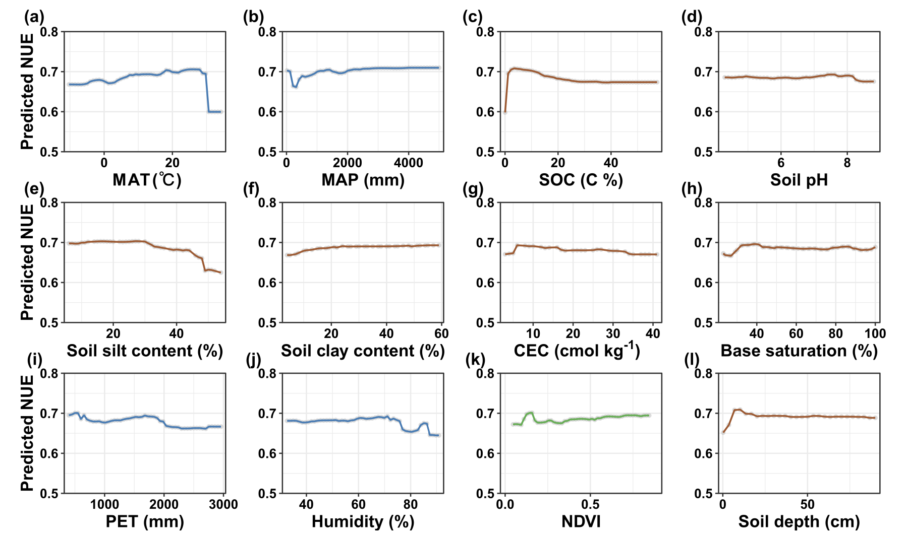
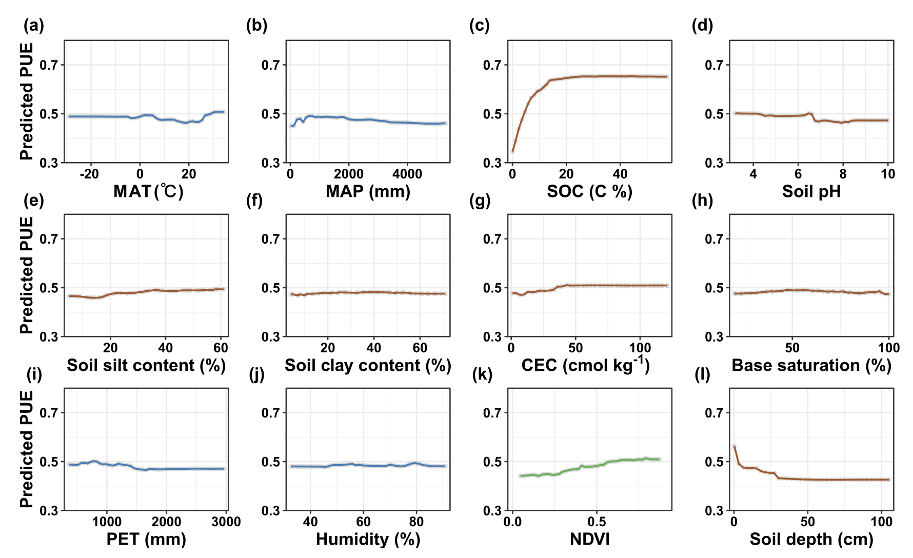
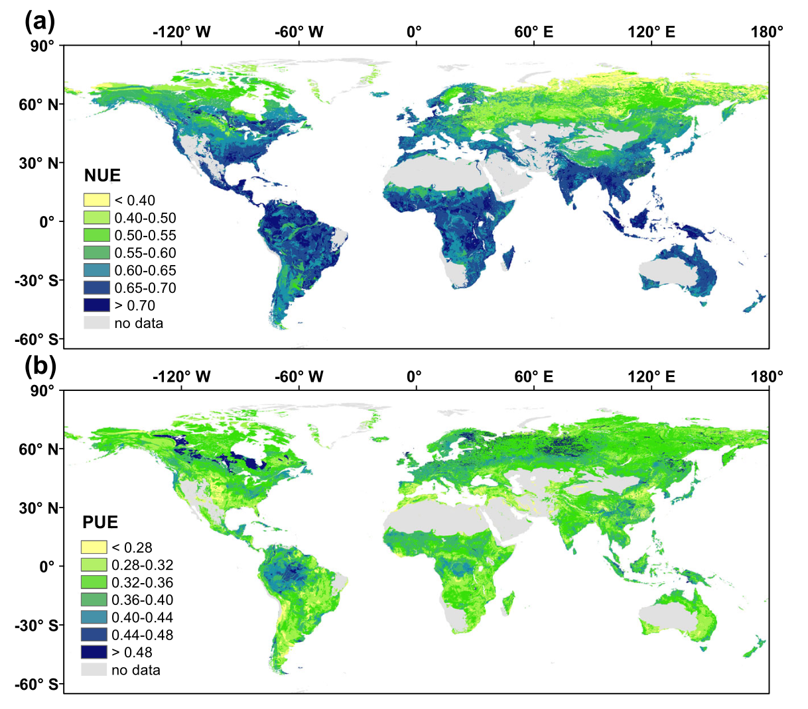

## 背景

氮和磷是全球生态系统生产力的两大主要限制性养分。为应对这些限制，植物和土壤微生物进化出多种策略以提高氮、磷利用效率。土壤微生物通过胞外酶分解高分子量有机化合物，并同化产生的低分子量有机氮、磷产物。微生物氮、磷利用效率反映了微生物在养分同化与潜在矿化之间的代谢投资权衡。更高的微生物氮、磷利用效率意味着更多的养分被分配给生物质生产，而非用于矿化投资。鉴于它们在土壤氮、磷循环中的核心地位，微生物氮、磷利用效率是理解和预测微生物介导的土壤功能与养分动态的关键性状。然而，其全球格局与驱动因素在很大程度上仍未得到解决，限制了将微生物性状整合到基于微生物的土壤碳和养分循环模型中。

微生物氮、磷利用效率的全球格局和驱动因素不清，主要有三个原因。首先，现有测量大多基于方法、环境条件和培养时长各异的培养实验，这种方法的变异性阻碍了对空间格局和环境驱动因素一致性的识别。其次，基于同位素的方法成本高昂，难以在大尺度上应用，导致相关研究数量有限。最后，虽然化学计量模型允许大尺度估算微生物氮、磷利用效率，但其实施需要多个难以获得的参数。因此，基于现有方法的微生物氮、磷利用效率全球评估仍然缺乏。

- Gao, D., Kuzyakov, Y., Delgado-Baquerizo, M., Peñuelas, J., Moorhead, D. L., Sinsabaugh, R. L., ... & Cui, Y. (2026). Global patterns and drivers of soil microbial nitrogen and phosphorus use efficiency. *Nature Communications*, 17, 2576. https://doi.org/10.1038/s41467-026-70602-0
- 期刊：*Nature Communications* （影响因子请查阅最新期刊引证报告，通常较高，但文档未提供具体IF）
- 发表时间：2026年3月17日（在线发布）

这篇研究利用生态酶化学计量法，估算了全球陆地生态系统中微生物的氮利用效率与磷利用效率。全球平均微生物氮利用效率约为0.60，几乎是磷利用效率的两倍。土壤有机碳是氮、磷利用效率最强有力的预测因子，较高的土壤有机碳含量与更高的养分利用效率相关联。空间升尺度分析显示，苔原和北方森林土壤的氮利用效率显著低于其他地区，表明寒冷生态系统中微生物在养分获取方面的氮投资较高；而磷利用效率在各生物群落间差异不大，暗示了磷获取能力的普遍低下。本研究揭示了全球潜在的养分循环热点区域，为改进大尺度土壤碳和养分动态预测提供了关键参数。

## 方法

### 数据来源与处理
数据提取自截至2022年已发表的、经过同行评审的文献，来源包括Web of Science和Google Scholar数据库。最终，213篇论文符合选择标准，分别提供了2012个和3419个微生物氮利用效率和磷利用效率的观测值。对于每个研究点，我们汇编了地理坐标、生物群落类型、气候变量、土壤特性和土壤微生物生物量等信息。若原始研究未完全报告所有土壤属性，缺失数据则通过采样点的地理坐标从全球数据图集中提取补充。

### 微生物氮、磷利用效率计算
土壤微生物氮利用效率和磷利用效率使用基于土壤酶活性的生态酶化学计量法计算。该方法提供了一个框架，用于理解微生物如何响应环境养分有效性，分配资源以获取碳、氮和磷。微生物胞外酶对于分解有机质和释放微生物可吸收的养分至关重要，这些酶的活性反映了微生物的养分需求和限制。具体计算公式如下：

其中，NUE_max 和 PUE_max 分别代表氮、磷利用效率的理论最大值，均设为1。半饱和常数 KN:C, KN:P, KP:C, KP:N 均设为0.5，代表微生物养分获取达到其最大潜力一半时的酶活性比率。标量 SN:C, SN:P, SP:C, SP:N 用于量化微生物生物量化学计量与有效养分之间的平衡，并通过酶活性比率进行标准化。

### 驱动因素分析与模型预测
为评估微生物养分利用效率的驱动因素，我们选择了七个土壤参数和五个气候与植被参数作为自变量。为识别预测微生物氮、磷利用效率的最佳模型，我们评估了包括四种线性回归模型和四种非线性模型在内的八种预测模型。随机森林模型因其优越的性能而被选中，随后用于利用13个预测因子的网格化数据集在全球尺度上预测微生物氮、磷利用效率。通过将训练好的随机森林模型应用于全球协变量图层，生成了全球1公里分辨率的微生物氮、磷利用效率图。

## 结果与讨论

### 全球微生物氮、磷利用效率的关键驱动因素
估算的全球平均值分别为：氮利用效率0.60，磷利用效率0.35。在测试的模型中，随机森林模型对微生物氮利用效率和磷利用效率的预测准确度最高。在全球尺度上，土壤有机碳含量成为影响微生物氮、磷利用效率的最重要因素。偏回归分析表明，在初始土壤有机碳含量较低的土壤中，两种效率均随土壤有机碳水平的升高而显著增加。这很可能是因为增加的碳缓解了能量限制，并通过刺激酶生产促进了微生物在养分获取方面的投资。然而，在相对较低到中等的土壤有机碳水平下，这种积极趋势趋于平缓，表明限制从能量限制转向了养分限制。

气候因子，包括湿度、年均温和潜在蒸散量，也在塑造微生物氮、磷利用效率的全球格局中扮演关键角色。温度和降水共同影响微生物生物量合成与氮、磷矿化之间的平衡。潜在蒸散量作为水-能量平衡的指标，通常与干旱和温度升高相关。微生物氮、磷利用效率对潜在蒸散量表现出波动的响应。在高潜在蒸散量下的下降阶段反映了由于干旱和温度升高导致的微生物胁迫增加，这通常会引发碳限制和潜在的矿质氮积累。在相对较高的潜在蒸散量水平下，氮、磷利用效率的稳定可能反映了微生物的适应或群落组成的变化。

### 微生物氮、磷利用效率的全球热点区域
我们通过将估算值与11个全球尺度环境协变量相结合，绘制了氮、磷利用效率的全球分布图。模拟的微生物氮利用效率值显示出清晰的纬度梯度，从热带到北方地区下降了22%。具体而言，热带/亚热带地区的平均值最高，其次是温带地区。苔原生态系统的氮利用效率最低。

与我们的假设（高纬度地区微生物氮利用效率可能更高）相反，我们的结果显示这些地区的数值较低。基于生态酶化学计量法的这些预测表明，微生物将更大比例的同化氮分配给酶生产，用于分解有机质。这与微生物氮利用效率不仅受氮有效性或温度限制，还受竞争动态和微生物资源分配策略组合调控的观点一致。在养分限制的环境中，微生物群落（如外生菌根真菌）优先投资于酶促分解顽固有机物，而非生物质生产。这种碳和能量的重新分配将同化氮从生长转向酶合成，解释了观察到的氮利用效率降低。

观察到的微生物氮利用效率随纬度增加而下降的趋势，与微生物碳利用效率随纬度增加而增加的公认格局形成对比，揭示了跨气候梯度微生物性状之间的权衡。在热带生态系统中，土壤经历着显著的磷限制，同时保持着紧密的氮循环。尽管氮矿化速率快，但微生物通过高效的固定-再循环途径优先保持氮，以应对强烈的植物竞争和淋失损失，从而产生更高的氮利用效率。此外，高温下呼吸成本升高减少了碳的保留，从而降低了微生物碳利用效率。相比之下，在北方和苔原生态系统中，低温减缓了有机物分解，有利于碳固定，从而产生更高的微生物碳利用效率。然而，源于酶化学计量的微生物氮利用效率下降，因为能量分配优先用于生产分解顽固有机物的胞外酶，而非微生物生物质合成，这使同化氮偏离了生长。

与微生物氮利用效率相反，微生物磷利用效率没有显示出明显的纬度趋势。这种缺乏明显全球格局的现象可能主要归因于三个原因：各生物群落普遍存在的磷限制；磷循环本身比氮更慢、更易变，这抑制了微生物调控磷利用的能力；以及土壤年龄、矿物学和土地利用等占主导地位的局部尺度控制因素。然而，我们发现了一些微生物磷利用效率的区域热点，这表明微生物磷利用效率主要受土壤类型、植被、母质和微气候条件等局部尺度因素的控制。

森林的微生物氮、磷利用效率高于草原。这可以归因于森林土壤通常具有更高的碳氮比和碳磷比，由于富含木质素的凋落物输入。这些化学计量失衡增加了微生物对氮和磷的需求，以维持化学计量稳态。虽然高底物碳养分比迫使投资于生态酶（一种代谢成本），但这种策略允许微生物最大限度地减少养分损失，从而保持高的细胞氮、磷保留（高氮、磷利用效率），尽管碳获取的能效成本较高。草原由于其较低的基线氮、磷利用效率，以及由较低的碳养分比驱动的酶投资策略，在变暖诱导的矿化脉冲下可能更易受到养分淋失损失的影响，可能降低长期的碳封存潜力。

## 结论

总之，我们的研究揭示了土壤微生物氮、磷利用效率的全球格局和关键驱动因素，为理解微生物介导的土壤养分循环提供了见解。微生物氮利用效率显示出清晰的纬度梯度，在热带/亚热带地区达到峰值，在北方地区下降，主要由气候格局影响的微生物能量分配策略和氮保留机制驱动。相比之下，微生物磷利用效率没有表现出一致的纬度趋势，表明在微生物磷利用中，土壤养分有效性等局部因素的作用更强，并且微生物在适应高度可变的土壤碳磷比方面具有化学计量灵活性。土壤有机碳成为微生物氮、磷利用效率的最强预测因子，强调了碳有效性在调节微生物养分利用策略中的核心作用。森林生态系统的微生物氮、磷利用效率始终高于草原，这可能是由于森林土壤中更高的顽固有机物增加了微生物对养分的需求，并驱动了酶介导的养分觅食。这些发现共同突显了土壤性质、气候和植被在塑造不同生态系统微生物养分利用效率方面的不同影响。未来的研究应优先厘清微生物氮、磷利用效率的局部和全球尺度驱动因素，并评估变暖和降水格局改变等全球变化因素如何影响微生物养分动态。这些见解对于改进生态系统模型和为支持长期土壤肥力和生态系统功能的可持续土地管理实践提供信息至关重要。
