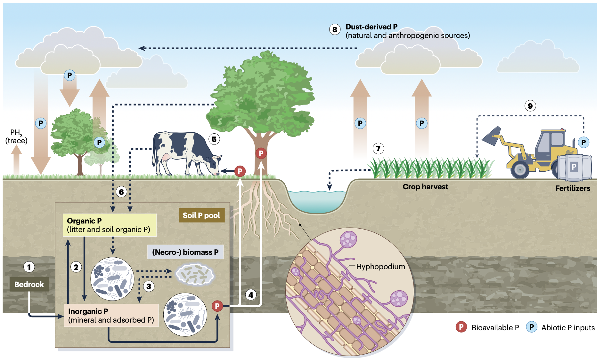
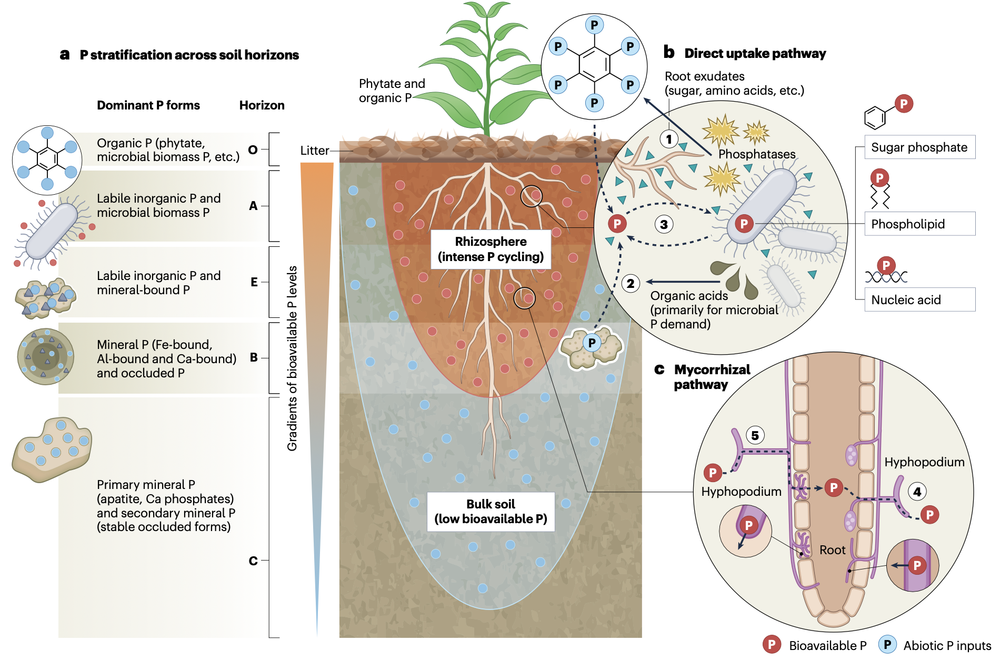
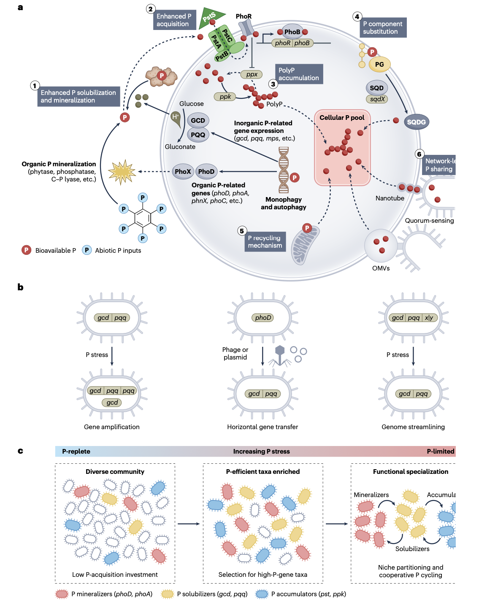
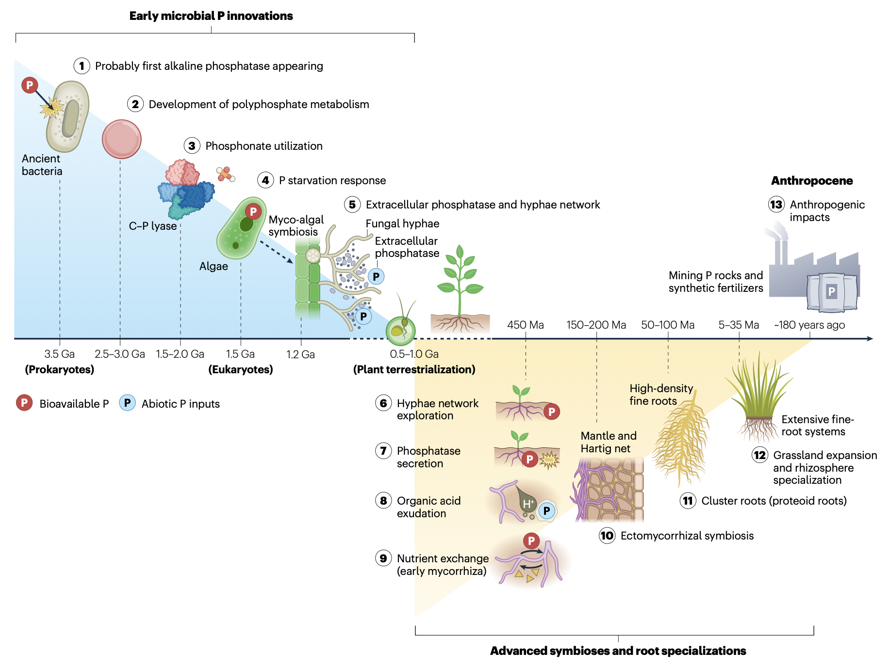

## 引言

磷是陆地生产力的“无声指挥家”，作为一种必需大量元素，其通过稀缺性而非丰度对生态系统施加着深远影响。与氮不同，磷没有显著的气态形式，主要来源于磷灰石等矿物的风化并在生态系统内部循环。全球范围内，慢性磷匮乏普遍存在，约43%的自然陆地面积（除南极洲外各大陆的森林、草原、苔原和湿地）以磷限制为主。在土壤环境中，通常只有不到6%的总磷以可溶性正磷酸盐的形式具有即时生物有效性，其余大部分存在于难利用形态中。与水生系统不同，陆地土壤呈现扩散限制的运输、强烈的吸附作用，并受到具有尖锐化学生物梯度的根际结构塑造，还直接承受干旱-复湿周期和土地利用干扰，这些因素共同构成了陆生微生物获取磷的独特且动态的基质环境。

微生物是陆地磷循环的关键介质，驱动着磷在有机、无机和生物分子形态之间的转化。在贫磷土壤中，微生物进化出了多样的策略来获取和保存磷，包括分泌胞外酶以从难分解有机质中释放磷酸盐、释放有机酸和螯合剂以溶解矿物磷酸盐、利用高亲和力转运系统搜寻稀释的磷酸盐，以及储存多聚磷酸盐等内部缓冲聚合物。这些微生物活动在很大程度上决定了不溶性或有机磷形态向植物和其他生物体转化的速率。同时，微生物与植物竞争有效磷，并能将相当一部分土壤磷固定于其生物量中。微生物磷矿化与固定之间的平衡是调节生态系统肥力和磷流失的关键因素。陆地磷循环还涉及水生系统所没有的独特生物互作，特别是陆地植物与协助磷获取的菌根真菌及根际相关微生物之间的共生关系，它们在地质时间尺度上协同进化，以克服陆地初级生产的磷限制。

理解陆地生态系统中的微生物磷循环日益紧迫，因为全球环境变化正在加剧土壤中的磷限制。大气CO2浓度上升和人为氮输入预计将通过加速植物生长和改变养分化学计量比，加剧许多地区的磷限制。人类活动深刻改变了全球磷循环，迫切需要基于微生物生态学原理的可持续磷管理策略。在本综述中，我们整合了当前关于陆地生态系统微生物磷循环的知识，重点阐述了关键的微生物过程及其生态学意义，并提出了“微生物磷适应进化理论”——一个将持久的磷限制与跨越细胞、基因组和群落尺度的进化适应联系起来的机制框架。

- Peñuelas, J., Zheng, B., Tariq, A., & Sardans, J. (2026). Microbial phosphorus cycling in terrestrial ecosystems. *Nature Reviews Microbiology*. https://doi.org/10.1038/s41579-026-01296-w
- 期刊：Nature Reviews Microbiology （IF=103.3）
- 发表时间：2026年3月24日（在线发布）

这篇综述整合了当前关于微生物磷循环的前沿认知，系统阐述了细菌、真菌和古菌用于活化磷（如通过PhoA、PhoD等磷酸酶和柠檬酸等有机酸）及直接促进植物磷吸收的多样化机制。我们深入探讨了这些过程在维持土壤健康、支持生态系统生产力及影响碳固存方面的生态学意义，并首次提出了“微生物磷适应进化理论”：长期的磷匮乏驱动微生物群落在进化与生态层面发生转变，使其更多地投资于磷的搜寻、多聚磷酸盐的存储与利用以及细胞脂质重塑。此外，文章还分析了环境因子、土地利用和气候变化如何调节这些转变，及其对生态系统功能和全球磷有效性的级联效应。以宏基因组学、18O-磷酸盐示踪和纳米二次离子质谱为代表的新技术正在革新我们对这些动态过程的理解。本综述强调，将微生物磷循环整合进生态系统模型，并制定基于微生物生态原理的磷智慧管理策略，对于应对土壤退化、粮食安全和环境变化等全球性挑战至关重要。

## 微生物磷循环过程

### 有机磷的矿化
土壤中相当一部分磷以有机形式存在，必须通过微生物磷酸酶进行矿化。土壤微生物产生一系列磷酸酶及相关酶来水解有机磷化合物，将无机正磷酸盐释放到土壤溶液中。关键酶包括酸性和碱性磷酸单酯酶，以及靶向磷酸二酯的磷酸二酯酶。其他特殊酶使微生物能够利用不寻常的磷源，例如碳-磷裂解酶多酶复合体可断裂有机膦酸酯中稳定的C-P键。这种能力使细菌能够利用膦酸酯作为磷源，这在磷耗竭土壤中尤为宝贵。微生物磷酸酶活性动态响应磷的有效性，通常在磷匮乏时增强。反之，当磷充足时，磷酸酶的产生减少，这反映了一种平衡代谢成本与养分需求的适应性策略。

### 矿物磷酸盐的溶解
土壤无机磷的显著部分以难溶性矿物形式存在，或被强烈吸附在铁、铝氧化物上。微生物在磷酸盐溶解中起关键作用，将这些结合态磷转化为生物有效态。许多细菌和真菌释放有机酸，通过螯合阳离子或酸化微环境来溶解沉淀的磷酸盐或从矿物中解吸磷。一个众所周知的机制是通过醌蛋白葡萄糖脱氢酶氧化葡萄糖产生葡萄糖酸。基因组分辨的宏基因组学研究揭示了磷酸盐溶解细菌的显著多样性。系统发育上，具有良好特征的PSB在假单胞菌属、芽孢杆菌属、根瘤菌属及相关变形菌门和厚壁菌门中尤为常见，而溶解磷酸盐的真菌常见于曲霉属和青霉属等丝状真菌中。这些PSB基因组往往更大，并编码丰富的碳水化合物降解酶，表明溶解磷酸盐的能力与广泛的代谢多功能性和大量有机酸产生有关。重要的是，当微生物自身的磷供应相对于其碳氮供应变得受限时，这些性状通常会表达。

### 高亲和力吸收与微生物磷储存
鉴于土壤溶液中的正磷酸盐阴离子浓度通常极低，微生物依赖高亲和力吸收系统在外部供应接近其生理阈值时获取磷酸盐。大多数细菌和真菌拥有磷酸盐特异性转运系统，这是一种由pstSCAB基因簇编码的高亲和力ABC转运蛋白，即使在外部浓度极低时也能导入磷酸盐。Pst系统是保守的Pho调节子的一部分，在磷酸盐饥饿条件下被诱导，使微生物能够有效竞争任何可用的磷酸盐。此外，土壤微生物还可以通过甘油-3-磷酸吸收系统等专用转运蛋白获取结合在小分子有机磷酸盐中的磷。一旦进入细胞，许多细菌会将过剩的磷酸盐转化为多聚磷酸盐，这是一种由数十或数百个磷酸单元组成的线性聚合物，作为一种储存化合物，具有较低的渗透压成本和可回收的磷酐键能。多聚磷酸盐颗粒作为一个内部磷库，微生物可以在外部磷匮乏时动用。无机多聚磷酸盐激酶和外多聚磷酸盐酶等酶严格调控这一储存循环。以多聚磷酸盐形式储存磷有助于微生物应对磷有效性的“丰-欠”循环。

### 病毒与极端微生物的贡献
病毒，特别是噬菌体，是土壤磷循环中关键但未被充分认识的因子。在感染期间，它们部署用于获取磷的辅助代谢基因，利用宿主的低磷响应来增加磷酸盐的输入和去磷酸化，用于病毒粒子生产。病毒分流发生在噬菌体首先在感染期间增强宿主的磷获取和去磷酸化，然后在裂解释放捕获的磷作为生物有效磷酸盐，从而加速养分周转并调节生态系统层面的磷循环。极端环境中的微生物群落进一步说明了在长期磷匮乏下病毒互作的关键作用。在超干旱沙漠、永久冻土和酸性矿山排水等环境中，微生物展现出与MPAET预测一致的适应性响应。

## 微生物磷循环的生态学意义

### 植物生产力与养分守门
微生物从根本上为自身代谢解锁磷，在此过程中，它们将原本难以利用的磷库转化为植物可利用的形式。在许多自然生态系统中，植物磷营养因此与微生物过程紧密耦合。微生物对有机磷的矿化与对矿物磷的溶解补充了植物根系可吸收的土壤溶液磷酸盐库。没有活跃的微生物周转，更大比例的土壤磷将保留在难利用形态中，导致植物生长受到更强的养分限制。与此同时，微生物对磷的固定可以调节养分损失并将磷保留在生态系统中。当微生物快速吸收磷脉冲时，它们可以防止磷通过淋溶流失或不可逆地结合到矿物上。磷被暂时以多聚磷酸盐颗粒的形式储存在微生物生物量中，充当一个“源-汇”缓冲库。最终，微生物周转会将这些磷以植物可利用的形态释放回土壤。

### 与碳循环的相互作用
微生物磷循环对陆地碳循环施加着基础性控制，对土壤碳动态和养分平衡具有重要影响。在许多土壤中，异养微生物主要受碳限制，并常将有机磷矿化作为分解有机物获取能量和碳的副产品，但磷的有效性仍可控制分解过程，因为微生物需要磷和氮来合成生物量和胞外酶。如果磷受限，微生物分解会减缓，导致土壤碳储存增加。相反，如果磷的输入缓解了微生物的养分限制，微生物可以加速碳分解，潜在地释放CO2，同时也释放额外的磷和氮等养分，刺激植物生长，从而增强生态系统固碳。

### 养分保持与生态系统稳定性
微生物磷循环的另一个生态意义是养分保持与流失。固定磷的微生物通过将磷脉冲快速导入微生物生物量或多聚磷酸盐来保留磷，延长其在生物库中的停留时间，维持长期土壤肥力。然而，在微生物需求饱和的受干扰或施肥环境中，过量的磷可能逃逸。群落组成影响这一结果：由假单胞菌或肠杆菌等快速生长的富营养型细菌主导的土壤可能快速矿化有机磷但无法固定全部，导致泄漏；而由酸杆菌门或疣微菌门等磷高效寡营养型微生物主导的土壤则能更有效地将磷保留在生物量或稳定化合物中。

## 植物-微生物在磷循环中的互作

植物-微生物互作至关重要地决定了陆地磷的有效性。这种相互作用结合了竞争与合作的要素，在磷限制环境中尤为关键，其中微生物共生体和根际群落为植物营养提供了必要支持。

### 菌根网络：古老的磷共享契约
陆地生态系统的一个显著特征是植物根系与微生物合作以克服磷限制。其中最重要的合作关系是菌根共生。估计有80-90%的陆地植物与菌根真菌共生，后者通过分泌有机酸和磷酸酶来活化磷，并通过其菌丝中的高亲和力磷酸盐转运蛋白从土壤溶液中吸收磷，从而大大扩展了植物的养分觅食能力。菌根网络可以提供植物所需的大部分磷。这种交换是陆地养分循环的基石——植物以碳换取磷和其他养分的古老进化贸易协定。

### 根际微生物：磷酸盐溶解功能团
除了菌根，植物还与PSB和其他根际微生物相互作用以增强磷的有效性。植物根系向根际分泌多种有机化合物，在磷限制条件下，许多植物增加柠檬酸和苹果酸等有机酸的分泌，这些分泌物也作为根际细菌的底物，促进其生长，进而增强其产磷活化酶和酸的能力。一些PSB通过产生生长素、细胞分裂素、释放铁载体和通过ACC脱氨酶降低乙烯来促进植物生长，使其跻身于植物根际促生菌之列。

### 竞争与合作
值得注意的是，尽管许多植物-微生物互作在磷获取方面是合作的，但也存在竞争。自由生活的土壤微生物可以固持植物所需的磷，特别是当植物输入的碳不成比例地刺激微生物生长时。这种情况可能导致一个悖论：向贫磷土壤添加有机质最初会加剧植物磷缺乏，因为微生物会固定磷以构建生物量，形成一个临时的磷“汇”，之后磷才逐渐循环回植物。这些动态可以被视为一个简单的成本-收益博弈：植物支付碳成本通过分泌物或共生“雇佣”微生物伙伴，只有当微生物释放或转移部分获取的磷而非囤积时，植物才能获得磷收益。

## 环境与人为因素对微生物磷循环的影响

微生物磷循环受环境和人为因素的塑造。我们按压力类型对驱动因素进行分组：一是加剧磷稀缺性的压力，二是缓解稀缺性但破坏适应的压力。这些因素不仅改变磷的有效性，还重塑负责磷转化的微生物群落的活性和组成。

### 气候极端事件与全球变化驱动因素的相互作用
气候强迫很少单独起作用。例如，变暖、降水改变、CO2升高和氮输入通常同时发生，共同塑造微生物的磷策略。短期变暖最初可加速有机质分解和磷矿化。然而，长期野外实验表明，当土壤变干时，这种加速作用会受到抑制。多因子实验的荟萃分析表明，这些组合驱动因子显著改变陆地磷库，通常通过将磷从易变土壤组分转移到植物生物量和更闭塞的矿物形态来收紧磷循环。这些交互效应表明，对于许多水分受限和高度风化的生态系统，气候变化可能加剧微生物和植物的磷胁迫。

### 人为土地利用变化
自然干扰和人为土地利用变化深刻影响微生物磷循环。野火通过燃烧有机物质释放无机磷，暂时提高土壤有效磷。火灾后微生物群落可迅速固定这些磷，但频繁火灾会逐渐耗尽总磷储量并改变微生物组成。农业通过肥料输入显著提高土壤磷水平，从而重塑微生物群落。在施肥的农田中，微生物群落对磷搜寻性状的依赖性降低，表现出较低的磷酸酶活性和较少的解磷微生物丰度。耕作、免耕农业、轮作和生物肥料应用等管理措施进一步影响微生物磷动态。

### 污染与全球磷失衡
污染和全球磷失衡为微生物磷循环增添了进一步的复杂性。重金属和其他污染物可抑制微生物活性，尽管微生物群落经常通过共抗性机制进行适应。含有膦酸盐的除草剂，包括草甘膦，将有机磷引入土壤，选择能够利用这些化合物作为磷源的微生物种群。磷富集地区与匮乏地区之间的全球磷失衡，创造了不同的微生物策略模式，这与受宏基因组学和酶活性数据约束的MPAET模式一致。

## 微生物磷研究的前沿

尽管取得了显著进展，但将微观尺度的微生物认知扩展到生态系统和全球水平仍然是一个基本挑战。尽管已经确定了众多参与磷循环的微生物基因和通路，但将这些发现转化为准确的生态系统预测，需要在模型中明确表征微生物过程。最近的微生物性状土壤生物地球化学模块表明，通过功能性状描述群落可以强烈改变预测的碳-养分反馈。将这些框架扩展到磷，意味着将微生物对磷限制的功能响应纳入模型，这些响应受宏基因组和酶活性数据的约束。同时，基因组尺度代谢模型和群落通量平衡方法使用注释的基因组和宏基因组组装基因组来推导关键的碳-氮-磷通量和关键磷转化类群的生态位，为更大尺度的动态模型提供吸收和分泌速率的机制性先验。

检验MPAET预测需要在受控磷限制下进行长期进化实验，结合宏基因组分析来区分进化适应与生态选择，并识别遗传适应。跨不同土壤磷条件的比较基因组学研究可以进一步阐明适应性策略。此外，将病毒生态学纳入土壤磷循环模型代表着一个新的挑战。最近在噬菌体中发现磷获取基因，凸显了病毒对微生物磷吸收和周转的贡献。解决这一问题需要土壤病毒组学的进步。最后，将微生物认知转化为可持续磷管理策略的实践应用仍然复杂。由于土壤生态系统复杂性，通过微生物接种剂、轮作或工程微生物组高效活化土壤遗留磷储备，常常产生不一致的结果。

## 结论

磷尽管受到的关注少于碳或氮，但对陆地生产力和生态系统功能至关重要。本综述强调，微生物过程通过三个核心机制独特地主导着陆地磷循环：酶促矿化、矿物溶解和内部循环，所有这些都独特地适应了土壤环境。这些适应性策略被MPAET框架所概括，该框架预测了基因表达、酶活性和群落组成的转变。关键适应包括生理调整、新型代谢途径的激活以利用难降解磷源，以及形成扩展植物根系能力的共生伙伴关系。在进化时间尺度上，这些适应性促进了具有弹性的生态系统，特别是在贫营养环境中，能够最大化磷利用效率。

然而，微生物磷循环嵌入一个涉及植物、土壤矿物和环境因素的复杂网络中。微生物-植物伙伴关系是这一网络的核心，它们是协同进化的联盟，对于缓解磷稀缺性和维持生态系统生产力至关重要。但是，人类活动和气候变化正在挑战这些动态：养分富集降低了一些地区微生物的效率，而变暖和降雨模式改变可能加剧其他地区的土壤磷限制。理解微生物对这些转变的响应，对于预测植物生长动态和碳固存日益关键。

从理解到行动需要一个更明确的研究和管理议程。在基础科学层面，应通过测量关键性状，在土壤时间序列、气候梯度带和实验操控中对MPAET进行定量检验和完善。在技术层面，这些认知应转化为基于微生物功能的土壤“磷健康”诊断指标。最后，在管理层面，这些指标可以指导精准的磷肥和改良剂策略，以利用微生物启动效应，循环利用遗留磷，并在农业和自然系统中保护关键共生关系。通过推进这一连接性状生态学、土壤生物地球化学和模型指导管理的协调议程，我们可以减少外部磷输入，将磷保留在土壤中，并朝着一个现实的、基于微生物认知的可持续磷未来迈进。
