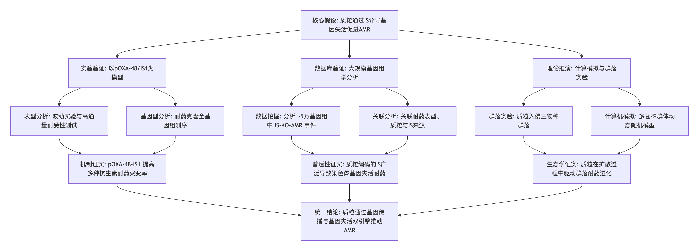
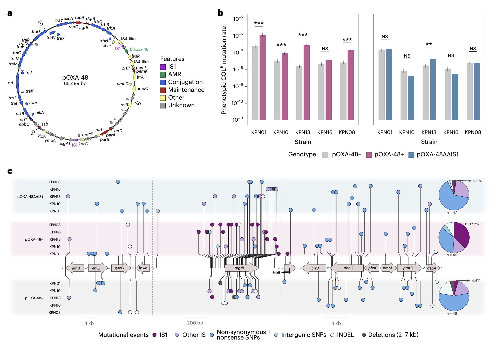
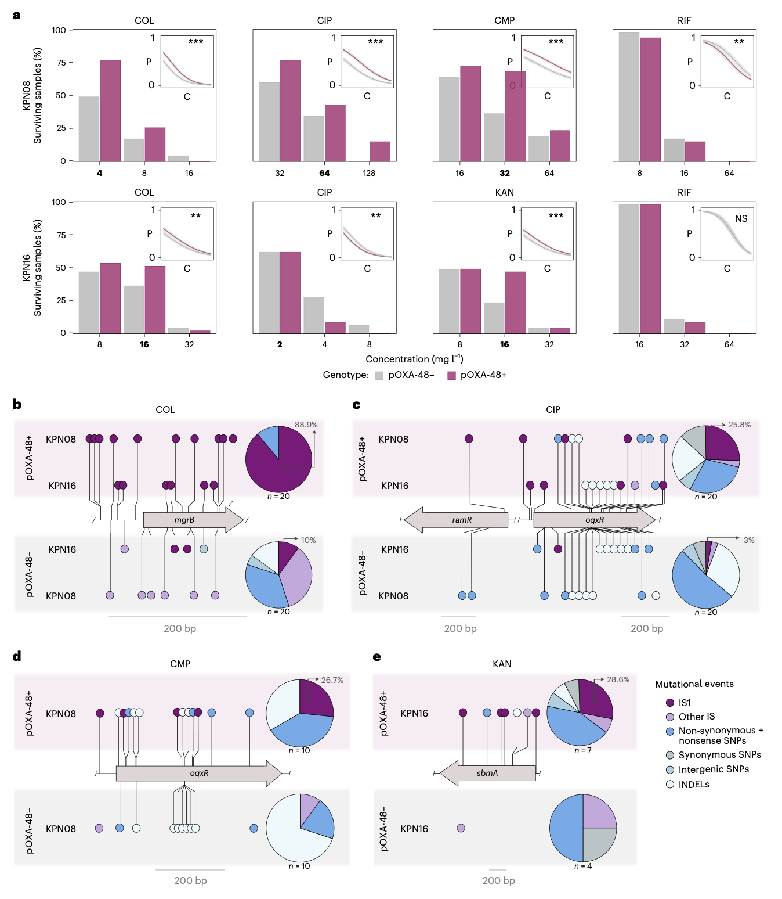
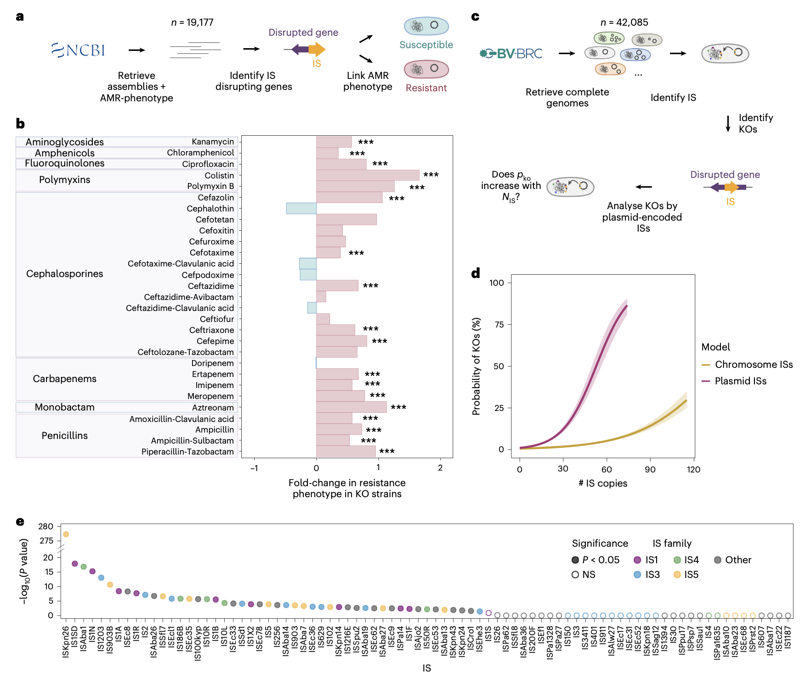
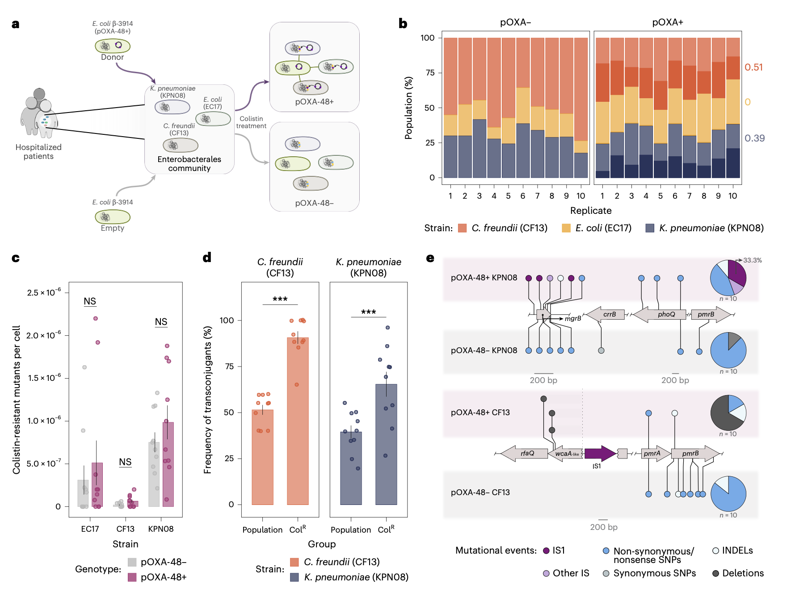
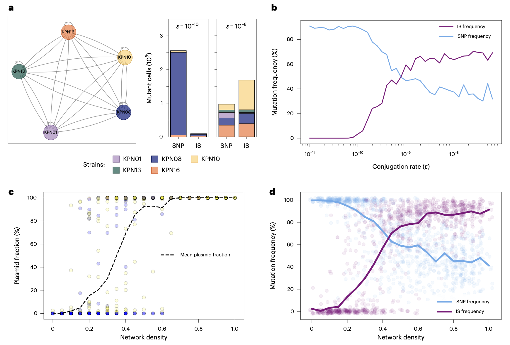

## 背景

抗菌素耐药性（AMR）是全球公共卫生面临的严峻挑战。细菌进化出耐药性的主要途径包括基因突变和通过水平基因转移（Horizontal Gene Transfer, HGT）获得外源耐药基因。在后者中，接合质粒扮演了核心角色，它们是临床环境中多重耐药（Multidrug-Resistant, MDR）病原体出现和传播的主要驱动力。

除了作为耐药基因的“运输工具”，近期的研究开始关注质粒对其宿主细菌进化产生的更广泛影响。例如，质粒可以改变宿主的基因表达谱、增加遗传变异，甚至提高突变率。与此同时，另一种可移动遗传元件——插入序列（IS）——在细菌适应性进化中也至关重要。IS是小型转座元件，能够在基因组内不同位置间“跳跃”。它们不仅可以携带耐药基因移动，其插入行为本身也能通过破坏或改变邻近基因的表达而导致表型变化，包括获得耐药性。一个突出的临床例子是，IS插入失活调控脂质A合成的mgrB基因，是碳青霉烯耐药肠杆菌（Carbapenem-Resistant Enterobacterales, CRE）获得多粘菌素耐药的主要机制之一。

值得注意的是，质粒通常富含IS元件。这引发了一个关键科学假设：质粒是否不仅能传播现成的耐药基因，还能通过其携带的IS元件“主动”诱变宿主染色体，创造新的耐药表型？为验证这一假设，研究人员以携带两个IS1元件的全球流行质粒pOXA-48为模型，结合实验、生物信息学和计算模拟方法，系统探究了质粒通过IS介导的基因失活促进AMR进化的机制与普适性。

- Sastre-Dominguez, J., Rodera-Fernandez, P., DelaFuente, J., Martinez-Gonzalez, S., Quesada, S., Valencoso-Requena, M., Calvo-Villamanán, A., Costas, C., Fuentes-Hernandez, A., Santos-Lopez, A., & San Millan, A. (2026). Plasmids promote antimicrobial resistance through insertion sequence-mediated gene inactivation. *Nature Microbiology*. https://doi.org/10.1038/s41564-026-02290-x
- 期刊：Nature Microbiology (IF 19.4)
- 发表时间：2026年3月13日（在线发布）

这篇研究提出并证实，质粒促进耐药性进化的作用远不止于基因的传播。研究人员发现，携带插入序列（Insertion Sequence, IS）的质粒本身能够作为一种“诱变平台”，通过其编码的IS元件插入并破坏宿主染色体上的特定基因，从而快速诱导多种耐药类型的产生。以临床广泛流行的碳青霉烯酶质粒pOXA-48为模型，实验证明其携带的IS1元件能够显著提高肺炎克雷伯菌对多粘菌素、环丙沙星、氯霉素和卡那霉素的获得性耐药突变率。对超过5万个细菌基因组的大规模生物信息学分析证实，由质粒编码的IS介导的染色体基因失活（IS-mediated Gene Inactivation）是跨多种细菌物种的普遍耐药进化机制。进一步的计算机模拟和简单微生物群落入侵实验表明，接合质粒在侵入和扩散于复杂菌群的过程中，同样能通过此途径促进耐药性的进化。综上所述，本工作揭示质粒通过“基因传播”和“基因失活”双重机制推动细菌耐药性进化，强调了在临床环境中加强质粒和抗生素管理的紧迫性。

## 方法

### 实验体系与菌株
研究以临床分离的肺炎克雷伯菌（Klebsiella pneumoniae）为主要模型，使用了属于不同序列型（ST15, ST377, ST432, ST1427）的5株菌，构建了其携带pOXA-48、不携带任何质粒以及携带敲除了两个IS1元件的pOXA-48ΔΔIS1的等基因配对菌株。

### 耐药突变率测定与高通量耐受性测试
1.  **波动实验**：通过传统的Luria-Delbrück波动实验，计算了各菌株对多粘菌素（COL）和利福平（RIF，作为对照）的表型耐药突变率。
2.  **高通量耐受性实验**：将大量独立菌落暴露于多粘菌素、环丙沙星（CIP）、氯霉素（CMP）、卡那霉素（KAN）和利福平的不同浓度梯度（0.5×MIC 至 4×MIC）下，通过测定生长存活率，评估pOXA-48对获得多种抗生素耐药性的影响。

### 全基因组测序与突变分析
对波动实验、高通量实验中获得的耐药克隆/种群，以及后续群落实验中的克隆进行全基因组测序（Illumina平台）。通过比对参考基因组，鉴定导致耐药性的突变，特别是IS插入事件。

### 生物信息学数据库分析
1.  **构建靶基因库**：整合MEGARes数据库和本实验发现的靶点，确定了54个已知失活后会导致耐药的表型的关键基因。
2.  **基因组大数据筛查**：分析了美国国家生物技术信息中心病原体检测数据库和细菌与病毒生物信息学资源中心数据库中的数万个完整细菌基因组。统计了IS介导的关键基因失活事件的发生率，并将其与抗生素耐药表型、质粒携带情况、IS的染色体/质粒来源进行关联分析。

### 微生物群落入侵实验
构建了一个由三种从住院患者肠道中分离的肠杆菌（肺炎克雷伯菌、大肠杆菌、弗氏柠檬酸杆菌）组成的简单群落。将携带或不携带pOXA-48的供体菌引入该群落，共培养后，分析质粒在群落成员间的接合转移频率，以及各成员在多粘菌素压力下产生耐药突变体的频率，并对耐药克隆进行基因组测序。

### 计算建模
建立了一个基于Gillespie算法的随机模型，模拟一个由5个菌株组成的细菌群落在抗生素压力下的动态。模型整合了菌株特异性生长参数、抗生素介导的死亡、质粒的接合转移与分离丢失，以及SNP突变和IS转座等进化事件。通过改变网络连接度和接合频率等参数，探索质粒入侵如何影响群落中IS驱动的耐药进化。

以下为本研究核心实验与计算路线的流程图：

## 结果

### pOXA-48通过IS1介导基因失活促进多粘菌素耐药
波动实验表明，在5株临床肺炎克雷伯菌中的3株里，携带pOXA-48显著提高了其对多粘菌素的耐药突变率。而当使用敲除了两个IS1元件的pOXA-48ΔΔIS1质粒时，这一效应在4株菌中消失，证明突变率的提高依赖于质粒编码的IS1。

对耐药克隆的基因组测序发现，pOXA-48携带株中，高达37.2%的克隆其耐药性由IS1插入失活染色体基因导致，而在无质粒株中该比例仅为4.4%。pOXA-48ΔΔIS1携带株的比例（2.3%）与无质粒株相近。最主要的失活靶点是mgrB基因，其低GC含量可能使其更易成为IS1插入的靶标。

### pOXA-48增强对多种抗生素的耐药性获得
高通量耐受性实验表明，在大多数测试的菌株-抗生素组合中，携带pOXA-48的菌群在更高抗生素浓度下的存活数量显著多于其无质粒对应株（利福平除外）。对存活种群的测序证实，对于多粘菌素、环丙沙星、氯霉素和卡那霉素，pOXA-48的存在均与更高比例的IS1介导的基因失活事件相关。这些失活靶点涉及脂质A合成通路、RND外排泵负调控基因以及膜转运蛋白基因等。

### 质粒介导的基因失活是普遍的AMR机制
对公共基因组数据库的分析发现，在肠杆菌目和假单胞菌目细菌中，分别有约7.2%和14.9%的菌株在其基因组中携带至少一个因IS插入而失活的AMR相关关键基因。在拥有表型数据的肠杆菌基因组中，携带此类IS失活基因的菌株，对相应抗生素的耐药比例显著更高。

进一步分析显示，基因组中质粒编码的IS拷贝数与发生AMR基因失活的概率呈强正相关，且其效应强于染色体IS拷贝数。此外，在83种不同的IS元素中，有49种被发现与“携带该IS的质粒”和“由该同种IS介导的染色体AMR基因失活”事件存在显著统计学关联。携带IncFII或IncFIB等复制子的多复制子质粒，以及IS1和IS5家族，在此类事件中尤为突出。

### pOXA-48入侵简单微生物群落促进AMR
在模拟肠道菌群的三种肠杆菌群落中，引入携带pOXA-48的供体菌后，质粒成功接合转移至肺炎克雷伯菌和弗氏柠檬酸杆菌。尽管整个群落的总体多粘菌素耐药频率未显著变化，但在耐药亚群中，质粒携带频率显著高于整个种群。对耐药克隆的测序显示，在获得质粒的肺炎克雷伯菌克隆中，多粘菌素耐药由IS1插入失活mgrB导致；而在弗氏柠檬酸杆菌中，发现了与pOXA-48存在特异相关的、涉及脂多糖合成基因簇的大片段缺失，其遗传特征提示可能由IS1介导的II型缺失导致。

### 质粒入侵与IS介导AMR进化的计算模型
计算机模拟再现了质粒入侵多克隆细菌群落的过程。模型显示，当接合频率超过一个临界阈值时，质粒能够在种群中迅速扩散并达到稳定存在。在质粒广泛扩散后，IS转座取代SNP成为主要的突变类型，导致群体整体突变负荷增加。对随机生成的接合网络进行模拟表明，随着网络密度（即菌株间接合连接的可能性）增加，质粒的流行度和每个细胞的平均IS突变数均上升，在高密度网络中，IS转座成为主导的突变类型。该模型证实，在现实的质粒转移速率和群落结构参数下，接合质粒能够通过IS介导的基因失活普遍地促进AMR进化。

## 讨论

本研究通过多层次证据链，首次系统阐明了接合质粒作为“可移动诱变平台”在驱动细菌耐药性进化中的新机制。实验结果表明，pOXA-48质粒通过其编码的IS1元件，能显著加速临床肺炎克雷伯菌对多种不同类别抗生素的耐药性获得，其核心机制是IS1插入失活染色体上关键的负调控基因或代谢基因。

生物信息学分析将这一发现从特定模型提升至普遍规律。研究证实，在自然界细菌基因组中，由质粒编码的IS介导的染色体基因失活是耐药性进化的一个广泛途径。临床上重要的质粒类型（如F-like质粒）和IS家族（如IS1、IS5）在此过程中扮演了关键角色。这与之前在多药耐药鲍曼不动杆菌和粪肠球菌中的基因组学研究结论相互印证。

计算模型和简化群落实验则从生态进化动力学角度揭示了该机制的现实意义。质粒在菌群中的接合扩散过程与其诱变效应协同作用，使得质粒不仅能“传播”耐药，还能在入侵新宿主的过程中“创造”新的耐药类型。即使在群落中存在接合“壁垒”（如某些菌株不易接收质粒），质粒仍能在可接合的成员中扩散并诱发耐药。

这一发现具有重要的临床和进化意义。它解释了为何在某些高水平耐药克隆（如碳青霉烯耐药肠杆菌）中，会快速并发对其他最后防线药物（如多粘菌素）的耐药性。质粒与IS之间可能存在一种“协同关系”：质粒帮助IS侵入新宿主，扩大其种群；而IS通过为宿主提供适应性突变（如耐药性），间接提高质粒的适合度，形成一种“二阶选择”。

## 结论

本研究表明，接合质粒是推动抗菌素耐药性进化的双重引擎：一方面作为耐药基因的高效传播载体，另一方面则作为可移动的诱变因子，通过其携带的插入序列失活宿主染色体基因，直接催化新耐药类型的产生。这种“质粒-IS”协同作用机制，在细菌应对抗生素压力的快速适应中至关重要。该研究强调了在临床感染防治和抗生素管理策略中，必须将质粒及其携带的IS元件作为一个整体性的进化威胁来加以监控和应对。
