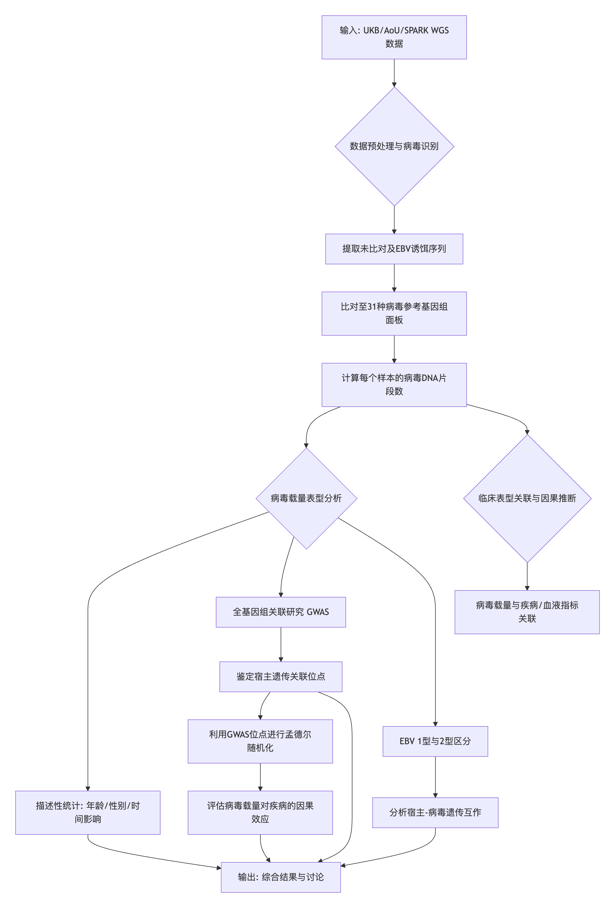
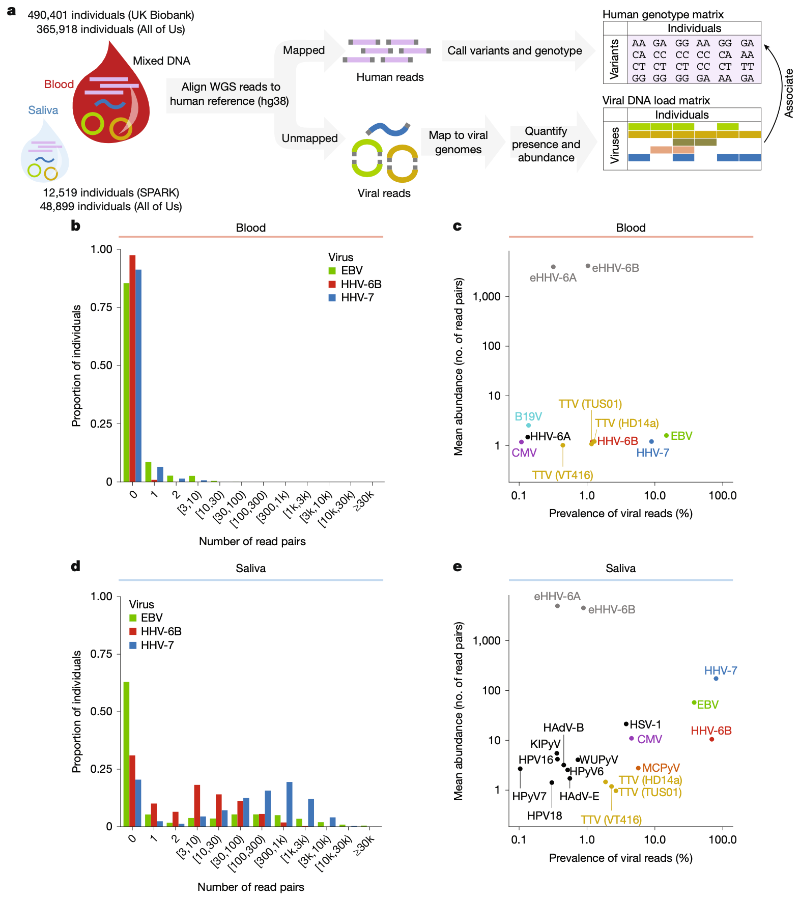
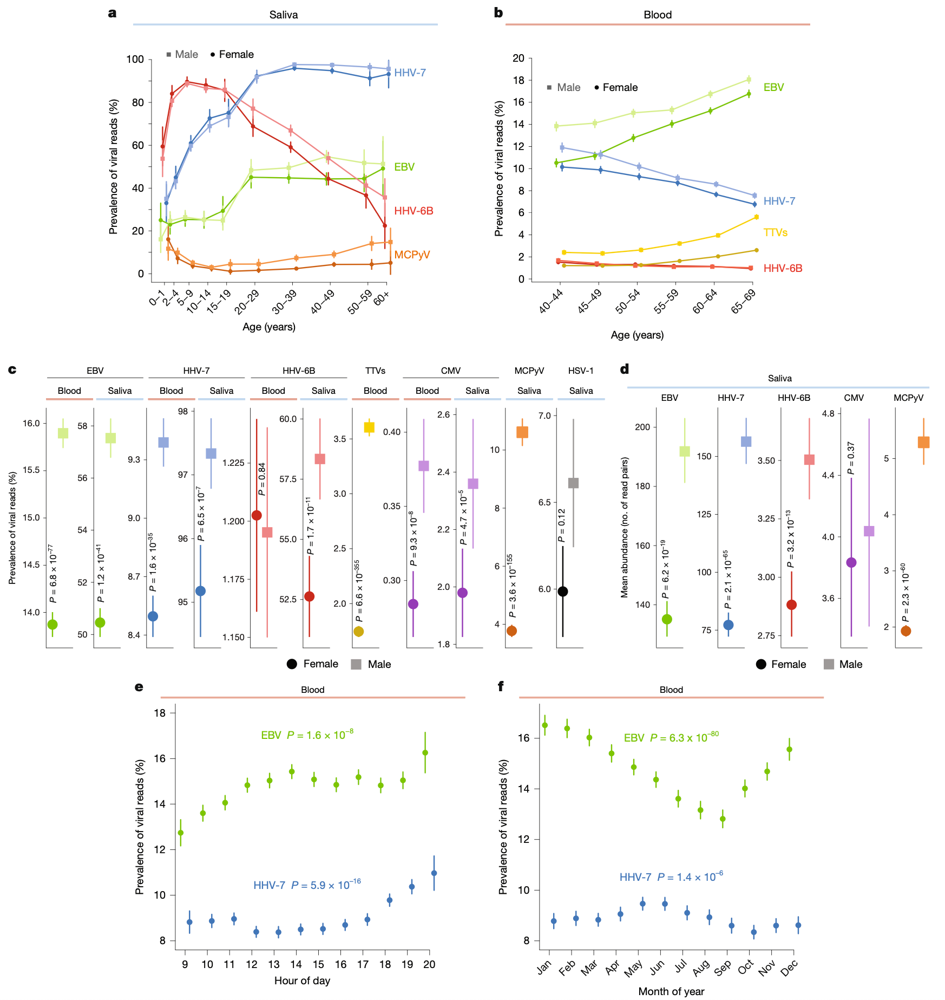
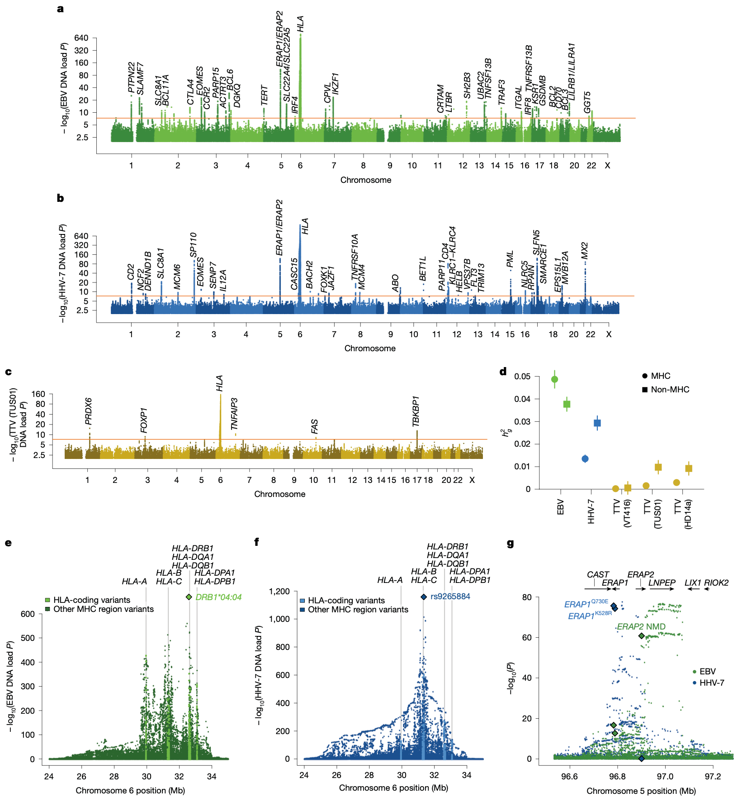
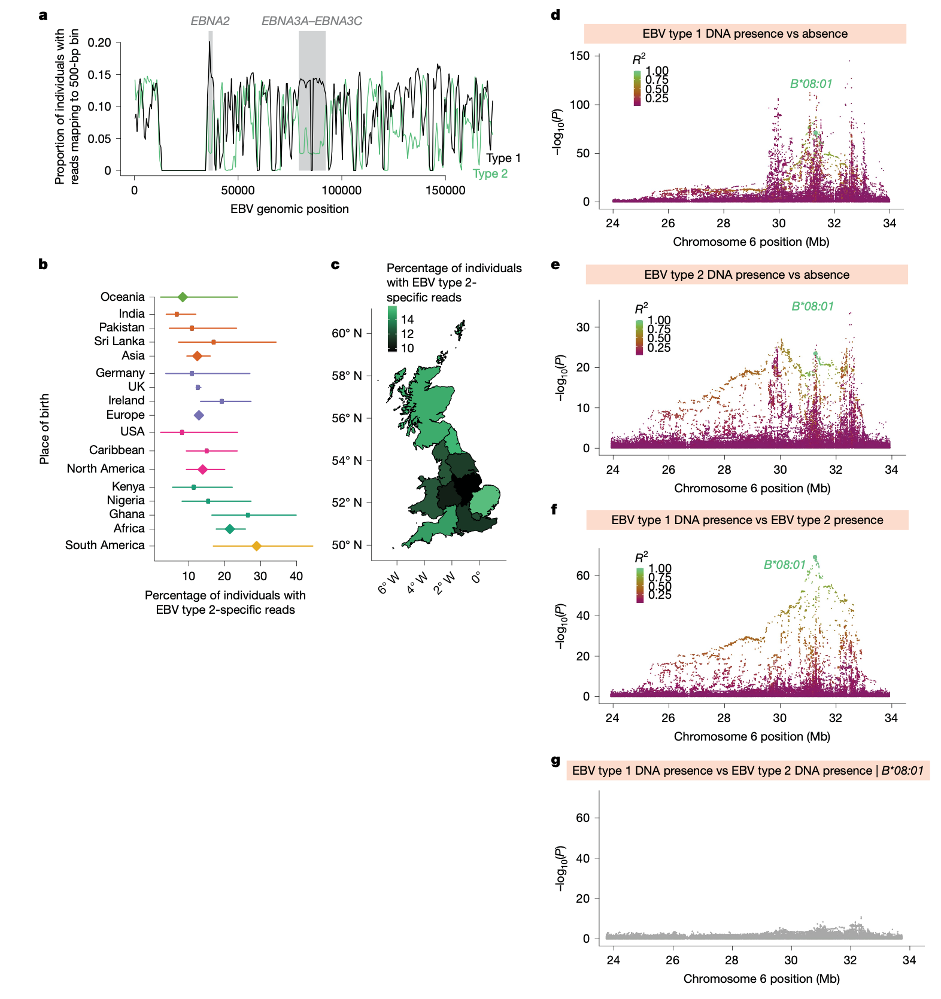
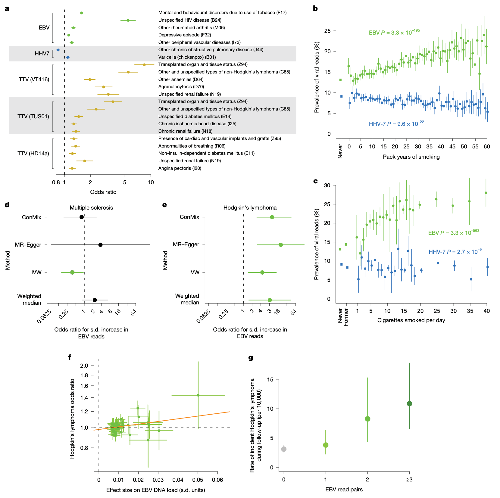

## 背景

许多病毒能够感染人类并建立终身潜伏感染。宿主免疫系统对病毒载量的控制差异可能导致病毒清除、稳定潜伏或疾病进展。例如，EBV感染是霍奇金淋巴瘤和多发性硬化症的已知风险因素。尽管先前研究已通过血清学方法揭示了宿主遗传对病毒免疫反应的影响，但对于健康个体中常见的潜伏病毒，其在不同组织（如血液和唾液）中的载量如何随宿主遗传、人口统计学特征和环境因素而变化，以及这种变化对健康的潜在因果影响，仍知之甚少。大规模生物样本库的WGS数据为系统性地、无偏地探索人类病毒组（virome）的构成与决定因素提供了前所未有的机会。

- Kamitaki, N., Tang, D., McCarroll, S. A., & Loh, P.-R. (2026). The DNA virome varies with human genes and environments. *Nature*. https://doi.org/10.1038/s41586-026-10288-y
- 期刊：Nature (IF 48.5)
- 在线发表时间：2026年3月25日

本研究利用英国生物银行（UK Biobank）、美国“全民健康研究计划”（All of Us）及SPARK队列中超过90万人的血液与唾液样本的高覆盖度全基因组测序（whole-genome sequencing, WGS）数据，系统量化了31种常见DNA病毒（包括疱疹病毒、多瘤病毒和指环病毒等）的载量。研究人员发现，病毒DNA载量在个体间差异巨大，且受到年龄、性别、样本采集时间（昼夜和季节）的显著影响。通过全基因组关联研究（genome-wide association study, GWAS），鉴定出数十个人类基因位点与Epstein-Barr病毒（EBV）、人类疱疹病毒7型（HHV-7）、Merkel细胞多瘤病毒（MCPyV）及指环病毒（anellovirus）的DNA载量相关，其中主要组织相容性复合体（major histocompatibility complex, MHC）区域的变异贡献了最强的遗传效应。HLA-B*08:01等位基因与EBV亚型存在特异性相互作用。孟德尔随机化分析表明，较高的慢性EBV DNA载量是霍奇金淋巴瘤（Hodgkin’s lymphoma）的致病风险因素，但与多发性硬化症（multiple sclerosis）的风险无直接因果关系，后者可能更依赖于宿主对特定病毒表位的免疫反应。

## 方法
研究人员分析了来自UK Biobank（490,401份血液样本）、All of Us（365,918份血液样本和48,899份唾液样本）及SPARK（12,519份唾液样本）的WGS数据。通过将未比对到人类基因组的测序序列重新比对到一个包含31种常见DNA病毒的参考基因组面板，量化了每种病毒的DNA片段数量，以此作为病毒载量的代理指标。主要分析方法包括描述性统计、GWAS、病毒亚型分析以及孟德尔随机化。研究流程可概括为以下关键步骤：

### 数据获取与处理
从各生物样本库获取了血液和唾液来源的DNA进行的高覆盖度WGS数据。通过专用流程提取未比对到人类参考基因组（GRCh38）的序列，将其比对至自定义的病毒参考基因组面板。为确保数据质量，研究人员过滤了病毒基因组中比对深度异常的区域，这些区域可能源于人类序列的误比对。最终，为每个样本计算了比对到每种病毒基因组的读对（read pair）数量，作为病毒DNA载量的定量指标。

### 统计分析
对于病毒载量与年龄、性别、采集时间等非遗传因素的相关性，使用线性或逻辑回归模型进行分析，并校正了潜在混杂因素。GWAS在具有欧洲血统的个体中进行，使用线性混合模型校正亲缘关系，将病毒DNA片段数量经逆正态变换后作为表型。为探究EBV亚型，研究人员将序列分别比对至EBV 1型和2型的参考基因组，并在EBNA2和EBNA3A-EBNA3C这两个具有亚型特异性的区域进行区分。孟德尔随机化分析则利用GWAS鉴定出的、与EBV DNA载量相关的遗传变异作为工具变量，评估病毒载量对疾病风险的因果效应。

## 结果

### 血液与唾液中的DNA病毒组特征
在血液WGS数据中，病毒DNA序列的检测率普遍较低，大多数个体未检测到任何病毒序列。这与疱疹病毒和指环病毒在人群中血清学阳性率高但潜伏感染的细胞比例极低的事实一致。EBV和指环病毒（TTV）的DNA检出率随年龄增长而增加，而HHV-7和HHV-6B的检出率则随年龄增长而下降。值得注意的是，所有研究的病毒在男性中的DNA载量均高于女性，且这种性别差异在青春期后开始显现。
与血液形成鲜明对比的是，唾液WGS数据中病毒DNA序列的检出率和丰度均显著更高。多种疱疹病毒呈现出明显的双峰分布，即样本要么不含该病毒序列，要么含有大量序列，这表明唾液中的病毒DNA可能源于频繁但间歇性的裂解性复制事件，而非持续存在的潜伏感染。

### 病毒载量的非遗传决定因素
除了年龄和性别，病毒DNA载量还表现出显著的昼夜节律和季节性变化。例如，在UKB血液样本中，EBV DNA的检出率在一天中从上午9点到晚上8点增加约1.2-1.3倍，且在冬季比夏季高出约30%。HHV-7也表现出昼夜节律变化，但其季节性波动模式与EBV不同。此外，吸烟行为对病毒载量有显著影响，且对不同病毒的作用方向相反：吸烟量与EBV DNA检出率正相关，而与HHV-7 DNA检出率负相关。

### 影响病毒载量的人类遗传因素
GWAS分析在血液样本中鉴定出82个与7种病毒（EBV、HHV-6B、HHV-7及三种指环病毒）DNA载量相关的人类基因位点。其中，EBV关联位点最多（45个），HHV-7次之（37个）。对于大多数病毒（HHV-6B除外），MHC区域贡献了最强的遗传关联信号，解释了病毒载量遗传力（heritability）的很大一部分（EBV为56%，HHV-7为32%）。不同病毒在MHC区域内的关联模式（即具体的关联单核苷酸多态性及其强度）具有高度特异性，表明不同的HLA等位基因通过呈递病毒特异性抗原肽来差异性地影响免疫控制。

MHC区域之外，位于5号染色体的`ERAP1-ERAP2-LNPEP`基因座与EBV和HHV-7的DNA载量存在强关联。该基因座编码的肽酶负责处理抗原肽以供MHC分子呈递。此外，研究还发现了与B细胞存活、疱疹病毒复制限制、细胞凋亡调节等通路相关的基因。在唾液样本的GWAS中也发现了类似的遗传关联，但部分遗传效应（如HLA-A*02:01等位基因）具有组织特异性，仅与血液中的EBV载量相关，而与唾液中的无关。

### HLA-B*08:01与EBV亚型的特异性相互作用
通过区分EBV 1型和2型，研究人员发现HLA-B*08:01等位基因与EBV亚型存在特异性遗传互作。该等位基因对1型EBV感染具有保护作用，但会增加2型EBV的感染风险。这表明HLA-B*08:01可能对1型EBV的某些抗原肽（如来自EBNA-3A的肽段）具有高亲和力，从而能有效清除感染，但对2型EBV的同源蛋白则无效。

### EBV DNA载量是霍奇金淋巴瘤的致病风险因素
研究人员观察到EBV DNA载量与多种疾病表型（如自身免疫性疾病、呼吸系统疾病、淋巴瘤等）及血液指标存在大量关联。为区分因果方向，他们利用GWAS发现的、影响EBV DNA载量的遗传变异作为工具变量进行孟德尔随机化分析。结果显示，较高的EBV DNA载量能显著增加霍奇金淋巴瘤的发病风险。然而，对于多发性硬化症、系统性红斑狼疮和类风湿关节炎，分析并未提供病毒载量具有因果效应的支持性证据，提示EBV感染与这些自身免疫病的关联可能更多是由针对特定病毒表位的异常免疫反应所介导，而非由感染后的慢性病毒载量直接导致。

## 讨论
本研究通过大规模人口测序数据，系统描绘了人类血液和唾液中DNA病毒组的变异图谱，并阐明了其关键决定因素。研究发现，人类遗传、年龄、性别、时间（昼夜和季节）以及吸烟行为共同塑造了病毒载量，但这些效应的强度和方向通常具有病毒特异性。

遗传学分析极大地扩展了我们对宿主控制常见潜伏病毒的理解。MHC区域及`ERAP1/2`等抗原处理呈递相关基因的强关联，凸显了适应性免疫在调控慢性病毒感染中的核心作用。不同病毒间 largely distinct 的多基因关联模式，反映了宿主与不同病毒间复杂的共进化历史。

最为重要的发现来自于孟德尔随机化分析，它提供了EBV DNA载量是霍奇金淋巴瘤致病风险因素的遗传证据。这具有潜在的临床意义，提示降低慢性EBV载量的干预措施（如抗病毒治疗）或许能作为霍奇金淋巴瘤的预防策略。同时，研究也明确了EBV感染引发多发性硬化症的风险可能主要源于初次感染时触发的特定免疫反应，而非终身携带的病毒载量本身，这为针对这两种EBV相关疾病的不同治疗和预防策略提供了理论依据。

## 结论
综合而言，这项研究揭示了个体间病毒DNA载量的巨大差异是由复杂的宿主遗传因素、人口学特征及环境暴露共同决定的。这些发现深化了我们对人类-病毒相互作用的理解，特别是阐明了遗传背景如何通过免疫系统影响对常见病毒的控制。更为重要的是，研究通过遗传学方法确立了慢性EBV载量在霍奇金淋巴瘤发病中的因果作用，为未来的疾病预防和精准医疗策略提供了新的视角和潜在靶点。随着生物样本库规模的不断扩大和测序技术的进步，利用群体遗传学资源研究病毒组将成为揭示感染性疾病机制、评估疾病风险的有力工具。
