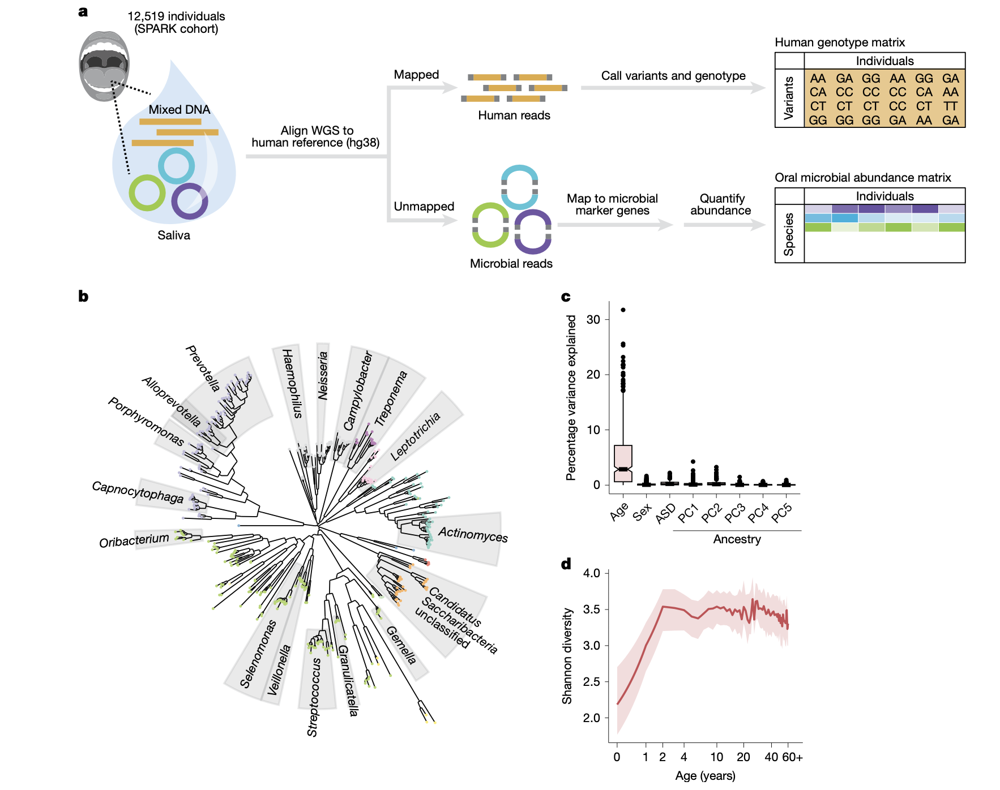
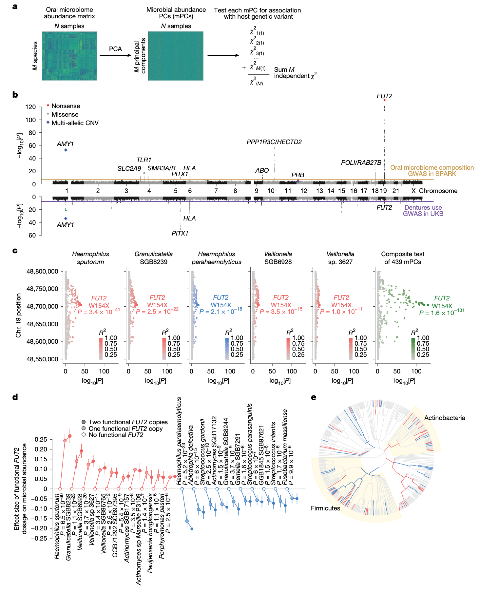
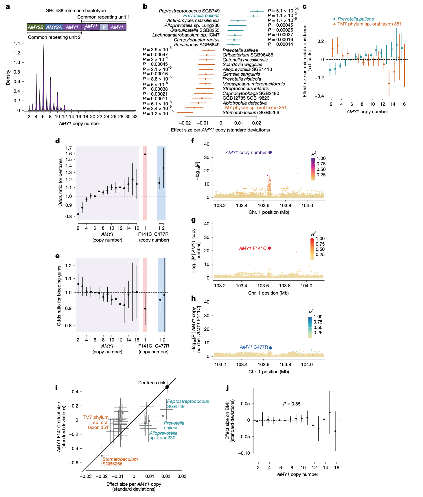
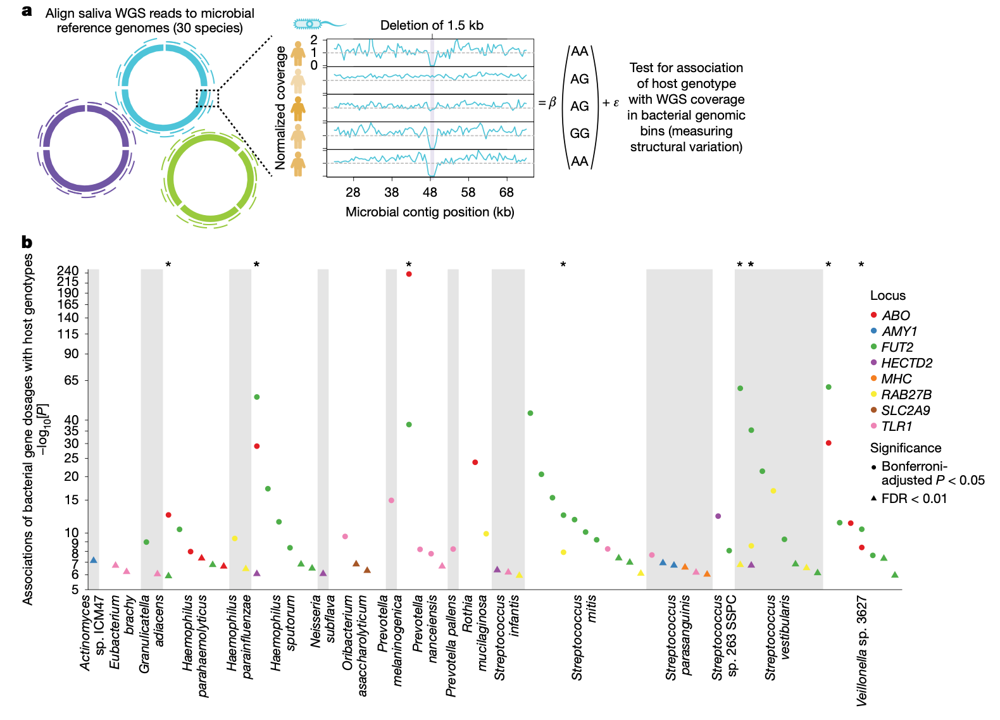
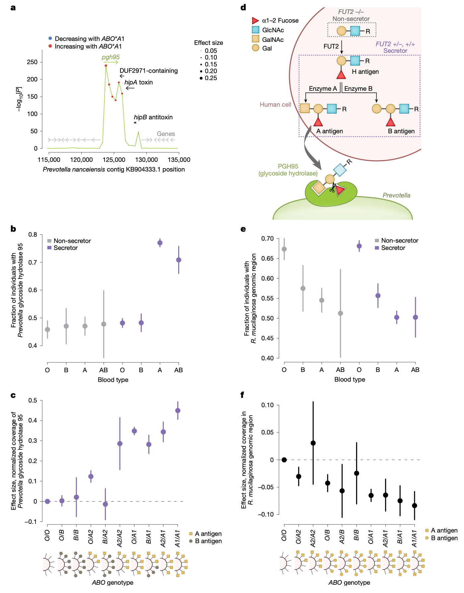
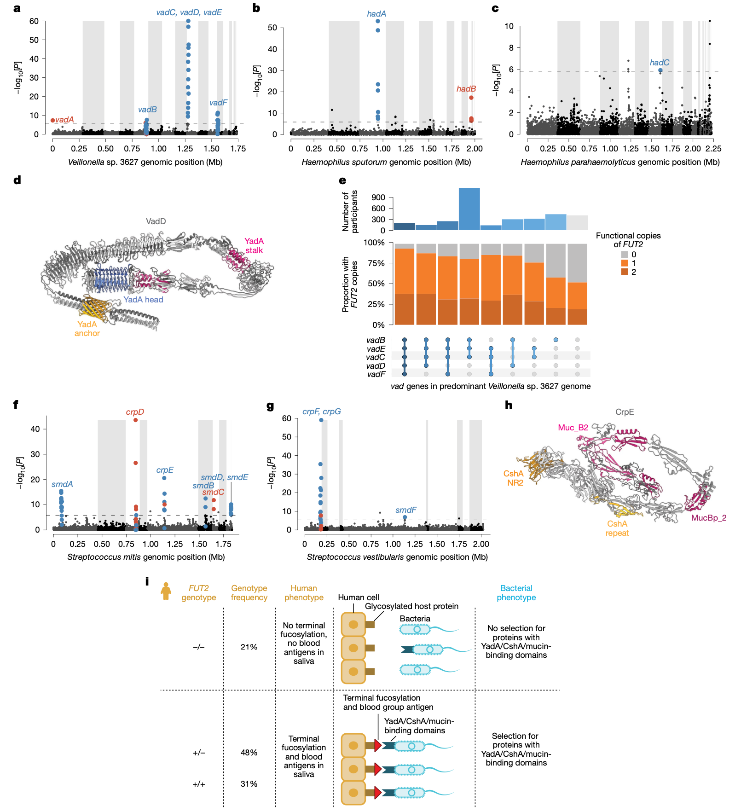

## 背景
口腔微生物组是人体最复杂的微生物群落之一，与多种口腔及全身性疾病密切相关。尽管双生子研究已表明口腔微生物组成的部分变异是可遗传的，但迄今为止，仅有少量研究发现了与特定口腔微生物丰度相关的人类遗传多态性，且样本量有限，统计效能不足。识别影响口腔微生物组的人类遗传效应，对于理解龋齿等口腔疾病的易感性机制至关重要，因为这类疾病源于口腔微生物的生态失调。同时，宿主与微生物之间的共生关系也意味着微生物基因组可能适应宿主的遗传变异。先前在肠道微生物组中已观察到此类共适应现象，例如费氏杆菌基因组中的结构变异与人类ABO血型的互作。然而，这种特异性共适应在口腔微生物组中是否普遍存在，仍是一个悬而未决的问题。

- Kamitaki, N., Handsaker, R. E., Hujoel, M. L. A., Mukamel, R. E., Usher, C. L., McCarroll, S. A., & Loh, P.-R. (2026). Human and bacterial genetic variation shape oral microbiomes and health. *Nature*, 651, 429–439. https://doi.org/10.1038/s41586-025-10037-7
- 期刊：Nature (IF 48.5)
- 在线发表时间：2026年1月28日

本研究通过重新分析来自西蒙斯基金会自闭症研究计划SPARK队列的12,519人唾液DNA全基因组测序数据，对口腔微生物组进行了系统表征。研究人员发现，人类在11个基因位点（其中10个为新发现）的遗传变异与口腔微生物组成的变化相关。这些关联中，涉及碳水化合物可利用性的位点尤为突出：最强关联与常见的FUT2 W154X功能丧失变异相关，其影响了58种细菌物种的丰度。人类宿主遗传学似乎也强有力地塑造着口腔细菌物种内部的遗传变异：这11个宿主遗传变异还与68个细菌基因组区域的基因剂量（gene dosage）变化相关。编码唾液淀粉酶的基因AMY1常见多等位拷贝数变异与口腔微生物组成显著相关，并与英国生物银行队列中的义齿使用风险相关，但与身体质量指数无关。这提示唾液淀粉酶丰度通过影响口腔微生物组来影响健康。另外两个与微生物组成相关的位点（FUT2和PITX1）也与义齿使用风险显著相关，共同揭示了一系列可能导致龋齿的宿主-微生物互作。通过细菌基因剂量分析，研究进一步发现了细菌基因组对宿主遗传环境的特异性适应，例如普雷沃菌（Prevotella）通过携带一种糖苷水解酶来利用宿主的A型血型抗原作为碳源，而多种口腔共生菌则通过表达具有YadA、CshA或黏蛋白结合结构域的黏附素来依附于宿主细胞表面，其存在与否取决于宿主是否为分泌者表型。这些发现共同描绘了一幅人类与口腔微生物在遗传层面紧密互作、共同影响口腔健康的复杂图景。

## 方法
本研究对来自SPARK队列的12,519名参与者的唾液DNA全基因组测序数据进行了二次分析。通过提取未比对到人类参考基因组（GRCh38）的测序读段，并利用MetaPhlAn工具将其比对到微生物参考基因组，研究人员量化了645种微生物物种的相对丰度，其中439种在队列中普遍存在（≥10%参与者）。为识别影响微生物组成的人类遗传变异，研究采用了基于微生物主成分的创新性全基因组关联研究方法，以整合对人类遗传变异具有多效性影响的信号，并有效控制多重检验负担。同时，研究利用英国生物银行的大规模表型数据，分析了所发现遗传位点与口腔健康表型（如义齿使用、牙龈出血）的关联。为探究宿主遗传如何塑造细菌基因组变异，研究人员开发了基于测序覆盖度的细菌基因剂量表型量化方法，并在30个高丰度或与人类遗传强相关的细菌参考基因组中，检测了人类遗传变异与细菌基因组区域覆盖度的关联。

### 数据获取与处理
研究分析了SPARK队列中先前生成的唾液DNA全基因组测序数据。从比对到GRCh38的CRAM文件中提取所有未比对的读段，用于后续微生物组分析。每位样本平均获得6750万条未比对读段，为微生物组分析提供了充足的数据量。利用MetaPhlAn工具和vOct22参考数据库，研究人员获得了每个样本中微生物物种的相对丰度谱。同时，基于已有的联合变异检测结果，经过严格的质量控制，获得了用于关联分析的人类遗传变异数据集。

### 核心统计分析方法
**微生物组成关联分析**：为检测人类遗传变异对复杂微生物群落的整体影响，研究人员首先对439个常见物种的丰度数据进行主成分分析，得到439个正交的微生物主成分。随后，使用线性混合模型分别检验每个遗传变异与每个微生物主成分的关联。最后，将一个变异在所有439个主成分上的卡方检验统计量求和，得到一个综合的、代表该变异对整体微生物组成影响的关联检验统计量，并基于自由度为439的卡方分布计算P值。这种方法增强了检测对人类遗传变异具有多效性影响的统计效能，并大幅降低了多重检验负担。

**细菌基因剂量分析**：为探究宿主遗传对细菌基因组内变异的影响，研究人员将未比对的测序读段重新比对到一个包含30个细菌物种的参考基因组面板。通过计算每个参考基因组上500 bp连续区间的归一化测序覆盖度，研究人员构建了反映细菌基因剂量（如特定基因组区域存在/缺失或拷贝数变化）的表型。随后，他们检验了先前发现的11个与微生物组成相关的人类遗传变异与这些细菌基因剂量表型的关联，并校正了细菌菌株结构等潜在混杂因素。

**口腔健康表型关联分析**：利用英国生物银行的数据，研究人员对义齿使用、牙龈出血等口腔健康表型进行了全基因组关联研究，以验证微生物相关遗传位点是否也与口腔疾病风险相关，并通过共定位分析探讨其潜在的共享遗传基础。

## 结果

### 大规模人群中的口腔微生物组特征
对12,519名SPARK参与者的分析产生了目前最大的口腔微生物组谱集合。年龄是驱动个体间口腔微生物组成差异的主要因素，其解释的物种丰度方差中位数远高于自闭症谱系障碍状态、性别和遗传血统。在SPARK队列覆盖的整个生命周期中，物种多样性在生命最初几年急剧增加，随后随着年龄增长缓慢下降。不同物种在其生命周期内表现出截然不同的丰度轨迹。

### 人类遗传学塑造口腔微生物组成
基于微生物主成分的全基因组关联研究，在11个人类基因位点鉴定出与口腔微生物组成显著相关的常见遗传变异。这11个位点中，有8个涉及功能明确、可能解释其与微生物组关联的基因：
- **唾液蛋白编码基因**：包括唾液淀粉酶基因、颌下腺雄激素调节蛋白基因以及碱性唾液富脯蛋白基因。关联似乎主要由影响基因表达或拷贝数的遗传变异驱动。
- **免疫相关基因**：包括编码适应性免疫中抗原呈递蛋白的HLA II类基因，以及编码先天性免疫中识别细菌脂蛋白的Toll样受体1的基因。TLR1位点最强的关联涉及一个导致细胞表面运输受损的错义变异，其与微生物丰度的关联呈隐性模式。
- **糖基转移酶基因**：ABO和FUT2基因，共同决定上皮细胞和分泌蛋白上组织血型抗原的表达。这两个位点已知影响肠道微生物组，本研究发现它们对口腔微生物组也有强效影响。
- **发育相关基因**：PITX1基因，与龋齿和义齿使用的已知遗传关联完全共定位，提示其可能通过影响牙齿形态来影响口腔微生物和牙齿健康。

### 遗传效应与口腔健康风险的关联
为进一步探索这些遗传效应对口腔健康的影响，研究人员在UK Biobank中对义齿使用（作为牙齿脱落和龋齿的代理表型）进行了GWAS。在11个影响口腔微生物组成的位点中，有3个位点的变异与义齿使用风险显著相关，且关联模式在微生物组成和义齿使用表型间存在共定位。这提示宿主遗传对口腔微生物组成的影响常常会进一步影响口腔健康结局。

### 唾液淀粉酶基因座的复杂变异及其影响
AMY1基因编码唾液α-淀粉酶，负责分解膳食淀粉。研究发现，AMY1的拷贝数变异是影响口腔微生物组成的最强遗传因素之一，与42种细菌物种的丰度逐步变化相关。同时，AMY1拷贝数也与UK Biobank中的义齿使用风险强相关，并在All of Us队列中得到复制。然而，AMY1拷贝数与身体质量指数无关，表明唾液淀粉酶主要通过影响口腔微生物组而非全身代谢来影响健康。除了拷贝数效应，两个罕见的AMY1错义变异与极高的义齿使用风险相关，其效应强度远超拷贝数变异。

### 人类遗传变异与细菌基因剂量的关联
通过检测人类遗传变异与细菌基因组区域测序覆盖度的关联，研究发现了宿主遗传塑造细菌基因组的直接证据。在18个细菌物种的68个基因组区域中，归一化读段深度与11个人类遗传变异中的一个或多个显著相关。这提示这些区域可能包含参与宿主-微生物遗传互作的基因。例如，随着宿主AMY1拷贝数增加， Streptococcus parasanguinis 中编码淀粉酶结合蛋白的基因剂量也相应增加。

### 宿主ABO血型选择细菌糖苷水解酶
宿主ABO*A1基因型与普雷沃菌是否携带一个编码糖苷水解酶的基因强烈相关。该关联仅在分泌者个体中存在，表明该糖苷水解酶可能使细菌能够利用宿主黏膜细胞表面或唾液蛋白（在分泌者中）呈现的A型血型抗原作为碳源。这类似于近期在肠道微生物组中观察到的机制。不同ABO等位基因对该基因覆盖度的影响呈等位基因系列，与各等位基因合成A抗原的能力强弱一致。

### 分泌者状态选择微生物黏附素
相反，许多口腔微生物基因组区域与分泌者状态相关，但与ABO*A1基因型无关。在这些区域中富集了编码三类可能参与细菌黏附的蛋白质基因：
1.  **YadA样结构域蛋白**：在 Veillonella sp. 3627、 Haemophilus sputorum 和 Haemophilus parahaemolyticus 中发现。YadA是三聚体自转运黏附素，可结合宿主细胞外基质成分。
2.  **CshA结构域蛋白**：在 Streptococcus mitis 和 S. vestibularis 中发现。CshA已知可结合宿主纤维连接蛋白。
3.  **黏蛋白结合结构域蛋白**：同样在上述链球菌中发现。黏蛋白高度糖基化。

这15个基因中的大部分在具有功能性FUT2基因的个体口腔微生物组中更常存在，表明它们可能编码依赖于FUT2介导的糖基化的细菌凝集素，用于细菌附着于宿主细胞表面。

## 讨论
这项迄今为止最大规模的口腔微生物组谱分析，揭示了人类遗传变异在塑造个体间口腔微生物组多样性方面的重要作用。研究发现的影响数量众多，表明人类遗传对口腔微生物组的影响可能大于对肠道微生物组的影响，这可能是因为口腔中的宿主细胞与细菌的界面更为直接。

其中一些对微生物丰度的遗传效应似乎介导了相同人类遗传变异与口腔健康表型之间的关联，从而指出了可能导致生态失调的细菌物种。唾液淀粉酶基因产生了最强的此类共享效应，这既由AMY1拷贝数变异驱动，也由其错义突变驱动。人类和家养动物中唾液淀粉酶拷贝数的扩张，曾被假设是农业出现带来的正选择结果。本研究发现AMY1基因拷贝数变异与导致临床相关疾病的口腔微生物表型相关，结合现代牙科和抗生素出现前牙齿感染的高死亡率，提示AMY1拷贝数可能也因其对口腔健康的影响而受到选择。

分析揭示的大量人类遗传变异与细菌基因剂量之间的关联，表明了微生物物种对个体人类宿主的频繁跨基因组适应，并指出了可能驱动这种适应的特定分子互作。大多数此类关联发生在那些整体丰度不受同一人类遗传变异影响的细菌物种中，这表明基因组适应使得许多细菌物种能够在不同的宿主遗传环境中同样良好地生存。相反，与相对物种丰度的关联则可能意味着微生物基因组无法适应特定的人类变异。所发现的大量此类效应表明，分析细菌基因剂量可能是识别宿主对微生物组影响的有力方法，或许是因为分析同一物种内携带或不携带可变基因的成员之间的平衡，可以控制对物种丰度的强烈环境影响。

## 结论
本研究通过大规模人群遗传与宏基因组数据分析，系统阐明了人类与细菌遗传变异如何共同塑造口腔微生物组并影响口腔健康。研究发现了11个影响微生物组成的人类基因位点，其中多个位点（如AMY1、FUT2、PITX1）与龋齿风险直接相关，建立了从宿主基因型到微生物组再到临床表型的潜在因果链条。更为重要的是，研究通过细菌基因剂量分析，首次在口腔微生物组中广泛揭示了细菌基因组对宿主遗传环境的特异性分子适应，包括利用宿主血型抗原作为碳源，以及表达特异性黏附素以依附于经宿主糖基化修饰的细胞表面。这些发现极大地深化了我们对宿主-微生物共生关系中遗传互作的理解，为从菌株和基因层面揭示口腔疾病的发病机制、开发针对性的微生态干预策略提供了全新的遗传学视角和潜在靶点。
