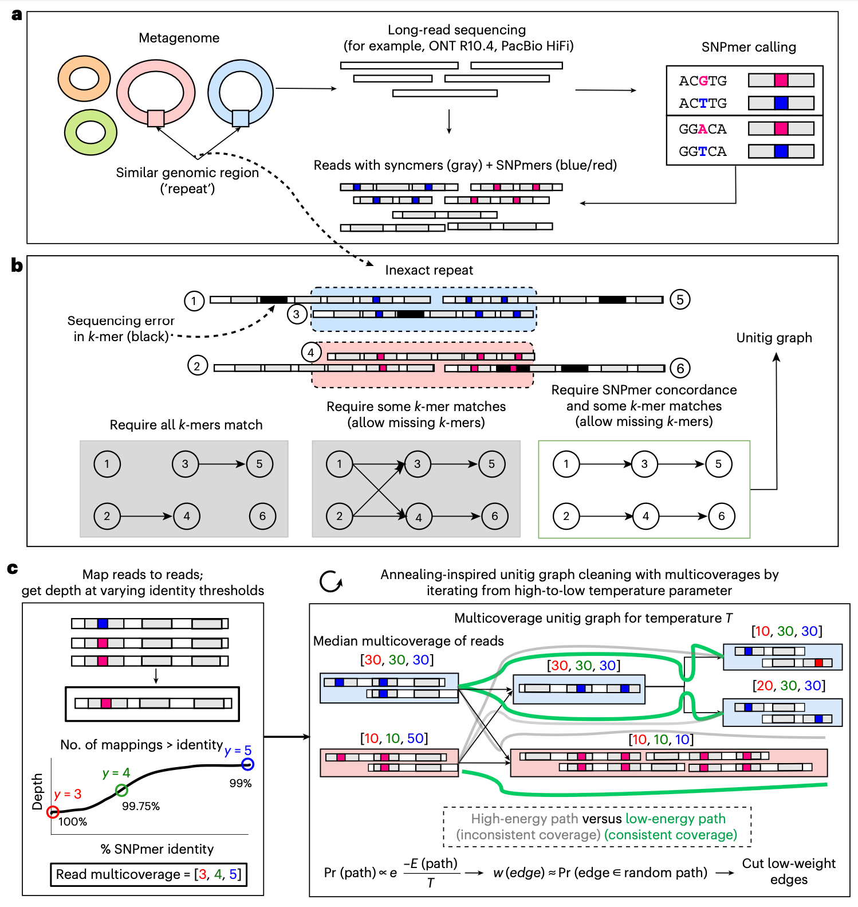
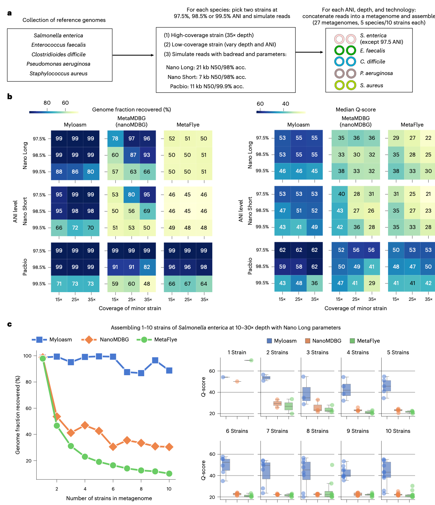
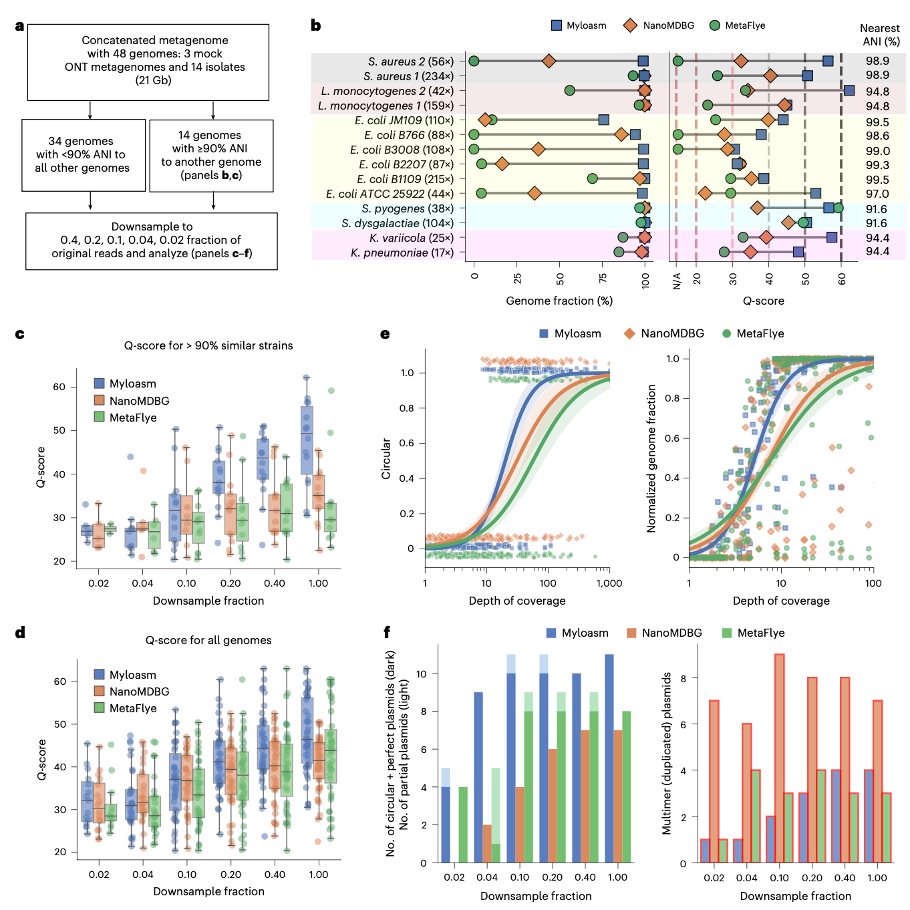
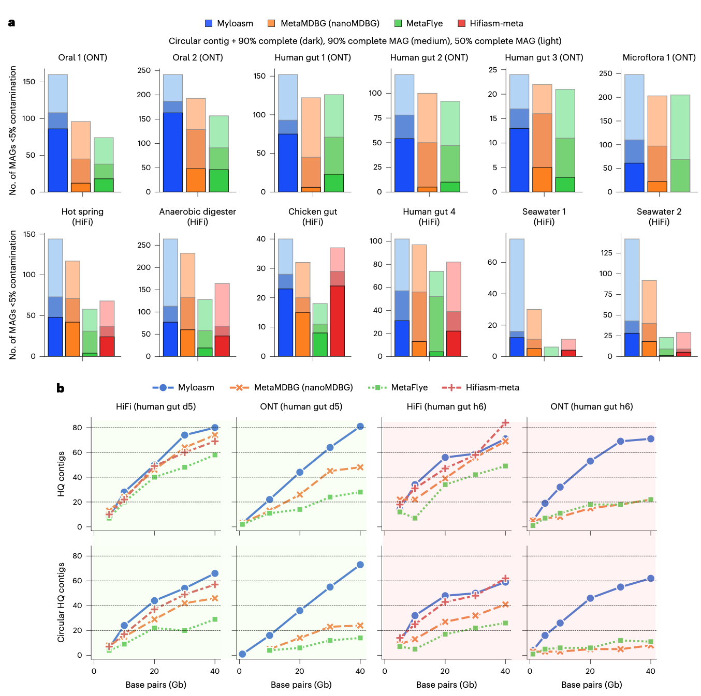
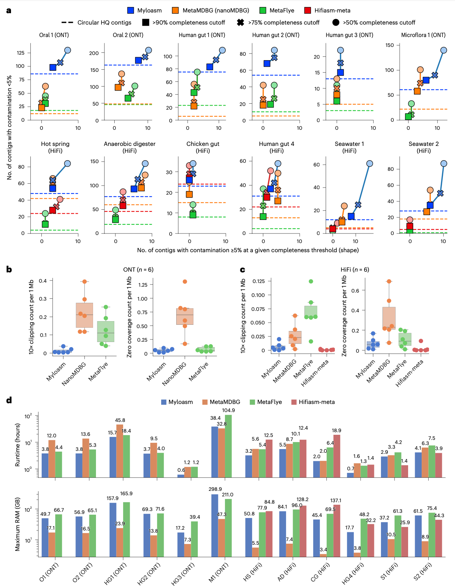
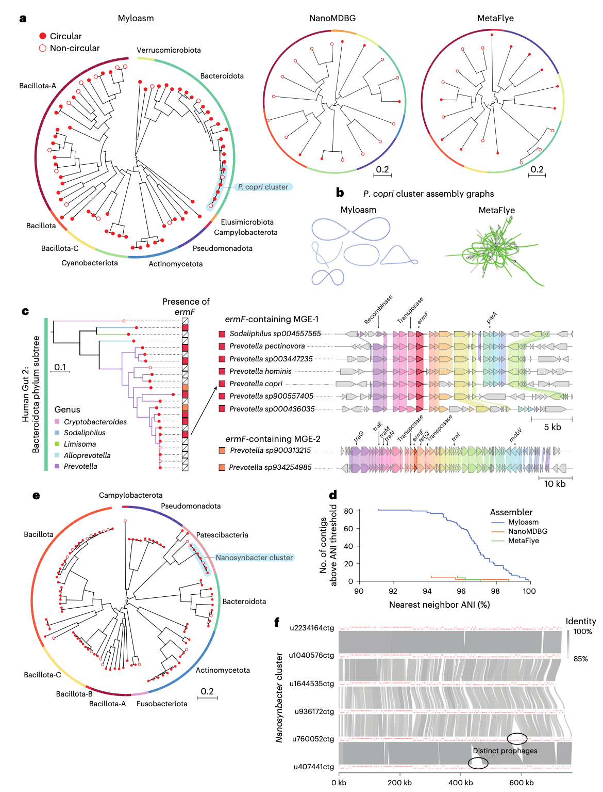

## 背景
宏基因组学彻底改变了我们对未培养微生物世界的认知，并在人类健康、环境科学和基础生物学研究中发挥着关键作用。长读长测序技术，特别是PacBio高保真（HiFi）测序和具有R10.4化学测序芯片的ONT技术，因其能够跨越复杂重复区域，极大地提升了从宏基因组中恢复完整基因组的潜力。然而，宏基因组的固有复杂性——包括大量共存的高度相似基因组（菌株）、水平基因转移事件以及基因组重复序列——对组装算法构成了持续挑战。这种相似性有时甚至超过了测序本身的错误率，使得区分不同菌株变得极为困难。

现有的长读长组装器主要基于两种范式：重叠图和德布莱英图。重叠图方法以读段为节点，以读段间重叠为边，理论上能更好地解析长重复序列，但计算开销大，且对测序错误敏感。德布莱英图方法以k-mer为节点，计算效率高，但可能丢失长程信息，且对测序错误容忍度低，尤其是对于准确率约为98-99%的现代ONT读段。尽管已有方法尝试结合两者优点，但在处理包含多个高度相似菌株的复杂宏基因组时，其分辨率和完整性仍不理想。因此，开发能够有效利用现代长读长数据特性、精准解析宏基因组内细微差异的新算法，对于推动微生物组研究的深度和精度至关重要。

- Shaw, J., Marin, M. G., & Li, H. (2026). High-resolution metagenome assembly for modern long reads with myloasm. *Nature Biotechnology*. https://doi.org/10.1038/s41587-026-03053-z
- 期刊：Nature Biotechnology (IF=41.7)
- 在线发表时间：2026年3月27日

本研究介绍了myloasm，一款专门针对现代高精度长读长（如PacBio HiFi和ONT R10.4）的宏基因组组装工具。myloasm的核心创新在于利用多态性k-mer（SNPmers）在缺乏参考基因组的情况下识别样本内的单核苷酸多态性，并以此构建高分辨率的重叠图（string graph）。此外，myloasm还引入了一种受模拟退火启发的图清理算法，该算法整合了覆盖度深度和重叠信息，以简化组装图。在广泛的基准测试中，myloasm的表现显著优于现有方法。在ONT R10.4数据上，myloasm组装出的完整环状重叠群数量是次优方法的3倍以上，并使ONT数据的组装结果在质量上可与PacBio HiFi相媲美。更重要的是，myloasm能够解析先前方法无法触及的种内多样性，例如从单个肠道宏基因组样本中恢复了6个完整的普雷沃氏菌（Prevotella copri）单重叠群基因组。这些结果表明，myloasm为实现高分辨率、菌株水平的宏基因组组装提供了强大的新工具。

## 方法
myloasm的整体工作流遵循经典的重叠图范式，但其核心创新在于引入了SNPmer和多轮图清理策略，以应对宏基因组组装的特殊挑战。

### 数据获取与预处理
研究使用了来自多个公共数据库的真实ONT R10.4和PacBio HiFi宏基因组测序数据集，以及人为构建的包含已知基因组的模拟群落数据用于基准测试。对于ONT数据，同时使用了超高精度（sup）和高精度（hac）两种碱基识别模式的数据。

### 核心算法：SNPmer与图清理
**SNPmer的识别与使用**：myloasm的核心创新之一是SNPmer。一个SNPmer被定义为一对长度k（默认为21）的k-mer，它们仅在中间碱基不同，而两侧的(k-1)/2个碱基完全一致。myloasm首先从所有读段中计数k-mer，然后通过过滤低频和存在链偏好性的k-mer对，在无参考基因组的情况下识别出样本中潜在的真正多态性位点（即SNPmers）。在后续的重叠检测中，myloasm会匹配SNPmer，但忽略其中间碱基的差异，从而允许来自不同菌株的、带有真正单核苷酸多态性的序列形成重叠。

**双链锚定与一致性估计**：myloasm使用开放同步子（open syncmer）和SNPmer对读段进行双重索引。在寻找重叠时，先进行开放同步子链的锚定和链化，再进行SNPmer链的锚定和链化。基于这两个链的统计信息，myloasm可以通过一个概率模型估计两个序列之间真实的序列一致性，这个估计值能够有效区分测序错误和真正的基因组变异。

**覆盖度整合与概率化图清理**：myloasm将每个读段映射到所有外部读段上，并计算在不同序列一致性阈值下的覆盖度深度。这些覆盖度信息被整合到一个基于“路径能量”的概率模型中。在该模型中，一条路径（即一组相连的单元重叠群）的能量取决于其覆盖度的连续性、重叠的长度以及重叠的序列一致性。myloasm然后为图中的每条边计算一个权重，该权重反映了这条边出现在“高质量”组装路径中的可能性。最后，采用一种模拟退火式的迭代清理策略：从高温（容忍度高）到低温（容忍度低）逐步切割低权重的边，同时移除尖端和合并气泡。这种策略允许在早期阶段形成更长的、覆盖度估计更稳健的单元重叠群，从而在后续阶段进行更激进而准确的图简化。

### 性能评估与分析
研究人员在模拟数据集和多个真实环境（如人体肠道、口腔、海水、土壤）的宏基因组数据集上，将myloasm与当前主流的长读长宏基因组组装工具（metaFlye, metaMDBG/nanoMDBG, hifiasm-meta）进行了全面比较。评估指标包括组装基因组的完整性、污染率、连续性（如NGA50）、质量值（Q-score）以及环状完整重叠群的数量。此外，还通过CheckM2评估宏基因组组装基因组（MAGs）的质量，并通过分析种内相似重叠群的数量和抗生素抗性基因的分布，来评估myloasm解析种内多样性和水平基因转移事件的能力。

## 结果

### 在模拟多菌株群落中实现高分辨率组装
为了评估组装器区分高度相似基因组的能力，研究人员构建了包含多个物种、每个物种包含2个具有不同平均核苷酸一致性（ANI，97.5% 至 99.5%）菌株的模拟宏基因组。测试覆盖了PacBio HiFi和ONT R10.4（长短两种读长分布）参数。
在所有ONT参数集的测试中，myloasm的表现远超其他方法。在ANI低于99.5%的12个ONT数据集中，myloasm恢复了≥95%的基因组部分，中位Q-score在47到55之间（对应错误率低于万分之三）。而metaFlye在所有ONT数据集中，每个物种仅能恢复两个菌株中的一个（基因组部分≤52%）。即使在metaFlye成功组装出一个菌株的情况下，其组装质量也远低于myloasm。metaMDBG在高覆盖度下表现良好，但在中等偏低覆盖度下组装完整性下降。在另一个更具挑战性的基准测试中（仅含1-10个高度相似的鼠伤寒沙门氏菌菌株），myloasm在包含10个菌株时仍能恢复>89%的基因组部分，而metaFlye和metaMDBG分别只能恢复10%和30%。这些结果证明，myloasm能够在很宽的参数范围和菌株复杂度下，输出高分辨率的重叠群并恢复其他方法无法恢复的基因组内容。

### 在真实ONT R10.4模拟群落中验证优异性能
研究人员将一个包含48个基因组的真实ONT R10.4测序数据集（由多个模拟群落和分离株测序数据拼接而成）用于基准测试。myloasm在5组存在密切亲缘关系的基因组（ANI > 90%）上表现最佳，其中位Q-score为49.3，显著高于metaMDBG的35.1和metaFlye的28.6。特别是在包含6个高度相似的大肠杆菌基因组（其中两株ANI达99.53%）的挑战性子集中，myloasm恢复了每个基因组>75%的部分，而其他方法则难以做到。在低覆盖率菌株的组装上，myloasm也表现出更强的鲁棒性。此外，在不同测序深度下采样测试中，myloasm在大多数深度下都获得了最高的中位Q-score和最多的环状单重叠群原核生物基因组。在质粒组装方面，myloasm在所有测序深度下恢复了最多且重复拷贝数最少的环状完整质粒。

### 在多样化的真实宏基因组中提升MAGs的回收率
研究人员在6个真实ONT R10.4和6个真实PacBio HiFi宏基因组上评估了各组装器的表现。在ONT数据上，myloasm的优势尤为明显：平均而言，其组装出的完整环状重叠群数量是次优方法的3倍以上。这种优势在不同环境的ONT数据中保持一致，包括口腔、肠道乃至超过100 Gbp的复杂土壤数据集。值得注意的是，在4个ONT数据集中，单个环状重叠群构成了myloasm所获高质量MAGs的80%以上，这表明在足够的测序深度和读长条件下，获得环状完整基因组正成为可能。在HiFi数据上，myloasm在大多数数据集上也恢复了最多的完整环状重叠群和高质量MAGs，尤其是在复杂的海水宏基因组中表现突出。

### 使ONT测序在人类肠道宏基因组组装中可比肩HiFi
为了直接比较ONT和HiFi技术的组装潜力，研究人员使用了两个同时用两种技术测序的肠道样本。对于其他组装器，HiFi数据依然明显优于ONT。然而，当使用myloasm时，这种差距被极大地缩小甚至逆转：使用ONT数据，myloasm组装出的完整环状重叠群数量平均达到了最佳HiFi组装器的96%至105%。而使用相同ONT数据，metaMDBG和metaFlye仅能达到13-35%和19-22%。这表明myloasm的算法能够有效利用ONT数据中存在的超长读段，使得ONT R10.4测序在人类肠道原核生物组装方面达到了与HiFi相当的水平。

### 揭示种内异质性与菌株特异性动态
myloasm的高分辨率使其能够解析真实群落中高度相似的共存基因组。在一个人类肠道ONT宏基因组中，myloasm一次性组装出6个普雷沃氏菌（P. copri）的高质量单重叠群基因组（其中4个为环状），而其他组装器无法恢复任何长度大于700 kb的P. copri重叠群。对这些基因组的分析还揭示了与它们可能相关的5个环状染色体外元件。对ermF抗生素抗性基因的分析显示，该基因存在于9个拟杆菌门的高质量基因组中，并且可区分为两个不同的序列，其中一种与一个整合性接合元件相关，表明myloasm能够解析菌株特异性的水平基因转移历史和抗性基因的不同进化轨迹。
在一个口腔ONT宏基因组中，myloasm恢复了82个与组内另一重叠群具有>90% ANI和>70%比对分数的重叠群，而其他方法仅发现6个。其中一个突出例子是一个包含8个Nanosynbacter属（TM7门）基因组的集群，其中6个为环状重叠群。尽管部分基因组对之间的ANI低于95%，但它们显示出完美的基因同线性，并且含有菌株特异性的前噬菌体区域，凸显了myloasm在揭示近缘物种和菌株间多样性方面的能力。

## 讨论
myloasm的开发代表了长读长宏基因组组装领域的一次重要进步。其成功的关键在于从底层算法设计上就专注于解决宏基因组的核心挑战，而非简单地将单基因组组装器适配到宏基因组场景。通过引入SNPmer，myloasm巧妙地利用了测序冗余度来识别多态性标记，从而能够在无参考情况下有效区分测序错误和真实的基因组变异。结合覆盖度信息的概率化图清理策略，则使算法能够整合局部与全局信息，做出更可靠的图简化决策。

本研究证实，凭借先进的算法，ONT R10.4长读长数据在复杂宏基因组组装方面已具备与PacBio HiFi数据竞争的实力。myloasm不仅显著提升了ONT数据的组装质量，也在多数HiFi数据集上优于或匹配现有最佳方法，展现出其技术的普适性和鲁棒性。myloasm在解析种内多样性方面的卓越能力，为研究微生物群体内的菌株共存、动态变化和基因流动提供了前所未有的工具。

当然，组装错误在所有宏基因组组装中都不可避免。为此，研究人员配套开发了mylotools可视化工具，帮助用户通过整合读段覆盖度、GC含量、重叠信息等多种基因组特征来检查重叠群质量。这体现了对组装结果进行严谨质量控制的必要性。未来，理解复杂宏基因组组装中错误的算法根源，以及在高重组率、基因流频繁的“基因型连续体”中定义“基因组组装”的数学理论，将是该领域需要深入思考的方向。

## 结论
综上所述，myloasm是一款针对现代高精度长读长测序数据设计的创新型宏基因组组装工具。它通过利用SNPmer解析多态性和整合覆盖度信息进行智能图简化，实现了对复杂微生物群落，尤其是其中高度相似基因组的高分辨率、高质量组装。广泛的基准测试表明，myloasm在合成和真实数据上均显著优于现有方法，不仅大幅提升了ONT R10.4数据的组装质量，使其可比肩PacBio HiFi，而且能够揭示先前难以触及的种内多样性和菌株特异性生物学事件。myloasm的发布为宏基因组学研究提供了更强大的分析工具，有望推动从环境微生物组到人类相关微生物组等广泛领域的科学发现。
