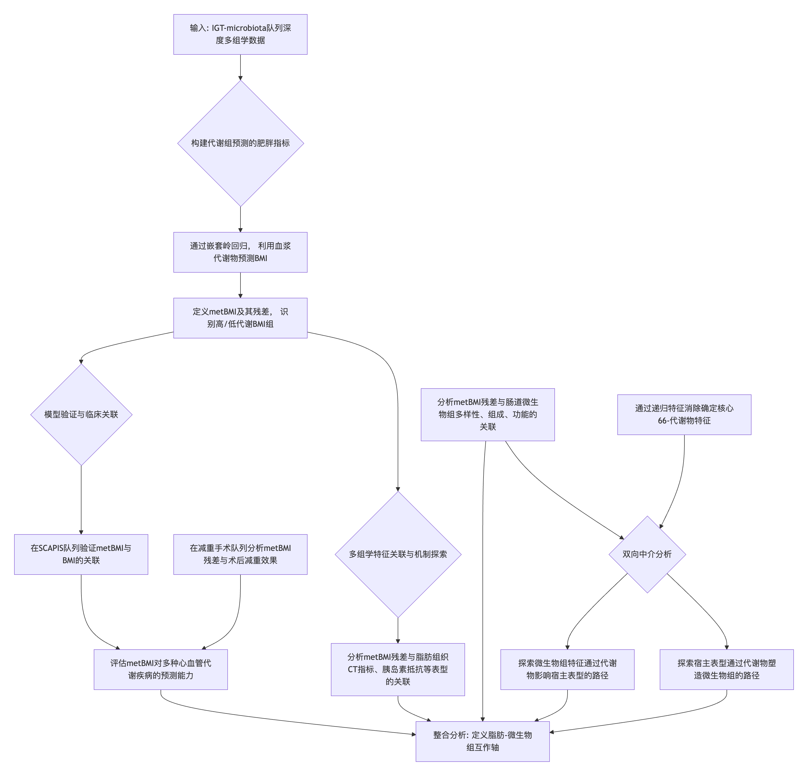
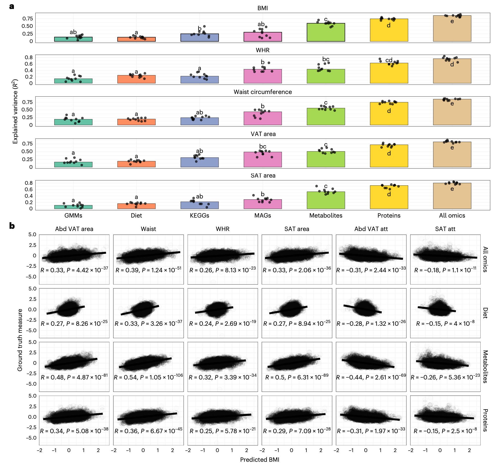
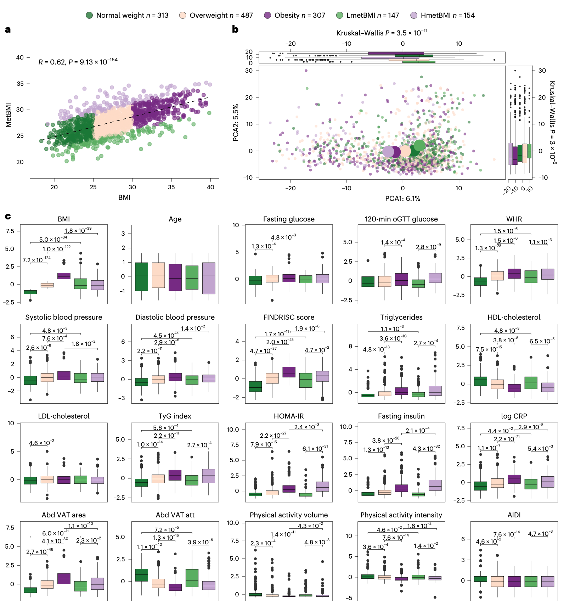
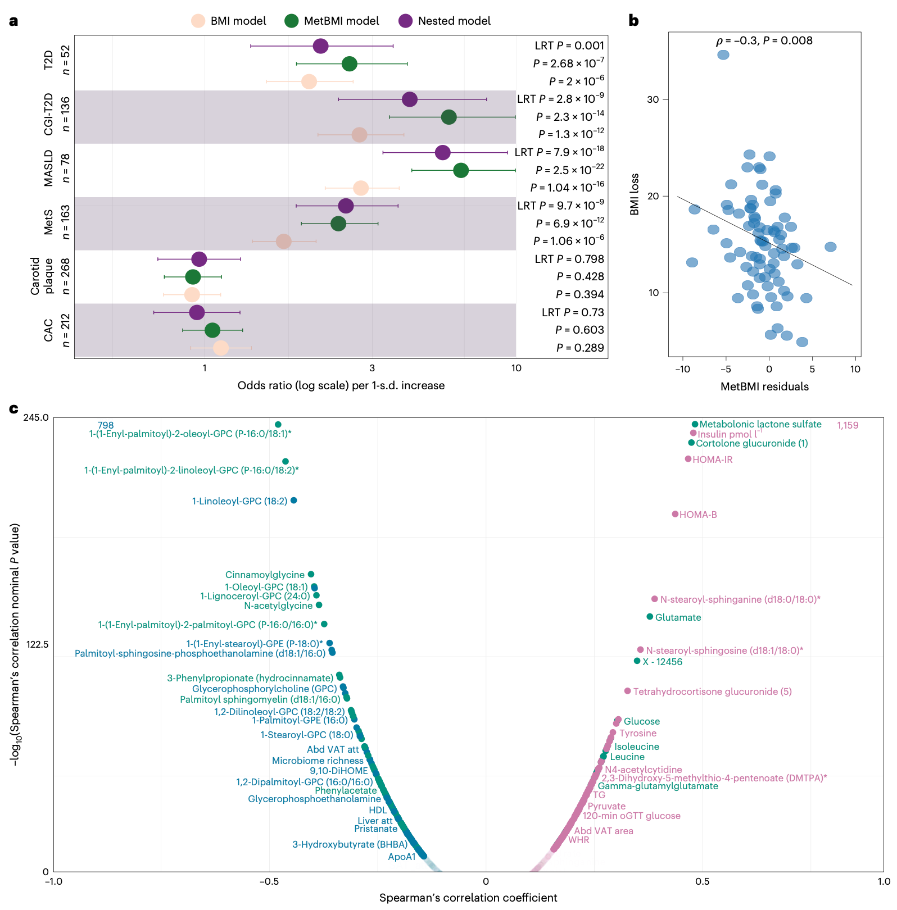
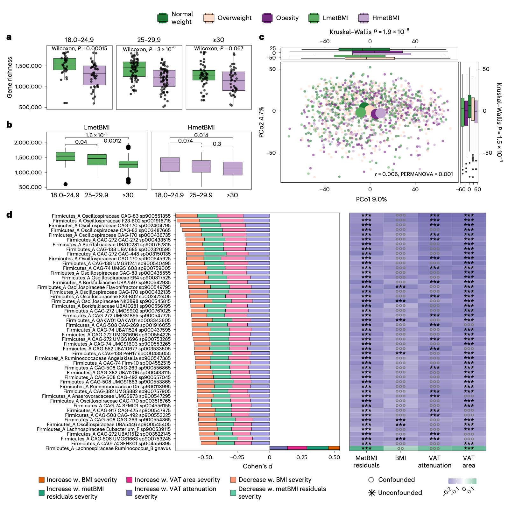
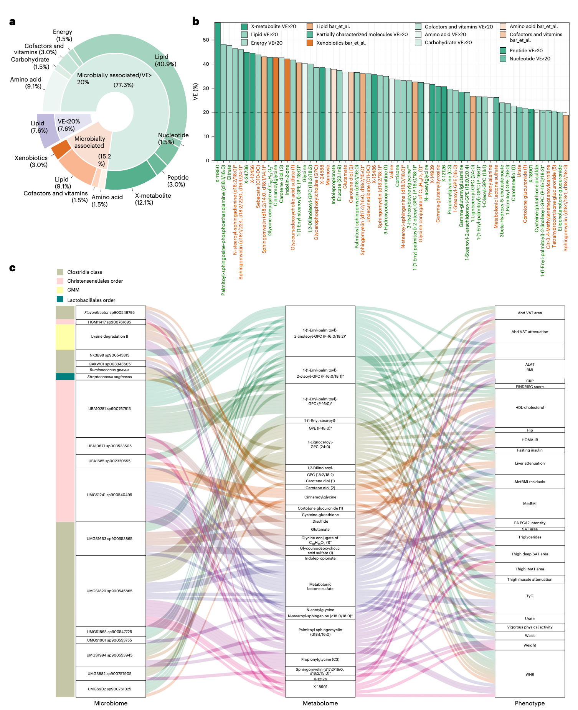
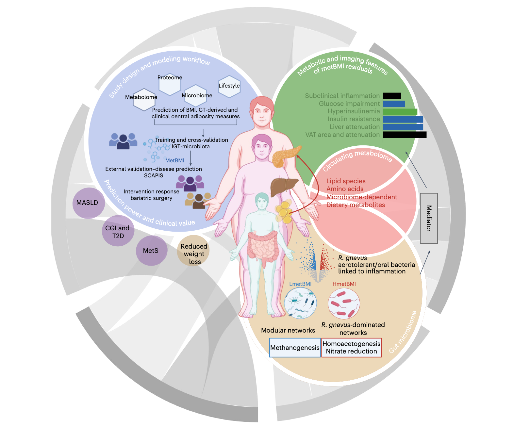

## 背景
肥胖被认为是一种由脂肪过度堆积驱动的慢性、多因素和进行性疾病，可导致组织、器官乃至全身水平的代谢功能障碍。它是2型糖尿病的主要诱因，也是心血管代谢疾病发病率和死亡率的重要贡献因素。然而，当前的临床诊断仍然依赖BMI——这是一个在区分心血管代谢风险方面存在局限性的替代指标。事实上，相当一部分心血管事件死亡发生在那些BMI未达到肥胖诊断阈值的人群中，这促使临床界呼吁需要改进诊断标准，以防止对有风险但未被BMI识别的个体的治疗不足。

虽然BMI可能无法捕捉与肥胖相关的功能性变化，但多组学方法通过整合跨器官和系统的信号，提供了对健康的代谢层面观察，从而能够更精确地描述肥胖相关风险和具有临床意义的肥胖异质性。由宿主生理、饮食和肠道菌群共同塑造的循环代谢物，是反映代谢健康的有力标志物。已有研究表明，基于代谢组定义的肥胖与心血管事件风险显著增加相关，凸显了代谢组学在早期风险评估方面的潜力。然而，这种代谢特征背后的表型多样性和驱动因素仍未被充分阐明。

肠道菌群与宿主代谢密切相关，能够贡献约15%的循环代谢物水平，在糖尿病前期和2型糖尿病患者中这一比例可升至近30%。因此，循环代谢物可作为肠道菌群衍生信号的代理指标，其相互作用的失调可能与肥胖谱系内的代谢异质性有关。本研究假设，基于代谢组学信息预测的BMI（metBMI）能够比传统BMI更精确地反映与脂肪相关的代谢风险。通过在两个瑞典队列中整合计算机断层扫描（CT）脂肪组织定量、代谢组、蛋白组、基因组、宏基因组数据以及全面的临床、生活方式、饮食和体力活动指标，研究人员证明了metBMI能够捕捉整个BMI范围内的代谢功能障碍，在独立队列中预测减重手术反应，并揭示了与心血管代谢风险相关的、潜在具有因果关系的菌群-代谢物交互作用。这一综合框架推进了肥胖的精准表型分型，阐明了跨器官和跨生物体的疾病通路，并可能为BMI定义阈值之外的、更早且更具针对性的干预提供可能。

- Chakaroun, R. M., Pradhan, M., Bjornson, E., et al. (2026). Multi-omic definition of metabolic obesity through adipose tissue-microbiome interactions. *Nature Medicine*, 32, 113–125. https://doi.org/10.1038/s41591-025-04009-7
- 期刊：Nature Medicine (IF=50)
- 在线发表时间：2026年1月2日

本研究旨在通过深度多组学表型分析，定义一个能够反映跨器官系统脂肪组织功能障碍的肥胖指标。研究人员基于来自1,408名个体的多组学数据，利用机器学习开发了代谢组学信息BMI（metabolome-informed BMI, metBMI）。在外部验证队列（n=466）中，metBMI能够解释52%的BMI方差，并且在反映脂肪分布和代谢风险方面优于其他组学模型。高metBMI（即代谢年龄大于实际BMI）的个体患有脂肪肝、糖尿病、严重内脏脂肪堆积、胰岛素抵抗、高胰岛素血症和炎症的风险高出2-5倍，并且在减重手术后，其体重减轻效果减少30%。这种致肥胖特征与肠道菌群丰富度降低、生态结构和功能潜能改变相一致。一个由66种代谢物组成的简化面板保留了38.6%的解释力，其中90%的代谢物与肠道菌群共变。中介分析揭示了一个以脂质、氨基酸和饮食衍生代谢物为媒介的双向、以代谢物为中心的宿主-菌群交互轴。这些发现定义了一个与脂肪组织相关、与肠道菌群相连的代谢特征，在心血管代谢风险分层和指导精准干预方面优于传统的BMI。

## 方法
### 研究队列描述
本研究主要基于糖耐量受损与菌群研究（IGT-microbiota）队列，这是一个前瞻性、非干预性的社区队列，共纳入1,408名无已知心血管疾病或2型糖尿病的个体（50-65岁）。参与者接受了包括人体测量学、CT身体成分分析、静脉血采集（用于代谢组、蛋白组和临床生化）、健康/生活方式/饮食问卷调查以及粪便采样在内的标准化表型分析。饮食摄入通过食物频率问卷评估，体力活动通过加速度计测量。

验证队列来自瑞典心肺生物影像研究（SCAPIS）队列的一个子集（n=466），该队列具有更均衡的性别分布，但代谢疾病负担稍高。减重手术队列（n=75）用于评估干预反应。

### 数据生成与预处理
*   **血浆代谢组**：由Metabolon公司通过高效液相色谱-质谱联用（HPLC-MS）平台进行分析，经过对数转换、批次校正和归一化后，保留1,190种代谢物用于分析。
*   **血浆蛋白组**：使用Olink邻近延伸分析（PEA）技术对1,462种蛋白质进行定量，结果以归一化蛋白表达（NPX, log2）表示。
*   **粪便微生物组**：对粪便样本进行全宏基因组鸟枪法测序。通过组装非冗余微生物基因目录并进行物种注释，最终获得2,820个宏基因组组装基因组（MAGs）用于下游分析。通过京都基因与基因组百科全书（KEGG）和自定义的肠道微生物模块（GMMs）进行功能注释。

### 多组学预测模型构建
研究人员使用巢式岭回归（Ridge Regression）结合10折交叉验证，分别针对BMI、腰臀比（WHR）、腰围以及CT衍生的内脏脂肪组织（VAT）和皮下脂肪组织（SAT）面积，构建了预测模型。模型使用的特征包括单一组学层面（代谢物、蛋白质、微生物物种、GMMs、KEGG通路、饮食变量）以及整合所有组学特征（共5,420个变量）的联合模型。

### 代谢组学信息BMI（metBMI）定义
为了在解决共线性的同时提高模型简洁性，研究人员使用与BMI最严格相关的267种代谢物训练了一个岭回归模型，所得的预测值即为metBMI。在调整了年龄、性别和BMI后，提取每个参与者的metBMI残差。残差大于+2.5的个体被定义为高metBMI（HmetBMI），小于-2.5的个体被定义为低metBMI（LmetBMI），各占队列约10%。

### 临床风险与微生物组关联分析
在验证队列中，通过逻辑回归（调整年龄和性别）评估metBMI对多种心脏代谢结局（如代谢综合征、脂肪肝、糖尿病等）的预测能力，并与仅使用BMI的模型进行比较。通过主坐标分析（PCoA）、网络分析和差异丰度分析，研究metBMI残差与肠道菌群多样性、组成、结构和功能的关系。

### 中介分析与特征筛选
为了探究微生物组-表型之间通过代谢物的相互作用，研究人员进行了双向中介分析。首先通过递归特征消除（RFE）和LASSO回归，从267种代谢物中筛选出最能代表metBMI残差的66种核心代谢物面板。随后，在微生物物种、核心代谢物和临床表型变量之间构建中介路径模型，以识别潜在的微生物→代谢物→表型或表型→代谢物→微生物的交互关系。

## 结果
### 基于多组学的肥胖建模
在比较各单一组学层面对肥胖和脂肪相关性状的预测性能时，研究人员发现循环代谢组提供了最具生理学信息量的信号。代谢物解释的BMI方差最高，达到60%，几乎是微生物物种（MAGs）解释方差（30%）的两倍。这提示代谢物能更好地代表广泛的肥胖相关过程。在预测腹部脂肪相关性状（如腰围、内脏脂肪面积）时，微生物物种的表现与代谢物相当，显示出与内脏脂肪的紧密联系。整合所有组学特征的联合模型达到了最高的总体预测性能，但其表现并未显著超越代谢组模型。交叉组学比较进一步强调了代谢组的核心整合能力：代谢物可解释高达76%的单个蛋白质方差（中位数35%），并优于蛋白质在解释微生物基因丰富度和物种丰度方面的表现。这些结果表明，代谢组是连接宿主、微生物和饮食信号的关键整合者。

### 代谢特征与BMI的解耦
研究人员定义了一个更为精简的metBMI模型。在IGT队列的测试集中，该模型可解释39%的BMI方差。基于metBMI残差定义的HmetBMI和LmetBMI个体，尽管其BMI范围相似，却显示出截然不同的代谢组学特征。LmetBMI个体的代谢谱与正常体重者聚类，而HmetBMI个体则与肥胖者聚类。在相似的基线临床特征（如年龄、血糖、血压）下，HmetBMI个体表现出明显的代谢功能障碍迹象，包括更高的腰臀比、更严重的内脏脂肪面积和脂肪衰减（反映脂肪组织脂质含量和纤维化）、更高的胰岛素抵抗、胰岛素分泌、炎症标志物，以及更低的肠道菌群基因丰富度。这些差异在性别和BMI类别中均保持一致，表明metBMI捕捉了独立于体型的代谢风险。

在独立验证队列（SCAPIS）中，metBMI与BMI保持强相关，解释力达到52%。在该队列中，HmetBMI个体显示出更不利的心脏代谢特征，包括更高的甘油三酯-葡萄糖指数、更高的空腹血糖以及更高的新发糖尿病患病率。

### 利用metBMI及其残差进行临床风险分层和干预反应预测
在评估metBMI对临床结局的预测能力时，研究人员发现，对于代谢综合征、脂肪肝、糖耐量异常合并2型糖尿病以及筛查检出的糖尿病，仅包含metBMI的模型预测效能最强。在调整了年龄和性别的模型中，metBMI是这些疾病的显著独立预测因子。巢式模型分析表明，在BMI基础上加入metBMI可显著改善模型拟合度，证明metBMI捕捉了BMI未能捕获的额外疾病信号。值得注意的是，metBMI与亚临床动脉粥样硬化标志物无关。

在独立减重手术队列中，基线metBMI残差与术后12个月的BMI降低程度呈负相关。尽管HmetBMI和LmetBMI组在基线或随访时的BMI无显著差异，但更高的metBMI残差预示着更差的减重效果。这突显了BMI与metBMI的分离：更高的BMI预示着更大的绝对减重量，而更高的metBMI残差则预示着更差的干预反应，表明metBMI捕捉了代谢对干预抵抗的某些方面，而这些无法被BMI单独反映。

### 表征metBMI残差的临床和多组学特征
metBMI残差与脂肪组织衰减的相关性强于与脂肪面积或肝脏衰减的相关性。它还比BMI本身与胰岛素抵抗、β细胞功能相关的胰岛素高分泌以及糖耐量受损的相关性更强。中介分析表明，metBMI残差介导了38%的脂肪组织衰减对β细胞功能的影响，支持了其在器官间代谢调控中的作用。

在组学层面，metBMI残差与涉及胰岛素抵抗的类固醇代谢物、谷氨酸/谷氨酰胺失衡、支链/芳香族氨基酸、特定磷脂种类的升高呈正相关，而与磷脂酰胆碱、乙酰肉碱、以及菌群/饮食来源的类胡萝卜素二醇等代谢物的降低呈负相关。在蛋白质层面，metBMI残差与胰岛素反应和能量调节相关的蛋白质（如瘦素、羧酸酯酶1）呈正相关。值得注意的是，尽管多种多基因风险评分（PRS）与其对应性状相关，但metBMI及其残差未被任何PRS显著捕获，表明其反映的主要是后天的、非遗传性的代谢特征。

### 肥胖特征的微生物组特征
metBMI及其残差与肠道菌群基因丰富度呈负相关，且相关性比BMI更强。在调整了多种协变量的多变量模型中，加入metBMI消除了基因丰富度与包括BMI在内的359个代谢、饮食和炎症标志物的显著相关性，凸显了metBMI是器官间和生物体间相互作用的重要总结指标。正常体重但高metBMI残差（HmetBMI）的个体，其菌群基因丰富度与肥胖且低残差（LmetBMI）的个体一样低，表明菌群多样性的丧失与代谢上不利的脂肪堆积加速相关。

在群落结构上，HmetBMI和LmetBMI组存在明显分离，HmetBMI的微生物组成与肥胖者聚类。网络分析显示，LmetBMI的菌群网络更密集、模块性更强，以克里斯滕森菌目和史氏甲烷短杆菌等为核心；而HmetBMI的网络则更稀疏，以与代谢功能障碍相关的类群（如Blautia, Bacteroides, Ruminococcus gnavus等）为中心，且与健康相关的类群（如普拉梭菌、真杆菌）存在更多的负向相互作用。

在校正了BMI、内脏脂肪面积和衰减以及药物使用后，研究人员识别出774个与metBMI残差相关的微生物类群。其中，有100个物种主要由metBMI残差驱动，而Ruminococcus gnavus是唯一在所有脂肪相关性状中均富集的物种，并与糖耐量受损相关。即使进一步校正菌群基因丰富度，仍有45个类群与metBMI残差显著相关，包括普拉梭菌和 Oscillospiraceae 的减少，以及口腔/耐氧物种（如咽峡炎链球菌、缓症链球菌）的增加。

在功能层面，有57个肠道微生物模块（GMMs）与metBMI残差独立相关。高残差与丁酸盐生成减少、甘露糖/甘油利用减少、γ-丁酰甜菜碱和产甲烷潜力增加相关。在校正基因丰富度后，随着metBMI残差增加，产甲烷功能减弱而同型产乙酸功能增强，表明微生物对二氧化碳和氢气的利用方式发生了转变，在HmetBMI中更多转化为乙酸，而在LmetBMI中则更多转化为甲烷。

### 代谢物介导的微生物组-表型相互作用
研究人员筛选出一个由66种代谢物组成的核心特征面板，可解释38.6%的BMI方差。其中61种代谢物的个体间差异主要由微生物物种解释，而非饮食或宿主遗传。富集于高metBMI的代谢物包括多种鞘磷脂、神经酰胺以及与胰岛素抵抗相关的微生物脂肪酸衍生物。反之，与低metBMI相关的代谢物包括吲哚丙酸盐和类胡萝卜素二醇等具有心脏代谢保护作用的饮食依赖性细菌代谢物。

双向中介分析揭示了微生物组-表型之间通过代谢物的相互作用路径。例如，来自 Oscillospiraceae 和 克里斯滕森菌目的细菌通过特定的磷脂代谢物（如1-(1-烯基-棕榈酰)-2-亚油酰-GPC）介导其有益作用，改善内脏脂肪衰减和血脂谱。相反，与高脂肪堆积和metBMI残差相关的细菌（如R. gnavus和口腔细菌），则通过消耗这些保护性代谢物产生不良影响。分析也识别出反向的、由表型（如系统性炎症、饮食摄入）通过代谢物塑造微生物功能的路径。

## 讨论
本研究证明，metBMI及其残差捕捉了跨越整个BMI谱系的肥胖代谢特征。metBMI在与其他组学衍生的BMI模型比较中表现更优，与强调中心性肥胖而非传统BMI阈值的最新肥胖定义更为一致。作为一种代谢负担的衡量指标，metBMI独立于测量的BMI，却与内脏脂肪分布、胰岛素抵抗和高分泌、糖耐量受损以及2型糖尿病和脂肪肝风险密切相关，印证了“双循环假说”。

本研究的metBMI特征在性能上与既往研究相当，但本研究进一步通过大规模、全面的多组学整合，深入揭示了与肠道菌群的相互作用。研究发现，高metBMI个体表现出与代谢健康不佳一致的菌群变化，包括多样性降低、群落结构紊乱以及向促炎症代谢的功能性转变。约90%的核心代谢物特征与菌群共变，中介分析揭示了一个双向的、以脂质、氨基酸和饮食衍生代谢物为中心的宿主-菌群交互轴。这表明循环代谢物不仅是菌群组成的代理指标，也可能介导细菌对代谢风险表型的影响。这些相互作用的破坏可能导致了临床上观察到的、独立于肥胖阈值定义的代谢功能障碍。

从转化角度看，在临床中使用大规模代谢物面板是不切实际的。本研究结果表明，metBMI特征与胰岛素抵抗和高分泌紧密相关，并受内脏脂肪分布和细胞特性的塑造。随着肥胖定义的演进，特别是近期共识将脂肪组织指标纳入诊断标准，像metBMI这样的多组学工具可以提供替代标志物和机制见解。本研究结果为该生物学框架的实验验证和未来临床应用奠定了基础。

## 结论
本研究定义了一个与菌群相连的、基于代谢物的特征指标（metBMI），它能够捕捉与肥胖相关的代谢损伤，在临床风险分层和预测手术结局方面比BMI更有效。该特征在跨组学层面和不同队列中均表现出稳健性和可重复性，反映了宿主代谢与肠道菌群之间的双向相互作用。研究结果表明，metBMI是个体疾病负担更敏感的指标，尤其对于那些低于传统筛查阈值的人群。这为未来的精准预防和治疗，特别是针对那些BMI正常但代谢受损的个体，提供了重要的科学依据。
