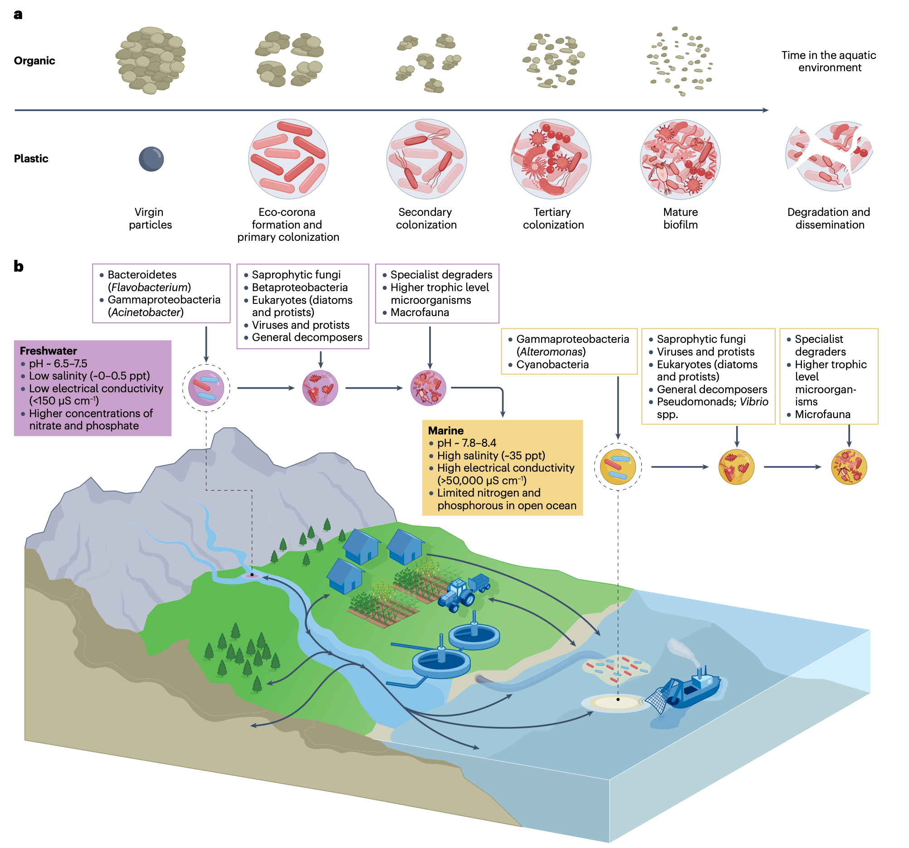
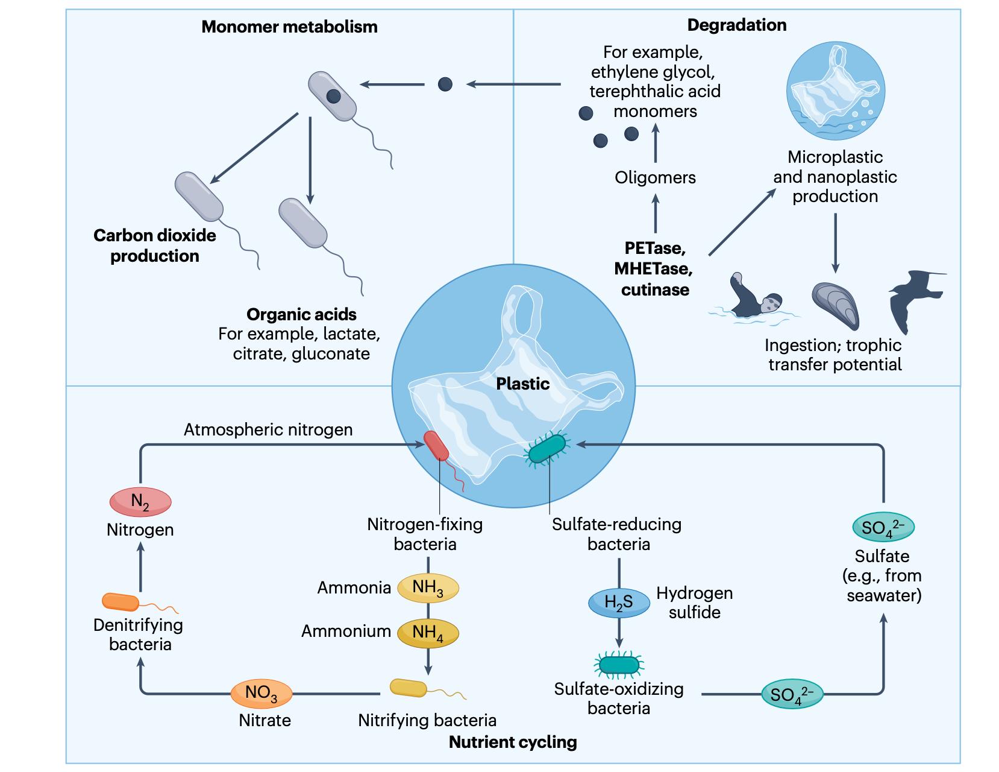
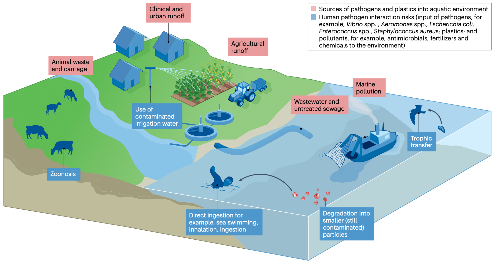
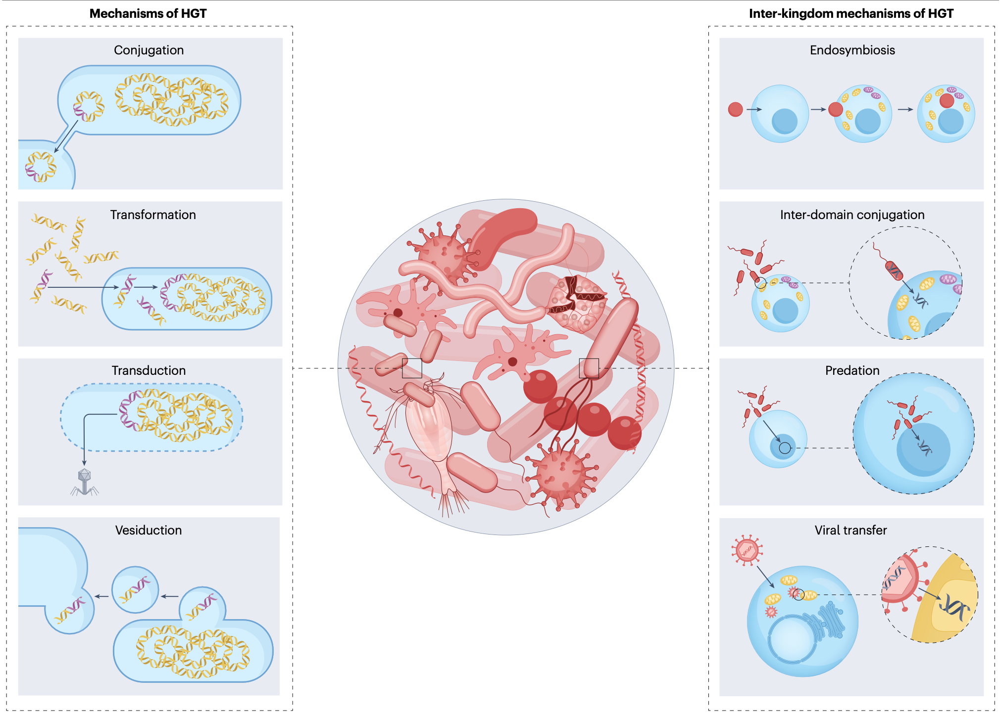
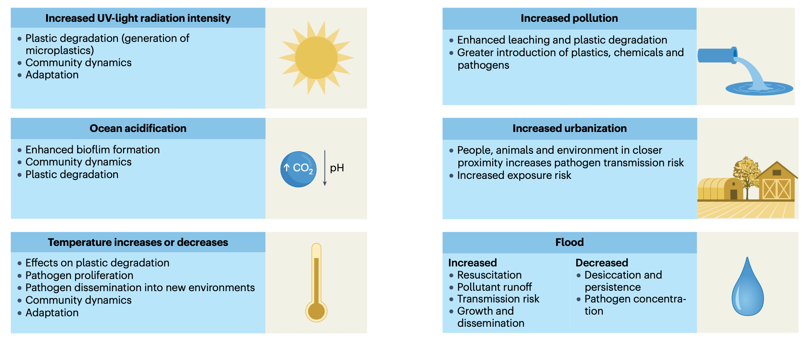
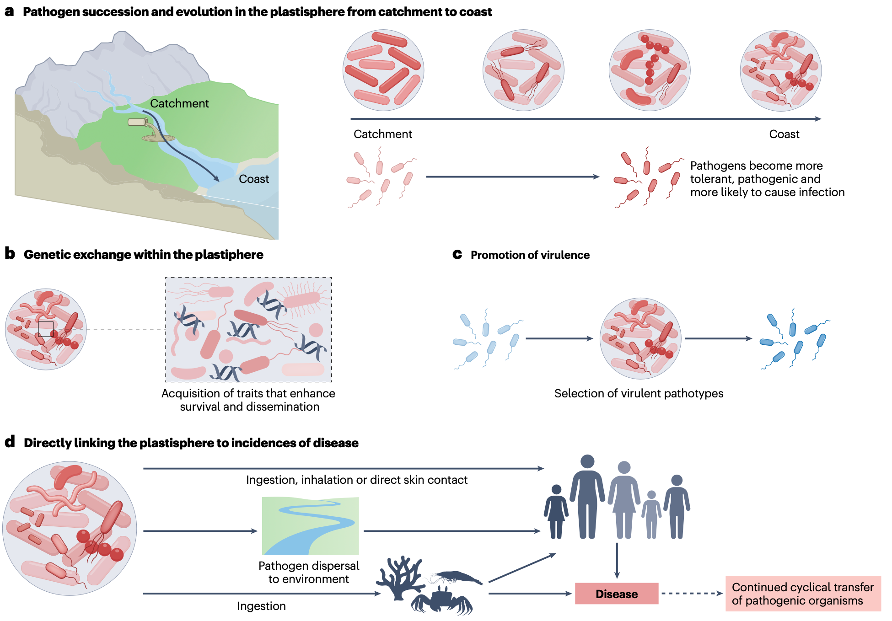

## 背景
每年估计有1900至2300万吨塑料进入河流、湖泊和海洋。与有机物不同，塑料碎片可在环境中持续存在数十年甚至数百年，其表面迅速转变为一个被称为“塑料际”的活的、可移动的生态系统。这一概念最初指海洋塑料碎片上的生物膜群落，现已扩展至包括淡水、土壤和大气等各种生态位中的塑料相关生物膜。塑料的特定性质（如浮力、持久性和表面化学特性）使其区别于水生环境中的天然基质，影响了微生物的附着、相互作用和存续。因此，塑料际代表了一个新颖的、人为制造的、全球分布且处于不断变化中的移动生态位。

过去十年的研究主要集中于描述塑料际的群落组成。然而，新技术的应用正在推动对该生态位功能性状及驱动其群落组装和功能的相互作用的理解。这揭示了一个复杂的相互作用网络，包括非生物因素、材料特性以及本土和外来微生物的输入。塑料际群落可以贡献于关键的生态系统过程，如氮、硫循环和污染物生物修复。同时，塑料经常通过废水排放和农业径流接触病原体和抗生素抗性基因，使塑料际成为新型强毒力、高抗性病原体进化的热点。塑料的浮力和持久性增强了塑料际的扩散潜力，可能创造新的暴露途径并放大潜在的公共卫生问题。高分辨率组学技术揭示了以往隐藏的类群、移动遗传元件和跨界的代谢相互作用。对生态驱动因素、生物化学转化和共选择过程的机制性理解表明，塑料际不再仅仅是一种奇观，而是一个可通过实验研究、且与政策相关的微生物栖息地。

- Ormsby, M. J., & Quilliam, R. S. (2026). The aquatic plastisphere: ecology, pathogen dissemination and antimicrobial resistance. *Nature Reviews Microbiology*. https://doi.org/10.1038/s41579-026-01301-2
- 期刊：Nature Reviews Microbiology （IF=103.3）
- 发表时间：2026年4月2日（在线发表）

本文全面综述了水生环境（包括淡水和海洋）中塑料际的研究进展。塑料际的群落组装始于塑料表面“生态电晕”的形成，随后经历可预测的演替过程。其组成和功能受到塑料聚合物特性、环境条件（如温度、盐度、紫外线）和生物相互作用（如竞争、捕食）的共同塑造。尽管塑料际与天然基质上的生物膜存在一定的分类学重叠，但其独特之处在于功能性状的选择，特别是作为人类病原体和抗生素抗性基因的储存库与传播载体。塑料际生物膜的高细胞密度、胞外聚合物基质的保护作用以及塑料表面吸附的亚抑制浓度抗生素等化学压力，共同创造了有利于水平基因转移和抗性进化的条件。气候变化预计将通过改变温度、紫外线辐射、盐度和水文模式，进一步影响塑料际的群落动态，并可能加剧其相关的公共健康风险。本文强调，需要采用“一体化健康”视角，将研究重点从描述性生态学转向机制性、可预测的框架，以应对塑料污染与气候变化交织带来的日益严峻的挑战。

## 塑料际的生态学
### 群落组装与演替
塑料颗粒进入水体后，其表面会迅速吸附溶解性有机物，形成一层“生态电晕”。这层有机膜改变了塑料的表面化学性质，为微生物定殖提供了基础。微生物在塑料表面的定殖遵循可预测的模式：表面调节、浮游细胞的可逆附着、细胞不可逆附着并产生胞外聚合物、最终成熟为结构复杂的生物膜。早期定殖者通常是能够快速利用新近可用有机质的富营养型类群。在海洋系统中，交替单胞菌属等γ-变形菌常主导初始阶段；而在淡水系统中，与陆地或废水输入相关的类群（如不动杆菌属、黄杆菌属）更为常见。随着时间的推移，光合自养生物和异养生物相继出现，群落的代谢功能也从快速周转不稳定的有机物转向更复杂的聚合物转化、营养循环和次级代谢。

塑料际的发展并非单向过程。微生物活动、胞外聚合物的沉积和表面化学性质的改变可以影响塑料的浮力、破碎速率和污染物吸附能力，从而重塑塑料颗粒的传输路径和潜在的人类暴露风险。这种双向反馈循环强调了为何不能将塑料际的特征仅仅理解为微生物群落的属性，因为它的存在主动决定了塑料在水生系统中的存续、分布和风险特征。

### 塑造塑料际的因素
塑料际群落的组成和功能受到外在环境条件（如环境温度、紫外线暴露、盐度）和内在因素（如聚合物特性、微生境可用性）的动态相互作用的共同塑造。聚乙烯和聚丙烯往往比聚苯乙烯等塑料支持更高的微生物多样性，这可能与影响微生物附着和生物膜形成的固有表面特性有关。风化塑料表面粗糙，裂纹增多，比表面积增大，更容易形成稳定的微环境，庇护微生物免受紫外线辐射和湍流等环境压力。

聚合物类型、塑料添加剂和生态电晕的组成可以极大地影响初始定殖动态。例如，在海洋环境中，假交替单胞菌属、盐单胞菌属和部分弧菌属被认为在聚乙烯和聚丙烯上富集；而在河口环境中，聚乙烯对苯二甲酸酯表面则优先被希瓦氏菌属和海洋杆菌属定殖。然而，也有相反的证据表明，聚合物类型对微生物群落组成没有一致性的影响，外在环境条件往往是主要决定因素。塑料的颜色和不透明度可以影响光透射和表面加热，间接影响光合自养生物的招募。捕食、病毒裂解以及微生物间的竞争或促进等生物相互作用，进一步重塑了塑料际的群落轨迹。

### 塑料际与天然基质生物膜
塑料际在多大程度上代表了一个真正区别于天然基质生物膜的新生态系统，目前仍存在争论。尽管塑料际的概念源于观察到其群落与周围水柱不同，但多项荟萃分析和区域比较表明，总体的外在环境变量通常是群落结构的主要驱动因素，导致同一水体中塑料和天然生物膜之间存在大量的分类学重叠。然而，塑料际独特的环境生态学意义可能不在于其分类学上的新颖性，而在于其表面所选择的功能性状，例如抗生素抗性基因的流动性增强和高风险人类病原体的富集。因此，将研究重点从塑料际的分类学转向其功能生态学，将有助于更深入地理解这个新颖且无处不在的栖息地。

### 微生物-微生物相互作用
塑料际是一个密集的三维生物相互作用空间。胞外聚合物基质内紧密的物理接近性，放大了代谢交换、竞争、捕食和基因交换的潜力，产生了无法仅从浮游群落预测的生态结果。例如，海洋假交替单胞菌产生生物活性化合物以抑制竞争者，而假单胞菌分泌鼠李糖脂生物表面活性剂以改变表面张力和营养获取。除了直接竞争，异养纳米鞭毛虫和纤毛虫通过选择性取食丰富的类群来塑造生物膜群落的多样性。噬菌体和蓝藻噬菌体的感染和裂解减少了优势种群，并可能通过转导催化水平基因转移。这些微生物间的动态相互作用对于塑料际的局部生态功能及其公共卫生特征至关重要。

### 功能性状与降解潜力
塑料际群落通过结合生物和非生物过程主动改变聚合物表面。紫外线驱动的光氧化和机械风化引入了不稳定的官能团和表面缺陷，随后可被微生物群落进一步利用。胞外聚合物的积累和真菌菌丝渗透产生的物理压力进一步增加了局部的化学转化。

尽管水生环境不太可能支持塑料聚合物完全矿化所需的持续生理条件，但频繁报道的表面化学性质改变、抗拉强度降低和浮力变化表明，微生物活动可以产生可测量的塑料降解指标。酶解去聚合在聚对苯二甲酸乙二醇酯中得到了最充分的记录，其中细菌Ideonella sakaiensis分泌PETase和MHETase将其水解。对于聚乙烯和聚丙烯等脂肪族聚合物，烷烃羟化酶和单加氧酶在链端引入氧化基团通常是微生物作用的第一步，增加了亲水性和酶的可及性。丝状真菌和某些细菌产生的氧化酶（如漆酶、过氧化物酶和酯酶）可以转化塑料粘合剂和添加剂。重要的是，酶促作用常与非生物风化协同作用：阳光预处理聚合物，微生物解聚低聚物，生物膜的物理过程加速了脆化和机械破碎，产生次级微塑料和纳米塑料，改变了运输动力学并增加了营养级暴露。

## 塑料际中的人类病原体
使塑料成为微生物合适栖息地的特性，也为人类病原体和抗生素抗性基因的潜在运输和传播提供了新途径。尽管木材或碎屑等天然基质也为附着病原体提供了一定程度的物理保护，但塑料的持久性、移动性以及浸出液产生的化学选择压力，使其成为功能上不同的、可增强病原体存活和传播的载体。

### 病原体的识别与传播
人类病原体可通过处理或未处理的废水、城市和农业径流以及牲畜和野生动物的直接输入进入水生环境。受人类活动影响的城区和沿海地表水的塑料际群落中，持续存在与粪便和环境污染物相关的类群，例如单核细胞增生李斯特菌、大肠杆菌、肺炎克雷伯菌、不动杆菌属、沙门氏菌血清型和弯曲杆菌。弧菌属是海洋塑料际中最常检测到的病原体之一，包括几种可导致人类疾病的物种。从监管角度看，将塑料际衍生的病原体和抗生素抗性数据嵌入现有的生态毒理学终点（如哨兵物种的死亡率、生长、繁殖、免疫生物标志物和微生物组破坏），将使微生物学证据与当前用于指导环境和公共卫生政策的措施保持一致。

### 毒力基因表达与跨界驱动因素
关于塑料际环境中典型毒力决定因子一致上调的直接证据仍然稀缺。然而，受控的中宇宙和实验室研究表明，塑料和塑料浸出液可以改变模式生物中的基因表达和应激恢复力。暴露于塑料衍生的化学物质或吸附的污染物可诱导病原体的应激反应，增强其存续和耐压性。塑料际中吸附的污染物，包括重金属和残留抗生素，可以作为抗生素抗性基因富集的共选择剂。多项体外研究表明，塑料相关生物膜可以保护大肠杆菌和弧菌等病原体免受紫外线辐射和干燥的影响，显著延长其存活时间。

尽管有详细的微生物多样性分类学信息，但我们仍然缺乏对群落组成如何影响塑料际中人类病原体丰度和致病性的理解。新出现的证据表明，天然淡水和海洋环境中的塑料碎片可能被临床相关真菌（如曲霉、念珠菌、镰刀菌）定殖；同样，噬菌体以及诺如病毒和腺病毒等病毒病原体可以附着在废水流出物中的塑料颗粒上。因此，塑料在水生系统中作为稳定的基质表面持续存在，并充当跨界的接触区。

##  抗生素抗性
### 移动遗传元件作为塑料际功能的驱动因素
除了作为人类病原体的潜在储存库外，水生塑料际生物膜也是抗生素抗性存续和进化的热点，由选择压力和独特的物理条件驱动。这些功能能力以移动遗传元件为基础并受其重塑。编码降解酶的基因有时位于质粒或基因组岛上，使得降解潜力得以在塑料际类群间水平转移。同时，塑料际宏基因组持续显示附属系统的富集，如金属抗性决定因子、外排泵和酶解毒途径，使微生物能够耐受添加剂和吸附的污染物。

生物膜环境也高度有利于抗生素抗性基因的获取和水平交换。例如，1类整合子经常在铜绿假单胞菌等生物膜相关病原体中检测到，并促进了多种抗性基因盒的捕获和表达。IncP型质粒已被证明在混合物种生物膜内的革兰氏阴性菌之间有效转移，突出了表面相关生长在提高接合频率中的作用。因此，编码β-内酰胺酶、四环素抗性、磺胺类抗性和质粒介导的喹诺酮类抗性决定因子等基因，在塑料际群落中均可检测到，尤其是在废水影响水域附近采集的塑料上。

### 塑料际中的基因交换
塑料际生物膜是促进水平基因转移的动态环境，创造了比周围浮游群落更可能发生基因交换的条件。高细胞密度和任何生物膜环境中固有的紧密接近性都可以促进水平基因转移，但塑料际独特的物理和化学特性放大了这种效应。例如，接合作用在塑料际中特别增强：生物膜内紧密的细胞间接触提高了携带抗性基因的Inc型质粒的转移速率。与微塑料表面相关的细菌比自由生活的细胞或天然聚集体经历更高频率的质粒转移。塑料表面的电荷也可以影响细菌病原体中抗生素抗性基因的接合转移速率。相比之下，塑料际生物膜内转化的证据更为有限。然而，塑料的疏水表面有助于捕获裂解细胞的胞外DNA，形成一个遗传物质库。胞外聚合物基质也可能作为遗传库，通过摄取稳定的胞外DNA促进适应性性状的发展。

### 塑料际中的抗真菌耐药性
受农业径流和废水排放影响的水生环境，可能是各种抗真菌化合物的重要储存库。这些化合物容易吸附在塑料表面，这一过程可能受到塑料聚合物类型及其风化程度的影响。塑料因其高表面积体积比和持续暴露于受污染流出物，成为抗真菌化合物的有效汇。这种吸附作用有效地浓缩了选择压力，促进了耐药真菌群落在塑料污染物表面的适应、存续和增殖。塑料际内的独特条件可能进一步加速这一过程，因为生物膜基质保护真菌细胞和/或菌丝免受高剂量抗真菌药物暴露，使其能够适应低水平暴露并产生耐药性。

---

### Box 1: 一体化健康与气候变化背景下的塑料际

塑料污染的加剧与气候变化的交汇，很可能放大暴露于机会性病原体和抗生素抗性决定因子的健康风险，将塑料际转变为一个病原体出现和全球抗生素抗性传播的主要通道（见图示）。当前的气候模型预测，温度、紫外线辐射、盐度和水文模式将发生重大变化，所有这些都可能加速塑料降解，并增加致病细菌、病毒和真菌的定殖潜力。这些变化将改变塑料际的群落组成和功能，并可能加剧抗生素抗性的存续和传播。例如，温度升高可以促进嗜温和机会性病原体（如弧菌属）的生长，并增强生物膜的产生及其在塑料上的附着能力。在水生环境中，温暖的水域已在扩大致病性塑料际群落的范围，使其从热带向温带海岸扩展。这富集了以弧菌、气单胞菌和假单胞菌等为优势的群落，并增加了与毒力和运动性相关基因的表达。由于微塑料颗粒容易被双壳类滤食动物等海洋生物摄入，这为病原体进入人类食物链创造了一条潜在途径。

由于大气中二氧化碳吸收增加导致的海洋酸化，尽管塑料际生物膜能在一定程度上庇护微生物免受周围海水影响，但酸化仍可能通过改变聚合物表面电荷和生态电晕化学来改变定殖动态。日益严重的污染和更高水平的城市化（这迫使人类、动物和环境更紧密地接近），进一步促进了病原体从塑料际传播的能力，并增加了人类暴露于塑料衍生化学物质和浸出物的可能性。随着塑料际内的微生物群落适应和响应气候变化而进化，它们在营养循环、污染物降解和病原体动态中的作用可能会发生重大改变。塑料表面易浸出的添加剂引入了额外的化学压力源，可以扰乱微生物群落，并与金属和杀菌剂等共存污染物相结合，可能产生与抗生素抗性相关的选择压力。最后，洪水等环境极端事件将增加污染物径流和微生物复苏，而干旱则可能将塑料际内的持久性病原体浓度提高。因此，塑料际可能正成为一个汇聚点，在这里，气候驱动的塑料降解与抗生素抗性相互交织。除了这些公共健康风险，塑料际也促进了气候强迫：塑料聚合物的微生物分解会产生挥发性有机化合物，并可以促进沉积物中富集的硝化细菌和反硝化细菌产生局部的一氧化二氮。因此，气候引起的温度和pH值变化对塑料的影响将进一步削弱其生态系统服务功能，并加剧环境污染。

### Box 2: 深化我们对“致病性塑料际”的理解

为了推进对塑料际相关风险的理解，研究问题需要聚焦于塑料在水生环境中如何作为病原体传播的载体、如何促进遗传适应以及如何构成公共健康风险。一个主要的研究重点是塑料际在跨越多样的水生生态系统（从内陆流域到沿海地带）运输病原体中的作用。塑料为微生物提供了持久的基质，使病原体能够克服通常限制其分布范围的环境障碍，并促进其在环境中的传播。这可能推动选择出能更好地适应多变水生栖息地的更强毒力菌株。了解塑料相关病原体如何从流域迁移到海岸，对于评估塑料污染的生态和流行病学影响至关重要。

塑料际使得包括毒力基因和抗生素抗性基因在内的遗传物质能够在原本可能不会相互作用的物种间共享。尽管基因交换研究已取得进展，但对塑料际相关微生物中水平基因转移的具体机制（如接合、转导和转化）进行更深入的探索仍是必要的。生物膜形成和塑料上存续等因素，可能揭示塑料际如何促进多重耐药性和高毒力病原体进化的途径。有证据表明，塑料表面可以诱导微生物群落发生表型变化，促进与毒力和存续相关的性状。塑料上的病原体可能发展出更强的表面附着能力、生物膜产量和应激耐受性，使其能够适应不同于其自然栖息地的条件。此类适应可能选择出高毒力表型，从而潜在地增加对宿主生物的致病性。未来的研究应侧重于阐明这些变化背后的分子机制，包括基因表达和应激反应通路。

尽管关于塑料际与病原体关联的报道很常见，但将这些病原体与疾病传播直接联系起来的证据仍是关键缺口。未来的研究必须转向机制性实验，将定殖与改变的宿主感染性和公共健康风险减缓联系起来。这需要在全球监测中实施标准化的哨兵塑料监测协议，将定量微生物风险评估框架整合到真实的暴露风险评估中，并利用全球政策协议将此议题提请决策者关注，以实施有针对性的健康干预。解决这些差距将加深我们对塑料际作为一种新型生态位的理解，及其在病原体动态、抗生素抗性和日益加剧的塑料污染背景下的公共卫生重要性。

---

## 讨论
水生塑料际代表了塑料污染物、微生物群落和环境健康之间的关键界面。它给淡水、河口和海洋生态系统带来了重要的一体化健康挑战，因为塑料既作为物理污染物，又作为移动载体，促进了人类和动物对机会性病原体和抗生素抗性决定因子的暴露。此外，日益加剧的塑料污染与气候变化的交汇可能会放大这些风险，可能加剧病原体的出现并通过水生途径扩大抗生素抗性的全球传播。

塑料际研究的下一前沿需要从纯粹描述性的清单转向机制性模型，这些模型能够将演替、功能性状、病原体和抗生素抗性的出现联系起来，并实现可预测的生态和基于风险的框架。重要的是，这些模型还必须跨尺度运作：即从塑料表面的分子和化学过程，到群落水平的演替和跨界相互作用，到对营养循环和运输的生态系统尺度影响，最后到监测和临床风险评估中的一体化健康结果。微生物学处于独特的地位，可以量化塑料际是微不足道的奇观，还是抗生素抗性和病原体生态学的变革驱动者。

为有效应对塑料际带来的风险和机遇，未来研究需要优先加强对这一新型栖息地的机制性和生态学理解。我们主张更加关注水平基因转移的机制，包括塑料际中的跨界相互作用，以便追踪抗生素抗性和毒力性状在环境与致病物种之间的移动。然而，我们必须从仅仅识别基因的存在转向确认其功能表达，以更准确地评估塑料际的公共健康风险。标准化方法对于研究间的稳健比较至关重要。所有这些方法都需要与开发和验证模型相辅相成，这些模型应结合在塑料表面观察到的特定富集因子和转移速率，以超越危害识别，发展定量风险评估。

## 结论
塑料际是一个复杂的、由生物和非生物因素共同塑造的微生物栖息地，它不仅改变了塑料污染物自身的环境归趋，更成为了病原体存续、进化和抗生素抗性基因传播的关键节点。气候变化作为新的压力因素，预计将通过与塑料污染协同作用，进一步放大相关的生态与健康风险。当前研究已从描述群落组成进入探索功能机制的阶段。未来亟需采用标准化的监测与实验方法，结合多组学技术和模型预测，在“一体化健康”框架下，深入阐明塑料际在环境病原体循环和抗性传播中的具体作用机制，从而为全球塑料污染治理和公共卫生政策制定提供坚实的科学依据。
