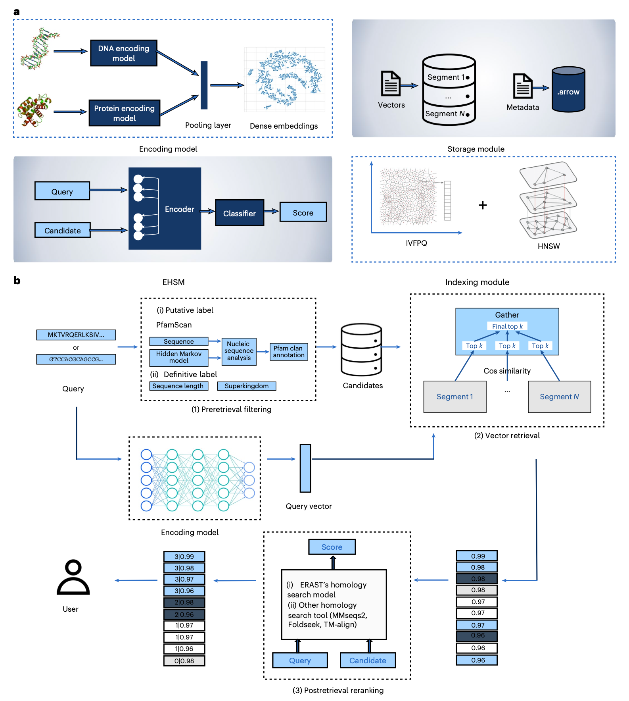
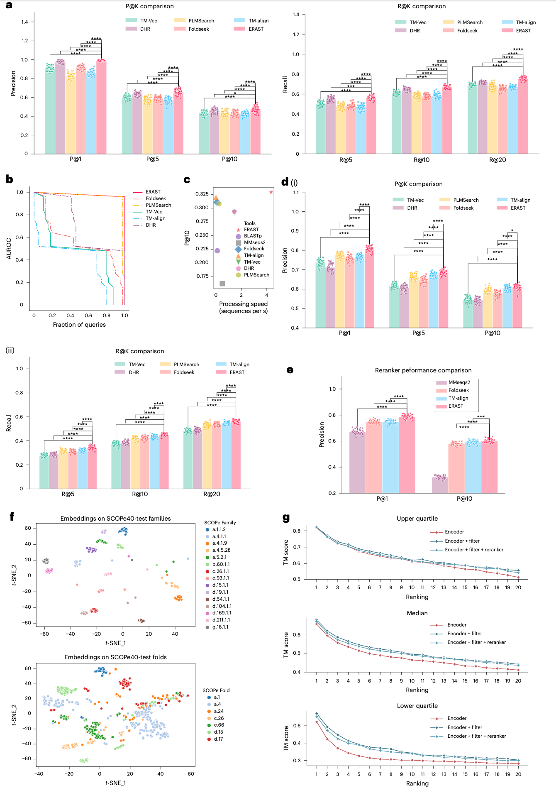
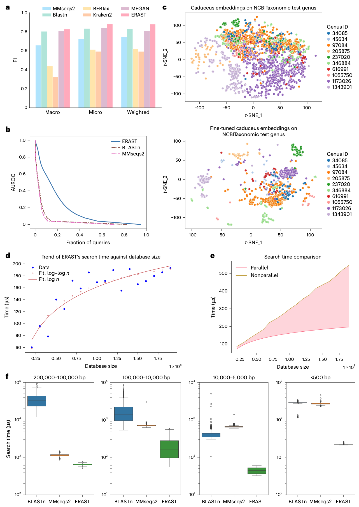
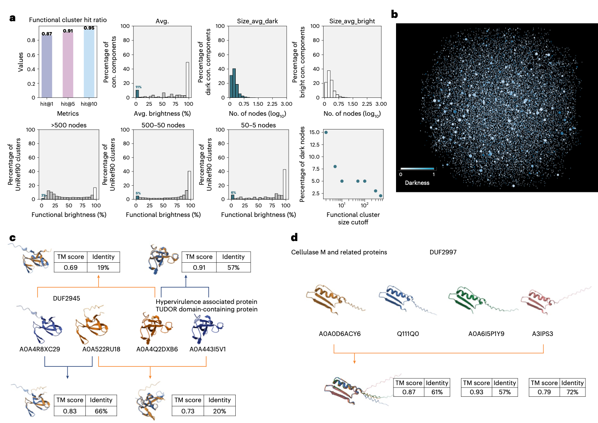

## 背景
同源性搜索是现代分子生物学的基础，对于识别具有共同祖先和可能类似功能（同源物）的序列至关重要。对新生物序列进行特征分析的第一步通常涉及执行同源性搜索，这使得该过程在生物信息学中不可或缺。传统的工具如BLAST、PSI-BLAST和FASTA在这一领域被广泛使用，它们使用启发式方法来加速局部比对搜索。为了提高灵敏度，尤其是在检测进化关系较远的同源序列时，基于结构的方法如CLE-SW、Foldseek、CE、Dali和TM-align被引入，以提供更有效的远距离同源序列检索。

尽管如此，同源性搜索仍面临两大主要挑战：首先，生物数据库的巨大规模构成重大障碍。在宏基因组学中，蛋白质序列数据库通常包含超过1亿条序列，其中最大的MGnify包含超过24亿条宏基因组序列。类似地，核苷酸序列数据库通常也超过10亿条序列。其次，高精度序列搜索方法的成本仍然高昂。例如，Foldseek等工具需要预先获得所有被分析蛋白质集合的结构信息。然而，对于缺乏预测结构的大规模宏基因组学蛋白质序列库而言，高精度结构预测的成本仍然令人望而却步。此外，现有的同源核苷酸搜索工具在处理长序列时速度缓慢。

为了应对同源性搜索的挑战，构建大规模向量数据库是一种有前景的解决方案。向量数据库使用嵌入向量在连续向量空间中表示序列，通过高效的向量操作和索引技术实现加速的相似性搜索。这种方法使得无需进行昂贵的序列比对即可检索相似序列。然而，构建和维护如此大规模的生物序列向量数据库，面临着表示质量、基础设施、索引效率、动态更新以及与现有工具兼容性等多重挑战。为解决这些难题，作者提出了ERAST及其配套的亿级向量数据库。

- Jiang, Y., He, B., Wu, Z., Wang, F., Lv, T., Jia, Y., Zhao, Y., Qin, C., Chen, H., Zhang, Q., & Yao, J. (2026). Scalable homology detection with ERAST. *Nature Biotechnology*. https://doi.org/10.1038/s41587-026-03051-1
- 期刊：Nature Biotechnology (IF=41.7)
- 发表时间：2026年4月1日（在线发表）

本研究介绍了一种高效的检索增强比对搜索工具ERAST。该工具旨在处理包含约10亿条生物序列的超大规模向量数据库，这是目前已知最大的生物序列向量数据库。ERAST结合了大语言模型和向量数据库技术，通过整合检索前过滤、向量检索和检索后重排序三个优化阶段，显著提升了搜索质量，并同时支持核苷酸和蛋白质序列的搜索。借助先进的索引技术、细粒度分段和元数据整合，ERAST在精度上超越了现有方法，其运行速度比Foldseek快约50倍，比TM-align快约50,000倍。这种卓越的性能使得ERAST能够在毫秒内对数十亿条生物序列进行精准搜索。此外，基于ERAST的全局相似性聚类揭示了大量功能未知蛋白质的潜在进化关系，为功能注释提供了新见解。集成了ERAST的向量数据库可通过 https://ai4s.tencent.com/erast 公开访问。

## 方法
### 数据来源
为构建向量数据库，研究人员从多个公共数据库采集了超过10亿条生物序列，包括：UniParc（包含超过8.07亿条蛋白质序列）、UniRef90（包含超过1.9亿条蛋白质序列）、UniRef50（包含超过5910万条蛋白质序列）、Swiss-Prot（包含超过57.2万条经注释的蛋白质序列）以及RefSeq（包含超过3000万条来自古菌、细菌、真菌和病毒的核苷酸序列）。

### 向量数据库构建
构建向量数据库的第一步是将原始序列基于预训练语言模型转换为连续的向量表示。对于蛋白质，作者比较了多种预训练蛋白质语言模型，最终选择ESM2作为编码模型，以增强对远距离同源蛋白质的召回率。通过应用平均池化层提取最终的蛋白质表示。对于核苷酸序列，为应对超过10,000个碱基对的长序列挑战，作者采用了长程语言模型MAMBA的变体Caduceus作为主干网络。通过在NCBI分类数据集上进行微调，使其能够准确编码核苷酸序列。

为了实现包含超过1亿个稠密向量的数据库的快速准确搜索，作者集成了一个在精度和速度间取得平衡的索引算法。基于经验和实际应用，作者选择了倒排文件与乘积量化相结合的方法，并辅以分层导航小世界算法来组织和存储向量表示。为应对可扩展性问题并加快查询响应时间，作者根据从UniProt下载的数据的固有长度顺序，将数据库划分为多个段，每个段包含1000万个样本，并为每个段构建索引。与向量数据库相关的元数据以Arrow格式存储，该格式特别适合高效存储和流式传输超大规模异构数据集。

### ERAST框架

如图1所示，ERAST将数据检索过程模块化为三个阶段：检索前、检索和检索后，并在每个阶段应用多种策略以提升检索质量。

**检索前过滤**。此阶段的主要重点是优化原始查询，通过添加元数据来过滤不相关数据。元数据过滤是基于具体元数据限制搜索空间的方法，可极大提升检索到的同源序列的质量。对于蛋白质，元数据可能包括输入序列长度或由PfamScan注释的Pfam家族标签等参数。对于核苷酸序列，元数据可以是分类标签，如超界。通过加入元数据过滤，ERAST能更有效地识别最相关的候选序列，从而获得更高质量的搜索结果。

**向量检索**。在收到用户查询后，ERAST使用与向量数据库构建阶段相同的编码模型，将查询转换为向量表示。随后，它计算查询向量与检索前阶段过滤出的候选向量之间的相似性得分（基于余弦距离）。为了进一步加快对大型数据库的搜索，作者实施了多线程搜索策略。在向量数据库构建阶段划分的每个段都进行并行检索和候选选择。最终比较跨段的候选序列，并根据最高相似性得分进行选择。

**检索后重排序**。在生物信息学中，准确搜索同源生物序列，特别是具有远距离进化关系的序列，仍是一个持续挑战。过去的研究常常侧重于增强编码模型，但当应用于向量数据库时，每次编码器模型更新都需要对数千万条序列进行重新编码，这会带来巨大的开销。在本研究中，作者对检索到的候选序列进行重排序，优先排列最相关的序列，以提升同源生物序列的搜索质量。为了重排序检索到的候选序列，作者设计了一个名为ERAST同源性搜索模型（EHSM）的评分模型，用于评估查询与目标序列的关系，并根据其分数对它们重新排序。此外，重排序模块被设计为可插拔的，允许灵活集成。ERAST支持多种高效的重排序策略以提升精度。具体而言，除了EHSM，ERAST还支持其他同源性搜索方法，如MMseqs2和TM-Align，为用户提供多样化的检索后重排序选择。

## 结果
### ERAST在蛋白质同源性搜索中精度超越现有方法

在同源蛋白质搜索方面，作者通过将ERAST与多种方法（包括两种序列搜索方法MMseqs2、Blastp，三种基于结构字母表的搜索方法CLE-SW、Foldseek和Foldseek-TM，三种基于结构比对的搜索方法CE、Dali和TM-align，以及三种深度学习方法TM-Vec、DHR和PLMSearch）进行比较，评估了其灵敏度。

在SCOPe40-test数据集（2,207个蛋白质，4,870,849个查询-目标对）上进行的“全部-对-全部”搜索测试显示，ERAST显著优于所有现有先进方法，P@1指标比TM-Vec提高了6.9%，比DHR提高了10.1%，比PLMSearch提高了2.9%。与最广泛使用的快速、准确的基于结构的方法Foldseek相比，其平均水平的P@1高出3.3%，同时速度提高了50倍。此外，ERAST还能够搜索高度远距离的进化关系。

为评估ERAST在分布外序列上的性能，作者与TM-align、Foldseek、TM-Vec、PLMSearch和DHR这五种先进同源性搜索工具在从SwissProt-Pfam派生的专用OOD数据集上进行了对比测试。ERAST在所有评估指标上均表现出卓越的灵敏度，其平均AUROC曲线比TM-align高出62.2%。ERAST在所有基线方法上均取得了统计上显著的改进，证实了其在分布偏移情况下的增强鲁棒性。

为评估检索前过滤和检索后重排序策略的有效性，作者进一步比较了不同搜索设置下，ERAST检索到的结构与查询结构之间的TM得分。结果显示，预训练的蛋白质语言模型能在家族层面捕获蛋白质的底层结构，但在折叠层面难以区分蛋白质。在检索前过滤的帮助下，搜索结果的整体质量得到提升。此外，EHSM在检索后阶段进一步提升了顶部搜索结果的质量。通过检索前过滤和检索后重排序的结合，ERAST平均水平的P@1从0.741提高到了0.821。即使在应用相同过滤器的条件下，ERAST仍然优于所有基线方法，证实了其优势不仅源于过滤步骤，还源于预过滤器和检索后重排序器的协同整合。

### ERAST在核苷酸同源性搜索中表现优异
在同源核苷酸序列搜索方面，作者比较了ERAST、两种序列搜索方法MMseqs2、BLASTn以及三种序列分类方法BERTax、Kraken2、MEGAN。作者在构建的远距离相关数据集上进行了分类测试。ERAST显示出相对于其他方法的明确且一致的优势。此外，ERAST在所有分类学层级上也优于两个代表性分类器Kraken2和MEGAN，实现了更高的精度和召回率。为评估核苷酸序列编码器（基于Caduceus微调而来）的有效性，作者进一步比较了不同搜索设置在属一级的准确性。结果显示，微调后的核苷酸序列编码模型学会了在属一级区分核苷酸序列，其微平均精度在属一级从0.507提高到了0.805。

### ERAST在毫秒内搜索十亿条生物序列
借助稠密向量和索引量化技术，ERAST在包含UniParc、UniRef90、UniRef50和RefSeq的十亿级向量数据库上实现了毫秒级搜索速度。

作者首先在SCOPe40-test数据集上比较了不同方法的“全部-对-全部”搜索总时间。如图2c所示，无重排序器版本的ERAST利用其优化的基于向量的搜索，在速度和精度上均超越了现有的同源性搜索方法。与基于结构的方法相比，ERAST的搜索速度比Foldseek快50倍，比TM-align快50,000倍，同时提供更好的精度。

为了进一步展示ERAST在搜索速度上相比其他处理长核苷酸序列的工具的优势，作者从RefSeq数据库中随机采样了2000条不同长度范围的序列进行比较。“全部-对-全部”搜索显示，ERAST在所有长度上都最快：对于>100,000 bp的序列，比BLASTn快60倍，比MMseqs2快2倍；对于<500 bp的序列，分别比BLASTn和MMseqs2快13倍和12倍。最后，作者展示了将生物向量数据库扩展到十亿级样本的能力。测试显示，在不使用并行搜索时，复杂度为O(n)，但采用作者的并行策略后，可改进为O(log n) - O(log log n)，使得ERAST能够在毫秒内查询（10亿，1280维）的数据库。

### 利用ERAST全局聚类阐释蛋白质功能
虽然UniRef50和UniRef90是基于局部相似性（使用MMseqs2）对UniRef100序列进行聚类构建的，但作者通过使用ERAST对UniRef50和UniRef90应用全局相似性聚类，构建了功能簇，显示了ERAST在阐明蛋白质功能方面的潜力。在UniRef90中所有没有已知功能的“暗”簇中，94%在生成的网络中连接到具有已知功能的“亮”UniRef90簇，为超过1.58亿个独特蛋白质揭示了潜在的进化关系。

作者通过针对1990万个UniRef90目标测试1000个查询来验证聚类效果。结果显示，大多数查询蛋白质成功识别出共享相同功能簇标签的目标蛋白质，其accuracy@10达到0.95。基于聚类方法的有效性，作者应用转移注释来研究包含不同比例“暗”蛋白质的簇。结果发现了新的潜在关联，例如，功能簇2527（暗度0.665）将未表征的DUF2945蛋白与TUDOR结构域调控蛋白关联起来，结构比对显示尽管序列一致性低于30%，但TM得分>0.6，表明DUF2945可能与TUDOR结构域蛋白具有相似或相关的生物学作用。类似地，功能簇276（暗度0.975）几乎全是“暗”蛋白，其中大多数暗蛋白被注释为DUF2997，而亮蛋白被注释为纤维素酶M及相关蛋白，随机选择的代表之间的结构比对揭示了暗成员和亮成员之间的高度相似性，表明DUF2997可能与纤维素酶M及相关蛋白有关。

为评估ERAST发现“暗”蛋白质功能的能力，作者将其和三种基线方法（DHR、TM-Vec、PLMSearch）应用于一个模拟数据集，其中25%的蛋白质功能被掩盖。ERAST实现了最高的平均命中率（0.917），优于DHR、TM-Vec和PLMSearch。这些发现突显了ERAST在实现大规模生物数据探索中的关键作用，否则这些数据将不切实际进行分析。即使在以未表征蛋白质为主的簇中，与少数已注释成员的相似性也能产生传统序列搜索会遗漏的可检验假设，证明了基于向量的聚类结合高速搜索对现代生物学发现的力量。

## 讨论
在本研究中，作者介绍了ERAST，一种旨在实现准确、可扩展生物序列搜索的高效检索增强比对搜索工具。通过一系列实验，作者证明了ERAST在蛋白质和核苷酸序列搜索的精度和速度上均优于现有的先进搜索方法。研究结果表明，ERAST能够在数秒内处理数百万个查询-目标生物序列对，使其成为当前最快、最准确的同源性检测工具之一。通过提高可扩展性和可解释性，ERAST增强了以更大置信度检测同源蛋白质的能力，这对于理解分子进化、药物发现、疾病诊断和基因工程等各个领域的进展至关重要。

深度学习方法（ERAST、PLMSearch、DHR）与传统工具（Foldseek、MMseqs2、TM-align）存在根本区别：前者基于标注数据进行训练，而后者不依赖于数据集特定的训练，而是依赖于手工设计的评分函数或结构比对启发式方法。为确保公平性，作者在OOD数据集上评估了所有方法以测试对新结构的鲁棒性。结果揭示了两种范式：DHR通过海量训练数据实现了最佳OOD性能，而PLMSearch在其训练域（SCOPe40-test）上表现出色。ERAST通过架构创新匹配了这种鲁棒性——集成了一个可自适应优化候选序列的检索前过滤器和检索后重排序器，而非仅仅依赖于数据规模，这提供了一种更具可扩展性、数据高效性的替代方案。关键的是，ERAST通过仅在新OOD数据上重新训练其轻量级重排序器，实现了高效更新，避免了昂贵的编码器重新训练和数据库重新嵌入。这确保了大规模数据库的实时适应性。

除了序列搜索，ERAST还实现了对数十亿蛋白质的大规模功能聚类，揭示了功能未知蛋白质与特征明确蛋白质之间的新关联。未来，作者计划通过纳入更多生物学上关键的序列类型来增强ERAST的生物向量数据库，包括抗体序列、抗体-抗原复合物以及其他蛋白质-蛋白质相互作用。这种扩展将拓宽ERAST在免疫学、疫苗开发和抗体工程等关键领域的实用性，其中高通量、精确的序列搜索至关重要。具体来说，ERAST的应用范围可以扩展到搜索与已知疾病相关变异功能相似的序列，加速罕见疾病的诊断和癌症panel中意义未明变异的解释。此外，应用ERAST识别具有共享抗原特异性的T细胞受体和B细胞受体，并基于结合潜力进行聚类，将有助于跟踪感染、疫苗接种和癌症中的抗原特异性免疫反应，并发现保护相关性。将这些多样化的生物实体整合到ERAST的数据库中，最终将把它转变为一个更强大、更多功能的基础研究和临床应用工具。

## 结论
本研究开发了ERAST，这是一个创新的、基于检索增强策略的生物序列同源性搜索框架。其核心是构建了全球最大的、包含超过10亿条序列的生物向量数据库。ERAST通过检索前过滤、高效向量索引和检索后重排序的三阶段优化流程，在保持毫秒级搜索速度的同时，实现了对蛋白质和核酸序列同源性检测精度的大幅提升，显著超越了现有方法。此外，基于全局相似性的聚类能力为大规模功能注释和“暗蛋白质”的功能推测提供了新途径。ERAST的成功开发，为解决后基因组时代海量生物序列数据的快速、精准分析这一核心挑战提供了强有力的工具，并有望推动包括进化生物学、结构预测、药物发现和精准医疗在内的多个研究领域的发展。
