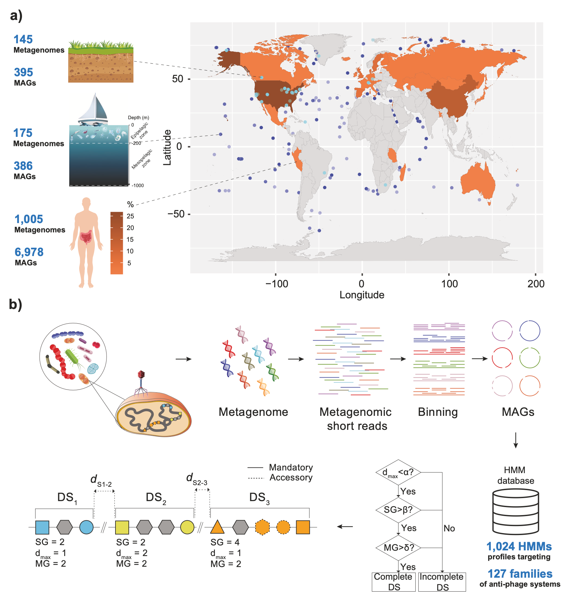
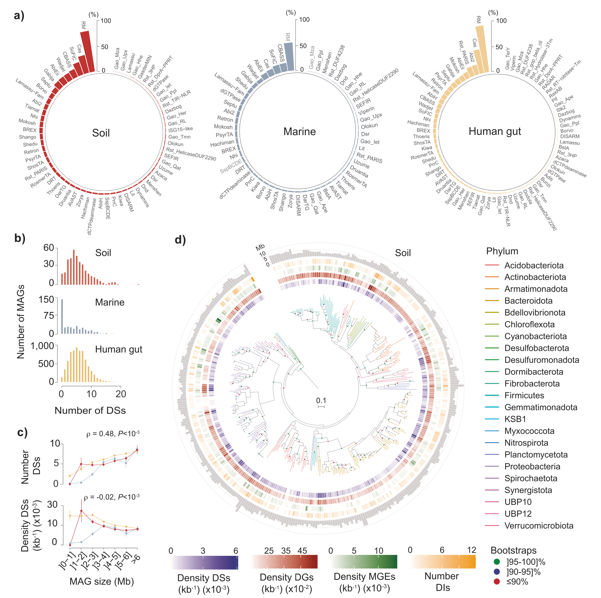
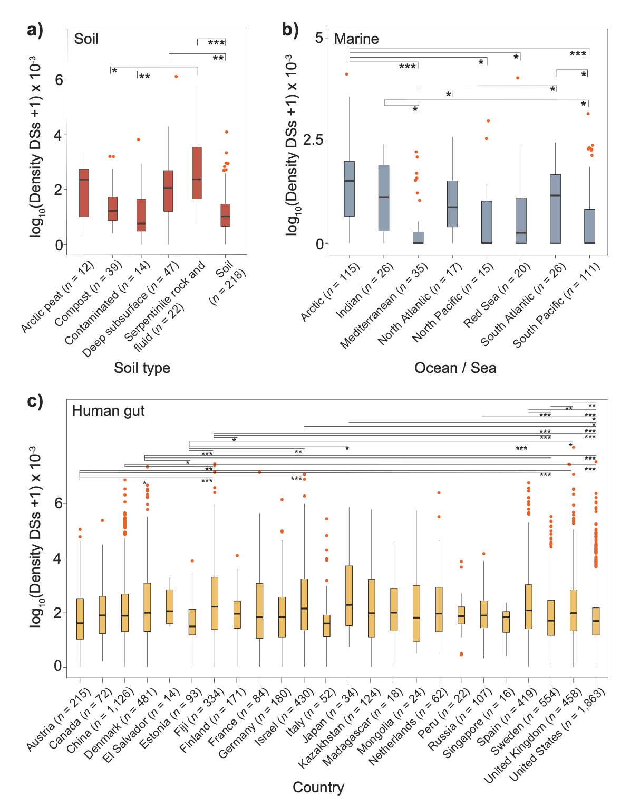
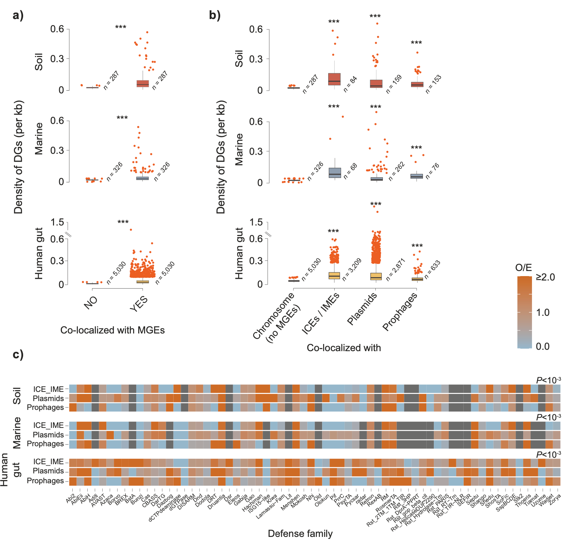
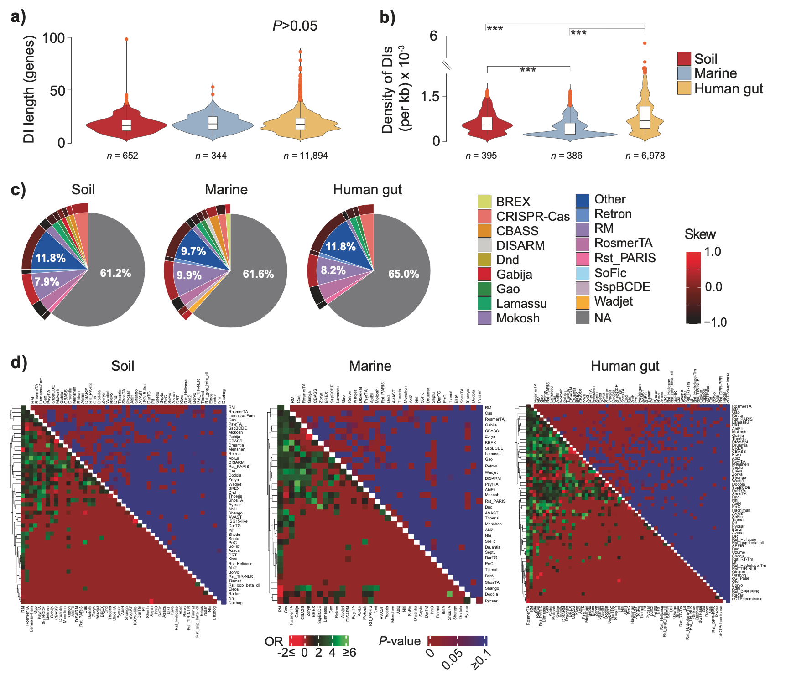
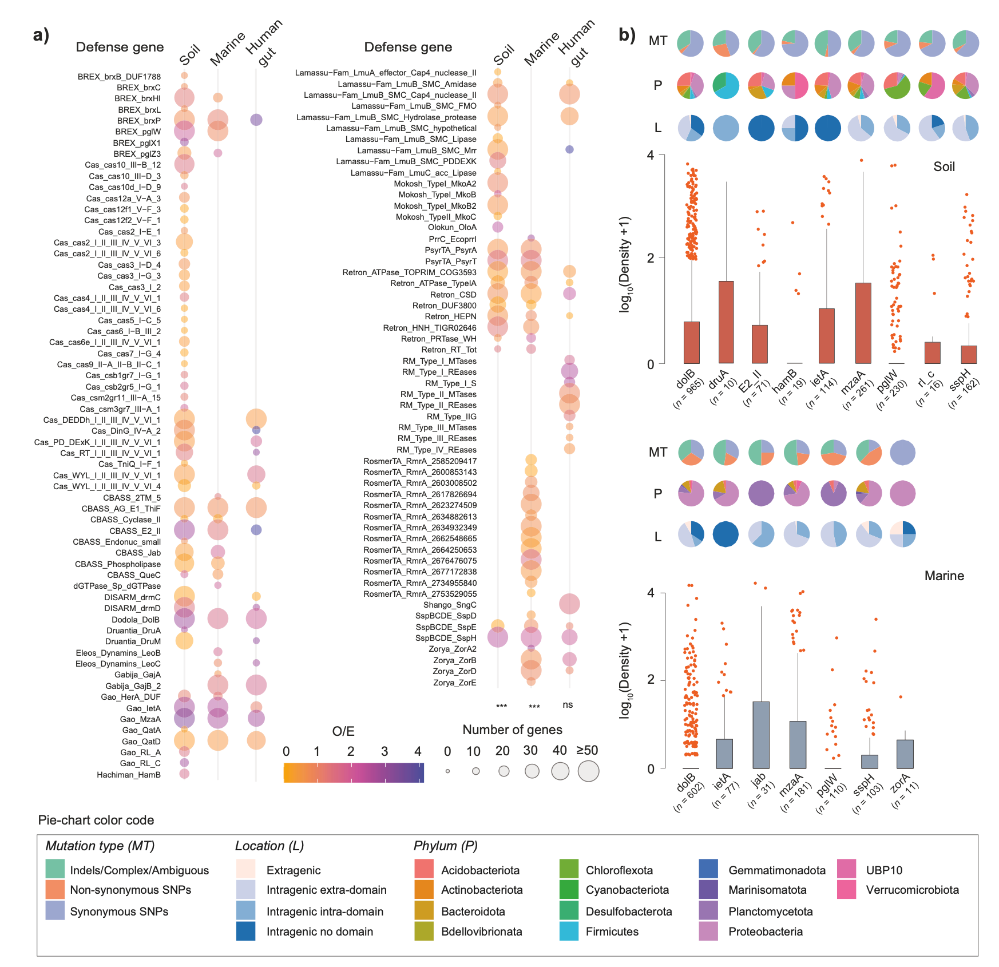

## 背景
细菌持续面临包括噬菌体在内的各种遗传寄生元件的感染威胁。作为对这种持续选择压力的响应，细菌进化出了多种复杂的防御机制，不仅能抵御病毒，还能通过水平基因转移调节遗传元件的流动。细菌防御系统的完整集合可被称为其“防御组”。目前已有多种细菌防御系统被发现，主要可分为先天免疫（非特异性）和适应性免疫系统两大类。典型的先天免疫系统包括限制修饰系统、流产感染系统，而适应性免疫则以CRISPR-Cas系统为代表。近年来，通过生物信息学工具（如DefenseFinder, PADLOC）进行的系统化绘图工作，极大地推动了防御系统的发现。然而，这些研究主要基于参考基因组数据库，而这些数据库过度代表了可培养的细菌（尤其是人类病原体），忽略了环境中占绝大多数的未培养微生物的多样性。

据估计，当前地球微生物组包含约5×10^30个原核细胞，分布在从深海到土壤的多种环境中，其中99%的微生物尚未被培养。与此同时，生物圈中估计存在约10^31个病毒颗粒，仅在海洋中每秒就可能发生高达10^23次感染事件。这种巨大的病毒压力很可能深刻塑造了不同生物群落中的防御组“军火库”。宏基因组组装基因组技术的进步，使我们能够不依赖培养，从复杂环境中恢复微生物的基因组草图或完整图谱，从而为研究未培养微生物的防御组提供了可能。

- Beavogui, A., Lacroix, A., Wiart, N., Poulain, J., Delmont, T. O., Paoli, L., Wincker, P., & Oliveira, P. H. (2024). The defensome of complex bacterial communities. *Nature Communications*, 15, 2146. https://doi.org/10.1038/s41467-024-46489-0
- 期刊：Nature Communications (IF 15.7)
- 发表时间：2024年3月8日

本研究对来自土壤、海洋和人肠道三个关键环境的7759个高质量细菌宏基因组组装基因组（MAGs）进行了防御组的大规模深入分析。研究观察到，防御系统的频率和性质在主要细菌门类中存在广泛差异，并与细菌的生活方式、基因组大小、栖息地和地理背景相关。防御系统的遗传移动性、在防御岛中的成簇现象以及遗传变异性具有系统特异性，并受细菌环境塑造。结果显示，海洋MAGs的防御组较为有限，而土壤和人肠道MAGs的防御组则更为丰富。防御基因在移动遗传元件（MGEs）中的密度高于染色体，且与不同MGE类型（如质粒、整合子、前噬菌体等）的关联模式在环境中存在差异。防御岛是防御基因的富集热点，其内部存在特定防御家族间的显著共定位。对防御基因变异谱的分析揭示了一个在强烈纯化选择下仍存在高频突变的子集，其突变类型受环境（种群结构）深刻影响。该研究提供了环境特异性细菌群落中多重免疫屏障的详细图景，并为后续在未培养微生物中发现新颖的防御策略奠定了基础。

## 方法
### 数据与MAGs筛选
本研究基于一个包含7759个高质量土壤、海洋和人肠道MAGs的大型数据集。这些MAGs根据宏基因组组装基因组的最低信息标准进行筛选：完整性≥90%，污染/冗余度≤5%，tRNA基因≥18个，且至少存在一类5S、16S和23S rRNA基因。为确保能准确反映多基因防御系统及防御岛的聚类情况，研究人员进一步筛选了高连续性的MAGs，主要使用N50 ≥ 100 kb的组装，并通过N50 ≥ 200 kb的数据集重复分析以控制连续性影响。

### 防御系统与基因鉴定
使用DefenseFinder工具，在MAGs中查询抗MGE防御基因/系统。研究人员参考了文献中描述的70个防御家族，将“完整的”防御系统定义为当前描述的、经实验证实具有抗MGE活性的遗传结构。防御基因则可能单独存在，或源于完整防御系统的遗传侵蚀。

### 移动遗传元件鉴定
使用多种工具对MGEs进行分类：PlasClass和PlasFlow鉴定质粒，IntegronFinder鉴定整合子，Virsorter2鉴定前噬菌体，ICEfinder鉴定整合接合元件和整合可移动元件。被多个工具同时命名的MGEs不被纳入分析。

### 防御岛鉴定
防御岛被定义为包含至少五个基因、且这些基因属于三个或以上不同防御家族的基因组区域，其中任意两个防御基因间的间隔不超过十个基因。

### 系统发育与变异分析
基于15个核糖体蛋白的串联序列构建最大似然系统发育树。通过将90个选定宏基因组的测序reads映射回其自身的防御基因序列（包括起始密码子上游200 bp区域），鉴定单核苷酸多态性和插入缺失。使用观察/期望比值评估各防御基因家族出现高频等位基因的倾向。通过计算非同义替换率与同义替换率的比值来分析自然选择的作用。

所有统计和图形分析均使用R语言完成。通过逐步线性回归评估变量对防御组丰度方差的解释作用。

## 结果
### 细菌MAGs中防御组的丰度与分布
研究人员在一个包含7759个高质量MAGs的大型数据集上进行了防御组绘图，共鉴定出43,263个防御系统和764,507个防御基因，涵盖70个防御家族。防御系统在不同环境中的分布差异显著，限制修饰系统、CRISPR-Cas和独立的SoFIC是最主要的系统。当观察防御基因的分布时，多种单独存在的基因/不完整系统普遍存在于大多数MAGs中。

防御系统数量与MAG大小呈正相关，而防御系统密度与大小呈负相关。这种趋势与基因组较大的细菌通常参与更多水平基因转移，因此需要更丰富多样的防御库的观点一致。在不同环境中，防御系统的密度差异很大，从细胞内专性共生菌中的近乎为零，到人肠道中某些类群的高密度不等。防御基因密度也存在类似变化。

逐步线性回归分析表明，MAG大小对防御组丰度有最强的直接影响，而系统发育深度也有显著但较弱的解释作用。此外，研究还发现了具有调节功能的WYL结构域和CARD样结构域与多种防御系统（如CBASS、RosmerTA等）的显著共定位，且这种模式在土壤和人肠道环境中有所不同。

### 防御组库与细菌生物地理学的相互作用
防御组的丰度和多样性与细菌的生物地理学显著相关。在土壤环境中，从蛇纹岩生态系统中恢复的MAGs具有最高的防御系统密度，这可能与该极端环境下的低细胞丰度、有限的微生物多样性及高病毒压力有关。而在受污染或常规表层土壤中，环境压力（化学物质、紫外线辐射）可能促使噬菌体-细菌相互作用从寄生转向互利共生，从而降低了防御需求。

在海洋MAGs中，来自北冰洋的基因组显示出最高的防御系统密度，这与之前在海水冰卤中观察到的高病毒接触率相符。值得注意的是，AbiEii系统在北冰洋和北极泥炭土壤的MAGs中均特别富集。相比之下，地中海MAGs的防御组丰度和多样性整体较低，可能与其寡营养条件有关。

在人肠道MAGs中，不同国家间的防御系统密度差异更为细微且难以解释，尽管微生物多样性随西方化进程而降低的趋势明确，但这并未转化为防御组清晰的地理格局。

### 细菌MAG防御组的遗传移动性
防御基因通常通过水平基因转移传播，且常由移动遗传元件介导。在本研究的所有环境中，MGEs中防御基因的密度均高于染色体（不含MGEs）。当按MGE家族细分时，无论环境如何，ICEs/IMEs与防御基因的共定位均有轻微更高的趋势。若包括整合子，则在人肠道中显示出最高的共定位密度，但由于统计效力低，需谨慎看待。

将防御基因按其所属家族进一步细分，可以评估其在各类MGE中的过表达或低表达情况。研究揭示了两个关键点：首先，无论环境如何，质粒携带的防御基因家族范围广泛，且数量普遍高于随机预期。其次，不同防御家族/MGE类别的组合模式在不同环境中具有高度异质性，反映了宿主-MGE-环境间多参数动态相互作用的结果。

### 防御岛的编码功能潜能与防御组共定位
防御基因倾向于在所谓的“防御岛”中成簇。研究人员在6217个MAGs中发现了12,890个防御岛，其大小分布在环境中相似（中位数约17个基因）。防御岛密度在海洋环境中显著较低，其次为土壤和人肠道，这与海洋MAGs防御组有限的观察结果一致。防御岛内的抗MGE成分非常多样，部分防御家族在防御岛中过表达，而另一些则低表达。值得注意的是，防御岛中约63%的基因内容未被预测具有防御功能，其COG分类主要富集于复制/重组/修复及转录相关类别。

研究人员进一步量化了防御家族在防御岛内（相比于岛外区域）的共定位频率。限制修饰系统在防御岛内与大多数其他防御家族显著共定位。相反，Menshen、Shango和Dodola等家族的基因倾向于在防御岛外共定位。有趣的是，尽管PsyrTA和Zorya等家族在防御岛中通常低表达，但其基因在防御岛内却与其他防御家族显著共定位。这些观察指出了防御岛内部分选定防御基因家族间先前未被重视的上位相互作用。

### 防御组的遗传变异性
宿主与寄生虫之间的协同进化导致了遗传多样化。为评估不同防御基因家族所受选择压力的差异，研究人员通过对防御基因进行宏基因组reads重招募，评估了其中短变异的频率和类型。

研究发现多个防御基因的SNP和插入缺失频率高于预期。其中dolB、mzaA和sspH等基因在不同环境中均属于“高频突变”子集，而druA、zorA或letA等基因则具有环境特异性。SNP和插入缺失的密度范围在不同防御基因家族间差异很大。突变类型也深受环境（及种群结构）影响，例如，海洋MAGs中的插入缺失和非同义SNP始终比土壤MAGs中更丰富。

尽管存在高频变异，对所有分析的防御基因进行的dN/dS计算表明，它们都处于强烈的纯化选择之下。然而，在某些基因（如dolB, ietA, mzaA）中，研究人员仍观察到了相对较高的序列分歧水平和正选择迹象，这些基因包含的预测功能域（如AAA+ ATP酶结构域）可能与适应性进化有关。

## 讨论
本研究首次在复杂微生物群落和三个代表性生物群系（土壤、海洋和人肠道）中对基因组/物种的防御组进行了大规模分析。结果显示，海洋MAGs的防御库有限，这可能源于多种因素：开放海洋中普遍存在基因组精简的类群、浮游生活方式的普遍性、低细胞密度、水平基因转移频率较低，以及现有防御系统HMM模型主要基于可培养细菌（与全球海洋微生物组亲缘关系较远）开发。

在更宏观的层面上，本研究结果在“一线”最丰富的防御系统（限制修饰系统、CRISPR-Cas）和识别出的家族总体多样性方面，与最近基于RefSeq基因组的研究结果定性一致。跨环境比较提供的更高粒度揭示了“二线”防御家族的偏好差异。例如，SoFIC和CBASS在约20%的土壤和海洋MAGs中存在，但在人肠道MAGs中比例显著较低（约8%）。相反，流产感染系统Rst_PARIS在20%的人肠道MAGs中存在，但在土壤或海洋环境中几乎不存在。随着防御系统丰度梯度的下降，存在着越来越多隐秘的、高度特化的、更具物种/种群特异性的系统。

防御基因在MGEs中或其附近的密度持续高于染色体，这种共定位有利于MGEs的传播，并强调了防御、宿主和MGEs三者间复杂的进化相互作用。防御家族在不同MGE类别间复杂且异质的分布，支持了防御系统可能为自身利益而“利用”MGEs的假说。

防御岛在不同环境中的大小、主要防御家族的相对丰度或“非防御”基因的顶级COG功能类别方面未显示出显著差异。尽管许多基因编码与遗传移动性相关的因子，但其他基因的功能尚不清楚。在防御岛中，多个防御家族的过表达并未转化为与防御组其余部分更高的共定位可能性，这提示了防御岛内部分选定基因家族间可能存在未被认识的上位相互作用或功能多样化。

在“红皇后”进化动力下，防御与反防御策略间的协同进化导致了持续的遗传多样化。本研究基于宏基因组reads重招募的方法，识别出了一个SNP和插入缺失频率高于预期的防御基因子集，它们在强烈的纯化选择下整体进化，但其突变类型的格局深受环境影响。对于其中一些基因，可以指出导致此类观察结果的决定因素，但对于其余基因（及其所属系统），由于缺乏足够的功能和机制认识，尚无法进行进一步有意义的推断。

需要认识到，本研究存在一些难以完全克服的限制。首先，数据集中来自不同生物群系的样本数量不平衡，且土壤和人肠道微生物组数据在地理上存在偏差。其次，使用短读长的MAG分箱方法可能会遗漏某些低丰度或难以解析的MGE家族，可能导致对防御基因在移动组中丰度的低估。第三，本研究的观察结果并不能代表所有细菌群落。尽管如此，研究中使用的严格数据集过滤、对连续性的控制以及先前对MAG大小估计准确性的验证，使研究者有理由相信，这些分析构成了对这些种群所携带的防御景观多样性及其背后复杂相互作用的合理代理。

## 结论
本研究对来自复杂环境微生物群落的高质量细菌基因组的防御组进行了大规模、深入的描绘。结果表明，细菌的防御“军火库”在丰度、分布、遗传移动性和遗传变异性上具有高度的环境特异性和系统性差异。防御系统的组成与细菌的基因组大小、生活方式、栖息地极端性（如北极、蛇纹岩土壤）以及病毒压力密切相关。防御基因倾向于在移动遗传元件和防御岛中富集，揭示了防御、宿主和寄生元件间复杂的进化博弈。该研究为理解微生物群落如何应对无处不在的病毒威胁提供了全新的全景视角，并为未来在未培养微生物中发现新型防御机制和解析其相互作用网络奠定了关键基础。
