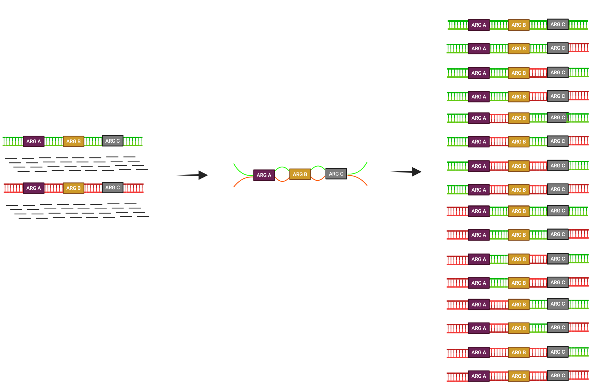

## 背景

抗生素耐药性已成为当今最紧迫的全球健康挑战之一。由于细菌及其遗传物质在人类、家养动物和外部环境之间不断流动，因此需要在“一体化健康”的整个谱系内进行干预和研究。微生物群落内部的动态非常复杂：非致病菌可能充当遗传性耐药决定因子的来源或中间载体，或者自身虽不耐药，却能影响同一群落中耐药细菌的生存成功。鉴于绝大多数细菌物种难以培养，不依赖培养的分析方法，如宏基因组测序或聚合酶链反应，为获得微生物群落中抗生素抗性基因的更全面视图提供了机会，远远超出了单个可培养病原体的范围。因此，对ARGs性质和丰度的研究，如今被用作解决一系列重要问题的基础，包括量化耐药病原体的传播风险和途径、理解微生物群落对耐药性的选择压力，以及洞悉区域耐药性状况。

尽管宏基因组ARG分析潜力巨大，但其广泛应用仍面临从技术实现到生物学意义解读的多重障碍。当前许多研究停留在对ARG进行“基因计数”的层面，而未能有效地将基因信息转化为对公共卫生风险的可靠评估。

本文深入探讨了当前ARG分析在技术和生物学解读两方面的主要局限。在技术层面，基于PCR的方法存在假阳性风险和高通量筛选的限制；短读长宏基因组学在组装移动基因时易产生嵌合体，难以准确还原ARG的遗传环境；而长读长测序、Epic-PCR和Hi-C等技术在提升分辨率的同时，也带来了生物量需求、成本、分辨率和数据解读复杂度等新挑战。在生物学解读层面，ARG丰度的变化可能由群落分类学组成改变驱动，而非直接的耐药性选择压力；ARG数据库本身的不完整性、归一化策略的选择以及缺乏对突变型抗性的有效检测，都影响了分析的准确性。更重要的是，对ARG所关联的公共卫生风险的评估，严重依赖于对其宿主（是否为病原体）、所在移动遗传元件的可转移性以及所处生态环境的了解。目前，仅凭宏基因组ARG丰度数据进行定量风险评估的根基尚不稳固。因此，研究人员呼吁，在利用这些强大工具的同时，必须充分认识其局限，谨慎解读数据，避免过度推断，并将研究重点转向整合宿主、环境和功能验证的更全面分析框架。

## 群落中ARG分析的技术局限与解决方案
数十年来，科学家一直通过（定量）PCR分析废水、土壤和人体微生物群落等复杂样本中的ARGs。PCR可以灵敏地测量单个基因的丰度，高通量PCR阵列或多重PCR方法可以并行分析数百个ARGs。然而，考虑到已有数百万个预测和鉴定出的ARGs，先验定义的PCR阵列可能会忽略许多相关基因。此外，PCR本质上对非特异性引物结合敏感，导致假阳性和错误定量的高风险。这种风险在处理高度多样化的微生物环境样本（如含有许多相似的、可能发生交叉反应的基因序列的废水）时变得尤为明显，因此需要在真实条件下进行更好的验证。

高通量测序允许采用随机的、广泛且深入的鸟枪法策略，基本上可以识别任何ARG，从而规避了非特异性PCR引物结合的挑战。此类测序技术也为研究任何可识别为ARG的基因铺平了道路，只要参考数据库中存在类似基因。由于选择寻找哪些ARGs可以在数据生成后进行，测序数据可以重新用于回顾性ARG分析。此外，相同的数据支持分类学组成和其他生化功能的研究。尽管更新型测序技术的准确性有所提高，但鉴于大多数微生物群落的高度多样性，测序深度不足仍然是许多应用中的限制。因此，鸟枪法宏基因组学的一个主要剩余挑战是检测和定量除最常出现的ARGs以外的任何基因。

另一个与PCR共有的关键局限是将ARGs置于准确的遗传背景中。虽然有大量生物信息学工具可以将测序群落的较短DNA序列组装成更长的、包含ARG的重叠群，但当遇到具有流动性、且往往在不同细菌的多种背景中出现的基因或DNA序列（包括ARGs）时，它们通常表现不佳。其根本问题在于，测序读长通常无法跨越移动序列的两侧。因此，组装过程通常会产生复杂的组装图，每个移动序列的上游和下游都有多个序列，尽管考虑了覆盖度，但确定哪些序列真正相连的可能性非常有限。随着移动元件数量和群落复杂性的增加，错误组装的风险也会增加。长读长测序（如牛津纳米孔和PacBio）有潜力显著减少这个问题。然而，基准测试研究表明，即使使用高精度长读长，下游分析步骤，特别是组装和组装后处理，也可能成为人为错误的主要来源，导致嵌合体、无支持的序列或基因组特征的错误呈现。随着并行化技术平台的发展，与Illumina相比，因测序深度损失而付出的部分代价也可能得以挽回。一个显著的剩余差异是长读长测序通常需要更高的生物量，这有时是一个限制因素。

无论读长如何，常规测序都无法将质粒与染色体连接起来。由于大多数临床相关的ARGs是质粒携带的，因此出现在多个菌株和物种中，将ARGs关联到物种甚至菌株通常至关重要。一个组装的耐药质粒与先前在某个物种中报道的质粒匹配，并不意味着它在被测序的群落中由同一物种宿主携带。为解决这一挑战，两种最常见的方法是Epic-PCR和Hi-C，两者都能连接源自同一细胞内部然后一起测序的DNA片段。然而，在复杂和动态的微生物群落中，基于Hi-C的关联可能难以解读，因为高丰度的类群或多拷贝质粒可能产生虚假关联，特别是在种群快速更替或病毒捕食率高的系统中。尽管长读长Epic-PCR和更准确的Hi-C数据分箱可能会在一定程度上提高分辨率，但下至物种和菌株的灵敏度和分辨率仍然是这两种技术的主要挑战。

另一个与背景相关的挑战是群落样本中细胞外DNA的存在。显然，游离DNA的进一步传播风险要小得多，因为ARGs需要成功的转化并整合到新宿主的基因组中才能繁殖，但具体小多少尚不清楚。在测序前需要进行物理分离步骤，以从活细胞中存在的遗传物质中去除或单独分析此类DNA。

## 从序列到基因：鉴定与数据库挑战
在最简单的形式中，ARGs是通过将DNA读长与已知或预测的耐药基因数据库（通常是CARD、Resfinder或ARGs-OAP）进行匹配来鉴定的。仔细考虑数据库的内容至关重要，其中可能不仅包括移动ARGs，还包括非移动ARGs、染色体耐药突变或针对抗生素以外抗菌剂的耐药基因。公共宏基因组数据正在迅速积累，为科学界提供了庞大而重要的资源。然而，相关元数据的可用性和质量常常限制了它们的用途。此外，与基因组数据库中细菌物种的偏斜类似，来自有限环境类型（特别是人类、常见家养动物、废水和土壤）的宏基因组存在严重的过度代表性。

序列存储库中只有一小部分ARGs经过实验证明能提供耐药表型，还有许多尚待发现。探索未知的ARGs对于新开发的抗生素尤其有价值。在群落中发现先前未描述的耐药基因有两种常见且原理不同的方法。基于随机DNA片段在细菌宿主中表达的功能宏基因组学，允许通过用抗生素筛选转化子来鉴定ARGs。其优点是不依赖于与已知基因的序列相似性，但需要在异源宿主中具有功能，且通量有限。根据可用基因组和宏基因组数据构建的预测模型通量要高得多。隐马尔可夫模型（检测保守序列基序）以及最近更常用的深度学习模型（自动从基因组数据中提取信息模式）都被证明是有用的。最终，实验验证对于确认耐药表型、避免对基于序列匹配的过度解读以及有意义地评估与推定ARGs相关的风险仍然至关重要。

## 解读ARG数据的挑战
解读宏基因组中的ARG数据涉及技术和更多概念性/生物学挑战。虽然长读长测序在历史上比短读长更容易出错，但其准确性正在迅速提高。在ARG分析的背景下，将序列与ARG数据库中的序列匹配时应用过于宽松的阈值，可能导致将缺乏耐药功能的同源基因的读长错误分配。相反，过于严格的阈值可能完全忽略临床上重要的ARG变体。因此，阈值需要与特定的基因、数据集和潜在问题仔细对齐。另一个限制是，相关的ARGs可能不在所使用的数据库中，这再次导致对ARGs的低估。将基因丰度归一化到参考值（如总读长或细菌含量）至关重要，但哪种策略最合适取决于所提出的问题。通常，ARG数据是零膨胀的，一些统计方法处理不当，导致效能大幅降低。

尽管如此，我们认为最令人担忧的挑战在于生物学解读。群落中相对ARG丰度的增加通常被解释为耐药性选择的证据。然而，由于ARGs在物种间分布不均，任何分类学变化都可能导致与耐药性选择完全无关的ARG丰度变化。同样，在没有可靠地分配到宿主的情况下，ARG丰度的增加不能简单地转化为相关耐药病原体传播风险的增加。此外，点突变在许多情况下是非常重要的耐药决定因素，但与移动ARGs相比，在宏基因组数据中准确检测和量化它们要困难得多。通常，“抗菌素耐药性风险”的定义是模糊的，这影响了对传播风险和不同进化过程的进一步下游理解。由于驱动因素可能不同，明确风险类型对于指导潜在的缓解措施至关重要。

与简单细菌传播和新型耐药基因型进化/出现相关的风险高度依赖于背景，最重要的是细菌宿主物种甚至菌株，以及对于耐药性进化而言，直接的遗传背景。位于无毒力菌株中的ARG所关联的风险，远低于病原体中相同的ARG。临床上重要的ARGs通常位于移动质粒上，这给解读带来了额外的挑战。耐药质粒在物种间的快速传播通常在抗生素的选择压力下发生。这意味着，不仅当前的细菌宿主对风险评估很重要，携带ARG的质粒的潜在宿主范围，以及群落中存在的其他非耐药兼容宿主的性质也很重要。为了理解风险，需要对微生物群落生态学进行更全面的评估，这远远超出了简单的基因计数工作。基于ARG丰度评估传播风险或耐药流行率的模型通常很容易生成。然而，鉴于在宿主、遗传背景和传播机会方面普遍存在的不确定性，基于ARG而非培养数据的风险排序方案目前根基不稳。这种风险评估方法的一个或许更深刻的局限性是，用独立生成的健康风险实证数据对其进行验证是一项真正具有挑战性的工作，因此目前缺乏。在没有更好的背景和验证的情况下，我们应该谨慎解读从宏基因组ARG数据推断出的风险，并避免进行定量评估。将解读限制在“相对风险”可能很诱人，但也需要对绝对风险进行合理估计，以避免夸大健康影响。我们还应该保持谦逊，并承认即使手头有高质量的培养数据，将特定环境中的细菌丰度转化为感染风险也往往具有挑战性。

## 讨论
新一代测序和群落中的ARG分析增加了我们对耐药性进化和动力学的理解，并将在未来几年继续如此。随着更多基因组的可用，包括来自那些罕见或难以培养的细菌，我们将能够更好地正确解读宏基因组数据。超越长读长测序的方案，包括单细胞宏基因组学，如果得到进一步发展，可能成为未来的游戏规则改变者。尽管如此，鉴于现有技术，我们需要认识到宏基因组学和ARG分析的局限性，特别是在宿主、遗传背景以及推断健康风险的诸多挑战方面。同样重要的是，这些局限性必须在可能由ARG分析所告知的政策倡议中得到反映。

当前的研究存在一个关键悖论：我们拥有前所未有的能力来描述环境中的基因库，却缺乏将基因信息与明确的健康结果有效联系起来的框架。许多研究隐含地假设“更多ARGs等于更高风险”，但这忽略了耐药性是一种涌现属性，取决于基因、宿主和环境之间的相互作用。未来的研究需要更加明确地界定所讨论的“风险”类型（例如，是现有耐药病原体的传播风险，还是新耐药基因型的进化风险，或是人类暴露于耐药菌的风险），并采用相应的分析策略。这意味着需要更多地整合培养组学、表型筛选和流行病学数据，以校准和验证基于宏基因组的风险评估模型。在技术层面，提高长读长测序的准确性和可及性，开发更强大的单细胞和空间分辨技术，以及构建经过充分验证、背景信息丰富的ARG数据库，是优先发展方向。在政策层面，认识到当前基于宏基因组ARG数据的风险排名的推测性质至关重要，应避免仅凭此类数据就制定严格的监管阈值或干预措施。

对微生物群落中抗生素抗性基因的分析是一个强大但复杂的工具。它极大地扩展了我们对环境耐药性基因库的认知，但技术局限使准确关联基因与宿主、遗传背景变得困难。更重要的是，从ARG丰度数据直接推断公共卫生风险存在概念鸿沟，因为风险本质上是基因、宿主、移动性、毒力和暴露机会共同作用的结果。因此，尽管这些方法对监测和理解耐药性动态不可或缺，但研究界必须谨慎解读结果，明确承认当前方法的局限性，避免对风险进行过度定量推断，并致力于发展整合了宿主解析、功能验证和明确风险定义框架的更全面分析方法。只有这样，我们才能将宏基因组学从描述性工具真正转化为能够指导有效干预的风险评估工具。
