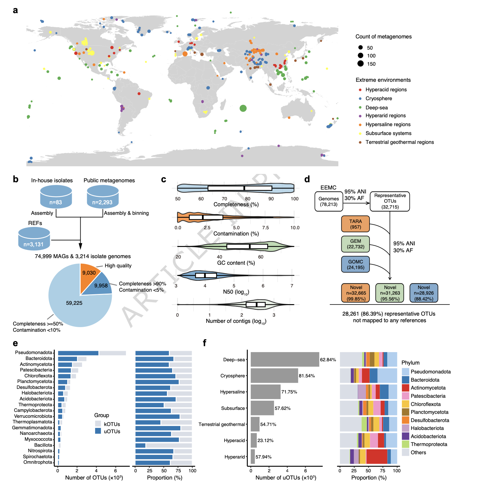
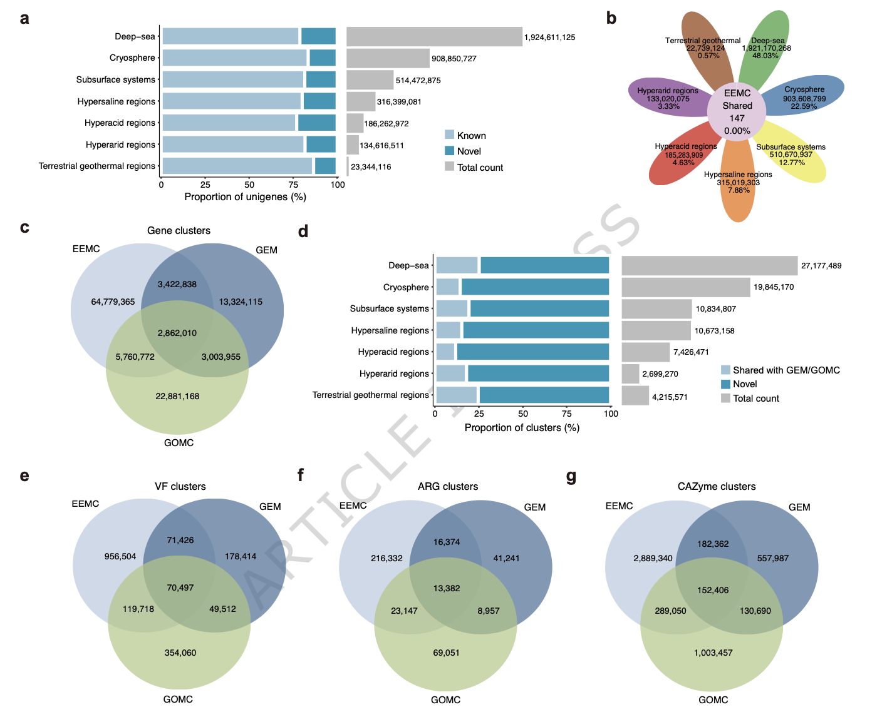
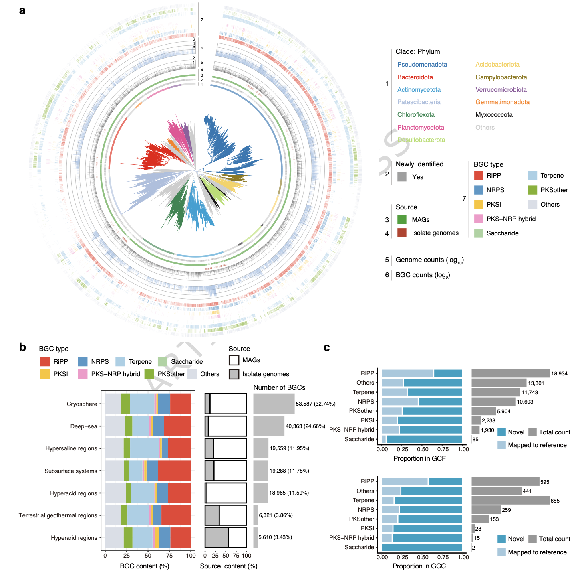
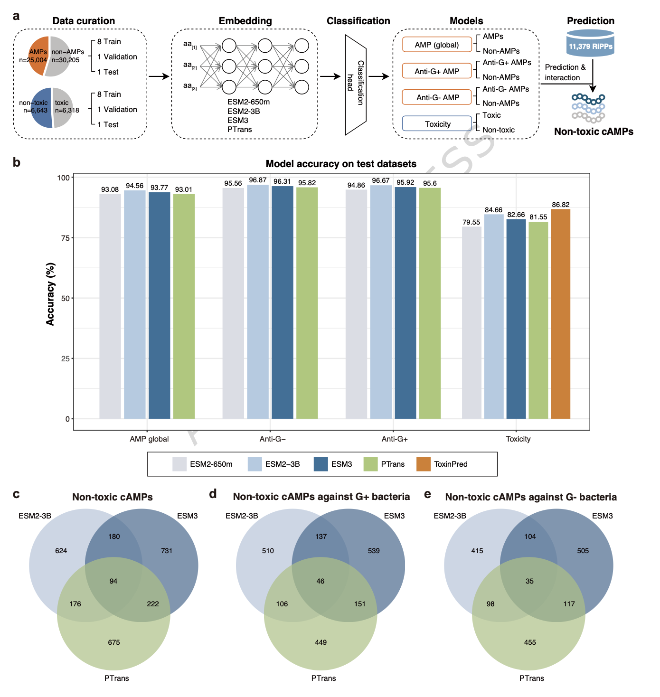
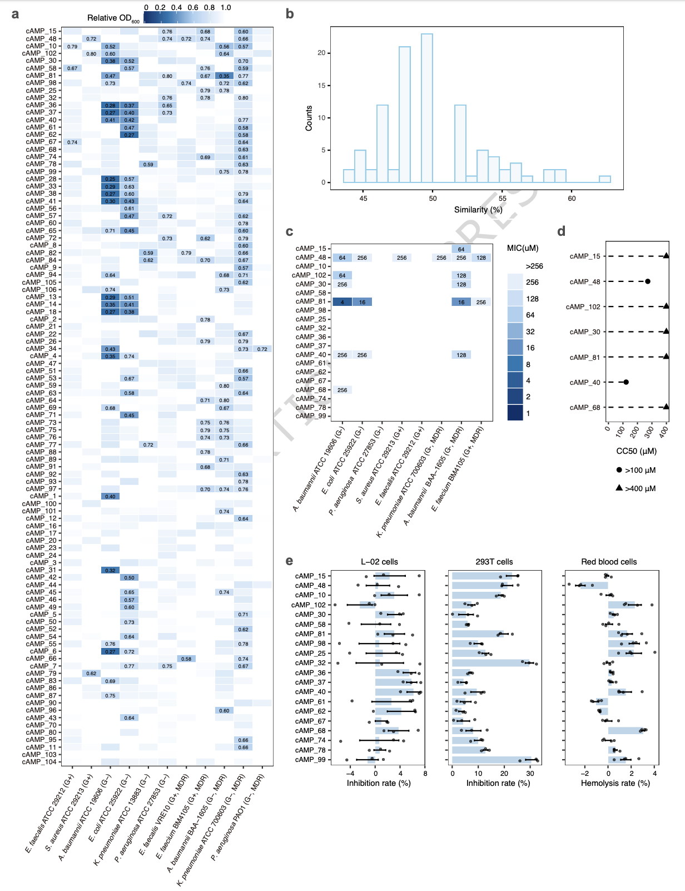
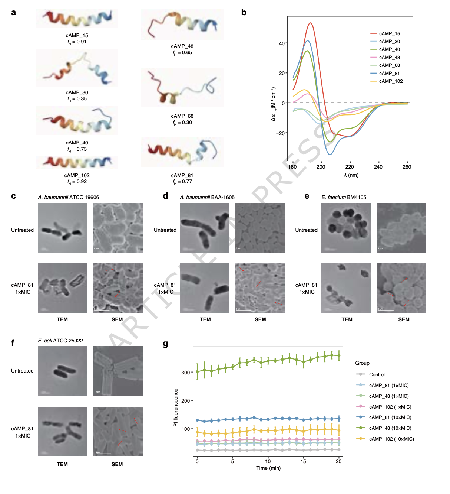

## 背景
以极端pH、盐度、温度和压力为特征的极端环境，蕴藏着跨越生命所有领域的、具有广泛系统发育和功能多样性的微生物。这些微生物进化出独特的代谢策略和生理适应机制，不仅是理解生命极限的关键，也是新型酶和生物活性代谢物的宝贵来源。然而，当前对微生物功能的认识严重偏向于可培养的类群，大量未培养微生物的代谢能力仍有待探索。

下一代测序技术和计算工具的进步，使得不依赖培养即可从宏基因组或单细胞中恢复基因组成为可能，从而能够从基因组尺度洞察微生物的多样性、代谢和生态角色。尽管如此，现有研究大多局限于特定地理区域和栖息地，缺乏在全球尺度上对不同极端生境进行大规模、整合性分析。这一空白限制了对全球极端环境微生物群落的分布、功能、生态相关性及其生物合成能力的理解，从而阻碍了从这些未开发的微生物资源中发现和开发新型酶与生物活性化合物。

抗生素耐药性是一项重大的全球健康威胁，自20世纪80年代以来，由于成本飙升和投资减少，未有新的抗生素类别被发现，因此亟需创新的抗生素发现方法。微生物天然产物，特别是核糖体合成和翻译后修饰肽，因其膜破坏机制和较低的耐药性发展倾向而受到特别关注。其基因编码特性使得能够进行基因组引导的挖掘。同时，人工智能的进步，特别是蛋白质大语言模型的发展，为从海量序列数据中系统性预测兼具抗菌活性和低毒性的肽类提供了新的可能。

- Jiang, P., Liang, Z., Kovacevic, V., Shi, J., Milicevic, N., Wang, F., Liu, L., Liu, Y., Jiang, Y., Han, M., Lin, X., Petronic, C., Stanojevic, N., Wang, L., Wang, S., Cheng, H., Li, J., Chen, R., Zhang, Y., Li, Y., Li, J., Fang, X., Yue, Z., Xue, C., Yin, P., & Chen, H. (2026). The Extreme Environment Microbiome Catalog (EEMC): a global resource for microbial diversity and antimicrobial discovery. *Nature Communications*. https://doi.org/10.1038/s41467-026-71145-0
- 期刊：Nature Communications (IF 15.7)
- 发表时间：2026年3月13日

本研究通过整合2293个公开的宏基因组数据和3214个分离株基因组，构建了一个统一的极端环境宏基因组目录。该目录包含了78,213个细菌和古菌基因组，聚类为32,715个代表性物种，其中63.00%为潜在新物种；并包含近40亿个非冗余基因，其中19.21%为新基因。EEMC还鉴定出163,693个生物合成基因簇，聚类为64,733个基因簇家族，其中58.68%被归类为新型，突显了其在天然产物发现方面的巨大潜力。针对其中最具潜力的核糖体合成和翻译后修饰肽类生物合成基因簇，研究人员开发了基于蛋白质大语言模型的深度学习框架，用于从EEMC中预测基因组编码的、非毒性的候选抗菌肽，共鉴定出3,032个候选肽。在化学合成的100个候选肽中，84%显示出抗菌活性，所有测试的50个候选肽均表现出对哺乳动物细胞的低细胞毒性。其中，7个最有效的候选抗菌肽在体外对包括耐多药革兰氏阴性菌在内的病原体显示出显著效力。综上所述，EEMC为发掘新的微生物谱系和生物合成能力奠定了资源基础，其整合人工智能与实验验证的管线，为未来的药物发现和生物技术应用提供了强大的工具与洞见。

## 方法
### 数据收集与基因组重建
研究人员从公共数据库收集了2010年1月至2024年2月期间发表的、来自多种极端环境（包括深海、冰冻圈、地下系统、高盐、高酸、陆地地热和超干旱区域）的2293个公开可用的宏基因组样本。使用MEGAHIT进行组装，并利用MetaWRAP整合多种分箱工具的结果，经MAGpurify净化后，最终获得74,999个宏基因组组装基因组。此外，还从NCBI RefSeq基因组数据库中收集了3131个来自极端环境的公开细菌和古菌分离株基因组，并利用冷泉沉积物样本培养了83株细菌，完成了基因组测序与组装。

### 基因组质量评估与物种聚类
使用CheckM评估所有基因组的完整度和污染度，保留符合宏基因组组装基因组最低信息标准中质量及以上标准的基因组。通过dRep软件，以95%的平均核苷酸一致性和30%的比对比例阈值为标准，将所有78,213个基因组聚类为物种级别的操作分类单元。利用基因组分类学数据库工具包对代表性OTU进行物种注释，并与已发表的基因组目录进行比较以评估新颖性。

### 基因目录构建与功能注释
使用Prodigal从原始未分箱的重叠群中预测开放阅读框，并通过MMseqs2以95%序列一致性和80%覆盖度为阈值，将其聚类为非冗余基因簇。使用DIAMOND和MMseqs2等工具，将非冗余基因对NR、UniRef50、Swiss-Prot、COG、KEGG、CAZy、GO、CARD和VFDB等多个数据库进行比对，完成功能注释。

### 生物合成基因簇鉴定与聚类
使用antiSMASH对长度不小于5 kb的重叠群进行生物合成基因簇预测。通过BiG-SCAPE将BGCs聚类为基因簇家族和基因簇家族，并使用BiG-SLiCE将其与BiG-FAM参考数据库进行比较，以评估其新颖性。

### 深度学习模型构建与候选抗菌肽预测
从公共数据库中收集并整理抗菌肽、非抗菌肽、有毒肽和非毒肽序列，构建训练数据集。研究人员开发了宏基因组人工智能框架，该框架整合了多种预训练的蛋白质大语言模型作为编码器，并连接由全连接层构成的分类头。训练了四个独立的分类模型，分别用于预测：i) 广谱抗菌活性，ii) 抗革兰氏阳性菌活性，iii) 抗革兰氏阴性菌活性，以及iv) 对哺乳动物细胞的细胞毒性。利用训练好的模型，对从EEMC的RiPP型BGCs中预测出的11,379个核心肽进行筛选，得到高置信度的候选非毒性抗菌肽。

### 实验验证
化学合成选定的候选肽，通过微量肉汤稀释法测定其最小抑菌浓度，并使用CCK-8法和溶血实验评估其对哺乳动物细胞的细胞毒性。通过圆二色谱、透射/扫描电子显微镜、膜完整性实验和长期耐药性诱导实验，对选定候选肽的结构和作用机制进行初步探究。

## 结果
### EEMC包含大量未被表征的微生物物种
研究最终构建的EEMC包含78,213个细菌和古菌基因组，平均完整度为76.84%，平均污染率为2.75%。这些基因组被聚类为32,715个代表性物种级别OTU。与已发表的基因组目录进行比较显示，EEMC具有极高的新颖性，99.85%、95.56%和88.42%的OTU与TARA海洋、GEM和GOMC目录中的代表性基因组相似性低。共有20,610个OTU未被基因组分类学数据库r220版注释，被视为潜在新物种，将GTDB数据库的物种多样性扩展了18.22%。

不同极端环境中未分类OTU的比例和优势门类存在差异。例如，在冰冻圈、高盐区域和深海样本中，未分类OTU的比例分别为81.54%、71.75%和62.84%。在门类水平上，假单胞菌门、拟杆菌门和放线菌门是冰冻圈未分类OTU中的高代表性类群，而盐杆菌门则在高盐区域中频繁出现。

### EEMC包含近40亿个非冗余基因，揭示广泛的多样性和显著的新颖性
从原始重叠群中预测出超过52亿个开放阅读框，最终聚类为3,999,744,836个非冗余基因簇。基因稀释曲线显示，随着测序深度增加，基因数量持续增长且未达到平台期，表明极端环境，尤其是深海，拥有巨大的遗传多样性。共有19.61%的基因未在任何使用的数据库中得到注释，被视为新基因。其中，深海环境拥有新基因的绝对数量最多，而高酸环境的新基因比例最高。

对基因功能的注释分析显示，与DNA修复、物质转运和代谢调控相关的通路广泛存在。同时，与抗生素和次级代谢物生物合成相关的通路也普遍存在，提示极端环境微生物可能广泛采用化学竞争策略。值得注意的是，在所有环境中共享的基因数量极少，99.79%的基因是环境特异性的。

### EEMC蕴藏广泛而多样的生物合成潜力
从EEMC基因组中共鉴定出163,693个BGCs，可归类为8种主要类型。其中，RiPPs是最丰富的BGC类型，占总数的28.60%。其次分别是萜类、非核糖体肽合成酶、I型聚酮合酶等。超过一半的BGCs来自假单胞菌门、放线菌门和拟杆菌门。

在极端环境分布方面，RiPP型BGCs在除冰冻圈外的大多数生境中占主导；而在冰冻圈，萜类BGCs最为丰富。深海和冰冻圈的基因组显示出最高的生物合成潜力。将BGCs聚类为64,733个GCFs和2,178个GCCs后，与BiG-SLiCE参考数据库比较，分别有58.68%的GCFs和70.16%的GCCs被定义为新型，表明EEMC具有极高的生物合成新颖性。

### 用于预测抗菌活性和毒性的深度学习模型
研究人员构建了名为宏基因组人工智能的框架，整合了ESM2、ESM3和PTrans等多种蛋白质大语言模型作为序列编码器，用于预测肽段的抗菌活性和毒性。在包含抗菌肽/非抗菌肽、抗革兰氏阳性/阴性菌活性肽以及毒性/非毒性肽的数据集上训练了四个分类模型。

模型性能评估显示，基于ESM2-3B的模型表现最佳，在预测抗菌活性、抗革兰氏阴性菌活性、抗革兰氏阳性菌活性和毒性的任务中，准确率分别达到94.56%、96.87%、96.67%和84.66%。与已有的抗菌肽预测工具相比，基于pLLM的模型在多项指标上均有超过10%的性能提升。

### 来自EEMC的候选抗菌肽对一系列病原体有效
利用训练好的模型对从RiPP型BGCs预测出的11,379个核心肽进行筛选，最终获得了3,032个候选非毒性抗菌肽。研究人员合成了其中100个候选肽进行实验验证。

在浓度为60μM的条件下测试这100个cAMPs对11种细菌病原体的抑制效果，结果显示84个cAMPs能够抑制至少一种菌株的生长，阳性率为84%。大多数cAMPs与已知抗菌肽序列相似性较低，表明模型的预测并非依赖于简单的序列同源性。

进一步对抑菌效果最好的20个cAMPs进行最小抑菌浓度测定。其中7个cAMPs对至少一种测试菌株的MIC值低于256μM。值得注意的是，cAMP_81对鲍曼不动杆菌ATCC 19606、大肠杆菌ATCC 25922和耐多药鲍曼不动杆菌BAA-1605的MIC值分别为4μM、16μM和16μM，显示出强效的抗菌活性。

### 候选抗菌肽的细胞毒性与作用机制
细胞毒性实验表明，抑菌效果最佳的20个cAMPs在60μM浓度下对红细胞溶血率低于4%，对L-02肝细胞的生长抑制率低于10%，对293T细胞的抑制率低于30%。随机测试的其他30个cAMPs也显示出较低的毒性。对7个具有可测量MIC值的cAMPs进行的半数细胞毒性浓度测定显示，除cAMP_40外，其余cAMPs的CC50值均远高于其MIC值。

通过圆二色谱分析，7个cAMPs中有5个呈现α-螺旋主导的二级结构。作用机制研究表明，cAMP_81处理会导致细菌细胞膜破损、内容物泄漏和细胞表面皱缩。膜完整性实验证实，cAMP_81、cAMP_48和cAMP_102能够剂量依赖性地破坏鲍曼不动杆菌的细胞膜。此外，对cAMP_81的长期耐药性诱导实验显示，在0.5倍MIC浓度下处理30天，诱导的耐药性水平低于阳性对照多粘菌素B。这些结果表明，从EEMC中鉴定出的cAMPs主要通过破坏细菌细胞质膜发挥抗菌作用。

## 讨论
本研究构建了首个涵盖多种极端生境的微生物基因组和基因目录。EEMC极大地扩展了已知的微生物多样性，其包含的超过7.8万个基因组和近40亿个基因为探索极端环境生命提供了前所未有的资源。目录中鉴定出的大量新型BGCs，特别是RiPPs，突出了极端环境作为新型天然产物，尤其是抗菌肽来源的巨大潜力。

尽管EEMC的规模和新颖性显著，但仍存在一些局限。首先，来自极端环境的已知分离株基因组仍然有限，需要更多以宏基因组推断的代谢特征为指导的分离培养工作。其次，大多数BGCs，尤其是来自宏基因组组装基因组的BGCs是碎片化的，这限制了BGC预测的完整性和准确性，可能导致对生物合成多样性的低估。第三，尽管基因目录捕获了大量序列新颖性，但具有生物技术应用潜力的酶尚未被充分探索。

在抗菌肽发现方面，本研究开发的宏基因组人工智能框架代表了相对于以往方法的重大进步。基于蛋白质大语言模型的分类器在解码复杂的序列-功能关系方面表现出色。后续的实验验证证实了该框架从EEMC中发现多样化、低毒性抗菌肽的能力。值得注意的是，部分活性cAMPs来源于古菌BGCs，这揭示了古菌微生物组在抗生素发现中尚未开发的潜力。

需要认识到，本研究合成的肽段与其天然对应物在折叠、稳定性和生物活性上可能存在显著差异。模型仅基于氨基酸序列进行训练，预测的核心肽代表的是酶加工前的遗传编码区域，而非成熟的功能性RiPPs。尽管缺乏翻译后修饰可能限制了可探索的化学空间，但筛选来自此类基因组背景的肽段，为探索天然编码的抗菌支架提供了一种合理的策略。

## 结论
极端环境宏基因组目录为捕获嗜极微生物的全球分类、功能和适应性多样性提供了前所未有的基因组和生物合成资源。EEMC极大地扩展了已知的微生物和天然产物景观，可作为探索地球生物圈生命极限的宝贵基础。通过整合深度学习模型与实验验证，本研究成功地从该资源中鉴定出大量新型、低毒的候选抗菌肽，证明了其在应对抗生素耐药性方面的转化潜力。未来，整合长读长测序、针对功能注释和BGC预测的深度学习方法，以及基于宏基因组衍生代谢见解的靶向分离培养，将对于充分实现EEMC的潜力至关重要。
