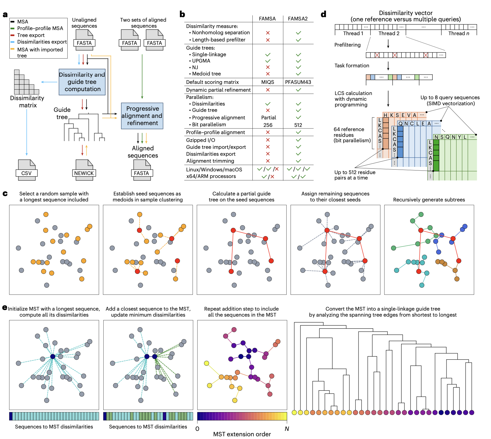
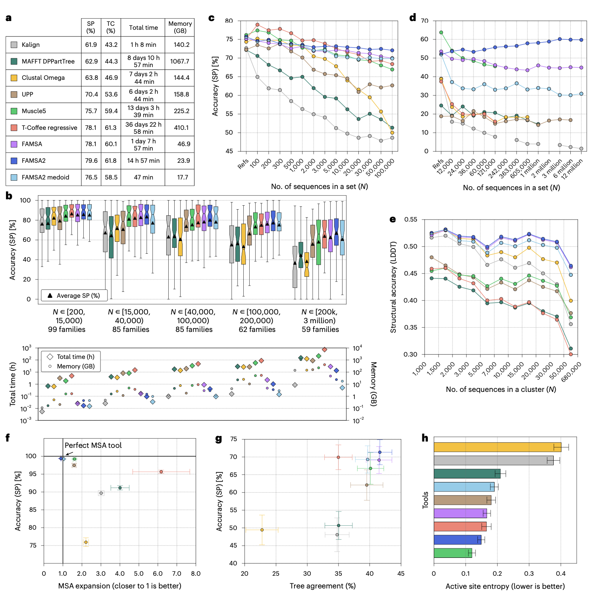

## 背景

过去三十年间，测序通量增长了数十亿倍，推动了诸如“地球生物基因组计划”等旨在编录全球所有基因组信息的宏大项目。随之而来的是蛋白质序列数据库规模的急剧膨胀，预计很快将包含数以十亿计的条目。为应对这种数据洪流，能够处理此等规模数据的序列相似性搜索工具（如DIAMOND和MMseqs2）已被开发出来，促进了数十万个新蛋白家族的发现。与此同时，AlphaFold革命及超过2亿个蛋白质结构模型的发布，也推动了基于结构的聚类工具（如FoldSeek）的发展，进一步丰富了蛋白家族的多样性。

然而，对于推断进化关系、蛋白质结构预测和系统发育分析至关重要的多序列比对工具，其发展速度却未能跟上蛋白质数据增长的步伐。目前针对大规模数据集最精准的比对器，如Muscle5和T-Coffee的回归方法，在处理超过数千条序列时扩展性很差，其准确性会随着数据集规模和噪声的增加而显著下降。随着蛋白家族成员数量向百万级迈进，开发能够克服这些局限性的新比对方法已成为迫切需求。

*   Gudys, A., Zielezinski, A., Notredame, C., & Deorowicz, S. (2026). Fast and accurate multiple-protein-sequence alignment at scale with FAMSA2. _Nature Biotechnology_. https://doi.org/10.1038/s41587-026-03095-3
*   期刊：Nature Biotechnology (IF=41.7)
*   发表时间：2026年4月14日

研究人员开发了FAMSA2。这是一种渐进式多序列比对算法，其在结构、系统发育和功能基准测试中，达到或超越了现有最优工具的精度，同时平均运行速度提升了400倍。FAMSA2的核心创新在于将渐进式比对与基于中心点（Medoid）聚类的引导树构建相结合，并采用了一种源自最长公共子序列、对序列分化具有鲁棒性的差异度度量方法。这些技术使其能够高效、可扩展地对海量蛋白家族进行精准比对，为充分利用当前及未来的多核计算架构、应对日益增长的数据挑战提供了强大工具。

## 方法



FAMSA2保留了其前身FAMSA的两阶段渐进式比对框架。在第一阶段，通过新颖的Medoid树算法或标准的单链接聚类来构建引导树。在第二阶段，根据引导树指示的合并顺序，将序列逐步比对成中间谱（profile）。除了完整的MSA计算，FAMSA2还支持多种工作流程，包括单独生成引导树、使用外部引导树进行比对、计算差异度或一致性矩阵，以及对两个输入谱进行比对。

FAMSA2是一个高效的渐进式多序列比对工具，其设计目标是在维持高精度的前提下，实现对海量蛋白质序列的可扩展处理。它包含两个主要阶段：引导树构建和渐进式谱-谱比对。

### Medoid树算法

Medoid树是一种用于近似引导树构建的随机算法，与用于默认单链接树的Prim算法相比，具有更好的可扩展性。该算法的时间复杂度为 $O(MN \log N)$（其中 $M$ 为算法参数，代表最大子树大小），相较于Prim算法的 $O(N^2)$ 在处理大规模序列集时优势显著。

该算法受MAFFT的PartTree启发，旨在解决PartTree因随机选择种子序列而导致树结构不稳定的主要问题。FAMSA2的Medoid树算法在种子选择阶段通过执行围绕中心点的划分聚类，并使用得到的聚类中心作为种子序列，从而降低了随机性。其余聚类步骤与PartTree类似，但默认使用单链接子树而非UPGMA。

具体而言，Medoid树算法递归地将序列划分为 $k$ 个簇，直到每个簇包含的序列数不超过 $M$。其核心步骤包括：初始化所有序列为一个簇；若簇大小大于 $M$，则从该簇中随机采样 $M$ 条序列（固定包含最长序列），使用优化的FastCLARANS算法确定 $k$ 个中心点作为种子，在种子序列上使用Prim算法构建单链接树，将非种子序列分配至最近的种子形成子簇，并对每个子簇递归应用此过程；若簇大小小于等于 $M$，则直接使用Prim算法为该簇所有序列构建单链接树。最后，递归地将子树合并，形成最终的引导树。为了最大化计算性能，顶层递归的子簇聚类是并行化的。

### 使用Prim算法的单链接引导树计算

FAMSA2使用Prim的最小生成树算法进行单链接引导树计算。该算法将序列划分为两个集合：$M$（已包含在MST中的序列）和 $R$（尚未加入MST的序列）。算法跟踪 $R$ 中每个序列到 $M$ 中任何序列的最小差异度值。在每一步，从 $R$ 中选择具有最小差异度的序列 $r$（此步骤跨线程并行），将其从 $R$ 移至 $M$，并计算 $r$ 与 $R$ 中所有剩余序列的差异度（此步骤也并行化）。此过程重复直至 $R$ 为空。Prim算法高度可并行化，且仅需要与序列数 $N$ 成线性关系的空间，非常适合大型数据集。

### 差异度度量

对于每对序列 $A$ 和 $B$，其差异度计算公式为：$indel(A, B)^{0.75} / LCS(A, B)$。其中，$LCS(A, B)$ 是 $A$ 和 $B$ 的最长公共子序列长度；$indel(A, B)$ 是将 $A$ 转换为 $B$ 所需的最少单符号插入或删除次数，可由 $LCS$ 推导得出：$indel(A, B) = |A| + |B| - 2 \times LCS(A, B)$。与FAMSA中指数为1.0相比，FAMSA2将指数调整为0.75，这一调整基于在独立参考数据集上的评估，能提高对序列分化的鲁棒性。

$LCS$ 的计算采用了位并行方法，可同时比较64个残基对。FAMSA2支持CPU的SIMD扩展指令集，包括AVX、AVX2、AVX512和NEON。例如，在支持AVX512的CPU上，单个线程可同时进行8组64符号的比较。结合多线程并行，计算效率极高。

### 基于长度的差异度预过滤

在Prim算法中，在计算选定序列 $r$ 与 $R$ 中每个序列 $x$ 的精确 $LCS$ 之前，FAMSA2会估算一个最佳情况下的 $LCS$ 值（假设较短序列是较长序列的子序列）。如果此估计值仍然导致差异度高于 $x$ 当前到 $M$ 的最小值，则跳过精确的 $LCS$ 计算。这种启发式方法消除了少量成对比较，带来了适度的加速。

### 并行谱-谱比对

FAMSA2在比对阶段引入了两级并行机制。它结合了独立谱-谱比对任务的并发处理（粗粒度）与单个谱对对齐的多线程比对（细粒度），并动态分配计算资源以保持CPU繁忙。并行化使用一个线程池来处理粗粒度和细粒度并发，以及一个包含待比对谱对任务的同步队列。

算法优先选择更高效的粗粒度并行。只要队列中的任务数大于等于空闲线程数，每个任务就分配一个线程（粗粒度并行）。否则，调整分配给任务的线程数以最大化计算资源利用率。任务通过以反对角线方式、按块计算动态规划矩阵来比对谱。块的高度固定为4，宽度为较长谱的长度除以分配给任务的线程数。处理过程中，线程使用主动等待的屏障进行同步以避免线程休眠延迟。

### 部分谱的动态精修

在FAMSA中，精修仅应用于最多1000条序列的最终谱，因为对更大规模比对效果不佳。在FAMSA2中，精修用于中间步骤，具体是当两个各自包含少于1000条序列的谱，与一个包含多于1000条序列的谱进行比对时。这确保了在谱规模尚小、精修仍能有效改进时进行操作，从而提升大规模比对的质量。

### 输出比对压缩与内置列修剪

鉴于FAMSA2极高的计算速度，将比对结果写入磁盘可能成为大规模数据集运行时的主要瓶颈。为此，FAMSA2将并行Gzip压缩集成到输出过程中：比对数据在线程间分区，每个线程独立压缩其数据块，允许压缩和写入操作并发进行，维持整体效率。此外，FAMSA2还包含一个内置的、简化的列修剪步骤，用户可设置每列的最小非空位比例，该设置在比对后应用于输出MSA，有助于减小文件大小并提高下游分析效率。

## 结果



### 结构准确性基准测试

在包含390个蛋白家族、最大规模达300万条序列的扩展版HomFam结构基准测试中，FAMSA2在15小时内生成了最准确的比对，SP和TC分数分别为79.6%和61.8%。使用Medoid树模式的FAMSA2仅用47分钟就提供了与Muscle5相当的结果，而Muscle5需要超过315小时。FAMSA2的准确性优势随着蛋白家族规模的增大而愈发显著。

### 处理规模递增的同源序列

为了评估准确性随规模扩大的变化，研究人员分析了从extHomFam家族中采样的、包含100至100,000条同源序列的子集。FAMSA2在序列数 ≥ 5,000的家族中准确性排名第一，在 ≥ 700条序列时超越Muscle5，在 ≥ 5,000条序列时超越T-Coffee。其SP分数在所有工具中下降幅度最小，显示出最佳的稳定性。FAMSA2的Medoid树模式在稳定性和准确性上与Muscle5相当。

### 对非同源序列污染的鲁棒性

为了测试比对工具在包含无关序列污染的数据集上的表现，研究人员生成了包含递增数量的同源与非同源混合序列的数据集，规模最大超过1200万条序列。只有FAMSA和FAMSA2完成了所有数据集的处理。FAMSA2在14个数据集中的12个上取得了最高的SP和TC分数，并且与其它工具不同，其准确性随着数据集规模增大而有所提升。这得益于其改进后的差异度度量能更有效地聚类相关序列。

### 基于AlphaFold数据库的结构评估

为了克服extHomFam基准依赖少量参考结构的局限性，研究人员基于AlphaFold数据库集群构建了补充性结构基准，使用局部距离差异测试分数进行评估。FAMSA2及其Medoid树变体取得了最高的平均LDDT分数。值得注意的是，FAMSA2的Medoid树模式所需时间比次优的Clustal Omega少227倍，而唯一具有可比执行时间的Kalign所产生的比对质量明显较低。

### 系统发育准确性评估

鉴于结构准确性仅是进化正确性的间接代理，研究人员通过无结构的实验方案评估了比对保留系统发育信息的能力。首先，在已知进化树下模拟了1,860个蛋白家族，生成基于进化史的真实参考MSA。FAMSA2的两个变体均取得了最高的SP和TC分数，并且其扩展比最接近理想值1。其次，在真实的extHomFam蛋白家族上评估了系统发育信号，通过比较从同一MSA重建的最大似然树和最小进化树之间的一致性作为系统发育准确性的代理。FAMSA2取得了最高的树一致性分数。虽然高的一致性本身不能直接证明系统发育准确性提高，但它表明FAMSA2产生的MSA是快速启发式建树方法（如最小进化法）更好的输入，而这类方法在大规模分析中常是必需的。

### 功能位点对齐准确性

考虑到基于结构和系统发育的基准在用于功能建模时可能受到趋同进化的干扰，最后一个实验聚焦于功能对齐。研究人员通过测量772个Pfam酶家族中1,376个已知活性位点残基在比对列中分布的熵值，来评估功能位点的保留情况，熵值越低表示保留越好。FAMSA2取得了0.15的熵值，仅次于Muscle5，平均97%的活性位点残基集中在最富集的列中。基于Medoid树的FAMSA2变体也产生了准确的结果，其熵值略优于MAFFT，并显著优于Kalign和Clustal Omega。

## 讨论

FAMSA2通过一系列协同的算法创新，成功解决了大规模蛋白质多序列比对中长期存在的速度-精度权衡问题。其Medoid树算法在保持引导树质量的同时，将时间复杂度降低到 $O(MN \log N)$，这为渐进式比对方法应对未来数据增长提供了可持续的路径。改进的差异度度量、高效的多级并行计算策略以及对输出流程的优化，共同确保了该工具在实际计算环境中的高效性。

基准测试结果全面证实了FAMSA2的优越性。它在处理纯净同源序列、受污染数据、超大规模家族（如300万条序列的ABC转运蛋白家族）时均表现出色，并且在结构、系统发育和功能三个维度上均保持了高准确性。这种全面的高性能使其成为处理当前及未来宏基因组学、蛋白家族发现等研究产生的大规模序列数据的理想选择。

FAMSA2成功地将高精度与卓越的可扩展性相结合，使得在数分钟内对数百万条蛋白质序列进行高质量比对成为可能。它能够高效处理大规模数据集集合，例如在大约8小时内处理约22,000个Pfam-A家族（约6200万条序列），或在约5小时内处理10万个新发现的蛋白家族（约2000万条序列）。其Medoid树算法为在MSA重建中使用非生物学树提供了进一步的证据。通过实现 $O(MN \log N)$ 时间复杂度的渐进式比对，FAMSA2为这一基础分析方法注入了新的长期活力。如今，多序列比对工具终于能够与规模不断增长的数据库和家族发现工具同步扩展，准备好迎接测序整个生态系统所带来的挑战。

## 使用教程

### 安装与配置

FAMSA2 提供了预编译二进制文件、Bioconda 安装以及 Python 接口等多种部署方式，同时也支持从源码进行深度定制编译。

#### 预编译二进制文件
适用于 Windows、Linux 和 macOS 系统的预编译二进制文件可在 GitHub 仓库的 Releases 标签页中获取。下载解压后即可直接使用，无需额外配置。

#### Bioconda 安装
对于生物信息学分析环境，推荐使用 Bioconda 进行一键安装。确保已配置好 Bioconda 频道后，执行以下命令：
```bash
conda install -c bioconda famsa
```

#### Python 接口 (PyFAMSA)
为了方便集成到 Python 生信流程中，社区提供了用户友好的 `PyFAMSA` 模块（由 Martin Larralde 维护）。该模块允许直接在 Python 脚本中调用 FAMSA2 的分析功能。

#### 从源码编译
如果需要针对特定 CPU 架构进行优化，或者希望启用静态链接，可以从源码构建。FAMSA2 支持 x86-64 和 ARM64 架构（包括基于 ARM64 8.4 核心的 Apple M1 芯片），并能利用 AVX2 (x86-64) 和 NEON (ARM) 指令集扩展。

**编译依赖**：
- Linux/macOS：需要 gmake 4.3 及 gcc/g++ 11 或更高版本。
- Windows：提供 Visual Studio 2022 解决方案。

**默认编译（x86-64 with AVX2）**：
```bash
gmake
```

**指定平台编译**：
可以通过设置 `PLATFORM` 变量来编译适用于不同 CPU 架构的版本：
```bash
gmake PLATFORM=none       # 未指定平台，无扩展指令集
gmake PLATFORM=sse4       # x86-64 with SSE4.1
gmake PLATFORM=avx        # x86-64 with AVX
gmake PLATFORM=avx2       # x86-64 with AVX2 (默认)
gmake PLATFORM=avx512     # x86-64 with AVX512
gmake PLATFORM=native     # x86-64 with native architecture
gmake PLATFORM=arm8       # ARM64 8 with NEON
gmake PLATFORM=m1         # ARM64 8.4 (Apple M1) with NEON
```

**静态链接**：
若需要二进制文件具备更好的跨机器移植性，可使用静态链接选项：
```bash
gmake STATIC_LINK=true
```

**注意**：x86-64 架构的二进制文件会在运行时自动检测 CPU 支持的扩展指令集，因此具有向后兼容性。例如，为 AVX 编译的可执行文件也能在仅支持 SSE 的平台运行，但性能会受限。此外，自 1.5.0 版本起，FAMSA 不再支持 GPU 模式。

### 快速入门

以下是基于 GitHub 主页提供的常用命令示例，涵盖从基础比对到引导树导出等多种场景。

#### 基础操作
1.  **使用默认参数进行比对**（单链接引导树）：
    ```bash
    ./famsa ./test/adeno_fiber/adeno_fiber sl.aln
    ```

2.  **使用 UPGMA 引导树并启用多线程与 Gzip 压缩**：
    ```bash
    ./famsa -gt upgma -t 8 -gz ./test/adeno_fiber/adeno_fiber upgma.aln.gz
    ```

3.  **导出邻接法（NJ）引导树**（Newick 格式）：
    ```bash
    ./famsa -gt nj -gt_export ./test/adeno_fiber/adeno_fiber nj.dnd
    ```

4.  **使用外部引导树进行比对**：
    ```bash
    ./famsa -gt import nj.dnd ./test/adeno_fiber/adeno_fiber nj.aln
    ```

5.  **使用近似 Medoid 引导树和 UPGMA 子树进行比对**：
    ```bash
    ./famsa -medoidtree -gt upgma ./test/hemopexin/hemopexin upgma.medoid.aln
    ```

#### 数据导出
6.  **导出距离矩阵**（默认下三角 CSV 格式）：
    ```bash
    ./famsa -dist_export ./test/adeno_fiber/adeno_fiber dist.csv
    ```

7.  **导出成对一致性矩阵**（方形矩阵）：
    ```bash
    ./famsa -dist_export -pid -square_matrix ./test/adeno_fiber/adeno_fiber pid.csv
    ```

#### 高级功能
8.  **谱-谱比对（Profile-Profile Alignment）**并关闭精修：
    ```bash
    ./famsa -refine_mode off ./test/adeno_fiber/upgma.no_refine.part1.fasta ./test/adeno_fiber/upgma.no_refine.part2.fasta pp.fasta
    ```

### 命令行使用说明

FAMSA2 的命令行接口遵循标准语法：`famsa [选项] <输入文件> [<输入文件2>] <输出文件>`。

#### 位置参数
- **input_file**：输入文件，FASTA 格式（可选项 gzip 压缩）。第一个输入可替换为 `STDIN` 字符串以从标准输入读取。
    - **单输入文件**：执行多序列比对（若输入包含空位，将在比对前移除）。
    - **双输入文件**：执行谱-谱比对（保留空位）。
- **output_file**：输出文件（传递 `STDOUT` 可输出至标准输出）。根据选项不同，可输出 FASTA 格式的比对结果、Newick 格式的引导树或 CSV 格式的距离矩阵。

#### 主要选项
- **-help**：显示高级选项。
- **-t <value>**：线程数。注意：超过物理核心数（非逻辑核心）会降低性能；0 表示使用一半的逻辑核心（默认：0）。
- **-v**：详细模式，显示计时信息（默认：禁用）。
- **-gt <method>**：引导树方法（默认：sl）。
    - `sl`：单链接（Single linkage）。
    - `upgma`：UPGMA 法。
    - `nj`：邻接法（Neighbour joining）。
    - `import <file>`：从 Newick 文件导入。
- **-medoidtree**：使用 Medoid 树快速构建近似引导树（默认：禁用）。
- **-medoid_seeds <value>**：Medoid 树中的种子数量（默认：100）。
- **-medoid_threshold <value>**：应用 Medoid 树启发式的最小子集大小 M（默认：2000）。
- **-gt_export**：将引导树导出为 Newick 格式文件。
- **-dist_export**：将距离矩阵导出为 CSV 格式文件。
- **-square_matrix**：生成方形距离矩阵（默认为下三角）。
- **-pid**：计算百分比一致性（匹配残基数除以较短序列长度），而非距离。
- **-keep_duplicates**：比对期间保留重复序列（默认：禁用，重复序列在比对前被移除，比对后恢复）。
- **-gz**：启用 Gzip 压缩输出（默认：禁用）。
- **-gz_lev <value>**：Gzip 压缩级别 [0-9]（默认：7）。
- **-trim_columns <fraction>**：移除非空位字符比例低于指定分数的列。
- **-refine_mode <mode>**：精修模式（默认：auto，即序列数 ≤ 1000 时启用精修）。

### 引导树导入与导出

FAMSA2 支持以 Newick 格式导入和导出比对引导树。

- **生成并导出 UPGMA 树**：
    ```bash
    famsa -gt upgma -gt_export input.fasta tree.dnd
    ```
- **使用外部树文件进行比对**：
    ```bash
    famsa -gt import tree.dnd input.fasta out.fasta
    ```

**注意**：导入树文件时，分支长度不会被考虑（尽管文件中必须指定以通过解析），所有分支在导入时被视为长度相等。导出树文件时，所有分支长度均被赋值为 1.0，因此仅能恢复树的结构（未来版本计划输出真实长度）。