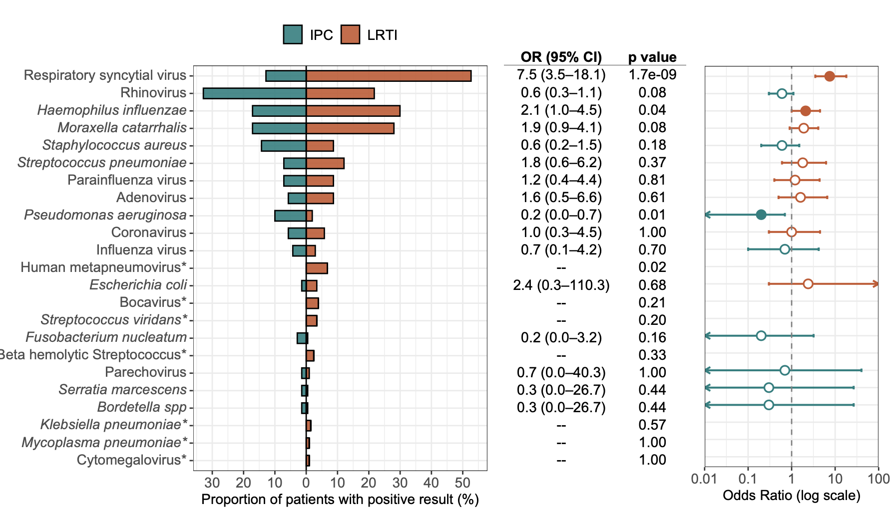
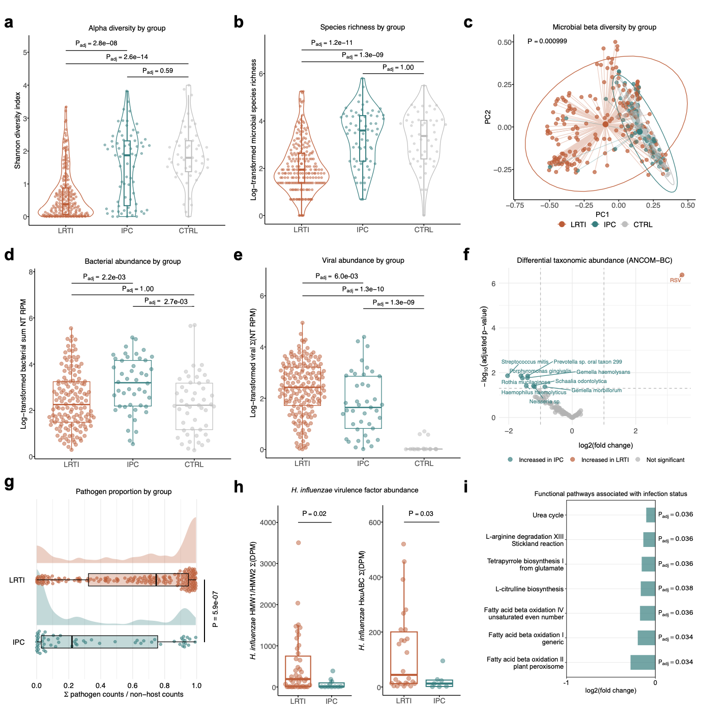
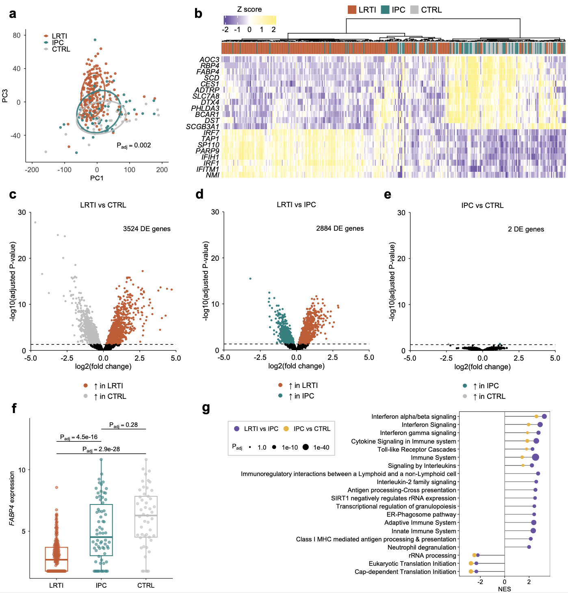
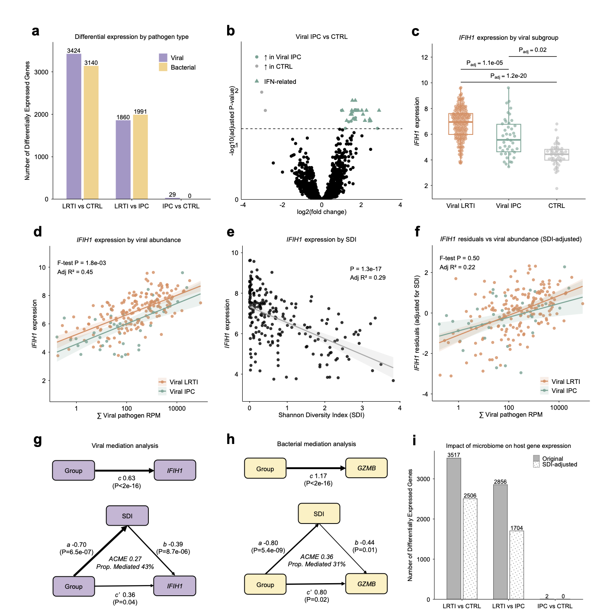
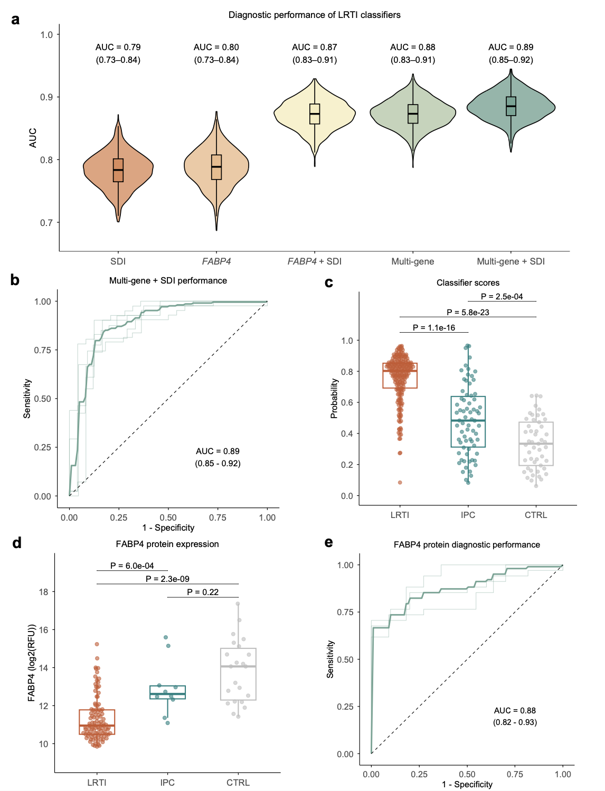

## 背景

呼吸道微生物组中常存在具有致病潜力的微生物（Pathobionts），它们可能在气道中处于无症状携带状态（IPC），而不引起感染症状和体征。IPC 的存在严重干扰了急性呼吸道疾病的临床诊断，因为传统的病原检测无法区分是“真感染”还是“单纯携带”，这往往导致抗菌药物的滥用或漏诊非感染性病因。尽管 IPC 在各年龄段均有发生，但在儿童中尤为普遍（如肺炎链球菌携带率可达 33-90%）。目前，尚缺乏能够准确区分 LRTI 与 IPC 的有效检测手段，且两者背后的宿主-微生物相互作用机制尚不明确。

- Lydon, E. C., Deosthale, P., Glascock, A., et al. (2026). Host-microbiome archetypes differentiate infection from pathogen carriage in the human lower airway. *Nature Communications*.
- 期刊：Nature Communications (IF 15.7)
- 发表时间：2026年4月13日

本研究通过对 326 名机械通气儿童的气管抽吸物进行宿主-微生物宏转录组分析，发现 LRTI 表现为气道微生物组 Alpha 多样性降低、代谢活性改变以及强烈的先天/适应性免疫激活；而 IPC 则表现为微生物多样性丰富、代谢活跃但宿主转录谱与未感染对照组相似。基于 FABP4 基因（编码巨噬细胞相关脂质伴侣）结合 Alpha 多样性的分类器，能准确区分 LRTI 与 IPC（AUC=0.89），单独的 FABP4 蛋白检测亦表现出色（AUC=0.88）。这表明整合宿主与微生物特征可实现对 LRTI 的数据驱动型精准诊断。

## 方法

研究人员对 457 名因急性呼吸衰竭接受机械通气的儿童进行了前瞻性队列研究。在插管后 24 小时内收集气管抽吸物（Tracheal Aspirates），并提取 RNA 进行宏转录组测序，最终纳入 343 名患者数据。

研究通过至少两名医生的盲法临床裁定，将患者分为三组：确诊 LRTI 且有病原体检出（LRTI组，n=207）、非感染性呼吸衰竭但有病原体检出（IPC组，n=70）、非感染性呼吸衰竭且无病原体检出（对照组 CTRL，n=49）。

数据分析涵盖了微生物组（Alpha/Beta 多样性、差异丰度分析 ANCOM-BC、毒力因子及代谢通路 HUMAnN）和宿主转录组（差异表达分析、GSEA 富集分析）。此外，研究还构建了基于 LASSO 回归的诊断分类器，并进行了中介分析以探讨微生物组对宿主免疫应答的调节作用。

## 结果

### 下呼吸道微生物组的生态差异

微生物组分析显示，LRTI 患者的气道微生物组 Alpha 多样性（Shannon Index）显著低于 IPC 组和 CTRL 组，且物种丰富度也更低。相反，IPC 组的总细菌丰度（RPM）实际上高于 LRTI 组。在分类学上，IPC 组富集了普雷沃氏菌属（*Prevotella*）、奈瑟菌属（*Neisseria*）等经典共生菌和厌氧菌；而 LRTI 组仅呼吸道合胞病毒（RSV）显著富集。功能分析发现，IPC 状态下微生物的代谢通路（如脂肪酸β-氧化、精氨酸降解）更为活跃，且流感嗜血杆菌的毒力因子（如粘附素 HMW1/2）在 LRTI 中表达更高。

### 宿主免疫应答的转录组特征

宿主转录组分析表明，LRTI 患者具有独特的免疫激活特征，涉及干扰素信号、抗原呈递和中性粒细胞脱颗粒等通路的上调，与 IPC 或 CTRL 组存在显著差异（3517 个差异基因）。相比之下，IPC 组的转录谱与未感染对照组极为相似（仅 2 个差异基因）。值得注意的是，FABP4（脂肪酸结合蛋白 4，一种巨噬细胞相关的脂质伴侣）在 LRTI 中表达显著上调，是区分感染状态的关键 outlier 基因。

### 病毒与细菌携带的免疫异质性

细分分析发现，病毒 IPC 会诱导微弱的干扰素刺激基因（ISG）表达，而细菌 IPC 则完全未引起明显的转录组变化。回归分析显示，虽然 ISG 表达与病毒载量正相关，但在相同病毒载量下，IPC 患者的 ISG 反应强度显著低于 LRTI 患者（即存在“应答衰减”现象）。此外，中介分析表明，较低的微生物 Alpha 多样性与较高的 ISG 表达独立相关，暗示微生物组结构可能调节宿主对病毒的免疫反应。

### 整合诊断模型的构建

基于上述发现，研究人员构建了诊断分类器。结果显示，单独的 FABP4 基因结合 Alpha 多样性指标即可达到 AUC 0.87；若整合多基因宿主转录谱与 Alpha 多样性，AUC 可达 0.89（95% CI 0.85-0.92）。在拥有蛋白数据的子集中，单独检测气道 FABP4 蛋白水平即实现了 AUC 0.88（95% CI 0.82-0.93）的优异性能，显示出其作为临床生物标志物的巨大潜力。

## 讨论

本研究揭示了 LRTI 和 IPC 截然不同的“宿主-微生物组原型”（Archetypes）。LRTI 本质上是病原体入侵导致的生态破坏（多样性崩溃）和强烈的免疫激惹；而 IPC 则表现为一种共生平衡态，即尽管病原体存在且微生物代谢活跃，但宿主并未触发显著的免疫防御程序。这种免疫反应的“衰减”或“耐受”可能是避免组织损伤的一种机制。

研究还证实，肺部微生物组的多样性本身就能调节免疫应答强度，高多样性环境可能抑制了过度的炎症反应。基于 FABP4 的诊断模型为临床提供了一种超越单纯病原检测的精准诊断思路，有助于减少抗生素滥用。

下呼吸道感染（LRTI）与无症状病原体携带（IPC）具有截然不同的微生物生态和免疫特征。LRTI 表现为微生物多样性降低和强烈的免疫激活，而 IPC 则维持了较高的微生物多样性和代谢活性，且宿主免疫反应静默。整合宿主基因 FABP4 与微生物 Alpha 多样性的诊断策略，能够高精度地鉴别真性感染，为临床管理急性呼吸道疾病提供了数据驱动的新工具。
