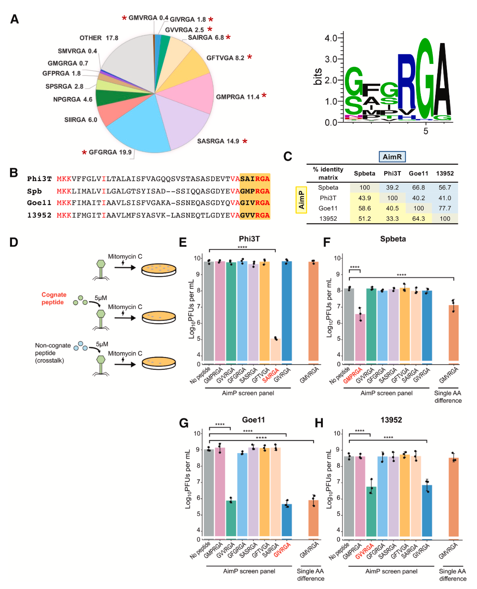
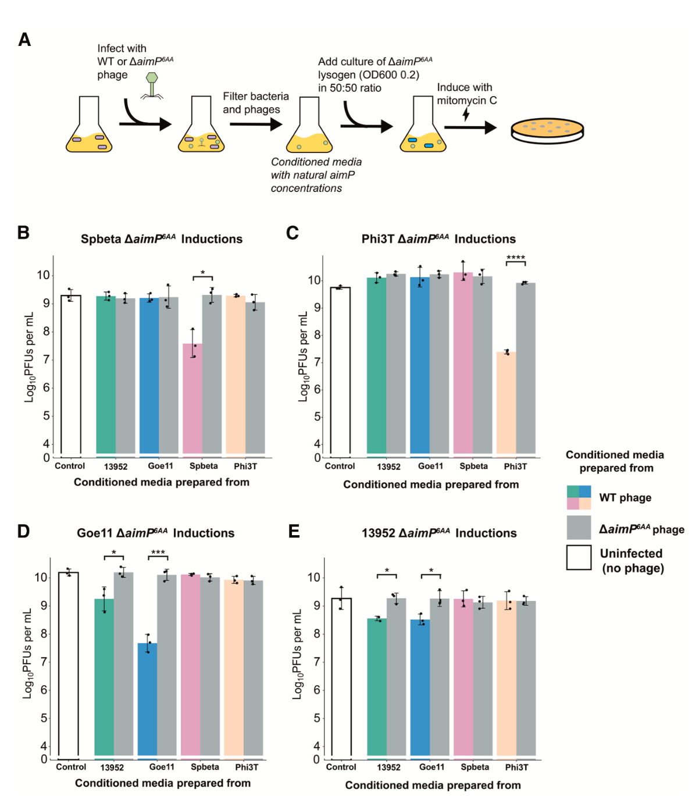
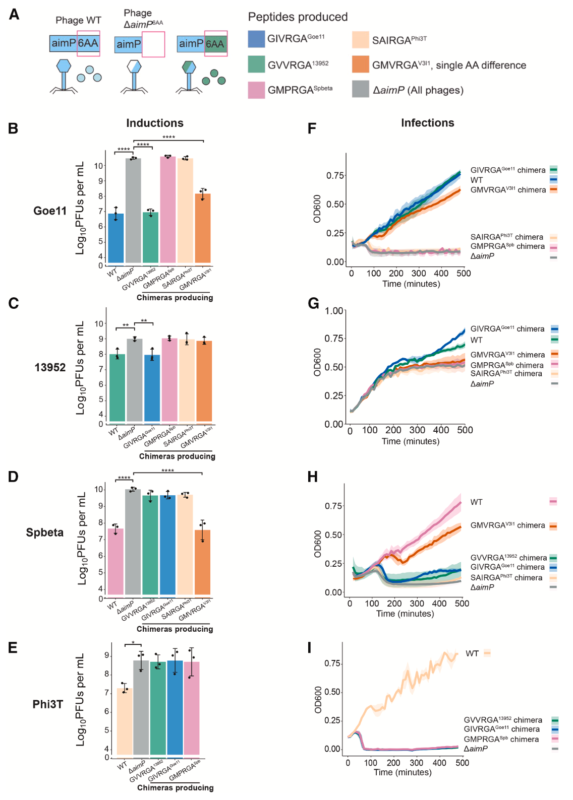
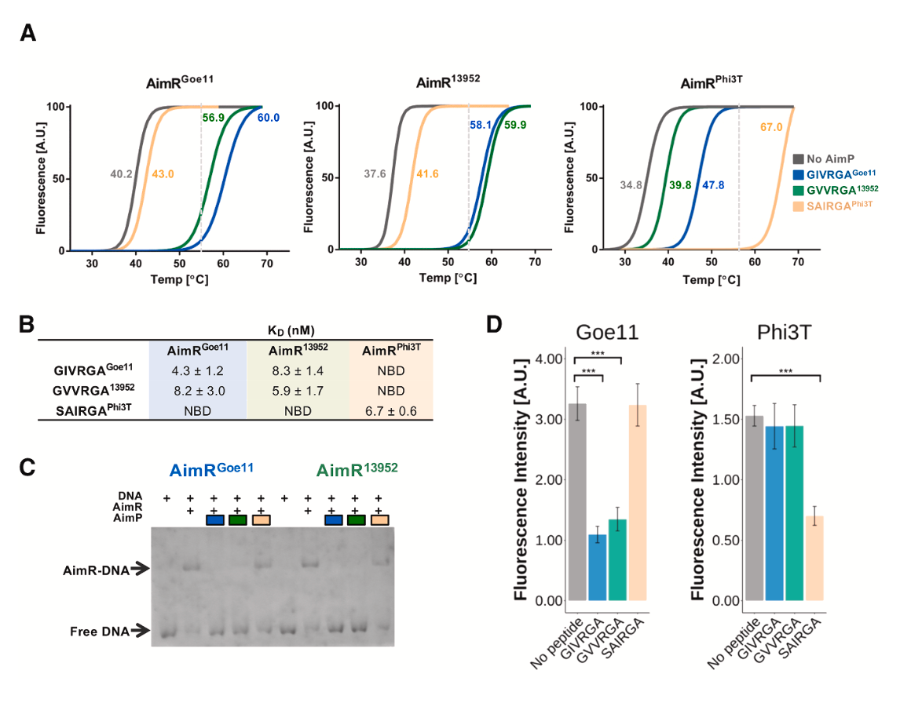
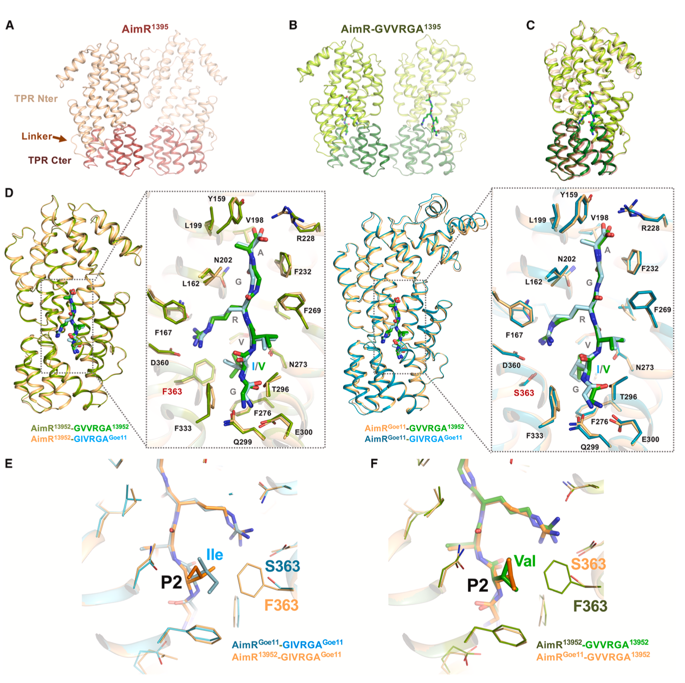
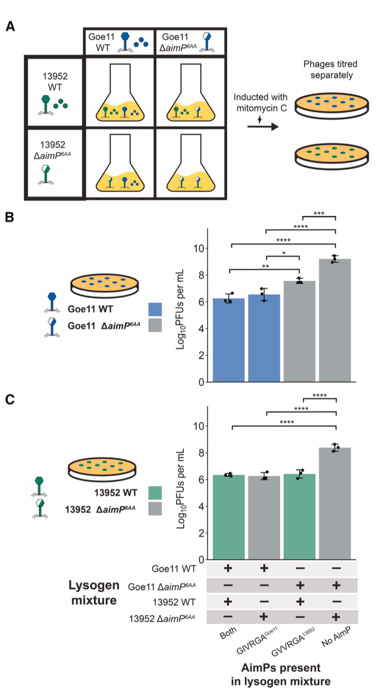
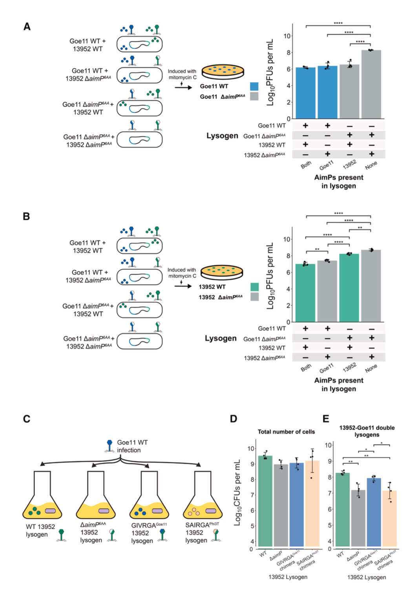

## 背景

理解物种内部和物种间的通信基础，对于把握群落行为及其生态功能至关重要。通信并非高级动物的专利，单细胞真核生物、细菌乃至质粒等移动遗传元件都发展出了复杂的通信系统。近年来，细胞间通信的概念被扩展到了病毒领域。研究发现，感染细菌的病毒（噬菌体）能够通过小分子信号进行集体决策。其中，温和型芽孢杆菌噬菌体利用一种名为“仲裁”的小分子通信系统来调控裂解与溶原之间的选择，这标志着病毒可以作为复杂的社会实体存在。鉴于噬菌体在细菌进化中的关键作用，理解这些社会性互动对于把握新细菌菌株的出现至关重要。

仲裁系统包含三个核心组件：AimP（仲裁通信肽）、AimR（仲裁受体，其功能是抗终止蛋白，可被AimP抑制）以及aimX（溶原的负调控因子）。在感染初期，感染性噬菌体颗粒相对较少，AimP水平较低，AimR功能不受抑制，使得aimX得以表达，从而促进裂解周期。随着多轮感染的进行，AimP在胞内外积累，与AimR结合并抑制其功能。在没有aimX的情况下，噬菌体的溶原周期（整合到细菌染色体中）被促进，从而保护了细菌种群和噬菌体自身。该系统不仅在噬菌体感染过程中发挥作用，对前噬菌体（integrated prophage）的正确诱导也至关重要。

近期的生物信息学分析显示，不仅在噬菌体中，在接合质粒等其他移动遗传元件及其细菌宿主中，存在数以千计的仲裁样系统。这些系统根据AimR蛋白的同源性被划分为10个不同的进化枝。每个系统编码一组独特的成熟AimP肽段，其大小和序列各异，据信这种多样性可以防止系统间的“串扰”，这也是目前学界的普遍观点。然而，如果不同噬菌体能够通过仲裁系统“窃听”彼此的信号，它们可能以尚未被充分理解的方式影响对方的行为。这种可能性将开辟一个未知的研究领域，对我们理解细菌生态和进化具有深远意义。

*   Gallego-del-Sol, F., Sin, D., Chmielowska, C., Mancheno-Bonillo, J., Li, Y., Zamora-Caballero, S., Quiles-Puchalt, N., Penadés, J. R., & Marina, A. (2026). Phages communicate across species to shape microbial ecosystems. _Cell_, 189, 1-14. https://doi.org/10.1016/j.cell.2026.03.004
*   期刊：Cell (IF=42.5)
*   发表时间：2026年3月31日

该研究聚焦于一种名为“仲裁”（arbitrium）的肽类通信系统，该系统可帮助噬菌体在裂解（杀死宿主）和溶原（整合进宿主基因组）之间做出决策。传统观点认为，每个仲裁系统都是独立的，其受体（AimR）只识别自身产生的信号肽（AimP），以确保“通话”私密性。然而，本研究发现，不同噬菌体编码的仲裁系统之间存在广泛的“串扰”（crosstalk），即一个噬菌体产生的AimP信号肽能够被其他噬菌体的AimR受体识别，并调控后者的裂解-溶原命运。研究人员结合结构生物学、生物化学、遗传学和生态学实验，证实了这种跨物种通信是真实存在的。它不仅影响单个噬菌体感染的结果，还能在混合溶原菌群落、多溶原菌等复杂生态情境中塑造噬菌体的整体行为。这一发现将病毒的社会复杂性提升到了新的层次，揭示了一个隐秘的噬菌体间通信网络，对理解细菌进化、生态动力学及开发新型抗噬菌体或抗菌策略具有深远意义。

## 方法

本研究采用多学科交叉的方法，系统性地探索并证实了仲裁系统间的串扰现象及其生态学影响。

研究人员首先对仲裁系统第2进化枝（clade 2）进行了深入的生物信息学分析，揭示了成熟AimP肽段的数量远低于理论可能值，提示了系统间可能存在串扰。基于此，他们选择了该进化枝中特征明确的原型噬菌体：Spbeta、Phi3T、Goe11以及来自不同芽孢杆菌属的13952噬菌体进行研究。

在功能验证层面，作者通过外源性添加合成肽、构建编码非同源AimP的嵌合噬菌体，并结合前噬菌体诱导抑制实验和感染后宿主存活率测定，在体内（in vivo）证明了非同源肽能够有效调控目标噬菌体的裂解-溶原决策。为探究其生化机制，研究团队利用热位移实验、等温滴定量热法、凝胶阻滞实验和荧光报告系统，定量和定性地分析了AimR受体与同源及非同源AimP肽的结合亲和力与功能抑制。

结构生物学研究是揭示分子机制的关键。作者解析了AimR13952蛋白的apo结构，以及其分别与同源肽（GVVRGA13952）和来自Goe11的非同源肽（GIVRGAGoe11）的复合物结构。同时，他们还解析了AimRGoe11与来自13952的非同源肽（GVVRGA13952）的复合物结构，在原子层面阐明了串扰发生的结构基础。

最后，为评估串扰的生态学意义，研究人员设计了混合溶原菌群落诱导实验、构建了多溶原菌，并模拟了外源噬菌体感染已携带相容仲裁系统前噬菌体的宿主细菌的场景，以探究在更接近自然状态的复杂群体中，串扰如何影响噬菌体群落的行为和动态。

## 结果

### 探索仲裁系统间的串扰

对仲裁系统第2进化枝的生物信息学分析显示，与该进化枝中281个不同AimR受体相关的大多数成熟AimP肽（74%）在其C端第4-6位共享一个高度保守的“RGA”基序，且第1位主要为甘氨酸或丝氨酸。这意味着AimP与同源AimR结合的特异性主要由第2和第3位的氨基酸决定。然而，研究人员在该进化枝中仅鉴定出26种不同的成熟AimP肽，这个数量远低于理论可能值，暗示进化压力可能限制了噬菌体所用肽段的多样性，并为系统间的串扰提供了便利。

研究人员选取了Spbeta、Phi3T、Goe11和13952这四种噬菌体进行验证。通过外源性添加合成AimP肽段并检测其对丝裂霉素C（mitomycin C, MC）诱导前噬菌体活化的抑制能力，研究发现，非同源肽段通常无法抑制诱导，这符合传统观点。然而，一个关键例外被发现：来自13952噬菌体的肽段GVVRGA13952不仅能有效抑制其自身的13952前噬菌体诱导，还能同等有效地抑制Goe11前噬菌体的诱导。反之，来自Goe11的肽段GIVRGAGoe11也能抑制13952的诱导。这构成了一个清晰的“对称性串扰”实例。

### 天然AimP肽水平及其在前噬菌体诱导干扰中的作用

为了验证在天然生理浓度下串扰是否仍然存在，研究人员制备了野生型噬菌体感染细菌后产生的条件培养基，其中含有自然分泌的AimP肽。将这些培养基与ΔaimP突变体溶原菌混合后进行MC诱导。结果显示，Goe11或13952感染产生的上清液不仅能干扰自身前噬菌体的诱导，也能相互干扰对方的诱导，但对Spbeta或Phi3T的前噬菌体无影响。这强有力地证明了在自然肽浓度下，串扰现象确实发生。

### 仲裁串扰的体内证据

为获得更直接的体内证据，研究人员构建了表达非同源AimP肽的嵌合噬菌体。当诱导这些嵌合噬菌体时，表达对方肽段（即GIVRGAGoe11或GVVRGA13952）的Goe11和13952嵌合体，其产生的感染性颗粒滴度与野生型噬菌体相同，而显著低于ΔaimP突变体或表达其他非同源肽的嵌合体。在感染实验中，表达对方肽段的嵌合噬菌体（Goe11-GVVRGA13952和13952-GIVRGAGoe11）感染宿主后，能像野生型一样显著提高宿主细胞的存活率（促进溶原），而ΔaimP突变体或其他嵌合体则导致广泛的裂解死亡。这些结果确证，自然产生的非同源肽足以在感染和诱导两个关键生命阶段，发挥与同源肽相同的调控功能。

### AimR与同源及非同源肽结合的生化分析

热位移实验表明，对于AimRGoe11和AimR13952，它们的同源肽（GIVRGAGoe11, GVVRGA13952）和对方的非同源肽能诱导近乎相同的熔点温度变化（ΔTm），而Phi3T的肽段（SAIRGAPhi3T）则不能。等温滴定量热法进一步量化了这种结合，显示AimR与同源肽的解离常数在纳摩尔级别（4.3-6.7 nM），而与可串扰的非同源肽的亲和力仅略低（8.2-8.3 nM）。凝胶阻滞实验和基于sfGFP的转录报告系统证实，这些能够结合AimR的非同源肽，同样能有效抑制AimR的DNA结合及其抗终止功能。

### 仲裁串扰的分子机制

结构生物学解析揭示了串扰的原子层面基础。AimR13952与其同源肽GVVRGA13952及非同源肽GIVRGAGoe11的复合物结构高度相似。对结合位点的分析发现，AimP肽段被19个AimR残基识别，其中14个与AimP侧链相互作用。AimRGoe11和AimR13952在此区域仅有一个残基不同：AimRGoe11是丝氨酸（Ser363），而AimR13952是苯丙氨酸（Phe363）。这个残基位于AimP第2位氨基酸（P2）附近，而GIVRGAGoe11和GVVRGA13952的区别恰在于此位点是异亮氨酸（Ile）还是缬氨酸（Val）。

结构显示，AimR13952的Phe363侧链庞大，限制了结合口袋的空间，这解释了其同源肽GVVRGA13952在P2位使用侧链较小的Val。然而，当结合非同源肽GIVRGAGoe11（P2为Ile）时，Ile的侧链可以调整构象，与Phe363发生疏水相互作用而不产生空间位阻。相反，AimRGoe11的Ser363侧链小，为结合提供了更大空间，可以轻松容纳来自GVVRGA1392的Val，也可以结合自身同源肽的Ile。这种精细的结构互补性使得受体能在保持对同源肽高亲和力的同时，允许与特定非同源肽发生串扰。

### AimP肽的单个氨基酸变化可限制仲裁系统间的串扰

结构数据提示，单个氨基酸的改变即可调节串扰水平。研究人员测试了来自噬菌体V3I1的肽段GMVRGAV3I1，该肽在P2位是甲硫氨酸（Met），侧链比Val和Ile都大。实验发现，外源添加GMVRGAV3I1可抑制Goe11和Spbeta的前噬菌体诱导。相应的嵌合噬菌体实验证实，表达GMVRGAV3I1的Goe11嵌合体诱导滴度接近野生型水平，而13952嵌合体则与ΔaimP突变体无异。这表明，即便是单个氨基酸的替换，也能通过改变与AimR关键识别残基的相互作用，精细调控串扰的敏感度，从完全有效到完全无效。

### 仲裁串扰在复杂生态情境中塑造噬菌体相互作用

在更接近自然的混合群体中，串扰的影响被放大。当分别携带野生型Goe11和13952前噬菌体的溶原菌以1:1混合后诱导，只要混合群中有任何一种噬菌体能产生其自身的AimP肽（GMPRGA或GVVRGA），就足以将两种噬菌体的诱导滴度抑制至少100倍。这表明，一方产生的肽段足以同时抑制自身和对方的诱导，协调了整个群体的行为。

在多溶原菌（同一细胞含有两个前噬菌体）中，串扰的影响呈现剂量效应。在Goe11 WT / 13952 WT双溶原菌中，13952的诱导滴度比Goe11 ΔaimP / 13952 WT双溶原菌低近10倍，意味着Goe11产生的额外AimP对13952的诱导产生了额外的抑制。这显示在共享同一细胞的亲密关系中，串扰是协调共居噬菌体诱导动力学的重要机制。

在感染情境下，串扰同样影响生态结果。当用携带四环素标记的野生型Goe11噬菌体，去感染已携带不同13952前噬菌体衍生物的溶原菌时，感染能产生交叉识别肽段（GVVRGA13952或GIVRGAGoe11）的溶原菌，所形成的Goe11溶原子数量，是感染不产生肽或产生无关肽的溶原菌的10倍。这说明，当入侵噬菌体遇到一个已携带可串扰仲裁系统的溶原菌时，宿主细菌产生的“异己”信号会误导入侵者，使其更倾向于建立溶原状态，从而保护了宿主群落。

## 讨论

本研究拓展了噬菌体通信的范式，证明仲裁系统可以介导无关噬菌体（甚至能感染不同细菌物种）之间的串扰。这挑战了“噬菌体仅与其后代通信”的固有假设。值得注意的是，所观察到的串扰发生在三种不同芽孢杆菌物种的噬菌体之间，包括那些共享相同生态位的物种，凸显了该现象的生态相关性。

这一发现引发了对仲裁系统进化压力的思考。虽然AimP-AimR相互作用的特异性可能最初是为了防止噬菌体间的有害干扰而进化出来的，但自然界中存在的不同AimR受体和AimP肽段的数量显著低于理论最大值，这暗示某些噬菌体可能进化出了可促进系统间交互的仲裁系统。本研究表明，在某些生态背景下，交叉通信可能赋予选择优势。例如，在共感染期间，串扰允许噬菌体检测到无关病毒种群的存在，或以影响溶原化宿主细胞存活的方式调整自身行为。同时，由于串扰在某些情况下可能是有害的，噬菌体也进化出了最小化与无关噬菌体相互作用的机制，正如单个氨基酸的替换就能将一个系统隔离所示。

本研究不仅挑战了现有范式，也为未来研究病毒通信的生态和进化作用奠定了基础。在自然环境中调查串扰的普遍性及其对微生物生态系统的影响，对于理解其更广泛的意义至关重要。此外，这里获得的见解可为开发新型生物技术工具提供信息，例如具有定制通信系统的工程噬菌体，用于靶向细菌控制。通过利用仲裁介导的通信原理，我们可能解锁对抗细菌病原体和缓解抗生素耐药性的新策略。

本研究综合运用多种技术手段，确凿地证明了在温和噬菌体广泛使用的仲裁通信系统中，存在着之前被忽视的、具有生态学意义的跨物种“串扰”现象。这种串扰并非偶然，而是由高度特异性的分子相互作用（纳米级亲和力）所介导，并受到关键氨基酸残基的精细调控。它在个体感染、群体感应乃至多溶原共存等多种生态尺度上，深刻影响着噬菌体的裂解-溶原决策，从而重塑了微生物群落的动态平衡。这项研究将病毒的社会复杂性提升到了新的高度，揭示了一个隐秘的、基于肽信号的噬菌体间通信网络，为理解微生物世界的运行规则、预测群落演替以及开发基于病毒通信的新型调控策略开辟了全新的方向。