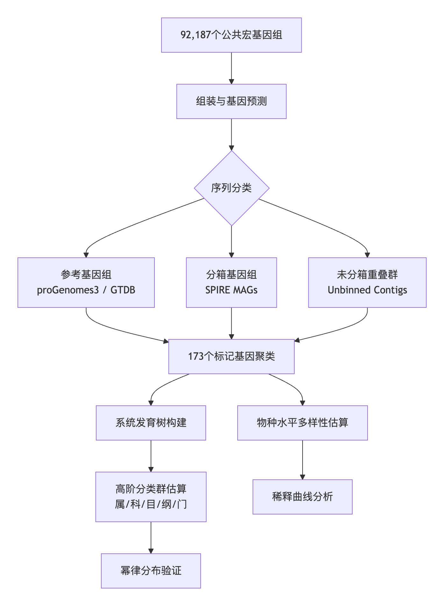
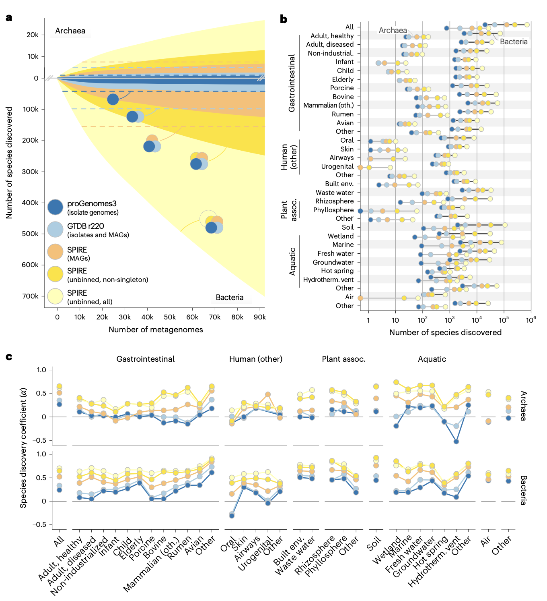
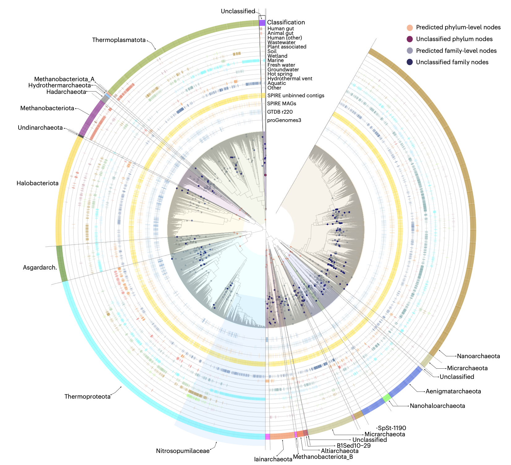
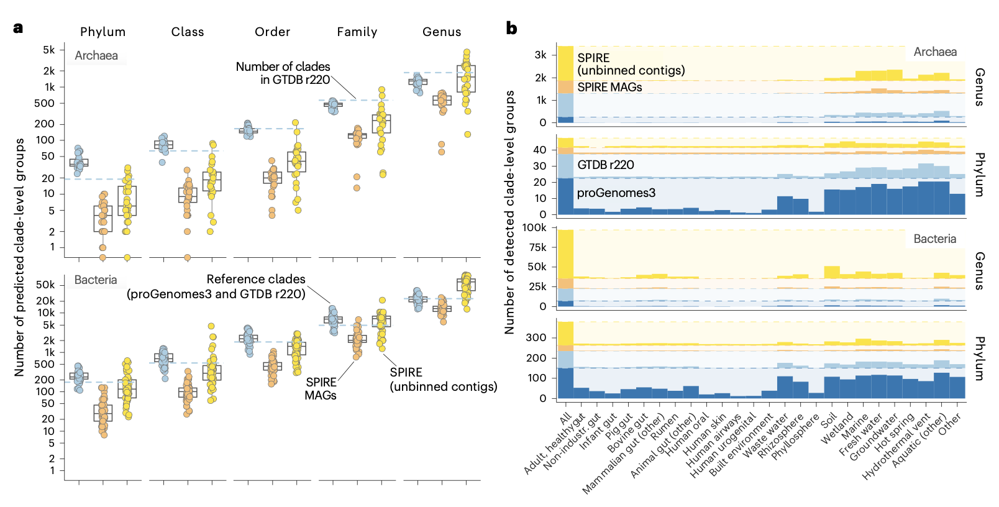
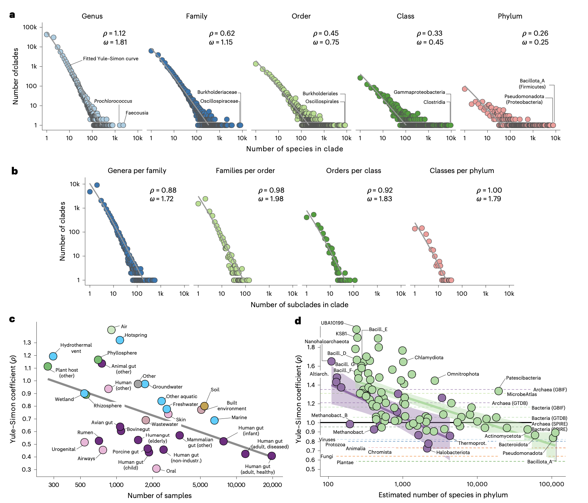

## 背景

在宏基因组学研究中，标准的生物信息学流程通常遵循“测序-组装-分箱（Binning）-构建宏基因组组装基因组（MAGs）-分析”的路径。然而，受限于当前算法的精度与召回率，绝大多数组装产生的连续序列（Contigs）无法被成功分箱，往往作为“噪音”或低质量数据被直接丢弃。这导致当前主流的基因组数据库（如GTDB、proGenomes3）本质上仅是“被成功分箱的数据子集”，可能存在系统性的偏差。

为了评估这些被忽略的数据中是否潜藏着未被认识的微生物世界，研究人员对全球范围内的92,187个宏基因组样本进行了综合分析。这些样本涵盖了从人体宿主到土壤、水体等地球各处的微生物生境。研究团队不再局限于传统的MAG分析，而是将目光聚焦于那些未能进入分箱流程的“未分箱序列”，旨在量化其中蕴藏的可发现多样性，并探讨其对全球微生物进化理论的启示。

- **标题**：Unbinned contigs expand known diversity in the global microbiome
- **期刊**：Nature Microbiology (IF 19.4)
- **发表时间**：2026年4月3日

该研究利用包含92,187个公共宏基因组样本的全球数据集，通过分析未分箱（Unbinned）的重叠群（Contigs），对细菌和古菌的多样性进行了系统性量化。结果显示，当前基于基因组的调查仅捕获了约20-50%的可发现物种，而未分箱序列中隐藏着约705,000个细菌物种和27,000个古菌物种。研究进一步指出土壤和水生环境是发现新谱系的热点区域，并证实原核生物类群大小分布遵循幂律特征，符合Willis定律和Yule过程。

## 方法

本研究构建了一个多维度的分析框架，以系统评估不同数据源（分离株基因组、MAGs及未分箱序列）中的微生物多样性。核心方法流程如下：

具体而言，研究人员利用120个细菌标记基因和53个古菌标记基因，对三类数据源进行了物种水平的聚类。为了量化新物种的发现速率，研究引入了**物种发现系数（Species Discovery Coefficient, α）**。该系数通过拟合方程 $S = k \cdot N^{-\gamma}$ 计算得出，其中 $\alpha = 1 - \gamma$。α值的范围在 $(-\infty, 1]$ 之间：
- 当 $\alpha \leq 0$ 时，表示该生境的物种发现已饱和，增加样本不再增加新物种（类似“封闭”泛基因组）。
- 当 $\alpha \in (0, 1)$ 时，表示物种发现未饱和，新样本会持续带来新物种，但发现速率逐渐放缓。
- 当 $\alpha \to 1$ 时，表示物种发现完全不饱和，每个新样本都能带来显著的新物种增量，稀释曲线无明显变平趋势。

此外，为了探究深层分类学多样性，研究人员基于相对进化分歧（Relative Evolutionary Divergence, RED）对标记基因的系统发育树进行切割，以估算属、科、目、纲、门级别的进化枝数量。最后，通过分析这些进化枝的大小分布，验证了原核生物多样性是否遵循Willis幂律及Yule-Simon分布（即“富者愈富”的优先附着过程）。

## 结果
### 基因组仅捕获了五分之一的可发现物种
通过对标记基因进行聚类分析，研究人员预测该数据集中存在约705,000个细菌物种和27,000个古菌物种。相比之下，包含分离株和MAGs的基因组数据集仅代表了其中17.8%的细菌和24.6%的古菌。这意味着高达75-80%的物种级类群未被当前基因组捕获，而这些“缺失”的多样性主要隐藏在未分箱的重叠群中。即使保守地仅计算包含多个序列的非单例簇，细菌多样性仍高达249,000种，比基因组代表集高出98%。

### 物种发现仍在快速进行中
不同栖息地的物种发现系数（α）显示，发现速率远未饱和。虽然人类相关环境（如肠道、口腔）中基于基因组的古菌发现已接近饱和，但在土壤、湿地和淡水栖息地，无论是细菌还是古菌，其发现速率都极高（α≥0.8），表明这些区域仍是未被开发的多样性热点。值得注意的是，未分箱序列中的物种发现系数普遍高于MAGs，预示着已分箱与未分箱多样性之间的差距将持续扩大。

### 深层谱系丰富了生命之树
除了物种水平，未分箱序列还极大地丰富了更深层的分类学分支。研究人员估计，在该数据集中还可发现约10个古菌门和145个细菌门，分别比现有参考估计增加了28%和61%。在属、科、目、纲等层级，基于未分箱序列预测出的类群数量均随分类分辨率的增加而显著上升。例如，热液喷口虽然样本量仅占0.3%，却包含了五分之四的参考古菌门级类群，显示出极高的深层谱系代表性。

### 原核生物多样性遵循幂律分布
研究人员验证了Willis定律在微生物领域的适用性，即分类群大小频率随类群规模的增加呈幂律下降。从种到门各级分类单元，其大小分布均符合幂律关系。进一步拟合Yule-Simon分布发现，新物种倾向于出现在较大的属中（ preferential attachment），这支持了原核生物多样性是通过类似于Yule过程的进化机制产生的，即“富者更富”的演化模式。

## 讨论
该研究强调了未分箱重叠群在微生物生态学研究中的巨大价值。传统工作流程中被视为“垃圾”或低效产物的未分箱序列，实际上包含了大量真实的生物学信号，特别是来自未培养门类的低质量MAGs。这一发现对未来的宏基因组学分析提出了新的要求：不应忽视未分箱数据，而应开发更先进的工具来挖掘其中的分类和功能信息。此外，土壤和水生环境作为多样性热点，在未来的采样工作中应得到更多关注，以填补当前全球微生物普查中的空白。

本研究通过系统分析未分箱序列，将全球原核生物的可发现多样性数量级提升至数十万种。研究结果证实，当前的基因组目录仅揭示了微生物多样性的冰山一角，而土壤和水生环境是未来探索的关键前沿。同时，原核生物类群大小遵循幂律分布的发现，为理解微生物进化的普遍机制提供了理论支持。
