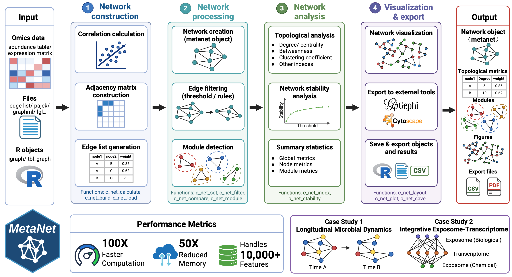
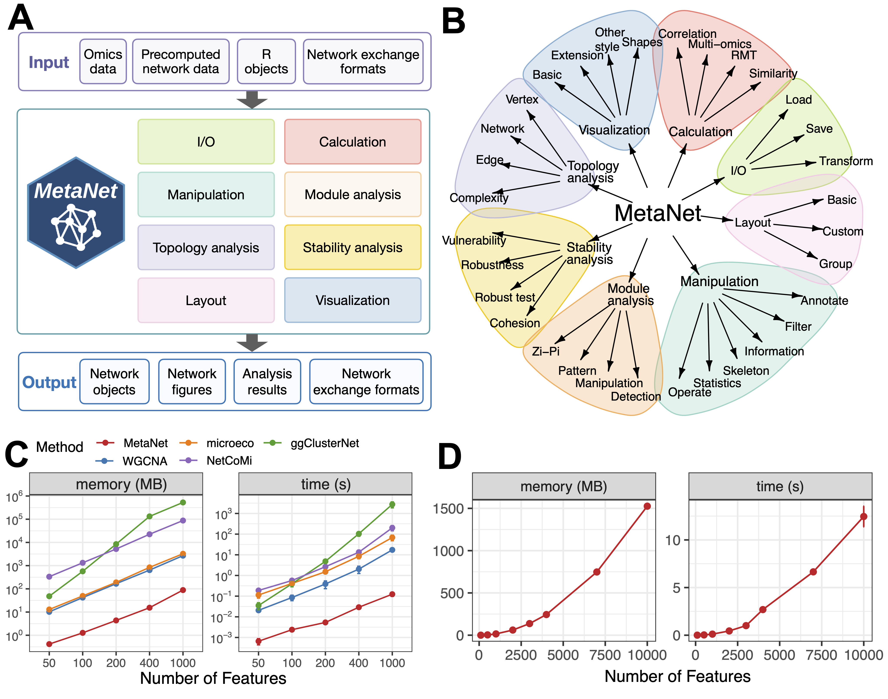
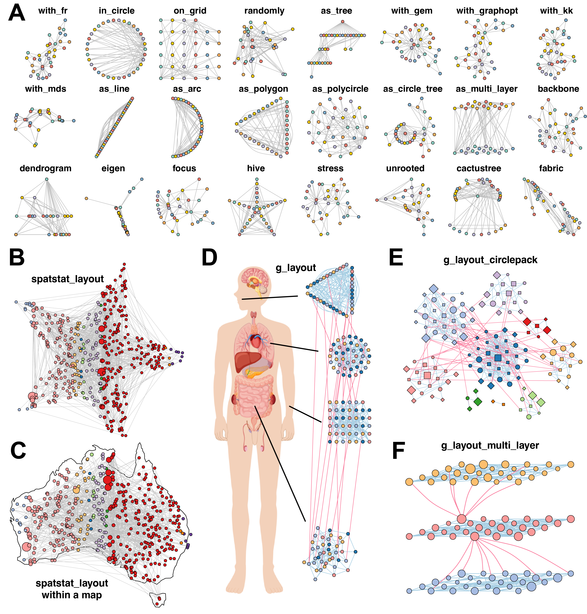
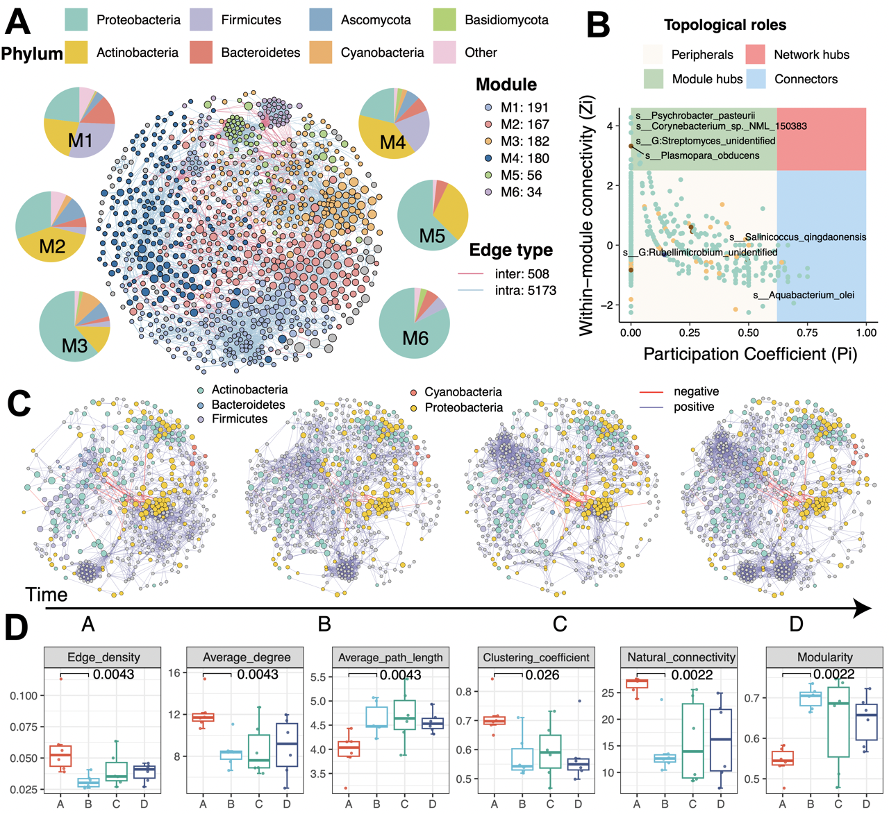
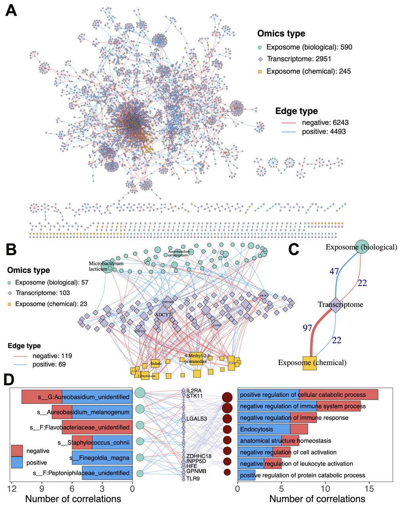

## 摘要

网络分析已成为解析复杂生物和环境系统的关键策略，特别是在现代组学技术产生日益庞大和异质数据集的背景下。然而，现有工具往往缺乏处理高维数据所需的可扩展性、灵活性和原生多组学支持。为此，我们开发了MetaNet，这是一个高性能的R语言软件包，旨在统一跨不同组学层次的网络构建、可视化和分析流程。

MetaNet能够为超过10,000个特征的数据集实现快速、可扩展的基于相关性的网络构建，提供超过40种布局算法、丰富的注释工具以及与静态和交互式平台兼容的可视化选项。该工具进一步提供了全面的拓扑和稳定性指标，用于深入网络表征。基准测试表明，与现有的R语言软件包相比，MetaNet在计算时间上实现了高达100倍的提升，内存使用减少了50倍。我们通过两个代表性应用展示了其效用：(1) 揭示空气微生物组动态的纵向微生物共现网络；(2) 包含超过40,000个特征的暴露组-转录组整合网络，揭示了生物和化学暴露的独特调控影响。通过提供一个稳健、可重复且具有生物学信息框架的工具，MetaNet推动了跨生物、生态和环境领域的多组学网络分析。

- 标题：MetaNet: a scalable and integrated tool for
reproducible omics network analysis
- 译名：MetaNet：面向组学数据的可扩展集成网络分析工具
- 期刊：Bioinformatics (IF：5.5)
- 发表时间：2026年5月20日
- 第一作者：彭晨，蒋刘一琦
- 通讯作者：蒋超
- 通讯单位：浙江大学生命科学研究院
- 链接：<https://doi.org/10.1093/bioinformatics/btag321>

## 背景

网络（或称图）是建模复杂生物和环境系统中关系的基本工具。它为从分子、细胞到微生物群落和环境因子等不同实体之间的相互作用提供了信息丰富的表示。网络理论深刻影响了生命科学和环境科学的众多子领域，使得系统层面的解释超越了单个分子事件。蛋白质-蛋白质相互作用网络阐明了细胞对生理和毒理学刺激的响应；共表达网络捕捉了协调的基因活性和转录组的模块化组织；基因调控网络描述了发育和疾病中的层次控制；代谢网络映射了生化反应和能量通量；生态网络阐明了物种相互作用和群落动态。

随着高通量组学技术的爆炸式增长（如宏基因组学、转录组学、蛋白质组学和代谢组学），基于网络的方法已成为解析复杂生物、临床和环境动态的核心。这些网络有助于揭示模块结构、推断功能关联，并识别支撑不同生物和疾病过程的关键调控因子。

目前已有多种工具用于网络分析和可视化。Cytoscape提供了可视化分子相互作用的用户友好平台，而Gephi则为大型图提供了高效的布局算法。igraph、ggraph和tidygraph软件包在R和Python中提供了灵活的功能；WGCNA广泛用于加权基因共表达分析；而ggClusterNet、microeco、CMiNet和NetCoMi等工具扩展了微生物组特异性分析的能力。一些基于网络的管道（如MENAP和iNAP）为简单用例提供了快速、可访问的解决方案。

然而，大多数现有工具未能满足当代生物和环境研究的需求。首先，很少有工具提供对多组学整合的原生支持，限制了它们揭示跨层关联（如分子、微生物和环境信号之间的联系）的能力。其次，计算性能常常成为瓶颈——特别是对于高维数据集的基于相关性的网络构建，可能需要数小时甚至数天。第三，相关性过滤的阈值选择通常是主观和任意的，导致网络拓扑不稳定和潜在的解释偏差。第四，可视化能力常常受限，限制了用户注释复杂网络或生成可用于发表的高质量图表的能力。最后，许多分析管道，特别是基于网页的工具，由于不稳定的计算环境、不透明的工作流程或缺乏标准化输出，缺乏可重复性。虽然这些工具对于一般网络分析仍然有价值，但对于需要整合建模、可扩展计算、客观方法、灵活可视化和可重复研究的组学规模数据来说，它们显得不足。

为了应对这些挑战，我们开发了MetaNet，这是一个全面且可扩展的R语言软件包，专为组学和多组学数据的网络分析而定制。MetaNet通过一个统一框架填补了这些空白，该框架整合了异质的组学层，使得能够构建生物、生态和暴露组-响应网络。通过利用优化和并行化算法，即使在具有数万个特征的数据集上，它也能实现快速的基于相关性的网络构建。为了提高客观性，MetaNet整合了随机矩阵理论用于数据驱动的相关性阈值选择，增强了网络拓扑的可靠性。其广泛的可视化模块提供了超过40种布局算法、注释支持以及与ggplot2、Gephi和Cytoscape的兼容性——使用户能够生成可定制的高质量图表。MetaNet还强调可重复性，提供了精选的数据集、分步教程和带有种子随机性的稳定版本控制。最后，该软件包包含了一套广泛的拓扑和稳定性指标，用于深入网络解释。我们通过两个代表性案例研究展示了MetaNet的能力：一个纵向空气微生物共现网络和一个整合的暴露组-转录组网络，展示了其在处理复杂、大规模生物和环境组学数据方面的有效性。

## 方法

### MetaNet的概念设计与开发

MetaNet是一个基于R的整合软件包，专为跨不同组学数据集（包括多组学数据）的全面网络分析和可视化而开发。它兼容运行R版本4.0或更高的Windows、macOS和Linux系统，其核心功能建立在广泛使用的igraph框架之上。MetaNet采用模块化架构，涵盖计算、操作、布局、可视化、拓扑分析、模块分析、稳定性分析和输入/输出，从而支持从网络构建到下游分析和可视化的端到端工作流程。核心数据结构是“metanet”对象，它是igraph类的一个扩展，完全兼容标准的igraph操作，并且可以无缝转换为“tbl_graph”对象，以便与ggraph和tidygraph生态系统集成。一致且直观的函数命名约定（所有核心函数均以“c_net_”为前缀）促进了高效和可重复的分析。

MetaNet通过“trans”函数提供了广泛的数据预处理能力，提供了针对不同组学类型定制的多种标准化策略，例如转录组学的CPM或对数转换、微生物组数据的aCPM或存在/缺失编码，以及蛋白质组学和代谢组学的log1p转换，并辅以用于特征过滤、清洗和合并的实用函数。网络构建可以直接从原始数据实现，从外部格式（如GraphML或Pajek）导入，从边列表生成，或从现有的igraph对象转换。通过专用的节点、边和网络级别元数据分配和检索函数支持注释和属性管理，而子网络提取、邻域分析、高亮显示和基于集的网络比较则实现了灵活的网络操作。

MetaNet进一步提供了超过40种布局算法的访问，其中13种是MetaNet新开发的（例如as_polygon、as_polycircle），而其他算法则是对来自广泛使用的R软件包（如igraph和ggraph）的现有算法的增强和优化更新。MetaNet还支持布局的几何变换，包括缩放、旋转、镜像和伪3D效果，可视化通过统一的绘图接口实现。通过计算17种常用的网络指标，可以进行高级拓扑表征，并且可以使用多种评估策略评估网络的鲁棒性和结构稳定性，特别适用于生态和微生物网络。MetaNet是完全开源的，通过CRAN、GitHub和Gitee公开可用，根据CRAN政策积极维护，并附有全面的在线手册，以支持基础网络分析和高级应用。

### MetaNet与其他现有工具的比较

为了展示计算效率，我们将MetaNet与几个广泛用于相关性网络构建的R软件包进行了比较。“MetaNet::c_net_calculate”函数通过利用“stats::cor()”的向量化矩阵操作和使用t分布公式解析计算p值来实现高性能，避免了显式循环以提高效率。具体来说，我们对以下函数进行了基准测试：“MetaNet::c_net_calculate”（v0.2.5）、“WGCNA::corAndPvalue”（v1.71）、“microeco::trans_network$new”（v0.13.1）、“ggClusterNet::corMicro”（v2.00）和“NetCoMi::netConstruct”（v1.1.0）。使用具有不同特征数量（具体为50、100、200、400和1,000）的数据集来评估每种方法的内存使用和计算时间。这些指标使用“bench::mark”函数（v1.1.2）进行测量，每个测试重复20次以确保可靠性。使用Wilcoxon秩和检验对内存使用和计算时间进行统计比较，揭示了MetaNet相对于其他R软件包的显著改进（p < 0.001）。所有基准测试均在相同条件下进行：为每个软件包的核心相关性函数使用等效参数，所有测试在一致的计算环境（macOS with M2 chip, 16 GB RAM, R 4.2.2）中进行。性能比较的完整、可重复代码在补充材料的“比较代码”部分提供。

### 案例研究

我们利用最近发布的一个纵向多组学数据集，该数据集包括转录组谱、生物暴露组（微生物暴露组）和化学暴露组谱，收集自处于特定水下环境中的个体。为了研究微生物关联网络，首先选择了流行度阈值超过10%的微生物分类群。此过滤后保留了总共914个微生物物种用于网络构建。物种共现网络使用Spearman相关性构建。仅保留绝对相关系数（|ρ|）大于0.6且BH校正p值小于0.05的边。我们采用快速贪婪模块化优化算法来评估模块化结构。每个模块代表一组具有更强组内连接而非组间连接的分类群，反映了潜在的生态一致性。为了捕捉微生物关联模式的时间变化，我们基于存在性提取了细菌的样本特异性子网络。计算了一系列子网络的拓扑指数，以表征随时间变化的微生物群落结构。这些指标包括边密度、负边比例、平均度、平均路径长度、网络直径、聚类系数、特征向量中心性、介数中心性、接近中心性、度中心性和自然连通性。

对于整合多组学网络分析，构建了暴露组（生物和化学）与转录组之间的相关性网络。对于每对组学数据集，通过计算Spearman秩相关系数和相关p值来计算相关性矩阵。为了仅保留与先前研究一致的稳健关联，将|ρ| > 0.6（对于化学-转录组对）或> 0.5（对于生物-转录组对）且BH校正p值 < 5e-4的变量对包含在最终网络中。最后，对于与微生物或化学暴露显著相关的基因，使用ReporterScore包（v0.2.2）针对KEGG和基因本体数据库进行过表征分析，以识别与环境暴露相关的分子通路和生物过程。

## 结果

### 高效且可扩展的网络计算支持分析更大的组学数据集

网络分析已成为许多组学学科的基石。在构建网络之前，不同的组学数据类型——包括微生物组、转录组、蛋白质组和代谢组——需要适当的预处理以确保数据质量。MetaNet提供了广泛的标准化策略来支持跨组学类型的预处理。例如，转录组数据可以使用CPM或对数转换等方法进行转换；微生物组数据可以使用aCPM或存在/缺失编码等方法进行标准化；基于质谱的蛋白质组学和代谢组学数据可以进行log1p转换以减少偏度并稳定方差。网络构建始于使用统计策略计算成对关系。主要方法包括基于相似性或相关性的方法，如“Spearman”、“Pearson”和“Bray-Curtis”。这些方法生成特征相似性矩阵，随后进行基于随机化的显著性检验和多重检验校正，以仅保留有意义的关联。用户可以应用常见的校正方法——包括Benjamini-Hochberg FDR、Bonferroni和Holm——所有这些都在“c_net_calculate”中实现。

成对相关性计算是大多数基于网络的组学工具的核心，但组学数据集规模的不断增长带来了巨大的计算需求。MetaNet通过优化的向量化矩阵算法计算相关系数和相应的p值来解决这一问题，大大减少了内存使用和运行时间。基准测试表明，MetaNet在少于1,000个特征的数据集上在0.2秒内完成基于相关性的分析，并使用少于100 MB的内存，在速度上优于其他工具100到10,000倍。虽然其他工具在大型数据集上可能需要超过一小时，但MetaNet保持了较低的资源使用，内存和运行时间随特征数量近似呈二次方缩放。这些效率使得MetaNet非常适合高通量网络构建。

基于相关性的关联网络因其简单性和鲁棒性而被广泛采用，但阈值选择仍然是主观的。许多研究依赖于手动截断值（例如|r| > 0.6且p < 0.05），这引入了不一致性和潜在的偏差。为了解决这个问题，MetaNet整合了随机矩阵理论，这是一种基于统计的方法，用于识别最佳阈值。RMT根据数据结构自动确定最小化虚假边的相关性截断值，提供了一种数据驱动的方法来定义网络构建的r_threshold参数。虽然MetaNet主要支持基于相关性的方法，但它与替代推断方法的结果兼容，包括用于非线性关系的互信息方法和用于控制间接关联的偏相关。

### MetaNet中的高级网络布局和可视化支持

布局是网络可视化的关键组成部分，因为精心设计的布局可以显著增强网络结构的可解释性。MetaNet将布局坐标存储在灵活的“coors”对象中，允许用户控制、重用和传输布局设置。“c_net_layout”函数提供了超过40种布局算法的访问，包括13种新布局以及来自igraph和ggraph软件包的适配布局。除了传统布局外，MetaNet引入了“spatstat_layout”方法，该方法将布局生成限制在用户定义的多边形内或沿其边缘。此布局函数支持在自定义形状内均匀或随机分布节点。例如，在星形内排列网络或将其映射到像澳大利亚这样的地理区域。MetaNet还提供了与交互式可视化平台（如Gephi和Cytoscape）的互操作性，允许用户导入外部生成或手动调整的布局。

对于具有分组变量的网络，MetaNet通过“g_layout”提供了高级接口。用户可以定义每个组的空间配置，包括定位、缩放和内部布局策略，并在一个可视化中组合多种布局类型。生成的“coors”对象可以嵌套或与后续调用重新组合，以创建高度定制的多级布局。例如，跨多个人体部位的共丰度网络可以通过单个“g_layout”调用来排列。此策略对于突出模块结构也很有用。“g_layout_circlepack”使用紧凑的圆形填充可视化模块分布，而“g_layout_multi_layer”引入了强调模块间关系的伪3D表示。

MetaNet的“c_net_plot”函数提供了广泛的视觉自定义参数，能够精确控制节点、边、模块和图例。默认情况下，MetaNet使用igraph的基础绘图，但偏好ggplot2的用户可以使用“as.ggig”转换网络，从而能够使用“labs”、“theme”和“ggsave”等ggplot2函数。MetaNet还支持将视觉内容导出到NetworkD3、Gephi和Cytoscape等工具，以扩展可视化工作流程。

### MetaNet支持灵活的网络分析、扩展的生物网络类型以及全面的拓扑和稳定性评估

MetaNet提供了简化的功能工具，用于网络注释、操作和比较，使得在网络构建后能够进行高效的探索性分析。可以方便地访问和总结网络、节点和边属性，而注释的网络对象仍然完全兼容现有的基于igraph和tidygraph的工作流程。MetaNet支持灵活的网络注释、子网络提取、模块检测和跨网络比较，有助于在复杂的组学和多组学数据集中对特定区域、模块或条件进行聚焦分析。

除了通用的基于相关性的网络外，MetaNet还扩展支持生物信息学中常用的专业和数据库链接的生物网络类型。这些包括基于集的网络、层次树结构、多变量节点表示以及外部策划的生物网络，如蛋白质-蛋白质相互作用、调控网络和基于通路的网络。MetaNet还与外部功能分析工具和生物知识库集成，使得能够直接可视化和探索通路水平和调控关系，从而扩展了其在不同生物背景下的适用性。

MetaNet进一步提供了全面的网络拓扑和稳定性分析工具，支持全局结构和节点级重要性的定量表征。它能够系统评估结构属性、模块组织和拓扑角色，以及与随机网络的比较以评估结构显著性。此外，MetaNet整合了多种稳定性和鲁棒性指标，以模拟网络在扰动下的弹性、脆弱性和群落凝聚力，为生物和生态系统的鲁棒性提供了见解。

### 案例1：微生物共现网络的纵向动态

为了展示MetaNet在不同和整合组学分析中的灵活性，我们将其应用于最近发布的一项涉及多组学数据的个体水平纵向研究。在这项研究中，研究团队开发了可穿戴被动采样器，对暴露于特殊环境的19名个体的化学和生物暴露组进行高分辨率时间谱分析。数据包括整合的转录组和暴露组谱，为检查环境扰动对个体健康的影响提供了独特机会。在此，我们重点关注微生物暴露组成分，代表了每个参与者随时间遇到的空气微生物群。时间点A代表自然环境中的基线条件，而时间点B到D记录在暴露环境中。

我们首先构建了一个全局微生物共现网络，该网络包括871个微生物物种，跨越四个分类学界。使用贪婪模块化优化算法，我们识别了六个具有不同模块内物种组成的独特模块。该网络的度分布遵循幂律分布，表明具有无标度特性。这表明观察到的网络具有复杂系统的特征。在每个模块内，我们分析了跨时间点的微生物丰度模式。例如，模块M3的成员随时间显示出相对丰度的一致下降。使用Zi-Pi方法进行的拓扑角色分类揭示了13个模块枢纽和19个连接器，可能对网络完整性和模块间通信至关重要。

我们还为每个暴露时间点提取了细菌的子网络。发现一部分微生物物种随时间的出现或丰度发生变化。进一步的拓扑分析表明从时间点A到B发生了重大变化。与时间点A的暴露前相比，时间点B到D的网络表现出增加的模块化和平均路径长度，同时全局效率、聚类系数和自然连通性下降。这些模式表明，MetaNet能够捕捉不同暴露条件下推断的微生物关联结构的纵向变化。这些结果表明空气微生物关联网络发生了与暴露相关的变化，这与先前证据基本一致，即空气微生物组在特殊暴露条件下变得不稳定；然而，这种重组的功能意义需要进一步验证。

### 案例2：多组学整合网络映射生物和化学暴露组与转录组的独特联系

我们通过对暴露组（包括生物和化学）与宿主转录组之间进行整合网络分析，扩展了对纵向多组学数据集的分析。该分析旨在表征环境暴露与基因表达之间的时间关联。我们使用MetaNet高效计算了35,587个转录组基因、2,955个微生物物种和3,729个化学暴露组特征之间的相关性网络。结果显示，590个微生物分类群与1,983个基因显著相关，其中大多数边代表正相关。相比之下，245种化学暴露与1,152个基因显著相关，且负相关边更为普遍。这些网络揭示了暴露组与转录组关联的明显模式：微生物关联主要涉及免疫和代谢通路，而化学关联则富集于细胞应激和解毒通路。时间分析进一步显示，微生物关联网络在暴露期间变得更加模块化和稀疏，而化学关联网络则保持相对稳定。功能富集分析确定了与每种暴露类型相关的独特生物过程，强调了MetaNet在解析复杂多组学相互作用方面的能力。

## 讨论

MetaNet的开发解决了当前组学网络分析工具的几个关键局限性。通过整合多组学支持、优化计算算法、数据驱动的阈值选择、灵活的可视化选项和强调可重复性，该工具为研究人员提供了一个全面且用户友好的平台，用于大规模网络分析。其模块化架构和与现有R生态系统的兼容性确保了易于采用和可扩展性。

该工具的计算效率尤其值得注意，因为处理大型组学数据集的能力对于现代系统生物学研究至关重要。基准测试中观察到的性能改进——计算时间减少100倍，内存使用减少50倍——使得以前不切实际的分析成为可能。随机矩阵理论的整合解决了网络构建中阈值选择的主观性问题，提供了更稳健和可重复的结果。

案例研究展示了MetaNet在现实世界应用中的多功能性。纵向微生物共现网络分析揭示了暴露相关的变化，这些变化可能对理解环境扰动对微生物群落的影响具有重要意义。整合的暴露组-转录组网络进一步证明了MetaNet处理复杂多组学数据的能力，揭示了生物和化学暴露的不同调控影响。

然而，值得注意的是，像所有网络推理方法一样，基于相关性的网络构建只能揭示关联而非因果关系。此外，网络解释仍然依赖于适当的生物背景和验证。MetaNet通过提供全面的拓扑和稳定性指标来部分解决这些限制，这些指标可以指导后续的假设生成和实验设计。

## 结论

MetaNet代表了对组学网络分析工具生态系统的重大贡献。通过解决现有工具在可扩展性、多组学整合、客观阈值选择、可视化灵活性和可重复性方面的局限性，它为研究人员提供了一个强大且全面的平台。其优化的算法实现了对大型数据集的高效处理，而其广泛的可视化和分析功能支持深入的网络探索和解释。两个案例研究证明了其在从微生物生态学到暴露组学的各种应用中的实用性。随着组学数据的持续增长和复杂化，像MetaNet这样的工具对于推进系统层面的理解和促进跨学科研究将变得越来越重要。该软件包的开源性质和积极维护确保了其持续发展和社区支持，使其成为生物信息学和系统生物学研究人员的宝贵资源。
